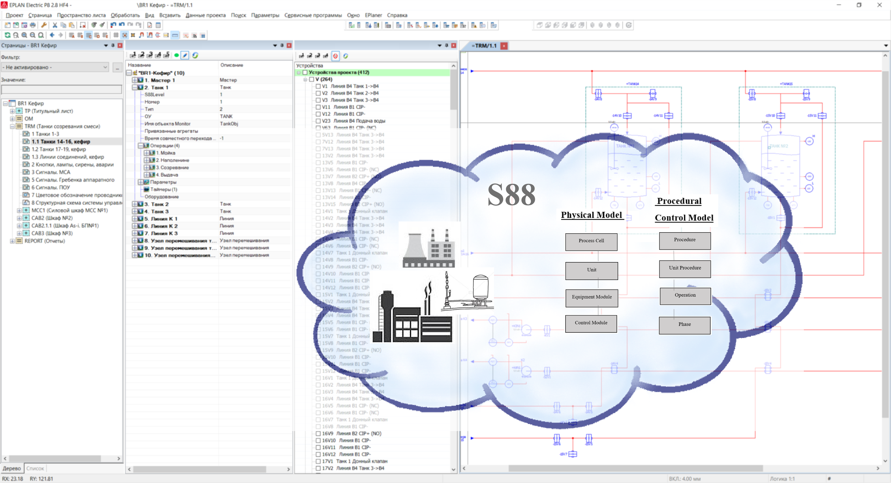

# EasyEplanner - Open Source

### Repository

This repository is an open source project - EasyEplanner.
We not only work on the project, but also solve various problems related to the project life and development.

### EasyEplanner

The Easyplanner is designed as an Add-In to EPLAN, currently, we using EPLAN 2.8 version. The add-in is used when developing projects in EPLAN and allows you to automate the work of an automation engineer, as well as a software engineer who describes the project in the LUA programming language. Using Easy Planner, technological objects are described (Tank, Boiler, etc.), operations of these objects, steps of operations, restrictions for operations are set, as well as many other properties of the technological object. Eventually, Easyplanner generates LUA files that are uploaded to the controller. Currently, controllers from the following manufacturers are supported:

1. [Phoenix Contact - PLCNext](https://github.com/plcnext);
2. [WAGO - PFC200](https://github.com/WAGO).

### User documentation
By [this](docs/user_manual/ReadMe.md) link you can find the latest version of user documentation for the project.

### Contributing
If you want to contribute to the development of our project then  check out [how to do it better](docs/contributing.md) before you start.

### Feedback
If you wont to contact with us you can use some ways:
* [Google group](https://groups.google.com/forum/#!forum/easyeplanner);
* Channel in [Slack](https://slack.com) - easyeplanner.slack.com.

### Code of conduct
We [using](docs/CODE_OF_CONDUCT.md)
standart behavior rules (communication), provided by the GitHub service.

### Code style
We use C# and LUA programming languages for development. We have [own set of agreements](docs/codestyle.md), which you must follow to make the code convenient and readable.

### License
The project is licensed under [MIT](LICENSE.txt) license.
