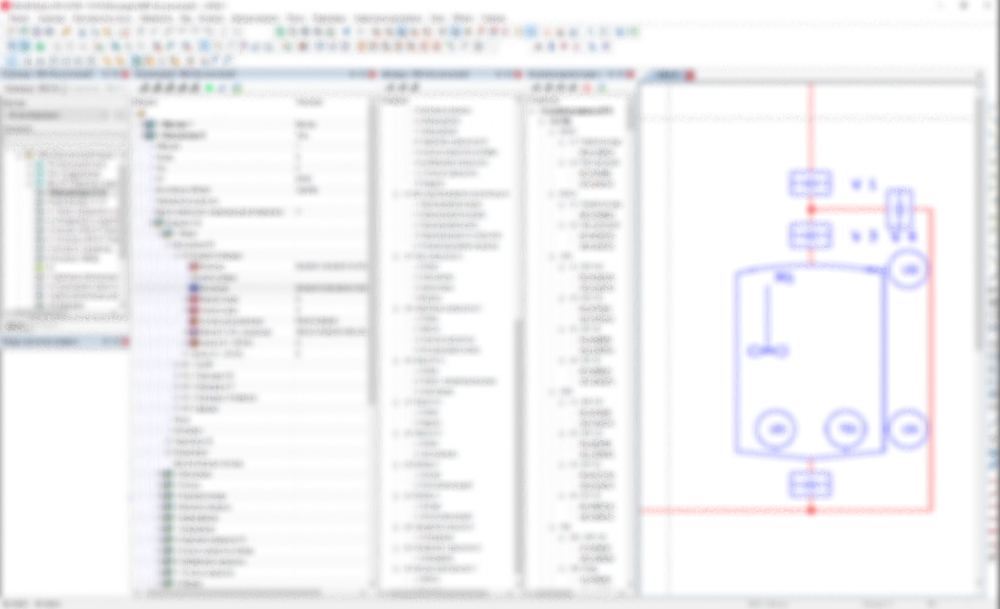

# EasyEPLANner - Open Source

**Русский вариант находится [здесь](docs/ru/readme.md). Deutsche Readme ist [hier](docs/de/readme.md).**

### Repository

This repository is an open source project - EasyEPLANner.
We are working on the project and solving various issues related to the development and project life.

### EPLAN

[EPLAN Electric P8](https://www.eplan-software.com/solutions/eplan-electric-p8/) is a modular and scalable solution for electrical design, automatic design and working documentation.

[EPLAN API Help](https://www.eplan.help/en-us/Infoportal/Content/api/2023/index.html) - Description and examples of how to use the EPLAN API.

Examples for EPLAN Electric P8 automation in the C# programming language can be found at
[Suplanus](https://github.com/Suplanus)

### EasyEPLANner

The EasyEPLANner is being developed as an Add-In to EPLAN 2.9 version. The add-in is being used for EPLAN projects and helps you to reduce the work of an Automation engineer and a Software engineer as well.

Software engineer creates code in Lua programming language for the project. EasyEPLANner helps you to describe technological objects (Tank, Boiler, etc.), operations of these objects, steps of operations, restrictions for operations, and many other properties. Eventually, EasyEPLANner generates LUA files that are going to be uploaded to a controller. We support controllers from the following manufacturers:

1. [Phoenix Contact - PLCNext](https://github.com/plcnext);
2. [WAGO - PFC200](https://github.com/WAGO).

### How to build
You could clone repository by next command:  
`git clone --recurse-submodules https://github.com/savushkin-r-d/EasyEPLANner.git`

or, if you are cloned without initializing and updating submodules, try next:  
`git submodule update --init --recursive`

Congratulations, now you can build our solution (_if you have a EPLAN P8 app_).

### User documentation
You can find the latest version of user documentation for the project [here](docs/user_manual/ReadMe.md).

### Developer documentation
You can find the latest version of developer documentation [here](docs/developer_manual/ReadMe.md).

### Contribution
If you want to contribute to the development of our project then check out [how to do it better](docs/contributing.md) before you start.

### Feedback

Feel free to contact us via Slack or Google group.

* Channel in [Slack](https://slack.com) - easyEPLANner.slack.com.

### Code of conduct
We are [using](docs/CODE_OF_CONDUCT.md)
standart behavior rules (communication), provided by the GitHub service.

### Code style
We use C# and LUA programming languages for development. We have [own set of agreements](docs/codestyle.md), which you must follow to keep the code clean and clear.

### License
The project is licensed under [MIT](LICENSE.txt) license.
