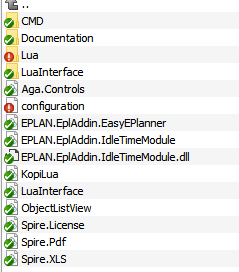
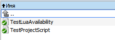
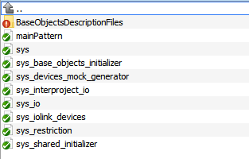
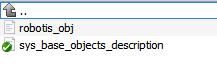
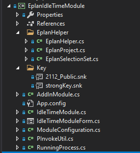
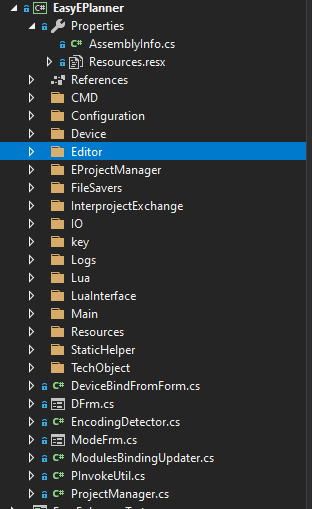
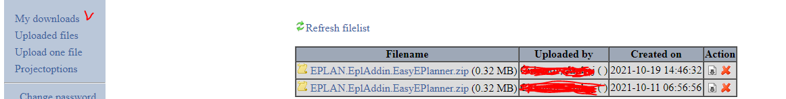
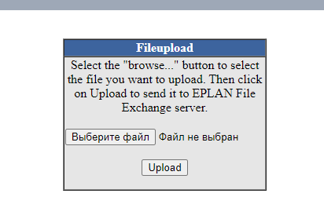

# Руководство начинающего разработчика для EasyEPlanner #

Данное руководство служит новичкам для ознакомления с решением и углубления знаний в проекте без непосредственного исследования кода. Помимо этого руководства, желательно ещё изучить руководство пользователя, т.к позволяет изучить варианты использования системы пользователями, а также пользовательский функционал. Создано в ноябре 2021.

**Примечание**: надстройка работает только с одним открытым проектом в EPLAN.

Дополнение подключается к версии **EPLAN 2.8** (*сейчас 2.9*) и новее. Большинство вопросов связанных с работой **EPLAN**, **EPLAN API** можно найти в документации **EPLAN**.

[Пользовательская документация](https://github.com/savushkin-r-d/EasyEPLANner/tree/master/docs/user_manual).

[Документация по API](https://www.eplan.help/en-US/infoportal/content/api/2.9/index.html).

[Документация по EPLAN](https://www.eplan.help/ru-RU/Infoportal/Content/Plattform/2.9/EPLAN_Help.htm) или кнопка **F1** в **EPLAN**.

## Содержание ##
1. [Технологический стек и проекты](#1-Технологический-стек-и-проекты)
    + [1.1 Aga.Controls](#11-AgaControls)
    + [1.2 EasyEPlanner](#12-EasyEPlanner)
    + [1.3 EasyEplanner.Tests](#13-EasyEplannerTests)
    + [1.4 EplanIdleTimeModule](#14-EplanIdleTimeModule)
    + [1.5 ObjectListView2012](#15-ObjectListView2012)
2. [Файловая структура](#2-Файловая-структура)
    + [2.1 Файловая структура готовой для использования надстройки](#21-Файловая-структура-готовой-для-использования-надстройки)
        + [2.1.1 Корневой каталог](#211-Корневой-каталог)
        + [2.1.2 Каталог CMD](#212-каталог-CMD)
        + [2.1.3 Каталог Lua](#213-каталог-Lua)
        + [2.1.4 Каталог BaseObjectsDescriptionFiles](#214-Каталог-BaseObjectsDescriptionFiles)
    + [2.2 Описание файла configuration.ini и EPLAN.EplAddin.IdleTimeModule.dll.config](#22-Описание-файла-configurationini-и-EPLANEplAddinIdleTimeModuledllconfig)
        + [2.2.1 Файл конфигурации EasyEPlanner](#221-Файл-конфигурации-EasyEPlanner)
        + [2.2.2 Файл конфигурации модуля простоя](#222-Файл-конфигурации-модуля-простоя)
    + [2.3 Файлы проектов Aga.Controls и ObjectListView2012](#23-Файлы-проектов-AgaControls-и-ObjectListView2012)
    + [2.4 Файлы проекта EplanIdleTimeModule](#24-Файлы-проекта-EplanIdleTimeModule)
    + [2.5 Файлы проекта EasyEPlanner](#25-Файлы-проекта-EasyEPlanner)
        + [2.5.1 Корень проекта](#251-Корень-проекта)
        + [2.5.2 Каталог Configuration](#252-Каталог-Configuration)
        + [2.5.3 Каталог Device](#253-Каталог-Device)
        + [2.5.4 Каталог Editor](#254-Каталог-Editor)
        + [2.5.5 Каталог EProjectManager](#255-Каталог-EProjectManager)
        + [2.5.6 Каталог FileSavers](#256-Каталог-FileSavers)
        + [2.5.7 Каталог InterprojectExchange](#257-Каталог-InterprojectExchange)
        + [2.5.8 Каталог IO](#258-Каталог-IO)
        + [2.5.9 Каталог Logs](#259-Каталог-Logs)
        + [2.5.10 Каталог Main](#2510-Каталог-Main)
        + [2.5.11 Каталог StaticHelper](#2511-Каталог-StaticHelper)
        + [2.5.12 Каталог TechObject](#2512-Каталог-TechObject)
        + [2.5.13 Каталог Extensions](#2513-Каталог-Extensions)
        + [2.5.14 Каталог PxcIolinkConfiguration](#2514-Каталог-PxcIolinkConfiguration)
    + [2.6 Файлы проекта EasyEplanner.Tests](#26-Файлы-проекта-EasyEplannerTests)
3. [Сборка проекта и подписывание библиотек ключом EPLAN](#3-Сборка-проекта-и-подписывание-библиотек-ключом-EPLAN)
    + [3.1 Сборка через терминал](#31-Сборка-через-терминал)
    + [3.2 Сборка через Visual Studio](#32-Сборка-через-Visual-Studio)
    + [3.3 Сборка для подписи надстройки и её подписывание](#33-Сборка-для-подписи-надстройки-и-её-подписывание)
    + [3.4 Как отлаживать надстройку](#34-Как-отлаживать-надстройку)
4. [Вопросы пользователей, частые изменения в проекте](#Вопросы-пользователей-частые-изменения-в-проекте)

## 1. Технологический стек и проекты ##

Решение **EasyEPlanner.sln** для Visual Studio  содержит в себе **5** проектов:
1. **Aga.Controls** - проект UI элемента управления.
2. **EasyEPlanner** - основной проект дополнения для Eplan.
3. **EasyEplanner.Tests** - проект с юнит-тестами для дополнения. Используется NUnit, как фреймворк, и Mock библиотека, как создатель Mock и Stub объектов. Stub содержат только состояние, а Mock - поведение. Fake объект содержит в себе и поведение, и состояние (*почитайте теорию*).
4. **EplanIdleTimeModule** - модуль простоя Eplan. Используется как отдельно, так и как часть EasyEPlanner.
5. **ObjectListView2012** - проект UI элемента управления для редактора технологических объектов.

Все проекты написаны на языке **C#** с применением технологии **.Net Framework** версии **4.5** (*Aga.Controls, ObjectListView2012*), версии **4.7.2** (*EasyEPlanner*) и версии **.Net Core 3.1** (*EasyEplanner.Tests*). Дополнительно в проекте **EasyEPlanner** используется скриптовый язык **Lua**.

Проекты **1**, **4** и **5** используется в **EasyEPlanner** как подмодули (*submodules*).

### 1.1 Aga.Controls ###

Проект содержит в себе UI-компонент, который используется в EasyEPlanner в окнах, открывающихся через пункты меню: "**Устройства, параметры объектов**" и "**Операции, ограничения и привязка объектов**".

Сам проект не нужно постоянно собирать и подписывать строгим именем, т.к. он уже был собран и используется в EasyEPlanner через ссылку на dll-библиотеку(_папка libs_). При Debug или Release сборке решения он будет собираться по необходимости, но копироваться будет версия из папки libs, которая уже подписана и используется, при её замене никаких сайд-эффектов быть не должно.

### 1.2 EasyEPlanner ###

Основной проект решения Visual Studio. Более подробное описание функционала можно найти в пользовательской документации. Используется в основном для описания управляющей программы для ПЛК. Описание загружается и сохраняется из **Lua** кода. Для взаимодействия с **EPLAN** используется **EPLAN API**. Надстройка может выгружать Excel отчеты, генерировать XML описание базы каналов для SCADA, считывать информацию с схем автоматизации (устройства, плк), а также поддерживает привязку каналов устройств к клеммам модулей-ввода вывода и др. Более подробно в пользовательской документации.

### 1.3 EasyEplanner.Tests ###

Проект с unit-tests использует **EasyEPlanner** как ссылку для тестирования. Написаны на .Net Core 3.1, но **ВНИМАНИЕ** тесты не полностью покрывают тестами надстройку. Нужно каждый раз запускать тесты, после внесения изменений, а после, для нового функционала писать новые, которые покрывают сценарии использования функционала. Юнит-тесты именуются по конвенции, из названий методов можно примерно понять, что они тестируют, и какой результат будет на выходе.

Конвенция нейминга - *UnitOfWork_StateUnderTest_ExpectedBehavior*. Но можно использовать современное и миксовать (*что, вроде как, встречается в коде*).

### 1.4 EplanIdleTimeModule ####

Проект модуля простоя **EPLAN**. Суть: по достижении определенного времени (*настраивается в конфигурации*), если пользователь не пользовался системой (*заблокировал компьютер через Win + L или что-то ещё*), **EPLAN** будет выключен, т.к лицензий конечное количество, а пользователей гораздо больше, чем лицензий (*иногда, свободны все лицензии, а иногда нужно ждать, когда освободится*).

Надстройка может подключаться отдельно от **EasyEplanner**, так и использоваться в **EasyEplanner** (_используешь её как ссылку и получаешь доступ к классам, возможность запускать модуль и подписаться на события_). Не рекомендуется использовать одновременно в описанных случаях, т.к неизвестны последствия.

### 1.5 ObjectListView2012 ###

Проект UI-компонента, использующегося в EasyEPlanner для окна "**Редактировать технологические объекты**". Сборка и использование - аналогично пункту [1.1 Aga.Controls](#11-AgaControls).

## 2. Файловая структура ##

В большинстве случаев, файлы исходного кода прокомментированы через _summary_ нотацию, что облегчает изучение кода, но, иногда, комментарий может быть обманчив (_легаси_). **Lua** скрипты в своем большинстве тоже прокомментированы.

### 2.1 Файловая структура готовой для использования надстройки ###

Не все файлы создаются сразу приложением, некоторые копируются из других проектов. Например, описание технологических объектов, но об этом ниже.

#### 2.1.1 Корневой каталог ####

Рисунок - Общий вид каталога надстройки

Описание:
1. CMD - скрипты в **.txt** формате, которые используются для проверки наличия установленного **Lua**, а также для запуска автоматического тестирования проектов.
2. Documentation - документ для настройки **Lua** в системе, чтобы работало тестирование проекта **EPLAN**.
3. Lua - вспомогательные скрипты (*описано ниже*), а также описание базовых объектов из репозитория **ptusa-lua-diary-sys**.
4. LuaInterface - подписанные библиотеки для работы с **Lua** через **C#** код и наоборот. Дублируются библиотеки *LuaInterface* и *KopiLua* из корня каталога (*легаси код, не переделывал*).
5. Aga.Controls.dll - подписанная библиотека с UI-элементом [1.1 Aga.Controls](#11-AgaControls).
6. configuration.ini - файл конфигурации для **EasyEPlanner**. Генерируется автоматически, если отсутствует, а потом в него уже записываются настройки. Описан в следующем разделе.
7. EPLAN.EplAddin.EasyEPlanner.dll - основная подписанная библиотека надстройки. Именно этот файл всегда подключается к **EPLAN**. В основном, когда вносятся изменения в проект, то чаще всего, этот файл меняется, а другие файлы остаются неизменными.
8. EPLAN.EplAddin.IdleTimeModule.dll - подписанная библиотека модуля простоя.
9. EPLAN.EplAddin.IdleTimeModule.dll.config - файл конфигурации модуля простоя. Формат - XML. Описан в следующем разделе.
10. KopiLua и LuaInterface - смотри пункт 4.
11. ObjectListView - аналогично с пунктом 5, только для [1.5 ObjectListView2012](#15-ObjectListView2012).
12. Spire.License, Spire.Pdf, Spire.XLS - библиотеки, использующиеся для генерации **Excel** отчетов.

#### 2.1.2 Каталог CMD ####

Рисунок - Каталог CMD

Описание:
1. TestLuaAvailability.txt - скрипт для проверки наличия **Lua** в системе. Запускается процессом из EasyEPlanner.
2. TestProjectScript.txt - скрипт, запускающий тестирование после проверки наличия **Lua** в системе.

#### 2.1.3 Каталог Lua ####

Рисунок - Каталог Lua

Описание:
1. BaseObjectsDescriptionFiles - каталог с описанием базовых объектов. Берется из репозитория **ptusa-lua-diary-system**. Если файлов нет - будет автоматически создан вместе с начальным пустым описанием.
2. mainPattern.plua - шаблон файла **main.plua**, можно менять в реалтайме. Генерируется **1** раз, при создании проекта (_часто пользователи копируют файлы проекта и сам проект, а потом просто переделывают, поэтому генерируется редко, но иногда нужно, чтобы шаблон менялся_).
3. sys.lua - файл с **Lua** скриптами, которые загружают описание из **Lua** файлов, в частности, технологических объектов проекта в надстройку. Меняется довольно часто, когда меняется структура **Lua** файлов.
4. sys_base_objects_initializer.lua - скрипт, которые инициализирует базовые объекты, считываемые из папки (_см. пункт 1_). Меняется в зависимости от изменений базовых объектов.
5. sys_interproject_io.lua - скрипт чтения описания **Lua** с файла *main.io.lua* для загрузки межпроектного обмена сигналами.
6. sys_io_modules.lua - скрипт с описанием модулей-ввода вывода, которые поддерживаются надстройкой.
7. sys_io_nodes.lua - скрипт с описанием узлов ввода-вывода, которые поддерживаются надстройкой.
8. sys_iolink_devices.lua - скрипт с описанием поддерживаемых IO-Link устройств.
9. sys_restriction.lua - скрипт читающий описание ограничений для технологических объектов (*всегда запускается после sys.lua*).
10. sys_shared_initializer.lua - скрипт читающий межпроектный обмен из файла *main.shared.lua* проекта.

#### 2.1.4 Каталог BaseObjectsDescriptionFiles ####

Нужно немного рассказать о том, как это работает. Базовые объекты могут быть любые, и их может быть любое количество. Главное, чтобы в файлах они не пересекались. Надстройка загружает из каждого файла базовые объекты, поэтому можно разделить их по разным критериям и использовать так, как надо пользователю. В этой папке всегда должен быть файл с описанием, иначе могут слететь в проектах базовые объекты со всеми настройками. В **SVN** репозитории файл зафиксирован (*sys_base_objects_description.lua*), который используется АСУТП. Если файла нет, то он будет создан автоматически, а внутри его будет базовое описание и комментарии о том, как заполнять этот файл. Дополнительно можно в папке Lua посмотреть файл **sys_base_object_initializer.lua**, которые показывает, что читается, и куда отправляется.

Рисунок - Каталог BaseObjectsDescriptionFiles в каталоге Lua

### 2.2 Описание файла configuration.ini и EPLAN.EplAddin.IdleTimeModule.dll.config ###

Файл configuration.ini относится к EasyEplanner, а второй, как видно из названия раздела, к модулю простоя.

#### 2.2.1 Файл конфигурации EasyEPlanner ####
Конфигурирует надстройку EasyEPlanner.

Может содержать 6 секций:
1. path - указываются пути (`folder_path` тэг) к файлам **Lua** с проектами (_есть в пользовательской документации_). Меняется руками.
2. helpSystem - указывается `address` и `mainAddress` для OSTIS (_никем не используется, но нужно было зачем-то добавить_). Меняется руками.
3. TestSettings - включение и выключение тестирование проекта (*есть в пользовательской документации*). Меняется руками.
4. currProjDevList - настройка отображения устройств для настройки межпроектного обмена в открытом проекте. Меняется автоматически.
5. advProjDevList - аналогично пункту 4, только для связываемого проекта.
6. bindedSignalsList - настройка окна связанных сигналов для межпроектного обмена. Меняется автоматически.

Пункты **4-6** используются для одного UI элемента управления в межпроектном обмене сигналами.

#### 2.2.2 Файл конфигурации модуля простоя ####

Конфигурирует модуль простоя. Конфигурация описана в формате **XML**.

Секции:
1. checkIntervalSec - интервал проверки простоя системы в секундах. Меняется руками.
2. maxChecksCount - количество успешных проверок подряд (*когда система простаивает*), после которого запускается механизм оповещения пользователя и затем отключения **EPLAN**, если пользователь не отреагировал в течении **1** минуты. Меняется руками.

### 2.3 Файлы проектов Aga.Controls и ObjectListView2012 ###

Описывать нет смысла, т.к используются уже подписанными библиотеками из папки `libs`. Мы их никак не меняли, пока что.

### 2.4 Файлы проекта EplanIdleTimeModule ###

Проект достаточно прост. Закрывать EPLAN, если система простаивает какое-то время. Если открыты какие либо всплывающие окна в EPLAN, то проект не может быть закрыт и тогда процесс EPLAN уничтожается через `Kill` метод процесса.

Надстройка сама по себе меняется редко, но в проекте EasyEPlanner ссылка указана на проект, а не на библиотеку. При сборке и подписи надо указывать ссылку на подписанную библиотеку (*будет описано в главе 3*).

Проект использует **Win32** библиотеки `PIInvoke`.

Рисунок - Структура файлов проекта IdleTimeModule

Описание:
1. EplanHelper - содержит классы и интерфейсы для абстрагирования от **API** Eplan. Класс EplanHelper использует классы и интерфейсы **EplanProject** и **EplanSelectionSet**. В классах идет работа с **API** для захвата проекта и его закрытия через **API** (_если это возможно_).
2. Key - ключи для подписывания надстройки.
3. AddInModule.cs - точка входа в надстройку. Когда надстройка подключается через Eplan **API** (т.е **EPLAN** загружает её, а **EasyEplanner**), то всегда вызываются методы этого класса, реализующего интерфейс `IEplAddin` (_см. подробнее в документации к API_).
4. App.config - файл конфигурации, который затем трансформируется в _EPLAN.EplAddin.EplanIdleTimeModule.dll.config_.
5. IdleTimeModule.cs - основной класс и интерфейс, который отвечает за модуль простоя. Позволяет запустить, остановить модуль, а также закрыть приложение/проект, показывать предупреждение пользователю и др.
6. IdleTimeModuleForm.cs - форма, показываемая пользователю, когда надо подтвердить действие, либо будет закрыт EPLAN.
7. ModuleConfiguration.cs - класс и интерфейс для работы с конфигурацией модуля простоя, её чтение, копирование.
8. PInvokeUtil.cs - класс утилит Win32.
9. RunningProcess.cs - класс и интерфейс для работы с запущенным процессом (_обертка_).

Как работает? Два пути. Первый - это самостоятельное использование надстройки. Для этого нам нужен файл config и dll модуля. Можем подключить через EPLAN и наслаждаться. В этом случае, будет вход через `AddInModule.cs`. Второй - использование в EPLAN. Подключаем ссылку, используем класс IdleTimeModule.

### 2.5 Файлы проекта EasyEPlanner ###

Рассмотрение начнем с каталогов т.к проект разбит на большое количество файлов и каталогов по логическому и предметному принципу.

#### 2.5.1 Корень проекта ####

Рисунок - Корень проекта

Каталоги `CMD`, `LuaInterface`, `Lua` (*без описания базовых объектов*) [аналогичны вот этому](#211-Корневой-каталог).

Описание:
1. Resources.resx и папка Resources - содержит ресурсы проекта. В основном это строковые шаблоны и картинки для редактора технологических объектов.
2. AssemblyInfo.cs - базовая информация о компилируемой библиотеке. Здесь меняется версия `dll`.
3. Configuration - файлы классов и интерфейсов настройки/чтения конфигурации проекта, надстройки и др. Описаны ниже.
4. Device - файлы с классами и интерфейсами для работы с устройствами, типами устройств, и др.
5. Editor - файлы с классами, интерфейсами и формами редактора технологических объектов с функционалом импорта и экспорта, подсветки устройств на ФСА и др.
6. EProjectManager - файлы с классами и интерфейсами, которые переопределены из **Eplan API**, для управления **Eplan** и проектом.
7. FileSavers - файлы с классами. интерфейсами, которые используются для сохранения различной информации. Это генерация отчета **Excel**, генерация базы каналов для **SCADA**, сохранение статистики по проекту в **SVG**, а также сохранение файлов проекта в **Lua**.
8. InterprojectExchange - полная функциональность межпроектного обмена сигналами.
9. IO - файлы с классами и интерфейсами для модулей-ввода вывода и взаимодействия с ними (привязка устройств, расчет адресного пространства в т.ч. и для IO-Link).
10. key - ключи для подписи надстройки.
11. Logs - файлы для работы с логгером проекта для пользователя. Логгер показывает пользователю подсказки и ошибки. Иногда в логгер может попадать StackTrace, если словили необработанную ошибку.
12. Main - файлы с `Action` (*см. Eplan Api документацию*), а также входным классом, который вызывается **Eplan Api** при загрузке надстройки.
13. StaticHelper - общие классы, содержащие данные и поведение, которое используется почти по всему проекту или в каком-то большом пуле классов. Все классы там статические.
14. TechObject - файлы описывающие объектную модель технологических объектов (*основной столп, как и устройства, который описывает программу в ПЛК*).
15. PxcIolinkConfiguration - файлы, описывающие функционал генерации описания для IOL-Conf.
15. DeviceBindFromForm.cs - класс, отвечающий за привязку выбранного на форме устройств канала ввода-вывода к каналу ввода-вывода на модуле ввода-вывода (*привязка канала устройства к модулю плк*). Создается класс с требуемыми аргументами в конструкторе, и вызывается метод `Bind()`. На форме устройств должен быть выбран канал ввода вывода (*двойным кликом происходит срабатывание этого функционала*).
16. DFrm.cs - форма в которой происходит привязка устройств к модулям ввода-вывода, к технологическим объектам (*устройства в операции*), а также привязка параметров к технологическим объектам, где это допустимо (*см. пользовательскую документацию*).
17. EncodingDetector.cs - говорящее название. При открытии проекта проверяет кодировку его файлов и читает их в нужной кодировке, чтобы не было битых символов (**ASCII отличается от UTF-8**).
18. ModeFrm.cs - форма на которой отображаются операции технологических объектов, а также есть возможность привязки объектов друг к другу и настройка их ограничений (_ограничение включений операций_).
19. ModulesBindingUpdater.cs - класс отвечающий за обновление комментариев и привязанных устройств при их изменении. Как работает - смотри пользовательскую документацию. Под капотом: устройства всегда имеют одну и ту же ссылку, поэтому при переименовании устройства, она не меняется и мы знаем, что надо поменять. Функциональность менялась буквально пару раз когда-то давно.
20. PInvokeUtil.cs - класс с загруженными в доступ **Win32** методами и свойствами. Нужно для захвата окон т.к наши UI компоненты рисуются в **Eplan** окнах, а также для записи `.ini` конфигурации и перехвата пользовательского ввода для его обработки.
21. ProjectManager.cs - класс менеджера открытого в Eplan проекта. Через него (когда он был вызван из `Action`) происходит запуск загрузки файлов проекта, их сохранение, запуск генерации отчетов, инициализация начальная надстройки и др.

#### 2.5.2 каталог Configuration ####

Содержит классы, которые отвечают за проверку конфигурации, её чтение, синхронизацию и др. Более подробно ниже.

1. ConfigurationChecker.cs - проверяет на ошибки текущий открытый проект. Перебирает IP-адреса, проверяет устройства, модули ввода-вывода, технологические объекты, а также запускает тестирование проекта, если оно включено. Потом выводит ошибки в лог пользователя, `Logs` каталог. Основной метод внутри объектов - это `Check()` он практически всегда перегружен `override` или виртуальный `virtual` т.к все объекты технологические наследуются от `TreeViewItem`, реализующего `ITreeViewItem`, а устройства от `IDevice` и так далее по иерархии наследования.
2. DeviceBindingReader.cs - читает привязку устройств к модулям ввода-вывода со схем. Запускается из `ProjectManager`. Использует Eplan Api, устройства, модули ввода-вывода и `StaticHelper`.
3. DeviceReader.cs - читает устройства с ФСА. Использует Eplan Api, устройства. Считывает, записывает в список, которым потом пользуются другие классы.
4. DeviceSynchronizer.cs и DeviceSynchronizerService.cs - классы отвечающие за синхронизацию устройств. Когда,к примеру, переименовали устройство, и это надо обновить в разных местах, где оно используется. Когда используются устройства внутри параметров устройств других, то они не синхронизируются т.к записаны в виде строки.
5. IOReader.cs - считывает конфигурацию ПЛК и модулей ввода-вывода со схем, которая затем используется в надстройке.
6. ProjectConfiguration.cs - общий класс-обертка, который управляет всей конфигурацией. Можно запустить проверку ошибок, чтение привязки, устройств, плк и модулей ввода-вывода и синхронизацию устройств.
7. ProjectHealthChecker.cs - класс, тестирующий работоспособность проекта, запуска скрипты тестирования и выводя лог пользователю. Именно этот класс использует скрипты из папки `CMD`.

#### 2.5.3 каталог Device ####

Каталог содержит все, что связано с устройствами. Классы устройств, вспомогательные классы для более чистого создания устройств и менеджер для работы с ними.

1. каталог IODevices - содержит перечень классов устройств, которые поддерживают ввод-вывод (_это для всех используемых устройств_). Устройства `DEV_VTUG` или `Y` - пневмоостров, который существует только в надстройке, но в файлы контроллера информация о них не грузится. Каждый класс отвечает за конкретное устройство со своими подтипами, параметрами и другими настройками. Описание у всех имеет примерно тот же алгоритм т.к они наследуются от класса `IODevice`, а тот в свою очередь от `Device`.
2. Device.cs - интерфейс и класс самого базового устройства. Содержит общую низкоуровневую логику.
3. IODevice.cs - интерфейс и класс, наследуемый от `Device`, содержит логику устройства, как устройства ввода-вывода с добавлением каналов, параметров, свойств и др. От класса `Device` кроме этого класса никто не наследуется.
4. Parameter.cs, Property.cs, Tag.cs, RuntimeParameter.cs - частичные классы `IODevice`, которые содержат в себе классы с данными о параметрах, свойствах, тэгах и рантайм параметрах. Используются для конфигурации устройств в классах папки `IODevices` т.е помогают описать устройство без дублирования кода.
5. DeviceType.cs, DeviceSubType.cs - перечисления со всеми возможными типами и подтипами для описания устройств при описании их классов. **Важно**: номер, которые указывается в перечислении очень важен и можно добавлять только в конец т.к это влияет ещё и на контроллер.
6. DeviceManager.cs - основной класс, работающий с устройствами. Можно запустить проверки, генерацию вспомогательных данных для отчетов **Excel**, для базы каналов в **SCADA**, создание устройств, добавление, поиск, сохранение в **Lua** формат и др.
7. IDevice.cs - интерфейс Device.
8. IIOChannel.cs - интерфейс IOChannel.
9. IOChannel.cs - каналы устройства (DI, DO, AI, AO).
10. IOLinkSize.cs - класс, представляющий IO-Link размерности для устройства.
11. IIODevice.cs - интерфейс IODevice.

#### 2.5.4 каталог Editor ####

Каталог содержит в себе основной функционал, связанный с редактором технологических устройств, окно "**Редактировать технологические устройства**", включая импорт и экспорт объектов, а также окно выбора базовых объектов. Более подробнее об этой функциональной расписано в пользовательской документации.

1. каталог ImportExport - содержит классы и формы для работы с импортом и экспортом объектов в/из **Lua** файла для последующего использования в других проектах (*к примеру*). За функционал импорта отвечают ` класс и ` форма с постфиксом `Importer`, а за экспорт `Exporter` в такой же конфигурации. При экспорта вызываются методы `SaveAsLua`, а при импорте используется скрипт `sys.lua`, но загружаются данные не в общий список объектов (*это происходит после выбора объектов, которые надо импортировать, из списка загруженных*), а во временный. Формы лишь передают информацию от пользователя в связанный класс, а те классы затем используют внутренние механизмы надстройки для сохранения или импорта.
2. каталог ObjectsAdder - внутри лежит только форма, с помощью которой производится выбор базового объекта для создания, если его нельзя определить автоматически. В форме есть экземпляр статического класса `BaseTechObjectManager` и методы, которые помогают надстройке понять, что было выбрано пользователем и было ли выбрано вообще.
3. DrawInfo.cs - класс, который используется для настройки цвета подсветки устройств на схеме автоматизации. Подсветка зависит от действия в шаге операции объекта. Он связывает устройство, которое нужно подсветить, и цвет (*стиль*) подсветки. Это потом используется при создании действий в шаге операции, и потом эта информация извлекается методом из `ProjectManager`, который и подсвечивает устройства.
4. Editor.cs - основной класс, через который редактор открывается, закрывается, а также перестраивает дерево полностью.
5. IEditor.cs - описание интерфейса для `Editor`.
6. IBaseObjChangeable.cs - интерфейс, описывающий метод для смены базового объекта у технологического объекта. Сейчас эта функциональность работает через сброс базового объекта (*см. пользовательскую документацию*).
7. IHelperItem.cs - интерфейс, описывающий метод `GetToHelpPage`, который при нажатии **F1** на различных элементах дерева редактора, открывает справку (*используется OSTIS, нужен логин и пароль. Узнать можно у руководителя. На практике - никем не используется и не использовалось*).
8. ImageIndexEnum.cs - перечисление с индексами картинок/иконок для дерева технологических объектов. Все связанные картинки можно посмотреть в `NewEditorControl`, в свойстве `SmallImagesList`, коллекция `Images`.
9. ITreeViewItem.cs - интерфейс описывающий атомарный элемент редактора.
10. TreeViewItem.cs - базовый элемент редактора - **древовидный элемент**.  Может содержать потомков (_ветви_).
11. ObjectProperty.cs - базовый элемент редактора - **свойство**. Не поддерживает потомков, т.е не является древовидным элементом.
12. NewEditorControl.cs - форма редактора технологических объектов. Содержит много связей с другими формами и менеджерами объектов, устройств т.к использует всех их. Элементы на дереве - это дерево технологических объектов. Форма через интерфейс дергает элемент дерева, в зависимости от того, какой элемент привязан. То есть, форма лишь отображает модель и изменяет её.

#### 2.5.5 каталог EProjectManager ####

Каталог содержит вспомогательные классы, которые работают с **Eplan Api**. С помощью этих классов происходит подписка на события, интеракции **EPLAN** и их обработка.

1. EplanEventListener.cs - класс с подпиской на основные главные события **EPLAN**. Такие как, открытие проекта, закрытие проекта, запуск **EPLAN**, закрытие **EPLAN** и др. Из этого класса в основном запускается сохранение проекта в **Lua** (_кроме этого, это можно сделать ещё из редактора объектов, а также через окно с устройствами)_, и его загрузка через `ProjectManager`.
2. EProjectManager.cs - созвучен с `ProjectManager`, но имеет приставку `E`. Реализует базовую логику, которая требует взаимодействия с Eplan API. Включение/отключение режима редактирования в редакторе, чтобы можно было добавлять устройства в операцию объекта через клик по нему на ФСА. Содержит логику сохранения и загрузки файлов проекта, которые вызываются в `EplanEventListener`.
3. InsertMacrosInteraction.cs - переопределенная пользовательская интеракция, которая вызывается тогда, когда в EPLAN происходит внутренняя интеракция XMaInsertMacro (проверка интеракции в Eplan может произойти через Ctrl + \ - это справа от буквы `э` на клавиатуре. В том окошке видны последние действия и запущены ли интеракции).
4. SelectInteractionWhileEditModes.cs - интеракция, которая включается, когда включается режим редактирования, при каждом клике на ФСА она пытается распознать устройство. Если распознано - добавляет его в выбранный пункт в редакторе объектов (_если это не противоречит бизнес-логике_), а затем перезапускает саму себя, пока в редакторе включен режим редактирования. При переключении между страницами интеракция перезапускается т.к внутренний механизм EPLAN её сбрасывает.

#### 2.5.6 каталог FileSavers ####

В каталоге содержатся файлы, отвечающие за сохранение информации на диск в разных форматах, которые используются для разных нужд.

1. Excel - каталог содержащий классы отвечающие за генерацию **Excel** отчета. `ExcelReporter` генерирует отчет, а `ExcelDataCollector` - собирает данные для ExcelReporter т.е он используется в нём.
2. PrgLuaSaver.cs - класс, который отвечает за генерацию файла проекта **main.prg.lua**. Он использует менеджеры устройств и технологических объектов и в соответствии с бизнес-логикой, формирует файл как таблицу **Lua** и возвращает в виде строки классу `ProjectDescriptionSaver`.
3. ProjectDescriptionSaver.cs - класс, занимающийся сохранением всей нужной информации для ПЛК в **Lua** формате и записью в каталог с проектом. Выводит также лог, если нужно по бизнес-логике.
4. SVGStatisticsSaver.cs - сохраняет различные SVG-изображения статистики по проекту. Сколько агрегатов, аппаратов, устройств и др.
5. XMLReporter.cs и XMLReporterDialog.cs - отвечают за генерацию базы каналов для **SCADA**. С помощью формы происходят первоначальные настройки перед запуском генерации. Форма же и запускает генерацию базы каналов.

#### 2.5.7 каталог InterprojectExchange ####

Каталог, отвечающий за функционал межпроектного обмена сигналами. Если изменений требует он, то менять нужно будет только тут, и файлы `.lua` из папки Lua. В частности, `sys_shared_initializer.lua` или `sys_interproject_io.lua`. Обмен завязан на реализацию в контроллере, поэтому  пока она не будет переделана, то этот функционал не должен изменяться по идее.

1. каталог Forms - содержит все формы, которые используются в межпроектном обмене.
    1. FilterForm.cs - форма настройки фильтра устройств и отображений в `InterProjectExchangeForm.cs`. Настройки потом сохраняются в `configuration.ini`.
    2. InterProjectExchangeForm.cs - основная форма, на которой происходит работа с функционалом межпроектного обмена сигналами. Из этой формы вызываются все описанные формы.
    3. PACSettingsForm.cs - форма работы с настройками PAC (_ПЛК_). Настройки влияют на генерацию файлов с межпроектным обменом, учитывайте это.
    4. UnknownDevTypeForm.cs - форма открывается тогда, когда идет попытка связать между собой два сигнала/устройства и невозможно автоматически определить, к какой группе нужно отнести эти устройства (_AI, AO, DI, DO_).
2. каталог Models - содержит основные модели данных с поведением, используемые для настройки межпроектного обмена.
    1. IProjectModel.cs -  интерфейс со свойствами и методами, которые должны быть реализованы в каждой модели. Реализуется в классах **3** и **4**.
    2. InterProjectExchangeModel.cs - абстрактный класс (_**НЕ** наследует `IProjectModel`_), с общими свойствами и методами для моделей описанных ниже. Но, как это бывает, если заниматься рефакторингом, то из классов **3** и **4** можно вынести ещё больше поведения и свойств в этот класс.
    3. CurrentProjectModel.cs - модель с поведением для настройки межпроектного обмена открытого в **EPLAN** проекта (_который редактируется сейчас_).
    4. AdvancedProjectModel.cs - модель с поведением для связываемых проектов (_с теми, с которыми в данный момент настраивается связь открытого проекта_).
3. DeviceComparer.cs - используется для сортировки устройств в списках устройств для проектов.
4. DeviceInfo.cs - базовая информация об устройстве, которая нужна для настройки обмена сигналами. Чтобы не дублировать код.
5. DeviceSignalsInfo.cs - информация о сигналах для модели межпроектного обмена. Используется для определения получаемых сигналов и отправляемых сигналов с каждой из сторон (_каждый проект может принимать и отправлять сигналы_).
6. FilterConfiguration.cs - класс, работающий с конфигурацией фильтра: чтение, сохранение, сброс, настройка и применение фильтра.
7. PACInfo.cs - класс с информацией об узле каждого проекта. Используется при настройке PAC через форму `PACSettingsForm`, связанной с моделью проекта, в зависимости от режима обмена.
8. InterprojectExchangeStarter.cs - стартовый класс для межпроектного обмена. Именно он  инициализирует главную форму, загружает уже существующий обмен через **Lua** файлы, а также читает конфигурации связанных проектов, загружает скрипты и заглушки. Также через этот класс инициируется сохранение межпроектного обмена. Создается класс `InterprojectExchangeSaver` и запускается метод `SaveAsync`.
9. InterprojectExchangeSaver.cs - класс, отвечающий за сохранение межпроектного обмена. Он формирует **Lua** файлы, а затем записывает их или изменяет, как надо по бизнес-логике в папке с каждым из проектов, которые связаны между собой. Для этих целей он использует экземпляр класса `InterprojectExchange`.
10. InterprojectExchange.cs - класс, работающий с формой `InterProjectExchangeForm`. Этот выполняет базовые проверки, использует полностью либо частично описанные выше классы, а также делегирует работу им, если это нужно.

#### 2.5.8 каталог IO ####

В каталоге основные классы для работы с модулями ввода-вывода.

1. IOLinkCalculator.cs - рассчитывает адресное пространство для IO-Link модулей ввода-вывода.
2. IOModule.cs - класс, описывающий модуль ввода-вывода и взаимодействие с ним. Привязку устройств к нему, генерацию разного вида частей отчета Excel, проверки правильности заполнения модуля, IO-Link адресов и др.
3. IOModuleInfo.cs - класс-описание модуля ввода-вывода с базовой логикой, для чтения этой информации и её передачи. Описание считывается из sys_io.lua.
4. IONode.cs - класс, описывающий узел ввода-вывода (*в частности, ПЛК*). В этом классе зашиты поддерживаемые узлы ввода-вывода, функции генерации описания для Lua (*обычно каждый класс, который должен быть сохранен, знает как себя сохранить*).
5. IOManager.cs - основной класс, управляющий узлами, модулями ввода-вывода. Проверка, добавление, поиск и др. Содержит описание того, какие модули являются IO-Link (*помимо sys_io.lua*).
6. IIOModule.cs - интерфейс IOModule.
7. IIOManager.cs - интерфейс IOManager.
8. IIONode.cs - интерфейс IONode.
9. IONodeInfo.cs - описание IONode (_хранилище как IOModuleInfo_) для описания узлов ввода-вывода.

#### 2.5.9 каталог Logs ####

Каталог содержит форму логов и логику работы с ней.

1. Logs.cs - класс работы с формой, можно добавить сообщение, очистить, управлять формой и др.
2. LogFrm.cs - форма логов. Содержит базовую логику обработки команд от `Logs`.

#### 2.5.10 каталог Main ####

Каталог, который содержит в себе входную точку в `dll` библиотеку. Из этого каталога начинается работа всей надстройки. Грубо говоря, надстройка - это куча разных `Action` из **EPLAN**, которые вызываются по каким-то событиям **EPLAN** или через пункты меню.

1. AboutProgrammAction.cs - действие "*О программе*", которое вызывается через пункт меню. Показывает текущую версию надстройки и информацию о лицензии.
2. ShowTechObjectsAction.cs - действие запуска редактирования технологических объектов с открытием редактора. Вызывается через пункт меню "*Редактировать технологические объекты*".
3. ShowOperationsAction.cs - действие запуска просмотра операций, настройки ограничений и привязки объектов для редактора технологических объектов. Открывает окно. Запускается через пункт меню "_Операции, ограничения и привязка объектов_".
4. ShowDevicesAction.cs - действия просмотра устройств, параметров объекта и их добавления в технологические объекты. Открывает окно. Запускается через пункт меню "_Устройства, параметры объектов_".
5. SaveDescriptionAction.cs - действие, которое запускает сохранение файлов проекта в **Lua** формате, а также запись статистики в **SVG**. Запускается из `EProjectManager`.
6. SaveAsXMLAction.cs - действие, запускающее экспорт базы каналов для **SCADA**. Сразу открывается окно, через которое конфигурируется экспорт. Запускается через пункт меню "*Экспорт XML для EasyServer*".
7. LoadDescriptionAction.cs - действие, запускающее чтение файлов **Lua** проекта для загрузки информации в надстройку. Запускается при открытии проекта в `EplanEventListener` и при синхронизации с сохранением в `EProjectManager`.
8. InterprojectExchangeAction.cs - действие, запускающее функционал межпроектного обмена сигналами между проектами. Открывает окно, считывает данные связанных проектов (*если есть*). Запускается через пункт меню "*Обмен сигналами между проектами*".
9. ExportTechDevsToExcelAction.cs - действие, запускающее экспорт отчета о проекте в **Excel**. Запускается через пункт меню "*Экспорт технологических устройств в Excel*". Сохраняется в файл с проектом **EPLAN**, в каталог **DOC**. Дополнительно в этом каталоге генерируется файл с припиской **auto_report**. Он генерируется каждый раз при синхронизации/сохранении файлов проекта в **Lua** и содержит урезанную информацию, которая нужна чаще, чем большой **Excel** отчет.
10. BindingSynchronizationAction.cs - действие, запускающее синхронизацию устройств и модулей ввода-вывода. Запускается через пункт меню "*Синхронизация названий устройств и модулей*".
11. AddInModule.cs - точка входа в надстройку. **EPLAN** при подключении надстройки выполняет код из этого класса. В этом классе регистрируются `Action`, настраиваются пункты меню и именно из этого класса происходит инициализация всех нужных для работы данных. Более подробно в **Eplan API**.

#### 2.5.11 каталог StaticHelper ####

Содержит общую статическую информацию, которая может использоваться по всему проекту, чтобы не дублировать код. Местами есть дублирование т.к не все переведено в эти классы (_легаси_).
1. ApiHelper.cs - класс, облегчающий работу с **Eplan Api**, инкапсулирует сложность, выдавая более простые методы. Много кода было написано ещё напрямую, поэтому если в нем нет функции, которая Вам нужна, и будет использоваться более 1 раза, то смело можно выносить их сюда. Класс статический, учитывайте это при работе с данными, которые изменяются.
2. CommonConst.cs - класс, содержащий основные константы для проекта.
3. DeviceBindingHelper.cs - класс, облегчающий привязку устройств для `DeviceBindingReader` и пары других классов.
4. GUIHelper.cs - класс, содержащий вспомогательные общие методы для работы с формами и их настройкой. Используется в основных формах надстройки.
5. IPConverter.cs - класс, который конвертирует **IP-адрес** из `string` в тип `long`.
6. LuaHelper.cs - класс для конвертирования **Lua** таблиц в типы, с которыми удобно работать в надстройке. Иногда данные приходят в виде **Lua** таблицы и с ними нельзя работать таким образом (*на самом деле можно, но лучше так не делать*), нужно конвертировать.
7. ProjectHelper.cs - разновидность ApiHelper, только работа с проектом Eplan.
8. DeviceHelper.cs - хелпер Api Eplan, работает с устройствами.
9. IOHelper.cs - хелпер Api Eplan, работает с модулями ввода-вывода.

#### 2.5.12 каталог TechObject ####

Каталог содержит в себе полную древовидную структуру технологических объектов, которая используется в редакторе технологических объектов. Будет описана иерархически. Чисто теоретически - все элементы наследуются от `TreeViewItem` и `ObjectProperty`, так что расположение их на дереве  может быть в любом месте, но нужно учитывать, что при изменении дерева, скорее всего потребуется изменять обработчики, которые будут обрабатывать новый или перенесенный элемент, а также файл `sys.lua`, который может не найти элемент дерева, который может не найти элемент дерева на старом месте, или на новом месте. Будьте внимательны и следите за ошибками, которые показывает надстройка, а также тестируйте изменения.

Если же вы работали с базовыми объектами, то нужно не забывать про `sys_base_objects_initializer.lua` считывающий описание базовых объектов из **Lua** файла, а так же про шаблон из `Resources.resx`, который автоматически создает файл с описанием базовых объектов, когда его нет. Файл с описанием базовых объектов не принадлежит надстройке и поставляется вместе с системными скриптами из репозитория **ptusa-lua-diary-system**.

Редактор технологических объектов отображает эту модель и работает с ней.

1. ITechObjectManager.cs - интерфейс менеджера технологических объектов.
2. TechObjectManager.cs - основной класс работы с технологическими объектами. Работает с рядом вспомогательных классов. С этого класса начинается иерархический спуск до конечных элементов дерева (_листьев_). В нем инициализируются вспомогательные классы из пунктов **3** и **4**, загружаются данные для дерева, инициализируются **Lua** скрипты перед загрузкой данных из **Lua** файлов и др. Это легаси класс, поэтому внимательнее при изменениях, к примеру, если меняется дерево объектов, то вспомогательные методы `Clone`, `Delete`, `Insert` и др. надо проверять, поскольку они могут не обрабатывать ещё написанную логику (_что логично т.к они ничего не знают об изменениях_).
3. TechObjectXMLMaker.cs - класс, который на основе состояния иерархии, генерирует часть базы каналов и возвращает её вызывающему коду. Используется через `TechObjectManager`.
4. TechObjectChecker.cs - класс, который запускает проверку дерева на корректное заполнение и другие бизнес-правила. В конечном итоге возвращает строку с ошибками вызывающему коду. Используется из `TechObjectManager` и использует `TechObjectCheckerStrategy.cs` файл, в котором определены классы стратегий (алгоритмы) проверки на корректность некоторых полей технологического объекта в иерархии. Основная же проверка запускается через делегирование, начиная с самого корня дерева и заканчивая его листьями, через метод `Check`.
5. каталог Base содержит в себе иерархическую модель базовых объектов с их связями между собой. Но в дереве технологических объектов, базовые объекты/операции/шаги и др. используются как композиция т.е технологический объект содержит базовый объект. В итоге мы имеем как-бы две иерархии со своим поведением, но частички одной используются в другой.
    1. каталог Properties содержит в себе базовые свойства для базовых объектов/операций и др. Они наследуются в основном от `BaseParameter`, который наследуется от `ObjectProperty` [про ObjectProperty тут](#254-каталог-Editor). То есть, они расширяют поведение и состояние `ObjectProperty` или изменяют существующее поведение.
        1. ActiveBoolParameter.cs - класс, описывающий свойство, которое принимает значение только **Да** или **Нет** (_true/false_).
        2. ActiveParameter.cs - описывает активный параметр, в который может быть записано любое значение, но основное - это поддержка устройств и параметров объекта. В зависимости от записанного параметра, и где он записан - будет разное сохранение в **Lua** формате.
        3. EquipmentParameter.cs - описывает параметр оборудования технологического объекта со своей логикой.
        4. MainAggregateParameter.cs - описывает главный параметр любого агрегата, который добавляется в аппарат - "**Использовать агрегат**". Наследуется от `ActiveBoolParameter`.
        5. ComboBoxParameter.cs - класс, описывающий свойтсво в виде комбинированного списка, принимающий кастомный набор значений.
    2. BaseOperation.cs - описывает логику базовой операции, которая используется в операции технологического объекта, а также в базовом объекте (_вспомните, что иерархии две, а элементы используются в технологических объектах через композицию т.е технологический объект содержит базовый технологический объект, операция содержит базовую операцию и др._).
    3. BaseParameter.cs - абстрактный класс для реализации разного вида базовых параметров, содержит общую логику. Реализованные параметры лежат в каталоге `Properties`.
    4. BaseProperties - являются древовидным компонентом, который добавляется в дерево, как базовые свойства базового объекта. Содержит внутри себя перечень свойств базового объекта, если таковой имеется.
    5. BaseStep.cs - описывает базовый шаг для базовой операции базового объекта. Используется в шагах технологического объекта.
    6. BaseTechObject.cs - описывает базовый технологический объект, использующийся в технологическом объекте. На основе логики базового объекта у технологического объекта появляются различные свойства и древовидные компоненты с настройками. Аналогично и для операций, шагов, привязанных объектов и др.
    7. BaseTechObjectLoader.cs - описывает интерфейс и реализующий его класс, который считывает базовые объекты из Lua описания, и записывает их в хранилище, из которого потом берется описание при создании технологических объектов. Технологический объект без базового объекта обычно не создается т.к практически вся логика для ПЛК зашита на базовые объекты и на генерацию файла  проекта`prg.lua`. В этом классе инициализируются скрипты, выполняются, а также создается шаблон файла описания (_из ресурсов проекта_), если описание было не найдено.
    8. BaseTechObjectSaver.cs - описывает интерфейс и реализующий его класс. Служит для сохранения базовых объектов в нужном формате, вызывая нужные методы. Возвращает описание для сохранения в файл в виде строки вызывающему коду.
    9. BaseTechObjectManager.cs - описывает интерфейс и реализующий его класс. Менеджер базовых объектов, через него происходит работа с базовыми объектами. Они копируются из хранилища, их можно добавлять через этот класс, получать вспомогательную информацию, список всех объектов. Класс используется в менеджере технологических объектов, при добавлении объекта в дерево, при импорте и экспорте объектов. Содержит как список всех технологических объектов в плоском виде, так и в древовидной структуре, которая отображается на форме.
6. каталог ObjectsTree - содержит иерархию дерева, которая идет от `TechObjectManager` через композицию т.е `TechObjectManager` содержит в себе список всех объектов, которые отображаются на дереве.

Примерная иерархия BaseTechObject:

- BaseTechObject
    - BaseOperation
        - BaseOperationProperties (__список__)
            - BaseParameter 1
            - BaseParameter 2
        - States (_список_)
            - BaseStep 1
            - BaseStep 2
    - Equipment
        - EquipmentParameter 1
        - EquipmentParameter 2
    - AggregateParameters (_список_)
        - BaseParameter 1
        - BaseParameter 1
    - MainAggregateParameter (_один параметр допустим_)
    - ObjectGroupList (_список_)
        - AttachedObjects 1
        - AttachedObjects 2
    - BaseProperties
        - BaseParameter 1
        - BaseParameter 2
    - Params
        - Param 1
            - ParamProperty 1 (__в зависимости от типа Param__)
            - ParamProperty 2
            - ParamOperationsProperty (_если допустимо_)
        - Param 2
    - SystemParams
        - SystemParam 1
            - ParamProperty 1
            - ParamProperty 2
        - SystemParam 2

Рассмотрим каталог `ObjectsTree` подробнее т.к его элементы являются первыми из древовидной структуры. Изучите деление объектов на компоненты на основе **S88** модели построения рецептурного производства. Нынешняя иерархия дерева примерно такая:

- TechObjectManager
    - ProcessCell
        - TechObject 1
    - Aggregate (**S88Object**)
        - BaseObject 1
            - TechObject 1
            - TechObject 2
        - BaseObject 2
            - TechObject 1
            - TechObject 2
    - Unit (**S88Object**)
        - BaseObject 1
            - TechObject 1
            - TechObject 2
        - BaseObject 2
            - TechObject 1
            - TechObject 2
    - Unidentified
        - TechObject 1
        - TechObject 2
    - UserObject
        - TechObject 1
        - TechObject 2

Эта иерархия построена на основе описания рецептурного производства **S88**, но выполнена она только частично (**юниты и агрегаты**). Как видно из иерархии, где-то используется класс `BaseObject`, а где-то сразу используется `TechObject`. Это продиктовано тем, что не всегда нам нужно такое поведение и что есть объекты, которые не включают в себя группы объектов одного типа.

1. ProcessCell.cs - класс ячейки процесса (__S88__). Описывает группу ячеек процесса, основанных на уровне объекта __S88__. Содержит базовый объект, который распространяется на технологические объекты внутри этого элемента дерева, но т.к. может быть только **одна** ячейка процесса, то программно ограничено добавление технологических объектов более **1**.
2. Unidentified.cs - класс, описывающий неопознанный базовый объект. Сюда помещаются все объекты, которые не были распознаны надстройкой при их загрузке из файлов **Lua**. Это происходит из-за того, что нет описания базовых объектов.
3. UserObject.cs - пользовательский базовый объект, который может содержать в себе множество технологических объектов, которые являются пользовательскими. После генерации файла описания проекта, можно обработать эти объекты в файле программы проекта - `main.plua`.
4. S88Object.cs - класс, использующийся для генерации агрегатов и аппаратов (_юниты_) в дереве объектов. Это все объекты по __S88__. Этот класс уже содержит иерархию из объектов `BaseObject.cs`, которые содержат набор объектов `TechObject.cs`. В итоге мы получаем структуру, которая была описана выше.
5. каталог UniversalObject - содержит в себе классы, которые описывают технологический объект. Более подробная структура технологического объекта может быть рассмотрена в пользовательской документации.

Примерная иерархия TechObject:

- TechObject
    - TechObjN
    - ObjectProperty (_TechType_)
    - NameInEplan
    - ObjectProperty (_NameBC_)
    - AttachedObjects (_если допустимо по бизнес логике_)
    - ObjectProperty (_CooperParamNumber - легаси, не используется_)
    - ModesManager
        - Mode 1
            - State 1 (_список состояний операции_)
                - Step 1
                    - Action 1 (_крайний элемент дерева, папка **Actions**_)
                    - Action 2
                - Step 2
            - State 2 (_более 2х_)
            - OperationParams
                - OperationParam 1
                - OperationParam 2
            - RestrictionManager
                - Restriction (_Общие ограничения_)
                - LocalRestriction (_Ограничения внутри объекта_)
                - LocalRestriction (_Ограничение на последующие операции - не используется_)
            - BaseOperation (_свойства базовой операции из базового объекта_)
                - BaseParameter 1 (_и его наследники, список_)
                - BaseParameter 2
        - Mode 2
    - ParamsManager
        - Params 1 (_старые проекты содержат более 1, но обычно только 1 тип_)
            - Param 1
                - ParamProperty 1 (__в зависимости от типа Param__)
                - ParamProperty 2
                - ParamOperationsProperty (_если допустимо_)
            - Param 2
        - Params 2
    - SystemParams (_из базового объекта, если есть_)
        - SystemParam 1
            - ParamProperty 1
            - ParamProperty 2
        - SystemParam 2
    - Equipment (_из базового объекта, если есть_)
        - EquipmentParameter 1
        - EquipmentParameter 2
    - ObjectGroupList (_из базового объекта, если есть_)
        - AttachedObjects 1 (_поведение отличается от того, что описано в самом верху структуры_)
        - AttachedObjects 2
    - BaseProperties (_из базового объекта, если есть_)
        - BaseParameter 1 (_и его наследники, список_)
        - BaseParameter 2

Рассмотрев иерархию, можно примерно понять, где какой файл используется (_или класс_), и какие зависимости у него есть, поскольку иерархические элементы часто знают о том, что над ними и под ними (_знают родителя и потомка, что не очень хорошо, но что поделать_). Отмечу, что некоторые классы содержатся в `.cs` файлах других классов и не имеют собственного `.cs` файла.

Более подробное описание полей есть в пользовательской документации.

1. TechObject.cs - класс, описывающий технологический объект. В нем описаны вложенные в него классы, которые нигде кроме этого класса не используются.
2. AttachedObjects.cs - описание элемента дерева, в который можно привязать другие технологические объекты, если это допустимо по бизнес логике. Используются также в некоторых объектах, для поля "**Группы объектов**" внутри технологического объекта.
3. Equipment.cs - оборудование технологического объекта. Берется из базового объекта.
4. SystemParams.cs - класс, реализующий системные параметры технологического объекта, которые берутся из базового объекта. Обычно это какие-то параметры **ПИД**, ещё в ячейке процесса можно настроить кое-какие параметры системные.
5. SystemParam.cs - атомарный системный параметр технологического объекта. Использует `ParamProperty`, но обрабатываются по-другому на уровне ПЛК.
6. ModesManager.cs - класс, реализующий управление группой операций т.е управляет списком `Mode` для объекта.
7. Mode.cs - класс, реализующий функционал операции технологического объекта. Содержит в себе базовую операцию.
8. State.cs - класс, описывающий состояния операции (_выполнение, пауза, стоп и др._). Содержит в себе шаги операции в этом состоянии.
9. Step.cs - класс, описывающий шаги операции в состоянии. Включает базовый шаг. Шаги содержат в себе действия `Action`, в которых задаются устройства.
10. каталог Actions - содержит классы, которые описывают все возможные действия, в которые могут быть записаны устройства и параметры объекта. Действия могут быть как плоские, так и с иерархией. Все действия помещаются внутри класса `Step`, что видно по иерархии.
11. OperationParams.cs - класс, реализующий отображение списка параметров, которые используются в операции. Они берутся из списка параметров объекта. В параметрах объекта указывается принадлежность.
12. OperationParam.cs - атомарный параметр из списка параметров операции.
13. ParamsManager.cs - менеджер параметров объекта. Управляет параметрами объекта.
14. Params.cs - класс параметров объекта определенного типа (_всего существует 4 типа параметров у объекта, но используются уже не все_). Содержит список параметров одного типа.
15. Param.cs - атомарный параметр объекта. Может относиться к любому типу, и поэтому, может иметь разную конфигурацию. Параметр содержит в себе более **1** поля.
16. ParamProperty.cs - класс, описывающий свойство внутри параметра. Это может быть значение, единица измерения и др.
17. ParamOperationProperty.cs - класс, описывающий связь между параметром объекта и операциями объекта. В это свойство параметра записывают номера связанных операций, и запускается процесс связывания (_добавления_) в `OperationParams` связанных операций.
18. RestrictionManager.cs - класс, управляющий ограничениями для объекта. Содержит в себе классы других ограничений объекта.
19. Restriction.cs - класс, описывающий набор ограничений для операции. В частности, общие ограничения, которые перекрестно устанавливаются между объектами и их операциями. Бизнес логика есть в пользовательской документации.
20. LocalRestriction.cs - ограничения для объекта. Ограничивают включение операций внутри объекта. Например, нельзя включать операцию **1**, если включена операция **2**. Наследуются от `Restriction` и переопределяют частично функциональность.

#### 2.5.13 Каталог Extensions ####
1. ApiExtensions.cs - расширения методов Eplan API, когда мы не могли использовать StaticHelper.

#### 2.5.14 Каталог PxcIolinkConfiguration ####
1. Models - содержит модели XML для генерации и чтения описания IOL-Conf файлов. Есть немного логики внутри
2. Interfaces - тут все интерфейсы классов, связанных с генерацией IOL-Conf.
3. DeviceDescriptionBuilder.cs - генерирует описание устройства, которое подключено к модулю ввода-вывода.
4. ModuleDescriptionBuilder.cs - генерирует описание модуля ввода-вывода без подключенных устройств (устройства потом добавляются).
5. PxcIolinkModulesConfiguration.cs - основной класс, управляющий генерацией (методы загрузки шаблонов, генерации из шаблонов одного шаблона модуля ввода-вывода и др. Подробнее в документации юзера).
6. SensorDescriptionBuilder.cs - класс, который запускает генерацию описания модуля ввода-вывода, а также устройств к нему привязанных, затем связывает их вместе.
7. XmlSensorSerializer.cs - сериализует и десериализует описание IOL-Conf (для генерации).
8. XmlTemplateReader.cs - класс, читающий описание шаблонов IOL-Conf.

### 2.6 Файлы проекта EasyEplanner.Tests ###

Структура файлов аналогично EasyEPlanner, только к каждой папке, классу есть приписка .Tests, которая обозначает, что файл с юнит тестами. Это просто конвенция нейминга, и ни на что она не влияет.

## 3. Сборка проекта и подписывание библиотек ключом EPLAN ##

Для того, чтобы надстройка могла быть подключена к **EPLAN**, она должна быть подписана ключами **EPLAN** и верифицирована на их сервере. Для того, чтобы можно было отлаживать надстройку, не обязательно её подписывать т.к. лицензия **EPLAN**, которая имеет компонент для разработки **API**, поддерживает неподписанные надстройки с возможностью отладки через **VS Studio**.

**Git** клиент может быть любой, я использую **TortoiseGit**, коллеги используют GitHub Desktop, GitKraken, Git Bash.

### 3.1 Сборка через терминал ###

Для этого можно использовать компилятор **msbuild**. Обязательно нужно, чтобы **submodules** были инициализированы и установлен EPLAN.

Строка для сборки: `msbuild /m /p:Configuration=<buildType> <PathTo .sln>`.

buildType - тип сборки. Указывается Debug, Release или ReleaseSigned.

PathTo .sln - это путь к файлу решения `.sln`.

Такая строка используется для сборки при **Pull Request**. Если поставить *Label* **safe to test**, то будет запущена автоматическая сборка надстройки и запуск *unit-tests*. Обычно, такой вид сборки используется только на гитхабе. Для продакшена мы используем Visual Studio Community т.к. проект Open Source, то это легально.
### 3.2 Сборка через Visual Studio ###

Для того, чтобы собрать через **Visual Studio** надо, чтобы был установлен **EPLAN**, инициализированы **submodules**, потом нажимаете кнопку сборки **F6** или в пункте меню "**Сборка**" >> "**Собрать решение**". На выходе получите файлы надстройки (_но без файла конфигурации, его можно скопировать из SVN каталога с надстройкой для пользователей, чтобы можно было проводить отладку_). Это будет дополнительно рассмотрено в пункте отладки надстройки.

### 3.3 Сборка для подписи надстройки, и её подписывание ###

Осуществляется через **VS Studio**. Рассмотрим по пунктам.

1. Необходимо изменить ссылку на **EplanIdleTimeModule** в ссылках т.к. в проекте идет ссылка на проект, но так как у нас уже есть подписанная надстройка модуля, то надо сослаться на уже подписанную надстройку в корневом каталоге надстройки, описанной в пункте [2.1.1](#211-Корневой-каталог), чтобы её не пришлось заменять и подписывать заново. Для этого надо открыть в корне проекта **"Ссылки"/"References"**, найти **EplanIdleTimeModule**, удалить его клавишей **Delete**, а затем добавить новую ссылку, указав уже подписанную надстройку из корневого каталога с надстройкой для пользователей.
2. Нужно выбрать конфигурацию сборки **ReleaseSigned**.
3. Затем, открыть настройки проекта, перейти на вкладку **"Подписывание"/"Signing"**.
4. Поставить галочку напротив **"Подписать сборку"/"Sign the assembly"**.
5. Выбрать ключ для подписи - **key/2112_Public.snk**.
6. Поставить галочку ниже, на пунктике **"Только отложенная подпись"/"Delay sign only"**.
7. Собрать надстройку через **F6** или через пункты меню **IDE**.

Затем можно снять галочки, вернуть обратно ссылку на проект. Я попросту откатываю изменения файла **EasyEPlanner.csproj** в **Git** репозитории проекта и все.

Следующий этап - это подписать надстройку. Так как мы собирали надстройку в конфигурации **ReleaseSigned**, то идем в папку **bin/ReleaseSigned**, где должна лежать подписанная надстройка. Если это финальная версия надстройки, которая должна быть передана пользователям, не забудьте обновить измененные файлы **Lua**, и другие, если они есть. Если Вы добавили новые файлы, проверьте, что они были скопированы в папку сборки, а затем руками их перенесите туда, где лежит надстройка для пользователей т.к нет механизма развертывания.

И так, надстройка подписана нами, но не подписана **EPLAN**. Нужно подписать её, отправив на сервер подписи. Логин и пароль возьмите у Вашего руководителя. Адрес сервера - https://service.eplan.de/exchange.

После входа в систему, можно посмотреть уже загруженные и подписанные надстройки (*прошлые версии, которые мы делали*).

Рисунок - Интерфейс сервера подписей

**MyDownloads** - то, где мы сейчас находимся. Скачать надстройку можно, нажав кнопку слева от красного крестика (__красный крестик - удаление__). Периодически старые надстройки нужно удалять т.к они занимают место (*у нас они есть в SVN подписанные*).

Для загрузки надстройки на подпись, нажимаем слева пункт меню "**Upload one file**", появится новое окно.

Рисунок - Загрузка надстройки на подпись

Выбираем файл, предварительно загрузив его в **.zip** архив, и нажимаем кнопку **Upload**. После загрузки сервер покажет нам, что он загрузил, жмем **OK** и переходим обратно в **MyDownloads**. Появится новая строка с нашей подписанной надстройкой. Качаем её, распаковываем, переносим в каталог для пользователей и проверяем.

Дополнительно в архиве с надстройкой появится файл логов, по которому можно заранее узнать, подписалась надстройка успешно или нет.

### 3.4 Как отлаживать надстройку ###

**Внимание**: если вы добавляете новые **Lua** файлы, или файлы, которые должны быть в каталоге с надстройкой для пользователя, не забывайте их копировать вручную в этот каталог из каталога сборки т.к. у нас нет автоматических механизмов развертывания.

**Пример**: добавили файл в папку **Lua**, и используете его в надстройке. Проверьте, чтобы стояло в настройках "*Копировать новые версии файла*" и не забудьте скопировать эту версию из папки **ReleaseSigned** (*можно и из Debug, если версии файлов одинаковые, это не принципиально*) в то же место, только в папке с надстройкой для пользователей. Не стоит копировать библиотеки, которые находятся в глобальном кэше сборок **GAC** т.к система их подхватит автоматически.

**Важно**: Для отладки надстройки, нужно её собрать, а затем подключить её в **EPLAN**. Версия надстройки должна быть **не подписана**, иначе не будет работать. Для работы с неподписанной версией, надо использовать лицензию, которая поддерживают разработку API.

Загрузив такую надстройку в **EPLAN**, нужно в **IDE** подключиться к процессу **EPLAN.exe**. Это можно сделать с помощью комбинаций клавиш **Alt** + **Ctl** + **P** или через пункт меню **Debug/Отладка** -> **Attach to process/Присоединиться к процессу**.

После подключения к процессу, **IDE** перейдет в режим отладки и можно инициировать вызов разных действий надстройки через **Eplan API**, ставить точки останова и др. При закрытии **EPLAN** отладка будет прервана. Для остановки отладки лучше использовать средства **IDE**. Если в надстройке случается критическая ошибка, связанная с файлами **EPLAN**, то она приводит к вылету **EPLAN**. После вылета **EPLAN** лицензия держится ещё некоторое время (*но её можно спокойно использовать повторно*).

## Вопросы пользователей, частые изменения в проекте ##

Здесь описаны наиболее частые вопросы пользователей, а также то, какие файлы в проекте чаще всего меняются, или что надо учесть, когда их меняешь. Все написано сугубо по памяти и не может быть использовано как абсолютная правда.

Из того что помню по пользовательской части:

**Q:** Пользователь говорит, что при загрузке проекта не загрузились технологические объекты. Что делать? 
**A:** Проверить путь в configuration.ini, и наличие папки с именем проекта по пути в configuration.ini.

**Q:** При загрузке проекта пользователь словил ошибку с файлом sys.lua. Что делать? 
**A:** Нужно проверить проект, и посмотреть, в каком месте у него возникла ошибка. Если файлы проекта не изменялись руками, то скорее всего только отлаживать. Возможно файлы проекта слишком старые/новые, или надстройкой старой пытаются открыть новые проекты. Ошибка возникает чаще всего, когда была допущена ошибка программиста при внесении изменений.

**Q:** При настройке Lua в системе, не включается тестирование проекта. Ошибку пишет тестирования, Lua в системе не найден. Что делать? 
**A:** Если все корректно настроено, а на ввод "Lua" в консоли открывается новый терминал, то надо снять галочку "Запускать от имени администратора" на файле lua.exe. Найти файл можно почитав документацию по настройке Lua в системе (__в папке с надстройкой для пользователя, папка Documentation__).

**Q:** От чего зависит тестирование? 
**A:** Тестирование очень сильно зависит от того, какие системные скрипты загружены (_ptusa-lua-diary-sys репозиторий_) и то, какая версия управляющей программы запускается. Из документации к настройке Lua есть пути, где это все лежит. Также есть в пользовательской документации.

**Q:** При запуске тестирования автоматического проекта EPLAN в логе выводит stack trace ошибок. Почему? 
**A:** Потому что где-то не прошел тест, и указано где именно он упал. Более дружелюбных ошибок тест не предоставляет т.к тест запускается через CMD и ответ мы не генерируем сами, только выводим результат. Такой тест.

**Q:** При открытии проекта пишет, что не найдены базовые объекты и будет пустой файл сгенерирован. Что делать? 
**A:** Такое возможно, когда нет файла с описанием базовых проектов. Его надо брать в репозитории _ptusa-lua-diary-sys_. Куда забрасывать, описано в этой документации в [главе 2](#2-Файловая-структура).

**Q:** При открытии межпроектного обмена выскакивают разные ошибки. Что делать? 
**A:** Надо проверить файлы _shared.lua_ для всех связанных проектов. Потому что до того, как этот функционал был написан, это делали вручную и переделывать под новый формат тоже надо вручную. Как переделывать - есть в пользовательской документации, в самом конце. Если shared.lua корректен, и файлы проектов нормальные (_при открытии и закрытии нет изменений, которые не учтены_), то это только отладка поможет. В последнее время с межпроектным обменом проблем не было.

**Q:** У пользователя есть устройство, но его не видит надстройка. Что делать? 
**A:** Проверить галочку "Главная функция", а так же то, что устройство размещено на ФСА, а не где-нибудь ещё. Дополнительно в каждом устройстве в Доп. поле [1] не должно стоять цифры 1. Это внутренний механизм надстройки, который игнорирует устройства.

**Q:** Не привязывается клемма устройства к модулю ввода-вывода. Что делать? 
**A:** Проверить, чтобы на странице с модулями ввода вывода на всех клеммах не было галочки "Главная функция". Обычно, если привязывается, но к модулю клемма не подходит, то потом в логе можно это увидеть.

По программированию:

**Q:** Как добавить поддержку модуля ввода-вывода? 
**A:** Изменить файл **sys_io_modules.lua**. В этом файле, в шапке, написана вся нужная для определения модуля информация. По поводу адресного пространства - там где более 1 типа поддерживается, это значит, что так и есть. Это может быть IO-Link или модули, где есть как вход и выход. Информация для надстройки берется из изделия, которое задают инженера.

**Q:** Как добавить поддержку узла ввода-вывода? 
**A:** Изменить файл **sys_io_nodes.lua**. В этом файле, в шапке, написана вся нужная для определения модуля информация.

**Q:** Как добавить новый подтип устройства? 
**A:** В перечислении `DeviceSubTypeEnum` к существующему типу добавляешь новый подтип. Его всегда нужно добавлять в конец. Затем в классе устройства в папке `IODevices` на примере уже описанных классов, настроить его (_добавить параметры, каналы и др_). То есть, добавление устройств всегда по одному шаблону. Для справки, лучше ещё изучить классы `IODevice` и `Device`, так можно лучше понять, какие свойства общие, а какие можно переопределить. Если устройства нет в логике управляющей программы, то оно не будет работать. Тут ты зависим от разработчиков ПЛК.

**Q:** Как добавить новый тип устройства? 
**A:** Аналогичная ситуация, как с подтипом практически. Только надо добавить тип в перечислении `DeviceTypeEnum`, но перед устройствами `DEV_VTUG` и `Y` т.к они виртуальные и их нет в контроллере. Если надо, добавляешь подтип. Определяешь новый класс в `IODevices`, наследованный от `IODevice`, и определяешь те данные, которые тебе нужны. Если ты проверил, и устройство работает, привязалось.

**Q:** Как добавить новый поддерживаемый тип узла/ПЛК? 
**A:** Узлы или ПЛК зашиты в код. Это надо делать с повторной компиляцией надстройки. Сделать это можно в конструкторе класса `IONode`. Также, если это совершенно новый тип, то в этом же классе для него надо добавить новое перечисление в `TYPES`.

**Q:** Как редактировать базовые объекты? 
**A:** Это все делается в репозитории *ptusa-lua-sys-diary*. Там в шапке файла есть описание того, как это делать. Также там в ReadMe есть информация о текущих базовый объектах репозитория. Если файл отредактирован некорректно, данные либо не будут загружены с ошибкой, либо загрузятся частично. Например, если добавили новые данные, а Lua файл инициализации (**sys_base_objects_initializer.lua**) не изменялся. Как редактировать файл знает специалист по Lua из АСУТП. Он этим тоже занимается иногда.

**Q:** Как добавить новое изделие IO-Link
**A:** Если к уже существующему подтипу и не надо его переделывать, то достаточно отредактировать файл **sys_iolink_devices.lua**. В шапке файла написано, как это делать.

**Q:** Как поменять существующие шаблоны файлов, которые генерируются для проекта EPLAN? 
**A:** Все шаблоны находятся в ресурсах проекта, а шаблон *main.plua* в папке **Lua**. Редактируя их, можно изменить шаблоны.

**Q:** Можно дополнять это руководство? 
**A:** Нужно!

**Q:** Писать юнит-тесты всегда? 
**A:** Чтобы написать хорошие тесты, иногда нужна очень большая доля рефакторинга, а также, лучше покрывать тестами те места, которые часто меняются. Я писал юнит-тесты, если писал новый функционал, а если изменял старый, то старался покрыть только то, что изменил. Если покрытие изменений кодом требует очень сильного рефакторинга кода, то я бы не писал из-за того, что это легаси система, которая развивалась с 2013 года. Но, as you wish. Всегда можно что-то доработать и научиться чему-то новому.

**Заключение**: в последнее время проект меняется не часто. Изменения, в основном, вносятся в дерево объектов (_добавляются свойства в базовых объектах, операциях_), а также добавляются новые подтипы устройств и новые IO-Link изделия устройств. Иногда, встречаются ошибки, но для этого дела были написаны частичные юнит-тесты. Все проблемы, связанные с надстройкой, можно решить через отладку (_почти все_). Сложность отладки вызывает только проблема с **Lua** кодом в скриптах, но, обычно, пишет в какой строке Lua кода произошла ошибка. Графический интерфейс не менялся очень давно.