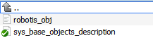
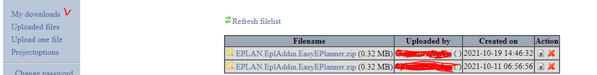

# Кіраўніцтва пачаткоўца распрацоўніка для EasyEPlanner #

Дадзенае кіраўніцтва служыць пачаткоўцам для азнаямлення з рашэннем і паглыбленні ведаў у праекце без непасрэднага даследавання кода. Апроч гэтага кіраўніцтва, пажадана яшчэ вывучыць кіраўніцтва карыстальніка, бо дазваляе вывучыць варыянты выкарыстання сістэмы карыстальнікамі, а таксама карыстальніцкі функцыянал. Створана ў лістападзе 2021 года.
**Нататка**: надбудова працуе толькі з адным адкрытым праектам у EPLAN.

Дадатак падключаецца да версіі **EPLAN 2.8** (*цяпер 2.9*) і навейшы. Большасць пытанняў звязаных з працай **EPLAN**, **EPLAN API** можна знайсці ў дакументацыі **EPLAN**.

[Карыстальніцкая дакументацыя](https://github.com/savushkin-r-d/EasyEPLANner/tree/master/docs/user_manual).

[Дакументацыя па API](https://www.eplan.help/en-US/infoportal/content/api/2.9/index.html).

[Дакументацыя па EPLAN](https://www.eplan.help/ru-RU/Infoportal/Content/Plattform/2.9/EPLAN_Help.htm) ці кнопка **F1** у **EPLAN**.

## Змест ##
1. [Тэхналагічны стэк і праекты](#1-Тэхналагічны-стэк-і-праекты)
    + [1.1 Aga.Controls](#11-AgaControls)
    + [1.2 EasyEPlanner](#12-EasyEPlanner)
    + [1.3 EasyEplanner.Tests](#13-EasyEplannerTests)
    + [1.4 EplanIdleTimeModule](#14-EplanIdleTimeModule)
      + [1.5 ObjectListView2012](#15-ObjectListView2012)
2. [Файлавая структура](#2-Файлавая-структура)
    + [2.1 Файлавая структура гатовай для выкарыстання надбудовы](#21-Файлавая-структура-готовай-для-выкарыстання-надбудовы)
        + [2.1.1 Каранёвы каталог](#211-Каранёвы-каталог)
        + [2.1.2 Каталог CMD](#212-Каталог-CMD)
        + [2.1.3 Каталог Lua](#213-каталог-Lua)
        + [2.1.4 Каталог BaseObjectsDescriptionFiles](#214-Каталог-BaseObjectsDescriptionFiles)
    + [2.2 Апісанне файла configuration.ini і EPLAN.EplAddin.IdleTimeModule.dll.config](#22-Апісанне-файла-configurationini-і-EPLAN.EplAddin.IdleTimeModule.dll.config)
        + [2.2.1 Файл канфігурацыі EasyEPlanner](#221-Файл-канфігурацыі-EasyEPlanner)
        + [2.2.2 Файл канфігурацыі модуля прастою](222-Файл-канфігурацыі-модуля-прастою)
      + [2.3 Файлы праектаў Aga.Controls і ObjectListView2012](#23-Файлы-праектаў-Aga.Controls-і-ObjectListView2012)
    + [2.4 Файлы праекта EplanIdleTimeModule](#24-Файлы-праекта-EplanIdleTimeModule)
    + [2.5 Файлы праекта EasyEPlanner](#25-Файлы-праекта-EasyEPlanner)
        + [2.5.1 Корань праекта](#251-Корань-праекта)
        + [2.5.2 Каталог Configuration](#252-Каталог-Configuration)
        + [2.5.3 Каталог Device](#253-Каталог-Device)
        + [2.5.4 Каталог Editor](#254-Каталог-Editor)
        + [2.5.5 Каталог EProjectManager](#255-Каталог-EProjectManager)
        + [2.5.6 Каталог FileSavers](#256-Каталог-FileSavers)
        + [2.5.7 Каталог InterprojectExchange](#257-Каталог-InterprojectExchange)
        + [2.5.8 Каталог IO](#258-Каталог-IO)
        + [2.5.9 Каталог Logs](#259-Каталог-Logs)
        + [2.5.10 Каталог Main](#2510-Каталог-Main)
        + [2.5.11 Каталог StaticHelper](#2511-Каталог-StaticHelper)
        + [2.5.12 Каталог TechObject](#2512-Каталог-TechObject)
        + [2.5.13 Каталог Extensions](#2513-Каталог-Extensions)
        + [2.5.14 Каталог PxcIolinkConfiguration](#2514-Каталог-PxcIolinkConfiguration)
    + [2.6 Файлы праекта EasyEplanner.Tests](#26-Файлы-праекта-EasyEplanner.Tests)
3. [Зборка праекта і падпісванне бібліятэк ключом EPLAN](#3-Зборка-праекта-і-падпісванне-бібліятэк-ключом-EPLAN)
    + [3.1 Зборка праз тэрмінал](#31-Зборка-праз-термінал)
    + [3.2 Зборка праз Visual Studio](#32-Зборка-праз-Visual-Studio)
    + [3.3 Зборка для подпісу надбудовы і яе падпісванне](#33-Зборка-для-подпісу-надбудовы-і-яе-падпісванне)
    + [3.4 Як наладжваць надбудову](#34-Як-наладжваць-надбудову)
4. [Пытанні карыстальнікаў, частыя змены ў праекце](#Пытанні-карыстальнікаў-частыя-змены-ў-праекце)

## 1. Тэхналагічны стэк і праекты ##

Рашэнне **EasyEPlanner.sln** для Visual Studio змяшчае ў сабе **5** праектаў:
1. **Aga.Controls** - праект UI элемента кіравання.
2. **EasyEPlanner** - асноўны праект дадатку для Eplan.
3. **EasyEplanner.Tests** - праект з юніт-тэстамі для дапаўнення. Выкарыстоўваецца NUnit, як фрэймворк, і Mock бібліятэка, як стваральнік Mock і Stub аб'ектаў. Stub змяшчаюць толькі стан, а Mock - паводзіны. Fake аб'ект змяшчае ў сабе і паводзіны, і стан (*пачытайце тэорыю*).
4. **EplanIdleTimeModule** - модуль прастою Eplan. Выкарыстоўваецца як асобна, так і як частка EasyEPlanner.
5. **ObjectListView2012** - праект UI элемента кіравання для рэдактара тэхналагічных аб'ектаў.

Усе праекты напісаны на мове **C#** з ужываннем тэхналогіі **.Net Framework** версіі **4.5** (*Aga.Controls, ObjectListView2012*), версіі **4.7.2** (*EasyEPlanner*) і версіі **.Net Core 3.1** (*EasyEplan. Дадаткова ў праекце **EasyEPlanner** выкарыстоўваецца скрыптовая мова **Lua**.

Праекты **1**, **4** і **5** выкарыстоўваюцца ў **EasyEPlanner** як падмодулі (*submodules*).

### 1.1 Aga.Controls ###

Праект змяшчае ў сабе UI-кампанент, які выкарыстоўваецца ў EasyEPlanner у вокнах, адкрываных праз пункты меню: "**Прылады, параметры аб'ектаў**" і "**Аперацыі, абмежаванні і прывязка аб'ектаў**".

Сам праект не трэба ўвесь час збіраць і падпісваць строгім імем, т.к. ён ужо быў сабраны і выкарыстоўваецца ў EasyEPlanner праз спасылку на dll-бібліятэку(_тэчка libs_). Пры Debug ці Release зборцы рашэння ён будзе збірацца па неабходнасці, але капіявацца будзе версія з тэчкі libs, якая ўжо падпісаная і выкарыстоўваецца, пры яе замене ніякіх сайд-эфектаў быць не павінна.

### 1.2 EasyEPlanner ###

Асноўны праект рашэння Visual Studio. Больш падрабязнае апісанне функцыяналу можна знайсці ў карыстальніцкай дакументацыі. Выкарыстоўваецца ў асноўным для апісання кіравальнай праграмы для ПЛК. Апісанне загружаецца і захоўваецца з **Lua** кода. Для ўзаемадзеяння з **EPLAN** выкарыстоўваецца **EPLAN API**. Надбудова можа выгружаць Excel справаздачы, генераваць XML апісанне базы каналаў для SCADA, счытваць інфармацыю са схем аўтаматызацыі (прылады, плк), а таксама падтрымлівае прывязку каналаў прылад да клем модуляў-уводу высновы і інш. Больш падрабязна ў карыстальніцкай дакументацыі.
### 1.3 EasyEplanner.Tests ###

Праект з unit-tests выкарыстоўвае **EasyEPlanner** як спасылку для тэсціравання. Напісаны на .Net Core 3.1, але **УВАГА** тэсты не цалкам пакрываюць тэстамі надбудову. Трэба кожны раз запускаць тэсты, пасля занясення змен, а пасля, для новага функцыяналу пісаць новыя, якія пакрываюць сцэнары выкарыстання функцыяналу. Юніт-тэсты называюцца па канвенцыі, з назваў метадаў можна прыкладна зразумець, што яны тэстуюць, і які вынік будзе на выхадзе.

Канвенцыя наймення - *UnitOfWork_StateUnderTest_ExpectedBehavior*. Але можна выкарыстоўваць сучаснае і міксаваць (*што, накшталт як, сустракаецца ў кодзе*).

### 1.4 EplanIdleTimeModule ####

Праект модуля прастою **EPLAN**. Сутнасць: па дасягненні вызначанага часу (*наладжваецца ў канфігурацыі*), калі карыстальнік не карыстаўся сістэмай (*заблакаваў камп’ютар праз Win + L ці нешта яшчэ*), **EPLAN** будзе выключаны, т.к ліцэнзій канчатковая колькасць, а карыстальнікаў значна больш, чым ліцэнзій (*часам, вольныя ўсе ліцэнзіі, а часам.

Надбудова можа падлучацца асобна ад **EasyEplanner**, так і выкарыстоўвацца ў **EasyEplanner** (_выкарыстоўваеш яе як спасылку і атрымліваеш доступ да класаў, магчымасць запускаць модуль і падпісацца на падзеі_). Не рэкамендуецца выкарыстоўваць адначасова ў апісаных выпадках, бо невядомыя наступствы.

### 1.5 ObjectListView2012 ###

Праект UI-кампанента, які выкарыстоўваецца ў EasyEPlanner для акна "**Рэдагаваць тэхналагічныя аб'екты**". Зборка і выкарыстанне - аналагічна пункта [1.1 Aga.Controls](#11-AgaControls).
## 2. Файлавая структура ##

У большасці выпадкаў, файлы зыходнага кода пракаментаваны праз _summary_ натацыю, што палягчае вывучэнне кода, але, часам, каментар можа быць зманлівы (_легасі_). **Lua** скрыпты ў сваёй большасці таксама пракаментаваны.
### 2.1 Файлавая структура гатовай для выкарыстання надбудовы ###

Не ўсе файлы ствараюцца адразу дадаткам, некаторыя капіююцца з іншых праектаў. Напрыклад, апісанне тэхналагічных аб'ектаў, але пра гэта ніжэй.

#### 2.1.1 Каранёвы каталог ####

Малюнак - Агульны выгляд каталога надбудовы

Апісанне:
1. CMD - скрыпты ў **.txt** фармаце, якія выкарыстоўваюцца для праверкі наяўнасці ўсталяванага **Lua**, а таксама для запуску аўтаматычнага тэсціравання праектаў.
2. Documentation - дакумент для настройкі **Lua** у сістэме, каб працавала тэсціраванне праекта **EPLAN**.
3. Lua - дапаможныя скрыпты (*апісана ніжэй*), а таксама апісанне базавых аб'ектаў з рэпазітара **ptusa-lua-diary-sys**.
4. LuaInterface - падпісаныя бібліятэкі для працы з **Lua** праз **C#** код і наадварот. Дублююцца бібліятэкі *LuaInterface* і *KopiLua* з кораня каталога (*легі код, не перарабляў*).
5. Aga.Controls.dll - падпісаная бібліятэка з UI-элементам [1.1 Aga.Controls](#11-AgaControls).
6. configuration.ini - файл канфігурацыі для **EasyEPlanner**. Генеруецца аўтаматычна, калі адсутнічае, а потым у яго ўжо запісваюцца наладкі. Апісаны ў наступным раздзеле.
7. EPLAN.EplAddin.EasyEPlanner.dll - асноўная падпісаная бібліятэка надбудовы. Менавіта гэты файл заўсёды падлучаецца да **EPLAN**. У асноўным, калі ўносяцца змены ў праект, то часцей за ўсё, гэты файл мяняецца, а іншыя файлы застаюцца нязменнымі.
8. EPLAN.EplAddin.IdleTimeModule.dll - падпісаная бібліятэка модуля прастою.
9. EPLAN.EplAddin.IdleTimeModule.dll.config - файл канфігурацыі модуля прастою. Фармат - XML. Апісаны ў наступным раздзеле.
10. KopiLua і LuaInterface - глядзі пункт 4.
11. ObjectListView - аналагічна з пунктам 5, толькі для [1.5 ObjectListView2012](#15-ObjectListView2012).
12. Spire.License, Spire.Pdf, Spire.XLS - бібліятэкі, якія выкарыстоўваюцца для генерацыі **Excel** справаздач.

#### 2.1.2 Каталог CMD ####

Рисунок - Каталог CMD

Апісанне:
1. TestLuaAvailability.txt - скрыпт для праверкі наяўнасці **Lua** у сістэме. Запускаецца працэсам з EasyEPlanner.
2. TestProjectScript.txt - скрыпт, які запускае тэсціраванне пасля праверкі наяўнасці **Lua** у сістэме.

#### 2.1.3 Каталог Lua ####

Рисунок - Каталог Lua

Апісанне:
1. BaseObjectsDescriptionFiles - каталог з апісаннем базавых аб'ектаў. Бярэцца з рэпазіторыя **ptusa-lua-diary-system**. Калі файлаў няма - будзе аўтаматычна створаны разам з пачатковым пустым апісаннем.
2. mainPattern.plua - шаблон файла **main.plua**, можна мяняць у рэальным часе. Генеруецца **1** раз, пры стварэнні праекту (часта карыстальнікі капіююць файлы праекту і сам праект, а потым проста перарабляюць, таму генеруецца рэдка, але часам трэба, каб шаблон змяняўся_).
3. sys.lua - файл з **Lua** скрыптамі, якія загружаюць апісанне з **Lua** файлаў, у прыватнасці, тэхналагічных аб'ектаў праекту ў надбудову. Змяняецца даволі часта, калі мяняецца структура **Lua** файлаў.
4. sys_base_objects_initializer.lua - скрыпт, якія ініцыялізуе базавыя аб'екты, якія счытваюцца з тэчкі (_гл. пункт 1_). Змяняецца ў залежнасці ад змен базавых аб'ектаў.
5. sys_interproject_io.lua - скрыпт чытання апісання **Lua** з файла *main.io.lua* для загрузкі міжпраектнага абмену сігналамі.
6. sys_io_modules.lua - скрыпт з апісаннем модуляў уводу-высновы, якія падтрымліваюцца надбудовай.
7. sys_io_nodes.lua - скрыпт з апісаннем вузлоў уводу-высновы, якія падтрымліваюцца надбудовай.
8. sys_iolink_devices.lua – скрыпт з апісаннем падтрымоўваных IO-Link прылад.
9. sys_restriction.lua - скрыпт які чытае апісанне абмежаванняў для тэхналагічных аб'ектаў (*заўсёды запускаецца пасля sys.lua*).
10. sys_shared_initializer.lua - скрыпт які чытае міжпраектны абмен з файла *main.shared.lua* праекту.

#### 2.1.4 Каталог BaseObjectsDescriptionFiles ####

Трэба крыху расказаць пра тое, як гэта працуе. Базавыя аб'екты могуць быць любыя, і іх можа быць любая колькасць. Галоўнае, каб у файлах яны не перасякаліся. Надбудова загружае з кожнага файла базавыя аб'екты, таму можна падзяліць іх па розных крытэрах і выкарыстоўваць так, як трэба карыстальніку. У гэтай тэчцы заўсёды павінен быць файл з апісаннем, інакш могуць зляцець у праектах базавыя аб'екты са ўсімі наладамі. У **SVN** рэпазітары файл зафіксаваны (*sys_base_objects_description.lua*), які выкарыстоўваецца АСУТП. Калі файла няма, то ён будзе створаны аўтаматычна, а ўсярэдзіне яго будзе базавае апісанне і каментары аб тым, як запаўняць гэты файл. Дадаткова можна ў тэчцы Lua паглядзець файл **sys_base_object_initializer.lua**, які паказвае, што чытаецца, і куды адпраўляецца.

Рисунок - Каталог BaseObjectsDescriptionFiles у каталозе Lua

### 2.2 Апісанне файла configuration.ini і EPLAN.EplAddin.IdleTimeModule.dll.config ###

Файл configuration.ini ставіцца да EasyEplanner, а другі, як відаць з назвы часткі, да модуля прастою.

#### 2.2.1 Файл конфігурацыі EasyEPlanner ####
Канфігуруе надбудову EasyEPlanner.

Можа змяшчаць 6 секцый:
1. path - паказваюцца шляхі (`folder_path` тэг) да файлаў **Lua** з праектамі (_ёсць у карыстальніцкай дакументацыі_). Змяняецца рукамі.
2. helpSystem - паказваецца `address` і `mainAddress` для OSTIS (_нікім не выкарыстоўваецца, але трэба было навошта-то дадаць_). Змяняецца рукамі.
3. TestSettings - уключэнне і выключэнне тэсціраванне праекту (*ёсць у карыстальніцкай дакументацыі*). Змяняецца рукамі.
4. currProjDevList - настройка адлюстравання прылад для налады міжпраектнага абмену ў адкрытым праекце. Змяняецца аўтаматычна.
5. advProjDevList - аналагічна пункту 4, толькі для злучанага праекту.
6. bindedSignalsList - настройка акна звязаных сігналаў для міжпраектнага абмену. Змяняецца аўтаматычна.

Пункты **4-6** выкарыстоўваюцца для аднаго UI элемента кіравання ў міжпраектным абмене сігналамі.

#### 2.2.2 Файл канфігурацыі модуля прастою ####

Канфігуруе модуль прастою. Канфігурацыя апісана ў фармаце **XML**.

Секцыі:
1. checkIntervalSec - інтэрвал праверкі прастою сістэмы ў секундах. Змяняецца рукамі.
2. maxChecksCount - колькасць паспяховых праверак запар (*калі сістэма прастойвае*), пасля якога запускаецца механізм абвесткі карыстальніка і затым адключэння **EPLAN**, калі карыстальніка не адрэагаваў на працягу **1** хвіліны. Змяняецца рукамі.

### 2.3 Файлы праектаў Aga.Controls і ObjectListView2012 ###

Апісваць няма сэнсу, бо выкарыстоўваюцца ўжо падпісанымі бібліятэкамі з тэчкі `libs`. Мы іх ніяк не мянялі, пакуль што.

### 2.4 Файлы праекта EplanIdleTimeModule ###

Праект дастаткова просты. Зачыняць EPLAN, калі сістэма прастойвае нейкі час. Калі адчыненыя якія-небудзь усплывальныя вокны ў EPLAN, то праект не можа быць зачынены і тады працэс EPLAN знішчаецца праз `Kill` ​​метад працэсу.

Надбудова сама па сабе мяняецца рэдка, але ў праекце EasyEPlanner спасылка пазначана на праект, а не на бібліятэку. Пры зборцы і подпісе трэба ўказваць спасылку на падпісаную бібліятэку (*будзе апісана ў главе 3*).

Праект выкарыстоўвае **Win32** бібліятэкі `PIInvoke`.

Рисунок - Структура файлаў праекта IdleTimeModule

Апісанне:
1. EplanHelper - змяшчае класы і інтэрфейсы для абстракцыі ад **API** Eplan. Клас EplanHelper выкарыстоўвае класы і інтэрфейсы **EplanProject** і **EplanSelectionSet**. Класы працуюць з **API** для захопу праекту і яго зачыненні праз **API** (_калі гэта магчыма_).
2. Key - ключы для подпісу дапаўненні.
3. AddInModule.cs - кропка ўваходу ў дадатак. Калі дадатак падлучаецца праз **API** Eplan (г.зн. **EPLAN** загружае яго, а **EasyEplanner**)), метады гэтага класа, які рэалізуе інтэрфейс `IEplAddin`, заўсёды выклікаюцца (_падрабязней гл. у дакументацыі API_).
4. App.config - гэта файл канфігурацыі, які затым пераўтворыцца ў _EPLAN.EplAddin.EplanIdleTimeModule.dll.config_.
5. IdleTimeModule.cs - асноўны клас і інтэрфейс, які адказвае за модуль чакання. Дазваляе запускаць і спыняць модуль, а таксама зачыняць прыкладанне/праект, паказваць карыстальніку папярэджанне і т. д.
6. IdleTimeModuleForm.cs - форма, якая адлюстроўваецца карыстальніку, калі неабходна пацвердзіць дзеянне або EPLAN будзе зачынены.
7. ModuleConfiguration.cs - клас і інтэрфейс для працы з канфігурацыяй модуля чакання, яго чытаннем і капіраваннем.
8. PInvokeUtil.cs - клас утыліт Win32.
9. RunningProcess.cs - клас і інтэрфейс для працы з запушчаным працэсам (_абалонкай_).

Як працуе? Два шляхі. Першы - гэта самастойнае выкарыстанне надбудовы. Для гэтага нам патрэбен файл config і dll модуля. Можам падключыць праз EPLAN і атрымліваць асалоду ад. У гэтым выпадку, будзе ўваход праз `AddInModule.cs`. Другі - выкарыстанне ў EPLAN. Падлучальны спасылку, выкарыстоўваем клас IdleTimeModule.

### 2.5 Файлы праекта EasyEPlanner ###

Разгляд пачнём з каталогаў т.к праект разбіты на вялікую колькасць файлаў і каталогаў па лагічным і прадметным прынцыпе.

#### 2.5.1 Корань праекта ####

Рисунок - Корань праекта

Каталогі `CMD`, `LuaInterface`, `Lua` (*без апісання базавых аб'ектаў*) [аналагічныя вось гэтаму](#211-Каранёвы-каталог).

Апісанне:
1. Resources.resx і тэчка Resources - утрымоўвае рэсурсы праекту. У асноўным гэта радковыя шаблоны і карцінкі для рэдактара тэхналагічных аб'ектаў.
2. AssemblyInfo.cs - базавая інфармацыя аб кампіляванай бібліятэцы. Тут мяняецца версія `dll`.
3. Configuration - файлы класаў і інтэрфейсаў наладкі / чытання канфігурацыі праекта, надбудовы і інш. Апісаны ніжэй.
4. Device - файлы з класамі і інтэрфейсамі для працы з прыладамі, тыпамі прылад, і інш.
5. Editor - файлы з класамі, інтэрфейсамі і формамі рэдактара тэхналагічных аб'ектаў з функцыяналам імпарту і экспарту, падсвятленні прылад на ФСА і інш.
6. EProjectManager - файлы з класамі і інтэрфейсамі, якія перавызначаны з **Eplan API**, для кіравання **Eplan** і праектам.
7. FileSavers - файлы з класамі. інтэрфейсамі, якія выкарыстоўваюцца для захавання рознай інфармацыі. Гэта генерацыя справаздачы **Excel**, генерацыя базы каналаў для **SCADA**, захаванне статыстыкі па праекце ў **SVG**, а таксама захаванне файлаў праекту ў **Lua**.
8. InterprojectExchange – поўная функцыянальнасць міжпраектнага абмену сігналамі.
9. IO - файлы з класамі і інтэрфейсамі для модуляў-уводу высновы і ўзаемадзеянні з імі (прывязка прылад, разлік адраснай прасторы ў т.л. і для IO-Link).
10. key - ключы для подпісы надбудовы.
11. Logs - файлы для працы з логгерам праекту для карыстача. Логер паказвае карыстачу падказкі і памылкі. Часам у логгер можа пападаць StackTrace, калі злавілі неапрацаваную памылку.
12. Main - файлы з `Action` (*гл. Eplan Api дакументацыю*), а таксама ўваходным класам, які выклікаецца **Eplan Api** пры загрузцы надбудовы.
13. StaticHelper - агульныя класы, якія змяшчаюць дадзеныя і паводзіны, якое выкарыстоўваецца амаль па ўсім праекце або ў нейкім вялікім пуле класаў. Усе класы там статычныя.
14. TechObject - файлы якія апісваюць аб'ектную мадэль тэхналагічных аб'ектаў (*асноўны слуп, як і прылады, які апісвае праграму ў ПЛК*).
15. PxcIolinkConfiguration – файлы, якія апісваюць функцыянал генерацыі апісання для IOL-Conf.
15. DeviceBindFromForm.cs - клас, які адказвае за прывязку абранага на форме прылад канала ўводу-высновы да канала ўводу-высновы на модулі ўводу-высновы (*прывязка канала прылады да модуля плк*). Ствараецца клас з патрабаванымі аргументамі ў канструктару, і выклікаецца метад `Bind()`. На форме прылад павінен быць абраны канал уводу высновы (*двайным клікам адбываецца спрацоўванне гэтага функцыяналу*).
16. DFrm.cs - форма ў якой адбываецца прывязка прылад да модуляў уводу-высновы, да тэхналагічных аб'ектаў (*прылады ў аперацыі*), а таксама прывязка параметраў да тэхналагічных аб'ектаў, дзе гэта дапушчальна (*гл. карыстацкую дакументацыю*).
17. EncodingDetector.cs - размаўлялая назва. Пры адкрыцці праекту правярае кадоўку яго файлаў і чытае іх у патрэбнай кадоўцы, каб не было бітых знакаў (**ASCII адрозніваецца ад UTF-8**).
18. ModeFrm.cs - форма на якой адлюстроўваюцца аперацыі тэхналагічных аб'ектаў, а таксама ёсць магчымасць прывязкі аб'ектаў сябар да сябра і налада іх абмежаванняў (_абмежаванне ўключэнняў аперацый_).
19. ModulesBindingUpdater.cs - клас які адказвае за абнаўленне каментароў і прывязаных прылад пры іх змене. Як працуе - глядзі карыстацкую дакументацыю. Пад капотам: прылады заўсёды маюць адну і тую ж спасылку, таму пры перайменаванні прылады, яна не мяняецца і мы ведаем, што трэба памяняць. Функцыянальнасць мянялася літаральна пару разоў калісьці даўно.
20. PInvokeUtil.cs - клас з загружанымі ў доступ **Win32** метадамі і ўласцівасцямі. Трэба для захопу вокнаў бо нашы UI кампаненты малююцца ў **Eplan** вокнах, а таксама для запісу `.ini` канфігурацыі і перахопу карыстацкага ўводу для яго апрацоўкі.
21. ProjectManager.cs - клас мэнэджара адкрытага ў Eplan праекта. Праз яго (калі ён быў выкліканы з `Action`) адбываецца запуск загрузкі файлаў праекту, іх захаванне, запуск генерацыі справаздач, ініцыялізацыя пачатковая надбудовы і інш.

#### 2.5.2 Каталог Configuration ####

Змяшчае класы, якія адказваюць за праверку канфігурацыі, яе чытанне, сінхранізацыю і інш. Больш падрабязна ніжэй.

1. ConfigurationChecker.cs - правярае на памылкі бягучы адчынены праект. Перабірае IP-адрасы, правярае прылады, модулі ўводу-высновы, тэхналагічныя аб'екты, а таксама запускае тэсціраванне праекта, калі яно ўключана. Потым выводзіць памылкі ў лог карыстальніка, `Logs` каталог. Асноўны метад усярэдзіне аб'ектаў - гэта `Check()` ён практычна заўсёды перагружаны `override` ці віртуальны `virtual` т.к усе аб'екты тэхналагічныя ўспадкоўваюцца ад `TreeViewItem`, які рэалізуе `ITreeViewItem`, а прылады ад `IDevice` і гэтак далей па іерархіі ўспадкоўвання.
2. DeviceBindingReader.cs - чытае прывязку прылад да модуляў уводу-высновы са схем. Запускаецца з `ProjectManager`. Выкарыстоўвае Eplan Api, прылады, модулі ўводу-вываду і `StaticHelper`.
3. DeviceReader.cs - чытае прылады з ФСА. Выкарыстоўвае Eplan Api, прылады. Счытвае, запісвае ў спіс, якім потым карыстаюцца іншыя класы.
4. DeviceSynchronizer.cs і DeviceSynchronizerService.cs - класы якія адказваюць за сінхранізацыю прылад. Калі, напрыклад, перайменавалі прыладу, і гэта трэба абнавіць у розных месцах, дзе яно выкарыстоўваецца. Калі выкарыстоўваюцца прылады ўсярэдзіне параметраў прылад іншых, то яны не сінхранізуюцца т.к запісаны ў выглядзе радка.
5. IOReader.cs - счытвае канфігурацыю ПЛК і модуляў уводу-высновы са схем, якая затым выкарыстоўваецца ў надбудове.
6. ProjectConfiguration.cs - агульны клас-абгортка, які кіруе ўсёй канфігурацыяй. Можна запусціць праверку памылак, чытанне прывязкі, прылад, плк і модуляў уводу-высновы і сінхранізацыю прылад.
7. ProjectHealthChecker.cs - клас, які тэстуе працаздольнасць праекта, запуску скрыпты тэсціравання і выводзячы лог карыстачу. Менавіта гэты клас выкарыстоўвае скрыпты з тэчкі `CMD`.

#### 2.5.3 Каталог Device ####

Каталог змяшчае ўсё, што звязана з прыладамі. Класы прылад, дапаможныя класы для больш чыстага стварэння прылад і менеджэр для працы з імі.

1. каталог IODevices - утрымоўвае пералік класаў прылад, якія падтрымліваюць увод-вывад (_гэта для ўсіх выкарыстоўваных прылад_). Прылады `DEV_VTUG` ці `Y` - пнеўмавостраў, які існуе толькі ў надбудове, але ў файлы кантролера інфармацыя аб іх не грузіцца. Кожны клас адказвае за канкрэтную прыладу са сваімі падтыпамі, параметрамі і іншымі наладамі. Апісанне ва ўсіх мае прыкладна той жа алгарытм бо яны ўспадкоўваюцца ад класа `IODevice`, а той у сваю чаргу ад `Device`.
2. Device.cs - інтэрфейс і клас самай базавай прылады. Змяшчае агульную нізкаўзроўневую логіку.
3. IODevice.cs - інтэрфейс і клас, спадчынны ад `Device`, утрымоўвае логіку прылады, як прылады ўводу-высновы з даданнем каналаў, параметраў, уласцівасцяў і інш. Ад класа `Device` акрамя гэтага класа ніхто не ўспадкоўваецца.
4. Parameter.cs, Property.cs, Tag.cs, RuntimeParameter.cs - частковыя класы `IODevice`, якія ўтрымоўваюць у сабе класы з дадзенымі аб параметрах, уласцівасцях, тэгах і рантайм параметрах. Выкарыстоўваюцца для канфігурацыі прылад у класах тэчкі `IODevices` т.е дапамагаюць апісаць прыладу без дублявання кода.
5. DeviceType.cs, DeviceSubType.cs - пералічэнні з усімі магчымымі тыпамі і падтыпамі для апісання прылад пры апісанні іх класаў. **Важна**: нумар, які паказваецца ў пералічэнні вельмі важны і можна дадаваць толькі ў канец т.к гэта ўплывае яшчэ і на кантролер.
6. DeviceManager.cs - асноўны клас, які працуе з прыладамі. Можна запусціць праверкі, генерацыю дапаможных дадзеных для справаздач **Excel**, для базы каналаў у **SCADA**, стварэнне прылад, даданне, пошук, захаванне ў **Lua** фармат і інш.
7. IDevice.cs – інтэрфейс Device.
8. IIOChannel.cs – інтэрфейс IOChannel.
9. IOChannel.cs – каналы прылады (DI, DO, AI, AO).
10. IOLinkSize.cs - клас, які прадстаўляе IO-Link памернасці для прылады.
11. IIODevice.cs – інтэрфейс IODevice.

#### 2.5.4 Каталог Editor ####

Каталог змяшчае асноўны функцыянал, звязаны з рэдактарам тэхналагічных прылад, акно "**Рэдагаваць тэхналагічныя прылады**", уключаючы імпарт і экспарт аб'ектаў, а таксама акно выбару базавых аб'ектаў. Больш падрабязней аб гэтай функцыянальнай распісана ў карыстальніцкай дакументацыі.

1. каталог ImportExport - утрымоўвае класы і формы для працы з імпартам і экспартам аб'ектаў у/з **Lua** файла для наступнага выкарыстання ў іншых праектах (*да прыкладу*). За функцыянал імпарту адказваюць `клас і` форма з постфіксам `Importer`, а за экспарт `Exporter` у такой жа канфігурацыі. Пры экспарту выклікаюцца метады `SaveAsLua`, а пры імпарце выкарыстоўваецца скрыпт `sys.lua`, але загружаюцца дадзеныя не ў агульны спіс аб'ектаў (*гэта адбываецца пасля выбару аб'ектаў, якія трэба імпартаваць, са спісу загружаных*), а ў часовы. Формы толькі перадаюць інфармацыю ад карыстача ў злучаны клас, а тыя класы затым выкарыстоўваюць унутраныя механізмы надбудовы для захавання або імпарту.
2. каталог ObjectsAdder - усярэдзіне ляжыць толькі форма, з дапамогай якой вырабляецца выбар базавага аб'екта для стварэння, калі яго нельга вызначыць аўтаматычна. У форме ёсць асобнік статычнага класа `BaseTechObjectManager` і метады, якія дапамагаюць надбудове зразумець, што было абрана карыстачом і ці было абрана наогул.
3. DrawInfo.cs - клас, які выкарыстоўваецца для налады колеру падсветкі прылад на схеме аўтаматызацыі. Падсвятленне залежыць ад дзеяння за крок аперацыі аб'екта. Ён злучае прыладу, якое трэба падсвятліць, і колер (*стыль*) падсвятленні. Гэта потым выкарыстоўваецца пры стварэнні дзеянняў у кроку аперацыі, і потым гэтая інфармацыя здабываецца метадам з `ProjectManager`, які і падсвятляе прылады.
4. Editor.cs - асноўны клас, праз які рэдактар ​​адчыняецца, зачыняецца, а таксама перабудоўвае дрэва цалкам.
5. IEditor.cs - апісанне інтэрфейсу для `Editor`.
6. IBaseObjChangeable.cs – інтэрфейс, які апісвае метад для змены базавага аб'екта ў тэхналагічнага аб'екта. Цяпер гэтая функцыянальнасць працуе праз скід базавага аб'екта (*гл. карыстальніцкую дакументацыю*).
7. IHelperItem.cs - інтэрфейс, які апісвае метад `GetToHelpPage`, які пры націску **F1** на розных элементах дрэва рэдактара, адчыняе даведку (*выкарыстоўваецца OSTIS, патрэбен лагін і пароль. Даведацца можна ў кіраўніка. На практыку - нікім не выкарыстоўвалася*).
8. ImageIndexEnum.cs - пералік з індэксамі карцінак / абразкоў для дрэва тэхналагічных аб'ектаў. Усе злучаныя малюначкі можна паглядзець у `NewEditorControl`, ва ўласцівасці `SmallImagesList`, калекцыя `Images`.
9. ITreeViewItem.cs - інтэрфейс які апісвае атамарны элемент рэдактара.
10. TreeViewItem.cs - базавы элемент рэдактара - **дрэвападобны элемент**. Можа ўтрымоўваць нашчадкаў (_галіны_).
11. ObjectProperty.cs - базавы элемент рэдактара - **ўласцівасць**. Не падтрымлівае нашчадкаў, г.зн. не з'яўляецца дрэвападобным элементам.
12. NewEditorControl.cs - форма рэдактара тэхналагічных аб'ектаў. Змяшчае шмат сувязяў з іншымі формамі і мэнэджэрамі аб'ектаў, прылад т.к выкарыстоўвае ўсіх іх. Элементы на дрэве - гэтае дрэва тэхналагічных аб'ектаў. Форма праз інтэрфейс тузае элемент дрэва, у залежнасці ад таго, які элемент прывязаны. Гэта значыць, форма толькі адлюстроўвае мадэль і змяняе яе.

#### 2.5.5 Каталог EProjectManager ####

Каталог змяшчае дапаможныя класы, якія працуюць з **Eplan Api**. З дапамогай гэтых класаў адбываецца падпіска на падзеі, інтэракцыі **EPLAN** і іх апрацоўка.

1. EplanEventListener.cs - клас з падпіскай на асноўныя галоўныя падзеі **EPLAN**. Такія як, адкрыццё праекту, зачыненне праекту, запуск **EPLAN**, зачыненне **EPLAN** і інш. З гэтага класа галоўным чынам запускаецца захаванне праекту ў **Lua** (акрамя гэтага, гэта можна зрабіць яшчэ з рэдактара аб'ектаў, а таксама праз акно з прыладамі)_, і яго загрузка праз `ProjectManager`.
2. EProjectManager.cs - сугучны з `ProjectManager`, але мае прыстаўку `E`. Рэалізуе базавую логіку, якая патрабуе ўзаемадзеяння з Eplan API. Уключэнне/адключэнне рэжыму рэдагавання ў рэдактары, каб можна было дадаваць прылады ў аперацыю аб'екта праз клік па ім на ФСА. Змяшчае логіку захавання і загрузкі файлаў праекта, якія выклікаюцца ў `EplanEventListener`.
3. InsertMacrosInteraction.cs - перавызначаная карыстальніцкая інтэракцыя, якая выклікаецца тады, калі ў EPLAN адбываецца ўнутраная інтэракцыя XMaInsertMacro (праверка інтэракцыі ў Eplan можа адбыцца праз Ctrl + \ - гэта справа ад літары `э` на клавіятуры. У тым акенцы бачныя апошнія дзеянні.
4. SelectInteractionWhileEditModes.cs - інтэракцыя, якая ўключаецца, калі ўключаецца рэжым рэдагавання, пры кожным кліку на ФСА яна спрабуе распазнаць прыладу. Калі распазнана - дадае яго ў абраны пункт у рэдактары аб'ектаў (калі гэта не супярэчыць бізнэс-логіцы), а затым перазапускае саму сябе, пакуль у рэдактары ўключаны рэжым рэдагавання. Пры пераключэнні паміж старонкамі інтэракцыя перазапускаецца бо ўнутраны механізм EPLAN яе скідае.

#### 2.5.6 Каталог FileSavers ####

У каталогу змяшчаюцца файлы, якія адказваюць за захаванне інфармацыі на дыск у розных фарматах, якія выкарыстоўваюцца для розных патрэб.

1. Excel - каталог які змяшчае класы якія адказваюць за генерацыю **Excel** справаздачы. `ExcelReporter` генеруе справаздачу, а `ExcelDataCollector` - збірае дадзеныя для ExcelReporter т.е ён выкарыстоўваецца ў ім.
2. PrgLuaSaver.cs - клас, які адказвае за генерацыю файла праекту **main.prg.lua**. Ён выкарыстоўвае менеджары прылад і тэхналагічных аб'ектаў і ў адпаведнасці з бізнес-логікай, фармуе файл як табліцу **Lua** і вяртае ў выглядзе радка класу `ProjectDescriptionSaver`.
3. ProjectDescriptionSaver.cs - клас, які займаецца захаваннем усёй патрэбнай інфармацыі для ПЛК у **Lua** фармаце і запісам у каталог з праектам. Выводзіць таксама лог, калі трэба па бізнес-логіцы.
4. SVGStatisticsSaver.cs - захоўвае розныя SVG-малюнкі статыстыкі па праекце. Колькі агрэгатаў, апаратаў, прылад і інш.
5. XMLReporter.cs і XMLReporterDialog.cs - адказваюць за генерацыю базы каналаў для **SCADA**. З дапамогай формы адбываюцца першапачатковыя налады перад запускам генерацыі. Форма ж і запускае генерацыю базы каналаў.

#### 2.5.7 Каталог InterprojectExchange ####

Каталог, які адказвае за функцыянал міжпраектнага абмену сігналамі. Калі змен патрабуе ён, тое змяняць трэба будзе толькі тут, і файлы `.lua` з тэчкі Lua. У прыватнасці, `sys_shared_initializer.lua` ці `sys_interproject_io.lua`. Абмен завязаны на рэалізацыю ў кантролеры, таму пакуль яна не будзе перароблена, то гэты функцыянал не павінен мяняцца па ідэі.

1. каталог Forms - змяшчае ўсе формы, якія выкарыстоўваюцца ў міжпраектным абмене.
1. FilterForm.cs - форма налады фільтра прылад і адлюстраванняў у `InterProjectExchangeForm.cs`. Налады потым захоўваюцца ў `configuration.ini`.
2. InterProjectExchangeForm.cs – асноўная форма, на якой адбываецца праца з функцыяналам міжпраектнага абмену сігналамі. З гэтай формы выклікаюцца ўсе апісаныя формы.
3. PACSettingsForm.cs - форма працы з наладамі PAC (_ПЛК_). Налады ўплываюць на генерацыю файлаў з міжпраектным абменам, улічвайце гэта.
4. UnknownDevTypeForm.cs - форма адчыняецца тады, калі ідзе спроба звязаць паміж сабой два сігналу/прылады і немагчыма аўтаматычна вызначыць, да якой групы трэба аднесці гэтыя прылады (_AI, AO, DI, DO_).
2. каталог Models - змяшчае асноўныя мадэлі дадзеных з паводзінамі, якія выкарыстоўваюцца для наладкі міжпраектнага абмену.
1. IProjectModel.cs – інтэрфейс са ўласцівасцямі і метадамі, якія павінны быць рэалізаваны ў кожнай мадэлі. Рэалізуецца ў класах **3** і **4**.
2. InterProjectExchangeModel.cs - абстрактны клас (_**НЕ** ўспадкоўвае `IProjectModel`_), з агульнымі ўласцівасцямі і метадамі для мадэляў апісаных ніжэй. Але, як гэта бывае, калі займацца рэфактарынгам, то з класаў **3** і **4** можна вынесці яшчэ больш паводзін і ўласцівасцей у гэты клас.
3. CurrentProjectModel.cs - мадэль з паводзінамі для настройкі міжпраектнага абмену адкрытага ў **EPLAN** праекта (_які рэдагуецца зараз_).
4. AdvancedProjectModel.cs - мадэль з паводзінамі для злучаных праектаў (_з тымі, з якімі ў дадзены момант наладжваецца сувязь адчыненага праекту_).
3. DeviceComparer.cs - выкарыстоўваецца для сартавання прылад у спісах прылад для праектаў.
4. DeviceInfo.cs - базавая інфармацыя аб прыладзе, якая патрэбна для наладкі абмену сігналамі. Каб не дубляваць код.
5. DeviceSignalsInfo.cs – інфармацыя аб сігналах для мадэлі міжпраектнага абмену. Выкарыстоўваецца для вызначэння атрымоўваных сігналаў і якія адпраўляюцца сігналаў з кожнай з бакоў (_кожны праект можа прымаць і адпраўляць сігналы_).
6. FilterConfiguration.cs - клас, які працуе з канфігурацыяй фільтра: чытанне, захаванне, скід, настройка і прымяненне фільтра.
7. PACInfo.cs - клас з інфармацыяй аб вузле кожнага праекта. Выкарыстоўваецца пры наладзе PAC праз форму `PACSettingsForm`, звязанай з мадэллю праекта, у залежнасці ад рэжыму абмену.
8. InterprojectExchangeStarter.cs – стартавы клас для міжпраектнага абмену. Менавіта ён ініцыялізуе галоўную форму, загружае ўжо існуючы абмен праз **Lua** файлы, а таксама чытае канфігурацыі звязаных праектаў, загружае скрыпты і заглушкі. Таксама праз гэты клас ініцыюецца захаванне міжпраектнага абмену. Ствараецца клас `InterprojectExchangeSaver` і запускаецца метад `SaveAsync`.
9. InterprojectExchangeSaver.cs – клас, які адказвае за захаванне міжпраектнага абмену. Ён фармуе **Lua** файлы, а затым запісвае іх ці змяняе, як трэба па бізнэс-логіцы ў тэчцы з кожным з праектаў, якія злучаны паміж сабой. Для гэтых мэт ён выкарыстоўвае асобнік класа `InterprojectExchange`.
10. InterprojectExchange.cs - клас, які працуе з формай `InterProjectExchangeForm`. Гэты выконвае базавыя праверкі, выкарыстоўвае поўнасцю або часткова апісаныя вышэй класы, а таксама дэлегуе працу ім, калі гэта трэба.

#### 2.5.8 Каталог IO ####

У каталогу асноўныя класы для працы з модулямі ўводу-вываду.

1. IOLinkCalculator.cs - разлічвае адрасную прастору для IO-Link модуляў уводу-высновы.
2. IOModule.cs - клас, які апісвае модуль уводу-высновы і ўзаемадзеянне з ім. Прывязку прылад да яго, генерацыю рознага выгляду частак справаздачы Excel, праверкі правільнасці запаўнення модуля, IO-Link адрасоў і інш.
3. IOModuleInfo.cs - клас-апісанне модуля ўводу-вываду з базавай логікай, для чытання гэтай інфармацыі і яе перадачы. Апісанне счытваецца з sys_io.lua.
4. IONode.cs - клас, які апісвае вузел уводу-высновы (*у прыватнасці, ПЛК*). У гэтым класе зашытыя падтрымоўваныя вузлы ўводу-высновы, функцыі генерацыі апісання для Lua (*звычайна кожны клас, які павінен быць захаваны, ведае як сябе захаваць*).
5. IOManager.cs - асноўны клас, які кіруе вузламі, модулямі ўводу-высновы. Праверка, даданне, пошук і інш. Змяшчае апісанне таго, якія модулі з'яўляюцца IO-Link (*акрамя sys_io.lua*).
6. IIOModule.cs – інтэрфейс IOModule.
7. IIOManager.cs – інтэрфейс IOManager.
8. IIONode.cs – інтэрфейс IONode.
9. IONodeInfo.cs - апісанне IONode (_сховішча як IOModuleInfo_) для апісання вузлоў уводу-высновы.

#### 2.5.9 Каталог Logs ####

Каталог змяшчае форму логаў і логіку працы з ёй.

1. Logs.cs - клас працы з формай, можна дадаць паведамленне, ачысціць, кіраваць формай і інш.
2. LogFrm.cs - форма логаў. Змяшчае базавую логіку апрацоўкі каманд ад `Logs`.

#### 2.5.10 Каталог Main ####

Каталог, які змяшчае ў сабе ўваходную кропку ў `dll` бібліятэку. З гэтага каталога пачынаецца праца ўсёй надбудовы. Грубіянска кажучы, надбудова - гэта куча розных `Action` з **EPLAN**, якія выклікаюцца па нейкіх падзеях **EPLAN** ці праз пункты меню.

1. AboutProgrammAction.cs - дзеянне "Аб праграме", якое выклікаецца праз пункт меню. Паказвае бягучую версію надбудовы і інфармацыю аб ліцэнзіі.
2. ShowTechObjectsAction.cs – дзеянне запуску рэдагавання тэхналагічных аб'ектаў з адкрыццём рэдактара. Выклікаецца праз пункт меню "Рэдагаваць тэхналагічныя аб'екты".
3. ShowOperationsAction.cs - дзеянне запуску прагляду аперацый, налады абмежаванняў і прывязкі аб'ектаў для рэдактара тэхналагічных аб'ектаў. Адчыняе акно. Запускаецца праз пункт меню "_Аперацыі, абмежаванні і прывязка аб'ектаў_".
4. ShowDevicesAction.cs - дзеянні прагляду прылад, параметраў аб'екта і іх даданні ў тэхналагічныя аб'екты. Адчыняе акно. Запускаецца праз пункт меню "Прылады, параметры аб'ектаў".
5. SaveDescriptionAction.cs - дзеянне, якое запускае захаванне файлаў праекта ў **Lua** фармаце, а таксама запіс статыстыкі ў **SVG**. Запускаецца з `EProjectManager`.
6. SaveAsXMLAction.cs - дзеянне, якое запускае экспарт базы каналаў для **SCADA**. Адразу адчыняецца акно, праз якое канфігуруецца экспарт. Запускаецца праз пункт меню "*Экспарт XML для EasyServer*".
7. LoadDescriptionAction.cs - дзеянне, якое запускае чытанне файлаў **Lua** праекта для загрузкі інфармацыі ў надбудову. Запускаецца пры адкрыцці праекта ў `EplanEventListener` і пры сінхранізацыі з захаваннем у `EProjectManager`.
8. InterprojectExchangeAction.cs – дзеянне, якое запускае функцыянал міжпраектнага абмену сігналамі паміж праектамі. Адчыняе акно, счытвае дадзеныя злучаных праектаў (*калі ёсць*). Запускаецца праз пункт меню "*Абмен сігналамі паміж праектамі*".
9. ExportTechDevsToExcelAction.cs - дзеянне, якое запускае экспарт справаздачы аб праекце ў **Excel**. Запускаецца праз пункт меню "Экспарт тэхналагічных прылад у Excel*". Захоўваецца ў файл з праектам **EPLAN**, у каталог **DOC**. Дадаткова ў гэтым каталогу генеруецца файл з прыпіскай **auto_report**. Ён генеруецца кожны раз пры сінхранізацыі/захаванні файлаў праекта ў **Lua** і змяшчае зрэзаную інфармацыю, якая патрэбна часцей, чым вялікі **Excel** справаздачу.
10. BindingSynchronizationAction.cs - дзеянне, якое запускае сінхранізацыю прылад і модуляў уводу-высновы. Запускаецца праз пункт меню "*Сінхранізацыя назваў прылад і модуляў*".
11. AddInModule.cs - кропка ўваходу ў надбудову. **EPLAN** пры падключэнні надбудовы выконвае код з гэтага класа. У гэтым класе рэгіструюцца `Action`, наладжваюцца пункты меню і менавіта з гэтага класа адбываецца ініцыялізацыя ўсіх патрэбных для працы дадзеных. Больш падрабязна ў **Eplan API**.

#### 2.5.11 Каталог StaticHelper ####

Змяшчае агульную статычную інфармацыю, якая можа выкарыстоўвацца па ўсім праекце, каб не дубляваць код. Месцамі ёсць дубляванне бо не ўсё пераведзена ў гэтыя класы (легасі).

1. ApiHelper.cs - клас, які палягчае працу з **Eplan Api**, інкапсулюе складанасць, выдаючы прасцейшыя метады. Шмат кода было напісана яшчэ напрамую, таму калі ў ім няма функцыі, якая Вам патрэбна, і будзе выкарыстоўвацца больш за 1 раз, то смела можна выносіць іх сюды. Клас статычны, улічвайце гэта пры працы з дадзенымі, якія змяняюцца.
2. CommonConst.cs - клас, які змяшчае асноўныя канстанты для праекта.
3. DeviceBindingHelper.cs - клас, які палягчае прывязку прылад для `DeviceBindingReader` і пары іншых класаў.
4. GUIHelper.cs - клас, які змяшчае дапаможныя агульныя метады для працы з формамі і іх наладай. Выкарыстоўваецца ў асноўных формах надбудовы.
5. IPConverter.cs - клас, які канвертуе **IP-адрас** з `string` у тып `long`.
6. LuaHelper.cs - клас для канвертавання **Lua** табліц у тыпы, з якімі зручна працаваць у надбудове. Часам дадзеныя прыходзяць у выглядзе **Lua** табліцы і з імі нельга працаваць такім чынам (*насамрэч можна, але лепш так не рабіць*), трэба канвертаваць.
7. ProjectHelper.cs – разнавіднасць ApiHelper, толькі праца з праектам Eplan.
8. DeviceHelper.cs – хелпер Api Eplan, працуе з прыладамі.
9. IOHelper.cs - хелпер Api Eplan, працуе з модулямі ўводу-вываду.

#### 2.5.12 Каталог TechObject ####

Каталог змяшчае поўную дрэвападобную структуру тэхналагічных аб'ектаў, якая выкарыстоўваецца ў рэдактары тэхналагічных аб'ектаў. Будзе апісана іерархічна. Чыста тэарэтычна - усе элементы ўспадкоўваюцца ад `TreeViewItem` і `ObjectProperty`, так што размяшчэнне іх на дрэве можа быць у любым месцы, але трэба ўлічваць, што пры змене дрэва, хутчэй за ўсё запатрабуецца змяняць апрацоўшчыкі, якія будуць апрацоўваць новы або перанесены элемент, а таксама файл `sys.lua`, які можа не знайсці новым месцы. Будзьце ўважлівыя і сачыце за памылкамі, якія паказвае надбудова, а таксама тэсціруйце змены.

Калі ж вы працавалі з базавымі аб'ектамі, тое трэба не забываць пра `sys_base_objects_initializer.lua` счытвальны апісанне базавых аб'ектаў з **Lua** файла, а гэтак жа пра шаблон з `Resources.resx`, які аўтаматычна стварае файл з апісаннем базавых аб'ектаў, калі яго няма. Файл з апісаннем базавых аб'ектаў не належыць надбудове і пастаўляецца разам з сістэмнымі скрыптамі з рэпазітара **ptusa-lua-diary-system**.

Рэдактар тэхналагічных аб'ектаў адлюстроўвае гэтую мадэль і працуе з ёю.

1. ITechObjectManager.cs – інтэрфейс мэнэджара тэхналагічных аб'ектаў.
2. TechObjectManager.cs – асноўны клас працы з тэхналагічнымі аб'ектамі. Працуе з шэрагам дапаможных класаў. З гэтага класа пачынаецца іерархічны спуск да канчатковых элементаў дрэва (_лісцеў). У ім ініцыялізуюцца дапаможныя класы з пунктаў **3** і **4**, загружаюцца дадзеныя для дрэва, ініцыялізуюцца **Lua** скрыпты перад загрузкай дадзеных з **Lua** файлаў і інш. Гэта легасі клас, таму ўважлівей пры зменах, да прыкладу, калі змяняецца дрэва аб'ектаў, то ` `Insert` і інш. трэба правяраць, паколькі яны могуць не апрацоўваць яшчэ напісаную логіку (_што лагічна т.к яны нічога не ведаюць аб зменах_).
3. TechObjectXMLMaker.cs - клас, які на аснове стану іерархіі, генеруе частку базы каналаў і вяртае яе задзірліваму коду. Выкарыстоўваецца праз `TechObjectManager`.
4. TechObjectChecker.cs - клас, які запускае праверку дрэва на карэктнае запаўненне і іншыя бізнес-правілы. У канчатковым выніку вяртае радок з памылкамі задзірліваму коду. Выкарыстоўваецца з `TechObjectManager` і выкарыстоўвае `TechObjectCheckerStrategy.cs` файл, у якім вызначаны класы стратэгій (алгарытмы) праверкі на карэктнасць некаторых палёў тэхналагічнага аб'екта ў іерархіі. Асноўная ж праверка запускаецца праз дэлегаванне, пачынальна з самага кораня дрэва і сканчаючы яго лісцем, праз метад `Check`.
5. каталог Base змяшчае ў сабе іерархічную мадэль базавых аб'ектаў з іх сувязямі паміж сабой. Але ў дрэве тэхналагічных аб'ектаў, базавыя аб'екты/аперацыі/крокі і інш. выкарыстоўваюцца як кампазіцыя т.е тэхналагічны аб'ект утрымоўвае базавы аб'ект. У выніку мы маем як бы дзве іерархіі са сваімі паводзінамі, але часцінкі адной выкарыстоўваюцца ў іншы.
   1. каталог Properties утрымоўвае ў сабе базавыя ўласцівасці для базавых аб'ектаў/аперацый і інш. Яны ўспадкоўваюцца галоўным чынам ад `BaseParameter`, які ўспадкоўваецца ад `ObjectProperty` [пра ObjectProperty тут](#254-каталог-Editor). Гэта значыць, яны пашыраюць паводзіны і стан `ObjectProperty` ці змяняюць існуючыя паводзіны.
      1. ActiveBoolParameter.cs - клас, які апісвае ўласцівасць, якое прымае значэнне толькі **Так** ці **Не** (_true/false_).
      2. ActiveParameter.cs - апісвае актыўны параметр, у які можа быць запісана любое значэнне, але асноўнае - гэта падтрымка прылад і параметраў аб'екта. У залежнасці ад запісанага параметра, і дзе ён запісаны - будзе рознае захаванне ў **Lua** фармаце.
      3. EquipmentParameter.cs - апісвае параметр абсталявання тэхналагічнага аб'екта са сваёй логікай.
      4. MainAggregateParameter.cs - апісвае галоўны параметр любога агрэгата, які дадаецца ў апарат - "**Выкарыстоўваць агрэгат**". Успадкоўваецца ад `ActiveBoolParameter`.
      5. ComboBoxParameter.cs - клас, які апісвае свойства ў выглядзе камбінаванага спісу, які прымае кастамны набор значэнняў.
   2. BaseOperation.cs - апісвае логіку базавай аперацыі, якая выкарыстоўваецца ў аперацыі тэхналагічнага аб'екта, а таксама ў базавым аб'екце.
   3. BaseParameter.cs - абстрактны клас для рэалізацыі рознага выгляду базавых параметраў, утрымоўвае агульную логіку. Рэалізаваныя параметры ляжаць у каталогу `Properties`.
   4. BaseProperties - з'яўляюцца дрэвападобным кампанентам, які дадаецца ў дрэва, як базавыя ўласцівасці базавага аб'екта. Змяшчае ў сабе спіс уласцівасцяў базавага аб'екта, калі такі маецца.
   5. BaseStep.cs - апісвае базавы крок для базавай аперацыі базавага аб'екта. Выкарыстоўваецца за крокі тэхналагічнага аб'екта.
   6. BaseTechObject.cs - апісвае базавы тэхналагічны аб'ект, які выкарыстоўваецца ў тэхналагічным аб'екце. На аснове логікі базавага аб'екта ў тэхналагічнага аб'екта з'яўляюцца розныя ўласцівасці і дрэвападобныя кампаненты з наладамі. Аналагічна і для аперацый, крокаў, прывязаных аб'ектаў і інш.
   7. BaseTechObjectLoader.cs - апісвае інтэрфейс і які рэалізуе яго клас, які счытвае базавыя аб'екты з Lua апісання, і запісвае іх у сховішча, з якога потым бярэцца апісанне пры стварэнні тэхналагічных аб'ектаў. Тэхналагічны аб'ект без базавага аб'екта звычайна не ствараецца т.к практычна ўся логіка для ПЛК зашытая на базавыя аб'екты і на генерацыю файла праекта `prg.lua`. У гэтым класе ініцыялізуюцца скрыпты, выконваюцца, а таксама ствараецца шаблон файла апісання (_з рэсурсаў праекту_), калі апісанне было не знойдзена.
   8. BaseTechObjectSaver.cs - апісвае інтэрфейс і які рэалізуе яго клас. Служыць для захавання базавых аб'ектаў у патрэбным фармаце, выклікаючы патрэбныя метады. Вяртае апісанне для захавання ў файл у выглядзе радка задзірліваму коду.
   9. BaseTechObjectManager.cs - апісвае інтэрфейс і які рэалізуе яго клас. Мэнэджар базавых аб'ектаў, праз яго адбываецца праца з базавымі аб'ектамі. Яны капіруюцца са сховішча, іх можна дадаваць праз гэты клас, атрымліваць дапаможную інфармацыю, спіс усіх аб'ектаў. Клас выкарыстоўваецца ў менеджэры тэхналагічных аб'ектаў, пры даданні аб'екта ў дрэва, пры імпарце і экспарце аб'ектаў. Змяшчае як спіс усіх тэхналагічных аб'ектаў у плоскім выглядзе, так і ў дрэвападобнай структуры, якая адлюстроўваецца на форме.
6. каталог ObjectsTree - утрымоўвае іерархію дрэва, якая ідзе ад `TechObjectManager` праз кампазіцыю т.е `TechObjectManager` утрымоўвае ў сабе спіс усіх аб'ектаў, якія адлюстроўваюцца на дрэве.

Прыкладная іерархія BaseTechObject:

- BaseTechObject
    - BaseOperation
        - BaseOperationProperties (__спіс__)
            - BaseParameter 1
            - BaseParameter 2
        - States (_спіс_)
            - BaseStep 1
            - BaseStep 2
    - Equipment
        - EquipmentParameter 1
        - EquipmentParameter 2
    - AggregateParameters (_спіс_)
        - BaseParameter 1
        - BaseParameter 1
    - MainAggregateParameter (_адзін параметр дапусцім_)
    - ObjectGroupList (_спіс_)
        - AttachedObjects 1
        - AttachedObjects 2
    - BaseProperties
        - BaseParameter 1
        - BaseParameter 2
    - Params
        - Param 1
            - ParamProperty 1 (__у залежнасці ад тыпу Param__)
            - ParamProperty 2
            - ParamOperationsProperty (_калі дапушчальна_)
        - Param 2
    - SystemParams
        - SystemParam 1
            - ParamProperty 1
            - ParamProperty 2
        - SystemParam 2

Разгледзім каталог `ObjectsTree` падрабязней бо яго элементы з'яўляюцца першымі з дрэвападобнай структуры. Вывучыце дзяленне аб'ектаў на кампаненты на аснове **S88** мадэлі пабудовы рэцэптурнай вытворчасці. Цяперашняя іерархія дрэва прыкладна такая:

- TechObjectManager
    - ProcessCell
        - TechObject 1
    - Aggregate (**S88Object**)
        - BaseObject 1
            - TechObject 1
            - TechObject 2
        - BaseObject 2
            - TechObject 1
            - TechObject 2
    - Unit (**S88Object**)
        - BaseObject 1
            - TechObject 1
            - TechObject 2
        - BaseObject 2
            - TechObject 1
            - TechObject 2
    - Unidentified
        - TechObject 1
        - TechObject 2
    - UserObject
        - TechObject 1
        - TechObject 2

Гэта іерархія пабудавана на аснове апісання рэцэптурнай вытворчасці **S88**, але выканана яна толькі часткова (**юніты і агрэгаты**). Як відаць з іерархіі, дзесьці выкарыстоўваецца клас `BaseObject`, а дзесьці адразу выкарыстоўваецца `TechObject`. Гэта прадыктавана тым, што не заўсёды нам патрэбныя такія паводзіны і што ёсць аб'екты, якія не ўключаюць у сябе групы аб'ектаў аднаго тыпу.

1. ProcessCell.cs - клас ячэйкі працэсу (__S88__). Апісвае групу вочак працэсу, заснаваных на ўзроўні аб'екта __S88__. Змяшчае базавы аб'ект, які распаўсюджваецца на тэхналагічныя аб'екты ўнутры гэтага элемента дрэва, але т.я. можа быць толькі **адна** вочка працэсу, то праграмна абмежавана даданне тэхналагічных аб'ектаў больш **1**.
2. Unidentified.cs - клас, які апісвае неапазнаны базавы аб'ект. Сюды змяшчаюцца ўсе аб'екты, якія не былі распазнаны надбудовай пры іх загрузцы з файлаў **Lua**. Гэта адбываецца з-за таго, што няма апісання базавых аб'ектаў.
3. UserObject.cs - карыстальніцкі базавы аб'ект, які можа ўтрымоўваць у сабе мноства тэхналагічных аб'ектаў, якія з'яўляюцца карыстальніцкімі. Пасля генерацыі файла апісання праекту, можна апрацаваць гэтыя аб'екты ў файле праграмы праекту - `main.plua`.
4. S88Object.cs - клас, які выкарыстоўваецца для генерацыі агрэгатаў і апаратаў (_юніты_) у дрэве аб'ектаў. Гэта ўсе аб'екты па __S88__. Гэты клас ужо змяшчае іерархію з аб'ектаў `BaseObject.cs`, якія ўтрымоўваюць набор аб'ектаў `TechObject.cs`. У выніку мы атрымліваем структуру, якая была апісана вышэй.
5. каталог UniversalObject - утрымоўвае ў сабе класы, якія апісваюць тэхналагічны аб'ект. Больш падрабязная структура тэхналагічнага аб'екта можа быць разгледжана ў карыстальніцкай дакументацыі.

Прыкладная іерархія TechObject:

- TechObject
    - TechObjN
    - ObjectProperty (_TechType_)
    - NameInEplan
    - ObjectProperty (_NameBC_)
    - AttachedObjects (_калі дапушчальна па бізнес логіцы_)
    - ObjectProperty (_CooperParamNumber - легасі, не выкарыстоўваецца_)
    - ModesManager
        - Mode 1
            - State 1 (_спіс станаў аперацыі_)
                - Step 1
                    - Action 1 (_крайні элемент дрэва, тэчка **Actions**_)
                    - Action 2
                - Step 2
            - State 2 (_больш за 2х_)
            - OperationParams
                - OperationParam 1
                - OperationParam 2
            - RestrictionManager
                - Restriction (_Агульныя абмежаванні_)
                - LocalRestriction (_Абмежаванні ўнутры аб'екта_)
                - LocalRestriction (_Абмежаванне на наступныя аперацыі - не выкарыстоўваецца_)
            - BaseOperation (_Уласцівасці базавай аперацыі з базавага аб'екта_)
                - BaseParameter 1 (_і яго спадчыннікі, спіс_)
                - BaseParameter 2
        - Mode 2
    - ParamsManager
        - Params 1 (_старыя праекты змяшчаюць больш за 1, але звычайна толькі 1 тып_)
            - Param 1
                - ParamProperty 1 (__у залежнасці ад тыпу Param__)
                - ParamProperty 2
                - ParamOperationsProperty (_калі дапушчальна_)
            - Param 2
        - Params 2
    - SystemParams (_з базавага аб'екта, калі ёсць_)
        - SystemParam 1
            - ParamProperty 1
            - ParamProperty 2
        - SystemParam 2
    - Equipment (_з базавага аб'екта, калі ёсць_)
        - EquipmentParameter 1
        - EquipmentParameter 2
    - ObjectGroupList (_з базавага аб'екта, калі ёсць_)
        - AttachedObjects 1 (_паводзіны адрозніваецца ад таго, што апісана ў самым версе структуры_)
        - AttachedObjects 2
    - BaseProperties (_з базавага аб'екта, калі ёсць_)
        - BaseParameter 1 (_і яго спадчыннікі, спіс_)
        - BaseParameter 2

Разгледзеўшы іерархію, можна прыкладна зразумець, дзе які файл выкарыстоўваецца (_ці клас_), і якія залежнасці ў яго ёсць, паколькі іерархічныя элементы часта ведаюць аб тым, што над імі і пад імі (_ведаюць аднаго з бацькоў і нашчадка, што не вельмі добра, але што парабіць_). Адзначу, што некаторыя класы ўтрымоўваюцца ў `.cs` файлах іншых класаў і не маюць уласнага `.cs` файла.

Больш падрабязнае апісанне палёў ёсць у карыстальніцкай дакументацыі.

1. TechObject.cs - клас, які апісвае тэхналагічны аб'ект. У ім апісаны ўкладзеныя ў яго класы, якія нідзе акрамя гэтага класа не выкарыстоўваюцца.
2. AttachedObjects.cs - апісанне элемента дрэва, у які можна прывязаць іншыя тэхналагічныя аб'екты, калі гэта дапушчальна па бізнэсе логіцы. Выкарыстоўваюцца таксама ў некаторых аб'ектах, для поля "**Групы аб'ектаў**" усярэдзіне тэхналагічнага аб'екта.
3. Equipment.cs - абсталяванне тэхналагічнага аб'екта. Бярэцца з базавага аб'екта.
4. SystemParams.cs - клас, які рэалізуе сістэмныя параметры тэхналагічнага аб'екта, якія бяруцца з базавага аб'екта. Звычайна гэта нейкія параметры **ПІД**, яшчэ ў вочку працэсу можна наладзіць сякія-такія параметры сістэмныя.
5. SystemParam.cs – атамарны сістэмны параметр тэхналагічнага аб'екта. Выкарыстоўвае `ParamProperty`, але апрацоўваюцца па-іншаму на ўзроўні ПЛК.
6. ModesManager.cs - клас, які рэалізуе кіраванне групай аперацый т.е кіруе спісам `Mode` для аб'екта.
7. Mode.cs - клас, які рэалізуе функцыянал аперацыі тэхналагічнага аб'екта. Змяшчае ў сабе базавую аперацыю.
8. State.cs - клас, які апісвае станы аперацыі (_выкананне, паўза, стоп і інш.). Змяшчае ў сабе крокі аперацыі ў гэтым стане.
9. Step.cs - клас, які апісвае крокі аперацыі ў стане. Уключае базавы крок. Крокі ўтрымоўваюць у сабе дзеянні `Action`, у якіх задаюцца прылады.
10. каталог Actions - змяшчае класы, якія апісваюць усе магчымыя дзеянні, у якія могуць быць запісаны прылады і параметры аб'екта. Дзеянні могуць быць як плоскія, так і з іерархіяй. Усе дзеянні змяшчаюцца ўнутры класа `Step`, што відаць па іерархіі.
11. OperationParams.cs - клас, які рэалізуе адлюстраванне спісу параметраў, якія выкарыстоўваюцца ў аперацыі. Яны бяруцца са спісу параметраў аб'екта. У параметрах аб'екта паказваецца прыналежнасць.
12. OperationParam.cs – атамарны параметр з спісу параметраў аперацыі.
13. ParamsManager.cs – менеджэр параметраў аб'екта. Кіруе параметрамі аб'екта.
14. Params.cs - клас параметраў аб'екта вызначанага тыпу (_усяго існуе 4 тыпу параметраў у аб'екта, але выкарыстоўваюцца ўжо не ўсё_). Змяшчае спіс параметраў аднаго тыпу.
15. Param.cs – атамарны параметр аб'екта. Можа ставіцца да любога тыпу, і таму можа мець розную канфігурацыю. Параметр утрымоўвае ў сабе больш **1** палі.
16. ParamProperty.cs - клас, які апісвае ўласцівасць усярэдзіне параметру. Гэта можа быць значэнне, адзінка вымярэння і інш.
17. ParamOperationProperty.cs - клас, які апісвае сувязь паміж параметрам аб'екта і аперацыямі аб'екта. У гэтую ўласцівасць параметру запісваюць нумары злучаных аперацый, і запускаецца працэс злучэння (_даданні_) у `OperationParams` злучаных аперацый.
18. RestrictionManager.cs - клас, які кіруе абмежаваннямі для аб'екта. Змяшчае ў сабе класы іншых абмежаванняў аб'екта.
19. Restriction.cs - клас, які апісвае набор абмежаванняў для аперацыі. У прыватнасці, агульныя абмежаванні, якія крыжавана ўстанаўліваюцца паміж аб'ектамі і іх аперацыямі. Бізнес логіка ёсць у карыстальніцкай дакументацыі.
20. LocalRestriction.cs - абмежаванні для аб'екта. Абмяжоўваюць уключэнне аперацый усярэдзіне аб'ектаў. Напрыклад, нельга ўключаць аперацыю **1**, калі ўключана аперацыя **2**. Успадкоўваюцца ад `Restriction` і перавызначаюць часткова функцыянальнасць.

#### 2.5.13 Каталог Extensions ####
1. ApiExtensions.cs - пашырэнні метадаў Eplan API, калі мы не маглі выкарыстоўваць StaticHelper.

#### 2.5.14 Каталог PxcIolinkConfiguration ####
1. Models - утрымоўвае мадэлі XML для генерацыі і чытанні апісання IOL-Conf файлаў. Ёсць крыху логікі ўнутры
2. Interfaces – тут усе інтэрфейсы класаў, звязаных з генерацыяй IOL-Conf.
3. DeviceDescriptionBuilder.cs - генеруе апісанне прылады, якое падлучана да модуля ўводу-высновы.
4. ModuleDescriptionBuilder.cs - генеруе апісанне модуля ўводу-вываду без падлучаных прылад (прылады потым дадаюцца).
5. PxcIolinkModulesConfiguration.cs – асноўны клас, кіраўнік генерацыяй (метады загрузкі шаблонаў, генерацыі з шаблонаў аднаго шаблону модуля ўводу-высновы і інш. Падрабязней у дакументацыі карыстача).
6. SensorDescriptionBuilder.cs - клас, які запускае генерацыю апісання модуля ўводу-вываду, а таксама прылад да яго прывязаных, затым звязвае іх разам.
7. XmlSensorSerializer.cs - серыялізуе і дэсерыялізуе апісанне IOL-Conf (для генерацыі).
8. XmlTemplateReader.cs - клас, які чытае апісанне шаблонаў IOL-Conf.

### 2.6 Файлы праекта EasyEplanner.Tests ###

Структура файлаў аналагічна EasyEPlanner, толькі да кожнай тэчцы, класу ёсць прыпіска: Tests, якая абазначае, што файл з юніт тэстамі. Гэта проста канвенцыя нэймінгу, і ні на што яна не ўплывае.

## 3. Зборка праекта і падпісванне бібліятэк ключом EPLAN ##

Для таго, каб надбудова магла быць падключана да **EPLAN**, яна павінна быць падпісана ключамі **EPLAN** і верыфікавана на іх сэрвэры. Для таго, каб можна было наладжваць надбудову, не абавязкова яе падпісваць т.я. ліцэнзія **EPLAN**, якая мае кампанент для распрацоўкі **API**, падтрымлівае непадпісаныя надбудовы з магчымасцю адладкі праз **VS Studio**.

**Git** кліент можа быць любы, я выкарыстоўваю **TortoiseGit**, калегі выкарыстоўваюць GitHub Desktop, GitKraken, Git Bash.

### 3.1 Зборка праз тэрмінал ###

Для гэтага можна выкарыстоўваць кампілятар "msbuild". Абавязкова трэба, каб **submodules** былі ініцыялізаваны і ўсталяваны EPLAN.

Радок для зборкі: `msbuild /m /p:Configuration=<buildType> <PathTo .sln>`.

buildType - тып зборкі. Указваецца Debug, Release або ReleaseSigned.

PathTo .sln - гэта шлях да файла рашэння `.sln`.

Такі радок выкарыстоўваецца для зборкі пры **Pull Request**. Калі паставіць *Label* **safe to test**, то будзе запушчана аўтаматычная зборка надбудовы і запуск *unit-tests*. Звычайна, такі від зборкі выкарыстоўваецца толькі на гітхабе. Для прадакшэна мы выкарыстоўваем Visual Studio Community т.к. праект Open Source, то гэта легальна.### 3.2 Зборка праз Visual Studio ###

Для таго, каб сабраць праз **Visual Studio** трэба, каб быў усталяваны **EPLAN**, ініцыялізаваны **submodules**, потым націскаеце кнопку зборкі **F6** або ў пункце меню "**Зборка**" >> "**Сабраць рашэнне**". На выхадзе атрымаеце файлы надбудовы (але без файла канфігурацыі, яго можна скапіяваць з SVN каталога з надбудовай для карыстальнікаў, каб можна было праводзіць адладку). Гэта будзе дадаткова разгледжана ў пункце адладкі надбудовы.
### 3.3 Зборка для подпісу надбудовы і яе падпісванне ###

Ажыццяўляецца праз **VS Studio**. Разгледзім па пунктах.

1. Неабходна змяніць спасылку на **EplanIdleTimeModule** у спасылках т.я. у праекце ідзе спасылка на праект, але бо ў нас ужо ёсць падпісаная надбудова модуля, то трэба спаслацца на ўжо падпісаную надбудову ў каранёвым каталогу надбудовы, апісанай у пункце [2.1.1](#211-Карнявы-каталог), каб яе не прыйшлося замяняць і падпісваць нанова. Для гэтага трэба адкрыць у корані праекту **"Спасылкі"/"References"**, знайсці **EplanIdleTimeModule**, выдаліць яго клавішай **Delete**, а затым дадаць новую спасылку, паказаўшы ўжо падпісаную надбудову з каранёвага каталога з надбудовай для карыстачоў.
2. Трэба абраць канфігурацыю зборкі **ReleaseSigned**.
3. Затым, адкрыць налады праекта, перайсці на ўкладку **"Падпісванне"/"Signing"**.
4. Паставіць галачку насупраць **"Падпісаць зборку"/"Sign the assembly"**.
5. Выбраць ключ для подпісу - **key/2112_Public.snk**.
6. Паставіць галачку ніжэй, на пункце **"Толькі адкладзены подпіс"/"Delay sign only"**.
7. Сабраць надбудову праз **F6** ці праз пункты меню **IDE**.

Затым можна зняць галачкі, вярнуць спасылку на праект. Я папросту адкочваю змены файла **EasyEPlanner.csproj** у **Git** рэпазітары праекта і ўсё.

Наступны этап - гэта падпісаць надбудову. Бо мы збіралі надбудову ў канфігурацыі **ReleaseSigned**, то ідзем у тэчку **bin/ReleaseSigned**, дзе павінна ляжаць падпісаная надбудова. Калі гэта фінальная версія надбудовы, якая павінна быць перададзена карыстальнікам, не забудзьцеся абнавіць змененыя файлы **Lua**, і іншыя, калі яны ёсць. Калі Вы дадалі новыя файлы, праверце, што яны былі скапіяваныя ў тэчку зборкі, а затым рукамі іх перанясіце туды, дзе ляжыць надбудова для карыстачоў бо няма механізму разгортвання.

І так, надбудова падпісана намі, але не падпісана **EPLAN**. Трэба падпісаць яе, даслаўшы на сервер подпісы. Лагін і пароль вазьміце ў Вашага кіраўніка. Адрас сервера – https://service.eplan.de/exchange.

Пасля ўваходу ў сістэму, можна паглядзець ужо загружаныя і падпісаныя надбудовы (*мінулыя версіі, якія мы рабілі*).

Малюнак - Інтэрфейс сервера подпісаў

**MyDownloads** - тое, дзе мы зараз знаходзімся. Спампаваць надбудову можна, націснуўшы кнопку злева ад чырвонага крыжыка (__чырвоны крыжык - выдаленне__). Перыядычна старыя надбудовы трэба выдаляць, бо яны займаюць месца (*у нас яны ёсць у SVN падпісаныя*).

Для загрузкі надбудовы на подпіс, націскаем злева пункт меню "**Upload one file**", з'явіцца новае акно.

Малюнак - Загрузка надбудовы на подпіс

Выбіраемы файл, папярэдне загрузіўшы яго ў **.zip** архіў, і націсканы кнопку **Upload**. Пасля загрузкі сервер пакажа нам, што ён загрузіў, ціснем **OK** і пераходзім зваротна ў **MyDownloads**. З'явіцца новы радок з нашай падпісанай надбудовай. Качаем яе, распакоўваем, пераносім у каталог для карыстальнікаў і правяраем.

Дадаткова ў архіве з надбудовай з'явіцца файл логаў, па якім можна загадзя пазнаць, падпісалася надбудова паспяхова ці не.

### 3.4 Як наладжваць надбудову ###

**Увага**: калі вы дадаеце новыя **Lua** файлы, ці файлы, якія павінны быць у каталогу з надбудовай для карыстальніка, не забывайце іх капіяваць уручную ў гэты каталог з каталога зборкі т.я. у нас няма аўтаматычных механізмаў разгортвання.

**Прыклад**: дадалі файл у тэчку **Lua**, і выкарыстоўваеце яго ў надбудове. Праверце, каб стаяла ў наладах "*Капіяваць новыя версіі файла*" і не забудзьцеся скапіяваць гэтую версію з тэчкі **ReleaseSigned** (*можна і з Debug, калі версіі файлаў аднолькавыя, гэта не прынцыпова*) у тое ж месца, толькі ў тэчцы з надбудовай для карыстачоў. Не варта капіяваць бібліятэкі, якія знаходзяцца ў глабальным кэшы зборак **GAC**, бо сістэма іх падхопіць аўтаматычна.

**Важна**: Для адладкі надбудовы, трэба яе сабраць, а затым падлучыць яе ў **EPLAN**. Версія надбудовы павінна быць "не падпісана", інакш не будзе працаваць. Для працы з непадпісанай версіяй трэба выкарыстоўваць ліцэнзію, якая падтрымліваюць распрацоўку API.

Загрузіўшы такую ​​надбудову ў **EPLAN**, трэба ў **IDE** падлучыцца да працэсу **EPLAN.exe**. Гэта можна зрабіць з дапамогай камбінацый клавіш **Alt** + **Ctl** + **P** або праз пункт меню **Debug/Адладка** -> **Attach to process/Далучыцца да працэсу**.

Пасля падлучэння да працэсу, **IDE** пяройдзе ў рэжым адладкі і можна ініцыяваць выклік розных дзеянняў надбудовы праз **Eplan API**, ставіць кропкі супыну і інш. Пры зачыненні **EPLAN** адладка будзе перапынена. Для спынення адладкі лепш выкарыстоўваць сродкі **IDE**. Калі ў надбудове здараецца крытычная памылка, звязаная з файламі **EPLAN**, то яна прыводзіць да вылету **EPLAN**. Пасля вылету **EPLAN** ліцэнзія трымаецца яшчэ некаторы час (*але яе можна спакойна выкарыстоўваць паўторна*).

## Пытанні карыстальнікаў, частыя змены ў праекце ##

Тут апісаны найболей частыя пытанні карыстачоў, а таксама тое, якія файлы ў праекце часцей за ўсё змяняюцца, ці што трэба ўлічыць, калі іх змяняеш. Усё напісана асабліва па памяці і не можа быць скарыстана як абсалютная праўда.

З таго што памятаю па карыстальніцкай частцы:

**Q:** Карыстальнік кажа, што пры загрузцы праекту не загрузіліся тэхналагічныя аб'екты. Што рабіць? 
**A:** Праверыць шлях у configuration.ini, і наяўнасць тэчкі з імем праекту па шляху ў configuration.ini.

**Q:** Пры загрузцы праекту карыстач злавіў памылку з файлам sys.lua. Што рабіць? 
**A:** Трэба праверыць праект, і паглядзець, дзе ў яго ўзнікла памылка. Калі файлы праекту не змяняліся рукамі, то хутчэй за ўсё толькі адладжваць. Магчыма файлы праекту занадта старыя/новыя, ці надбудовай старой спрабуюць адкрыць новыя праекты. Памылка ўзнікае часцей за ўсё, калі была дапушчана памылка праграміста пры занясенні змен.

**Q:** Пры наладзе Lua у сістэме, не ўключаецца тэсціраванне праекта. Памылку піша тэсціраванні, Lua у сістэме не знойдзены. Што рабіць? 
**A:** Калі ўсё карэктна наладжана, а на ўвод "Lua" у кансолі адчыняецца новы тэрмінал, то трэба зняць галачку "Запускаць ад імя адміністратара" на файле lua.exe. Знайсці файл можна пачытаўшы дакументацыю па наладзе Lua у сістэме (__у тэчцы з надбудовай для карыстача, тэчка Documentation__).

**Q:** Ад чаго залежыць тэсціраванне? 
**A:** Тэсціраванне вельмі моцна залежыць ад таго, якія сістэмныя скрыпты загружаныя (_ptusa-lua-diary-sys рэпазітар) і тое, якая версія кіравальнай праграмы запускаецца. З дакументацыі да наладзе Lua ёсць шляхі, дзе гэта ўсё ляжыць. Таксама ёсць у карыстальніцкай дакументацыі.

**Q:** Пры запуску тэсціравання аўтаматычнага праекта EPLAN у логу выводзіць stack trace памылак. Чаму? 
**A:** Таму што недзе не прайшоў тэст, і пазначана дзе менавіта ён упаў. Больш прыязных памылак тэст не дае т.к тэст запускаецца праз CMD і адказ мы не генеруемы самі, толькі выводны вынік. Такі тэст.

**Q:** Пры адкрыцці праекта піша, што не знойдзены базавыя аб'екты і будзе пусты файл згенераваны. Што рабіць? 
**A:** Ттакое магчыма, калі няма файла з апісаннем базавых праектаў. Яго трэба браць у рэпазітары _ptusa-lua-diary-sys_. Куды закідваць, апісана ў гэтай дакументацыі ў [главе 2](#2-Файловая-структура).

**Q:** Пры адкрыцці міжпраектнага абмену выскокваюць розныя памылкі. Што рабіць? 
**A:** Трэба праверыць файлы _shared.lua_ для ўсіх злучаных праектаў. Бо да таго, як гэты функцыянал быў напісаны, гэта рабілі ўручную і перарабляць пад новы фармат таксама трэба ўручную. Як перарабляць - ёсць у карыстальніцкай дакументацыі, у самым канцы. Калі shared.lua карэктны, і файлы праектаў нармальныя (_пры адкрыцці і зачыненні няма змен, якія не ўлічаны_), тое гэта толькі адладка дапаможа. У апошні час з міжпраектным абменам праблем не было.

**Q:** У карыстальніка ёсць прылада, але яго не бачыць надбудова. Што рабіць? 
**A:** Праверыць галачку "Галоўная функцыя", а гэтак жа тое, што прылада размешчана на ФСА, а не дзе-небудзь яшчэ. Дадаткова ў кожнай прыладзе ў Дад. поле [1] не павінна стаяць лічбы 1. Гэта ўнутраны механізм надбудовы, які ігнаруе прылады.

**Q:** Не прывязваецца клема прылады да модуля ўводу-вываду. Што рабіць? 
**A:** Праверыць, каб на старонцы з модулямі ўводу высновы на ўсіх клемах не было галачкі "Галоўная функцыя". Звычайна, калі прывязваецца, але да модуля клема не падыходзіць, то потым у логу можна гэта ўбачыць.

Па праграмаванні:

**Q:** Як дадаць падтрымку модуля ўводу-вываду? 
**A:** Змяніць файл **sys_io_modules.lua**. У гэтым файле, у шапцы, напісана ўся патрэбная для вызначэння модуля інфармацыя. Наконт адраснай прасторы - там дзе больш за 1 тып падтрымліваецца, гэта значыць, што так і ёсць. Гэта можа быць IO-Link або модулі, дзе ёсць як уваход і выхад. Інфармацыя для надбудовы бярэцца з выраба, які задаюць інжынера.

**Q:** Як дадаць падтрымку вузла ўводу-вываду? 
**A:** Змяніць файл **sys_io_nodes.lua**. У гэтым файле, у шапцы, напісана ўся патрэбная для вызначэння модуля інфармацыя.

**Q:** Як дадаць новы падтып прылады? 
**A:** У пераліку `DeviceSubTypeEnum` да існага тыпу дадаеш новы падтып. Яго заўсёды трэба дадаваць у канец. Затым у класе прылады ў тэчцы `IODevices` на прыкладзе ўжо апісаных класаў, наладзіць яго (дадаць параметры, каналы і інш). Гэта значыць, даданне прылад заўсёды па адным шаблоне. Для даведкі, лепш яшчэ вывучыць класы `IODevice` і `Device`, так можна лепш зразумець, якія ўласцівасці агульныя, а якія можна перавызначыць. Калі прылады няма ў логіцы кіравальнай праграмы, тое яно не будзе працаваць. Тут ты залежым ад распрацоўшчыкаў ПЛК.

**Q:** Як дадаць новы тып прылады? 
**A:** Аналагічная сітуацыя, як з падтыпам практычна. Толькі трэба дадаць тып у пераліку `DeviceTypeEnum`, але перад прыладамі `DEV_VTUG` і `Y` бо яны віртуальныя і іх няма ў кантролеры. Калі трэба, дадаеш падтып. Вызначаеш новы клас у `IODevices`, атрыманы ў спадчыну ад `IODevice`, і вызначаеш тыя дадзеныя, якія табе патрэбныя. Калі ты праверыў, і прылада працуе, прывязалася.

**Q:** Як дадаць новы падтрымоўваны тып вузла/ПЛК? 
**A:** Вузлы або ПЛК зашытыя ў код. Гэта трэба рабіць з паўторнай кампіляцыяй надбудовы. Зрабіць гэта можна ў канструктару класа `IONode`. Таксама, калі гэта зусім новы тып, то ў гэтым жа класе для яго трэба дадаць новы пералік у `TYPES`.

**Q:** Як рэдагаваць базавыя аб'екты? 
**A:** Гэта ўсё робіцца ў рэпазітары *ptusa-lua-sys-diary*. Там у шапцы файла ёсць апісанне таго, як гэта рабіць. Таксама там у ReadMe ёсць інфармацыя аб бягучых базавых аб'ектах рэпазітара. Калі файл адрэдагаваны некарэктна, дадзеныя альбо не будуць загружаныя з памылкай, альбо загрузяцца часткова. Напрыклад, калі дадалі новыя дадзеныя, а Lua файл ініцыялізацыі (**sys_base_objects_initializer.lua**) не змяняўся. Як рэдагаваць файл ведае спецыяліст па Lua з АСУТП. Ён гэтым таксама займаецца часам.

**Q:** Як дадаць новы выраб IO-Link 
**A:** Калі да ўжо існуючага падтыпу і не трэба яго перарабляць, то дастаткова адрэдагаваць файл **sys_iolink_devices.lua**. У шапцы файла напісана, як гэта рабіць.

**Q:** Як памяняць існуючыя шаблоны файлаў, якія генеруюцца для праекту EPLAN? 
**A:** Усе шаблоны знаходзяцца ў рэсурсах праекта, а шаблон *main.plua* знаходзіцца ў тэчцы **Lua**. Вы можаце змяніць шаблоны, адрэдагаваўшы іх.

**Q:** Ці можна дапаўняць гэтае кіраўніцтва? 
**A:** Трэба!

**Q:** Пісаць юніт-тэсты заўсёды? 
**A:** Каб напісаць добрыя тэсты, часам патрэбна вельмі вялікая доля рэфактарынгу, а таксама, лепш пакрываць тэстамі тыя месцы, якія часта мяняюцца. Я пісаў юніт-тэсты, калі пісаў новы функцыянал, а калі здраджваў стары, то стараўся пакрыць толькі тое, што змяніў. Калі пакрыццё зменаў кодам патрабуе вельмі моцнага рэфактарынгу кода, то я б не пісаў з-за таго, што гэта легасі сістэма, якая развівалася з 2013 года. Але, as you wish. Заўсёды можна нешта дапрацаваць і навучыцца нечаму новаму.

**Заключэнне**: у апошні час праект мяняецца не часта. Змены, галоўным чынам, уносяцца ў дрэва аб'ектаў (_дадаюцца ўласцівасці ў базавых аб'ектах, аперацыях_), а таксама дадаюцца новыя падтыпы прылад і новыя IO-Link выраба прылад. Часам сустракаюцца памылкі, але для гэтай справы былі напісаны частковыя юніт-тэсты. Усе праблемы, звязаныя з надбудовай, можна вырашыць праз адладку (амаль усе). Складанасць адладкі выклікае толькі праблема з **Lua** кодам у скрыптах, але, звычайна, піша ў якім радку Lua кода адбылася памылка. Графічны інтэрфейс не мяняўся вельмі даўно.