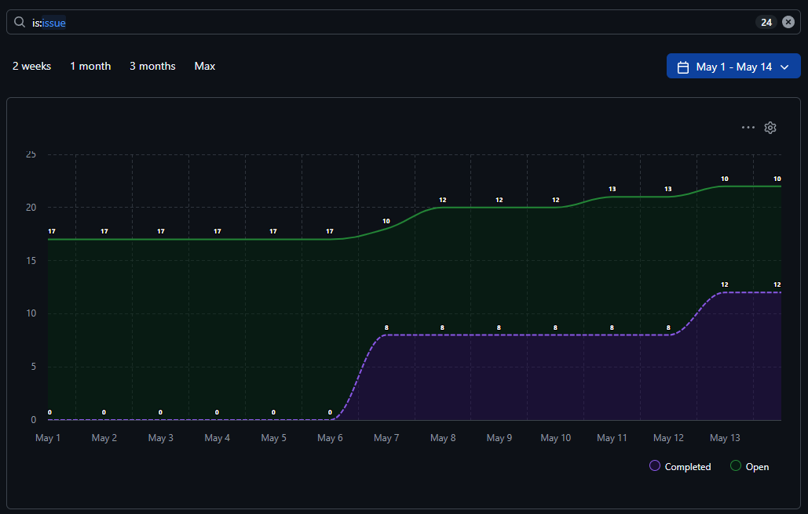
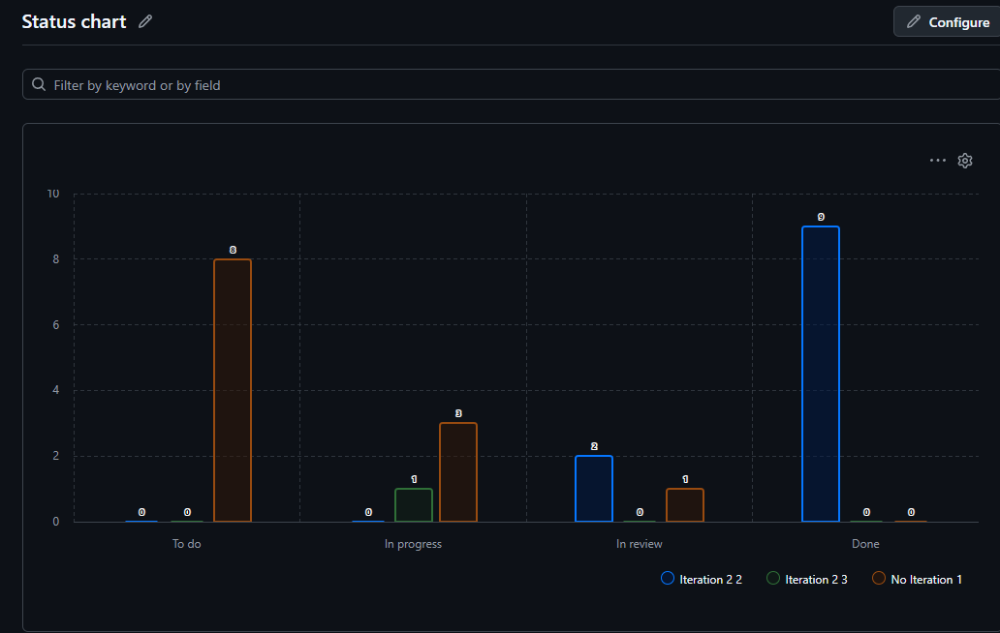

# Отчет по спринту

Дата отчета: 25 мая 2026

## 1. Общая информация

Этот отчет предназначен для фиксации результатов спринта, основных изменений в автоматизации проекта, а также для прикрепления скриншотов графиков и статусов.

## 2. Цели спринта

- Автоматизировать обработку issue через GitHub Actions.
- Настроить связь приоритета задачи с текущей или следующей итерацией.
- Добавить автообновление информации о спринте в issue templates.
- Подготовить перенос незавершённых задач на следующую итерацию.
- Документировать процесс для новых участников проекта.

## 3. Что было сделано

### 3.1 Issue templates

- Добавлен блок с автоинформацией о текущем и следующем спринте.
- Оставлен выбор приоритета.
- Сохранен dropdown для планируемой итерации.

### 3.2 GitHub Actions

- Workflow для синхронизации priority и iteration с Project.
- Workflow для обновления информации о спринтах в шаблонах.
- Workflow для переноса незавершённых задач.
- Workflow для автообновления версии.
- CI workflow для сборки и тестирования проекта.

### 3.3 Документация

- Подготовлено подробное руководство по GitHub Actions и автоматизации.
- Сформирован отчет по спринту.

## 4. Скриншот спринта

Ниже приведен скриншот графика спринта из GitHub Project.

### Что видно на графике

- На старте периода open-задачи держались примерно на уровне 17.
- После 7 мая количество закрытых задач выросло с 0 до 8, затем до 12.
- Open-задачи в течение периода постепенно росли и к середине мая достигли 22.
- Это означает, что закрытие задач пошло, но входящий поток задач всё ещё превышал скорость завершения.
- График показывает, что команда активно закрывала задачи, но backlog продолжал расти.

### Вывод по графику

- Спринт был продуктивным по части закрытия задач, особенно после 7 мая.
- При этом накопление open-задач говорит о том, что нагрузка на команду оставалась высокой.
- Для следующих итераций стоит контролировать входящий поток задач и заранее выделять время на закрытие хвоста.
- По графику видно, что процесс автоматизации и ведения Project уже помогает сделать динамику задач более прозрачной.

### Скриншот

Скриншот из сообщения чата нужно вставить сюда как изображение, если он будет сохранен в репозиторий отдельным файлом.

## 5. Результаты

| Показатель | Значение |
| --- | --- |
| Количество автоматизированных workflow | 5 |
| Количество issue templates | 3 |
| Количество используемых основных secrets | 8+ |
| Частота обновления информации о спринте | ежедневно |
| Автообновление версии | ежемесячно |

## 6. Графики и скриншоты

### 6.1 График выполнения задач

Вставьте сюда скриншот графика выполнения задач.

Пример подписи:

- Фактическое завершение задач по датам.
- Доля выполненных задач от общего количества.
- Нагрузка по дням спринта.

### 6.2 График по статусам

Наблюдения:

- Большая часть закрытых задач (`Done`) приходится на текущую итерацию (9 задач).
- В статусе `To do` находится много задач без привязки к итерации (8 задач) — нераспланированный запас.
- `In progress` распределён по итерациям небольшими партиями (примерно 1–3 задачи на итерацию).
- В `In review` есть несколько задач (2 в текущей итерации и 1 без итерации), что может задерживать завершение.

Выводы и рекомендации:

- Наличие 8 незапланированных задач в `To do` повышает риск роста backlog — желательно привязать эти задачи к текущей или следующей итерации и расставить приоритеты.
- Темп закрытия задач хороший (9 в `Done`), но входящий поток превышает скорость завершения; нужно ограничивать приём новых задач или увеличивать пропускную способность для завершения хвоста.
- Ускорить проход по `In review`: назначать ответственных за ревью и фиксировать SLA на проверку, чтобы уменьшить блокировки.
- Планировать резервное время в следующей итерации для обработки незавершённых и безитерационных задач, а также проводить регулярный обзвон задач без итерации для их распределения.

## 7. Замечания

- GitHub Issue Forms не умеют динамически показывать данные Project в момент заполнения.
- Чтобы информация в шаблонах была актуальной, используется workflow обновления.
- Для следующей итерации важно заранее создавать соответствующие iteration в Project.

## 8. Вывод

Спринт был сфокусирован на автоматизации процессов, уменьшении ручной работы и подготовке понятной документации для новых участников проекта.

## 9. Приложения

Если необходимо, сюда можно добавить ссылки на:

- экспорт из GitHub Project;
- дополнительные скриншоты;
- отчеты SonarCloud;
- логи GitHub Actions.
