# Автоматическое добавление объектов на основе макросов #

При вставке специально доработанного макроса на страницу Eplan, автоматически произойдет добавление вставляемого базового объекта в редактор. Доработка макроса осуществляется за счет добавления к нему символа, который будет определять макрос, как базовый объект для EasyEplanner.

## Введение ##

Функционал автоматизирует добавления объектов в редактор технологических объектов. Для того, чтобы сработал триггер - необходимо специальным образом доработать макрос, а именно: на макросе нужно расположить специально подготовленный символ, который ожидает увидеть EasyEplanner при вставке макроса на страницу. Рекомендуется группировать макрос с этим символом, чтобы этот символ не терялся. На вставляемом макросе должен быть строго один символ, который его определяет для EasyEplanner. При присутствии более <b>1</b> определяющего символа, системой автоматически будет выбран случайный.

## Подключение готовой библиотеки символов ##

Готовую библиотеку символов с макросом можно взять на сервере в стандартном каталоге с библиотеками символов (<i>Символы</i>). Название библиотеки - EplannerSymbols. Пример символа на рисунке ниже. Размер символа из библиотеки - 9мм х 5мм

<b>Рисунок</b> - <i>Пример символа определяющего макрос</i>

Для того, чтобы подключить библиотеку в проект, необходимо открыть проект. Затем, перейти в меню "<b>Параметры</b>" >> "<b>Настройки</b>". В появившемся окне развернуть вкладку "<b>Проекты</b>", затем развернуть меню проекта и выбрать пункт "<b>Управление</b>" и внутри этого пункта есть пункт "<b>Библиотеки символов</b>". Там необходимо настроить библиотеку для проекта.

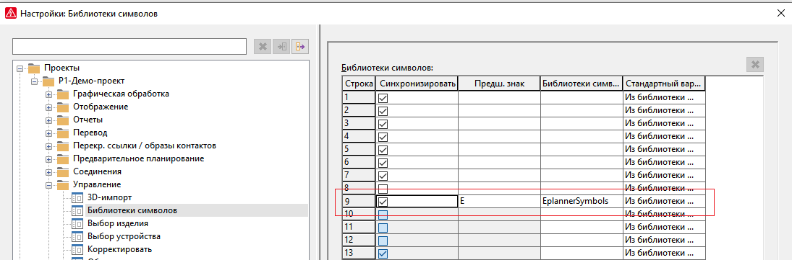

<b>Рисунок</b> - <i>Меню для настройки библиотеки</i>

## Самостоятельное создание символа ##

Если библиотека недоступна, то можно нарисовать свой символ. Графическое отображение символа не имеет значение, системе важно его правильная настройка для его идентификации.

Перед тем, как создать символ, необходимо либо открыть уже существующую библиотеку символов, либо создать новую. Это можно сделать в меню "<b>Сервисные программы</b>" >> "<b>Основные данные</b>" >> "<b>Библиотека символов</b>". Если же опустить этот пункт, а перейти сразу к следующему, то при создании символа, Eplan попросит выбрать библиотеку символов для того, чтобы создать символ в ней. Более подробная информация о библиотеках символа - <a href="https://www.eplan.help/help/platform/2.5/ru-ru/help/Content/htm/xmasterdatasettingsgui_h_symbolbiblverwalten.htm">здесь</a>.

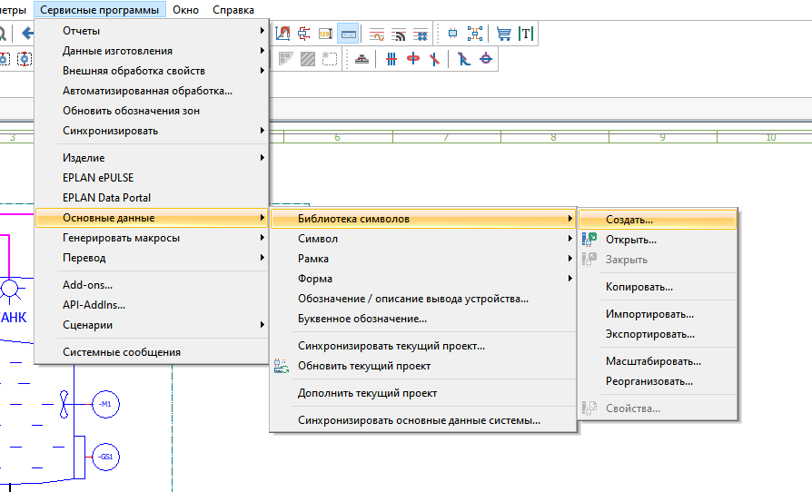

<b>Рисунок</b> - <i>Меню библиотеки символов</i>

Для того, чтобы создать символ, необходимо в Eplan выбрать пункт меню "<b>Сервисные программы</b>" >> "<b>Основные данные</b>" >> "<b>Символы</b>" и там выбрать пункт "<b>Создать</b>".

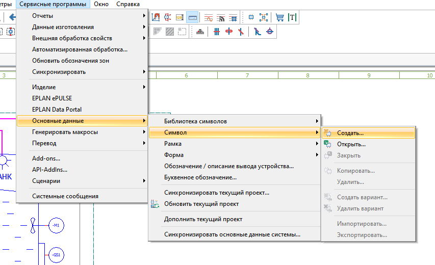

<b>Рисунок</b> - <i>Меню символов</i>

Откроется пустое окно для редактирования символа. Графическое отображение, желательно, создать по аналогии с пунктом [подключение готовой библиотеки символов](#Подключение-готовой-библиотеки-символов). Самое главное, правильно настроить функцию символа. Для этого, перейдем в настройки символа, нажав ПКМ на страницу символа и выбрав пункт "<b>Свойства</b>".

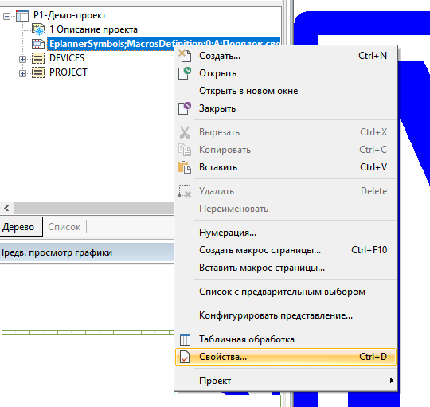

<b>Рисунок</b> - <i>Меню свойств символа</i>

В появившемся окне необходимо правильно заполнить данные. Для заполнения, смотрите картинку, представленную ниже. Рассмотрение заполнения функции будет описано ниже, после картинки. Красными галочками отмечены поля, которые должны совпадать.

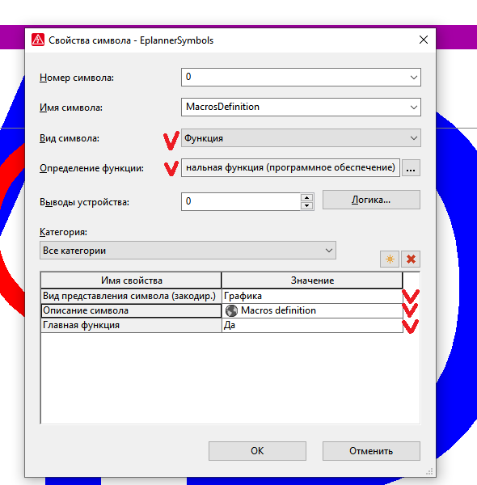

<b>Рисунок</b> - <i>Заполненные данные по символу</i>

Для выбора функции, необходимо нажать на троеточие справа от пункта "<b>Определение функции</b>". В появившемся окне необходимо выбрать следующую функцию: "<b>Общее</b>" >> "<b>Общие специальные функции</b>" >> "<b>Функциональная функция (программное обеспечение)</b>" >> "<b>Функциональная функция (программное обеспечение), перемен.</b>" >> "<b>Функциональная функция (программное обеспечение)</b>". Пример ниже.

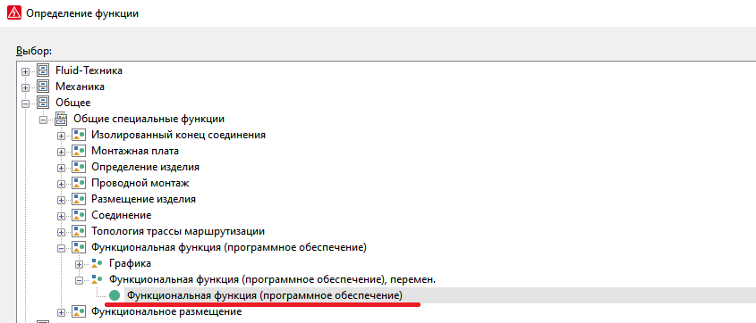

<b>Рисунок</b> - <i>Функция символа</i>

После выбора нажимаем <b>ОК</b>. И в свойствах символа тоже <b>ОК</b>. Символ готов, эту страницу можно закрывать и использовать символ по назначению.

## Список функциональных текстов для символа ##

Список функциональных текстов аналогичен тому, который используется в EasyEplanner для идентификации базовых объектов. Функциональный текст необходимо записать в поле "<b>Функциональный текст</b>" определяющего символа в макросе.

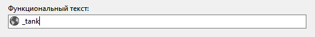

<b>Рисунок</b> - <i>Редактирование функционального текста</i>

Таблица с названиями объектов и их функциональными текстами:

  Название объекта | Его функциональный текст
---|---
 Автомат | automat
 Бачок откачки лёдводы | _tank
 Бачок откачки лёдводы ПИД | _tank_PID
 Бойлер | boil
 Ячейка процесса | master
 Линия | line
 Линия приемки | line_in
 Линия выдачи | line_out
 Линия перекачки | line_pumping
 Пастеризатор | pasteurizator
 Пост | post
 Танк | tank
 Узел давления ПИД | pressure_node_PID
 Узел подогрева | heater_node
 Узел подогрева ПИД | heater_node_PID
 Узел расхода ПИД | flow_node_PID
 Узел охлаждения | cooler_node
 Узел охлаждения ПИД | cooler_node_PID
 Узел перемешивания | mix_node
 Узел стерильного воздуха | sterile_air_node
 Узел продувания | steam_blast_node
 Узел текущего уровня ПИД | tank_level_node_PID
 Узел текущего уровня | tank_level_node
 Модуль мойки | cip_module
 Пользовательский объект | user_object
 Линия мойки | CIP_node

## Как использовать ##
Для начала, необходимо создать макрос, в котором будет расположен символ, определяющий базовый объект. Для этого, размещаем определяющий символ на ФСА, заполняем его функциональный текст согласно [пункту](#Список-функциональных-текстов-для-символа).

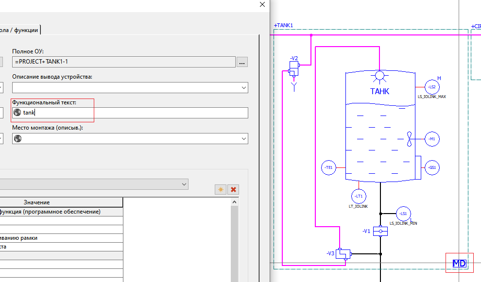

<b>Рисунок</b> - <i>Подготовка символа</i>

Затем, выделяем будущий макрос, и не забываем выделить вместе с ним определяющий символ. Жмем ПКМ (<i>правая кнопка мыши</i>) и жмем кнопку "<b>Создать макрос</b>".

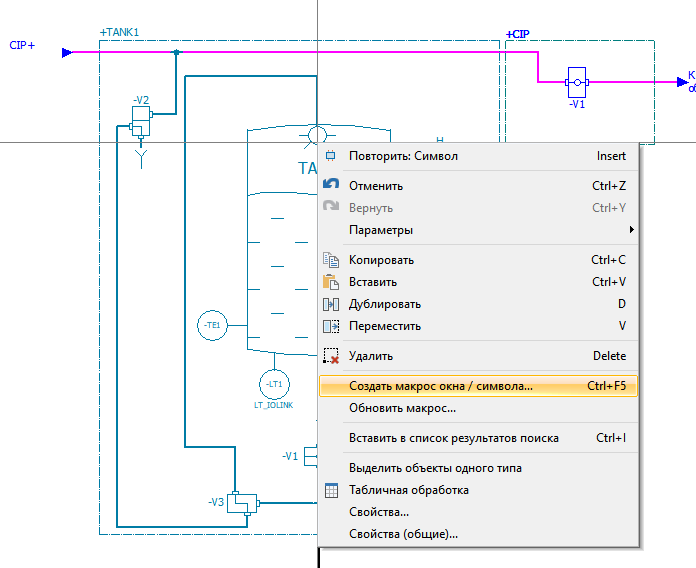

<b>Рисунок</b> - <i>Меню создания макроса</i>

Выбираем место для сохранения, остальные поля можно заполнить так, как Вам удобно. Жмем "<b>ОК</b>". На этом создание макроса завершено.

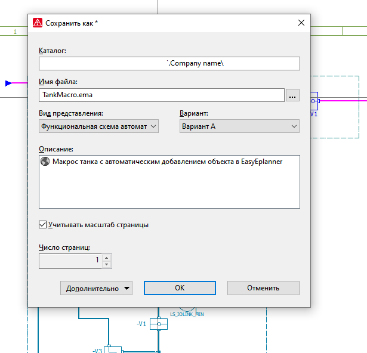

<b>Рисунок</b> - <i>Создание нового макроса</i>

Для использования макроса, необходимо вставить его на ФСА. Для этого, жмем на панели инструментов кнопку "<b>Вставить</b>" и в выпадающем списке выбираем пункт "<b>Макрос окна/символа</b>".

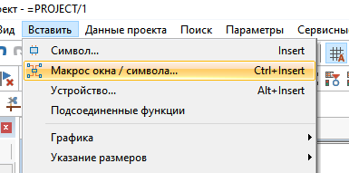

<b>Рисунок</b> - <i>Меню вставки макроса</i>

Выбираем нужный макрос и жмем <b>ОК</b>. Можно вставлять макрос на ФСА. После вставки макроса, автоматически будет добавлен базовый объект, если определяющий макрос символ был настроен правильно.

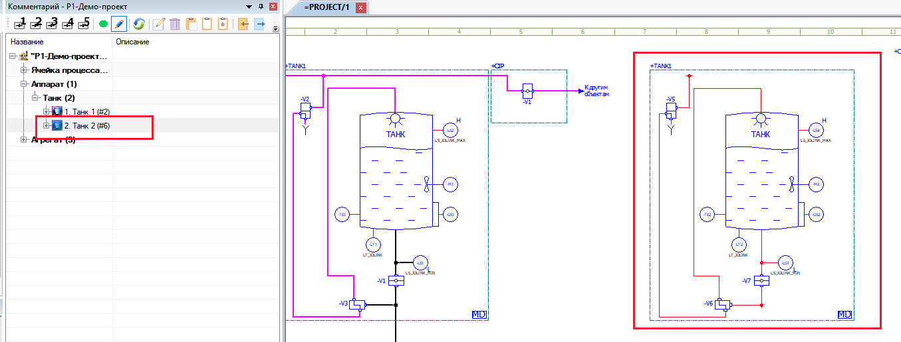

<b>Рисунок</b> - <i>После вставки макроса</i>
