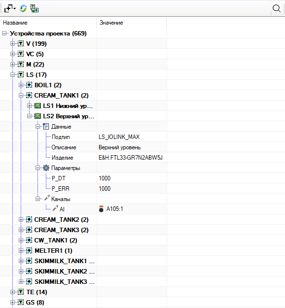

# Окно «Устройства» #

Окно отображает технологические устройства проекта в виде дерева с двумя
колонками — **Название** и **Значение**.

## Содержание ##

+ [Панель инструментов](#1-панель-инструментов)
+ [Поиск](#2-поиск)
+ [Редактирование значений](#3-редактирование-значений)
+ [Привязка каналов к модулям IO](#4-привязка-каналов-к-модулям-io)
+ [Контекстное меню и переход на ФСА](#5-контекстное-меню-и-переход-на-фса)

### 1 Панель инструментов ###

Слева направо:

-  **Развернуть** — уровень развёртки дерева (1–5) или «Свернуть всё».
-  **Обновить** — [синхронизация и сохранение (7.1.9)](ReadMe.md#719-Сохранение-результатов-редактирования) описания из EPLAN; обновляет дерево.
-   **Группировка** — переключение **Тип → Объект** и **Объект → Тип**; дерево перестраивается с сохранением развёртки.
-  **Поиск** — открыть поле поиска (<kbd>Ctrl</kbd> + <kbd>F</kbd>); подробнее в [разделе 2](#2-поиск).

### 2 Поиск ###

Открывается кнопкой  или <kbd>Ctrl</kbd> + <kbd>F</kbd>. Ищет по имени, EPLAN-имени, объекту, описанию и другим полям узла; совпадения подсвечиваются.

Счётчик справа — переход между результатами (дерево разворачивается к найденному узлу). Режимы: **слово целиком**, **регулярное выражение** (`||` — ИЛИ, `&&` — И).

### 3 Редактирование значений ###

Редактирование доступно в колонке **Значение** (двойной щелчок или выбор
ячейки с началом ввода).

| Поле | Способ ввода | Примечание |
| ---  |     ---      |    ---     |
| **Подтип** | выпадающий список | после смены подтипа отображается «Обновите проект»; для обновления конфигурации параметров в структуре на дереве |
| **Описание** | многострочный текст | переносы строк сохраняются в формате EPLAN (¶); <kbd>Enter</kbd> — новая строка, <kbd>Ctrl</kbd> + <kbd>Enter</kbd> — завершить ввод |
| **Параметры** | число | десятичный разделитель — точка |
| **Рабочие параметры** | целое число | |
| **Свойства** | текст | |

Поля **Изделие** и адрес привязки канала не редактируются из дерева.

Отмена редактирования — клавиша <kbd>Esc</kbd>.

Изменения описания, подтипа, параметров и свойств записываются в функции
устройств на ФСА.

### 4 Привязка каналов к модулям IO ###

Как в [структуре ПЛК](StructPLC.md): выберите клемму на ФСА или в окне ПЛК, дважды щёлкните канал в группе **Каналы**. <kbd>Ctrl</kbd> — множественная привязка; повторный щелчок без <kbd>Ctrl</kbd> — снятие привязки.

Подробные правила и ограничения — [раздел 4.2](ReadMe.md#42-Привязка-устройств-к-модулям-IO).

### 5 Контекстное меню и переход на ФСА ###

**Перейти на ФСА** (ПКМ, колесо мыши или <kbd>Ctrl</kbd> + <kbd>ЛКМ</kbd>) — открыть страницу устройства или привязанной клеммы на схеме.
