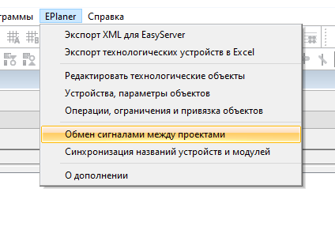

# Межпроектный обмен сигналами #

## Содержание ##

1. [Введение](#1-Введение)
2. [Включение редактирования обмена](#2-Как-включить-редактирование-межпроектного-обмена)
3. [Загрузка существующего обмена сигналами](#3-Загрузка-существующего-обмена-сигналами)
4. [Добавление проекта для обмена](#4-Добавление-проекта-для-обмена-сигналами)
5. [Удаление проекта из обмена](#5-Удаление-проекта-из-обмена-сигналами)
6. [Связывание сигналов](#6-Связывание-сигналов)
7. [Изменение связи сигналов](#7-Изменение-связи-сигналов)
8. [Удаление связи сигналов](#8-Удаление-связи-сигналов)
9. [Настройка PAC (контроллера)](#9-Настройка-PAC-контроллера)
10. [Поиск по сигналам и их фильтрация](#10-Сохранение-обмена-сигналами)
11. [Поиск по сигналам и их фильтрация](#11-Поиск-по-сигналам-и-их-фильтрация)
12. [Сообщения об ошибках, предупреждения, информация](#12-Сообщения-об-ошибках-предупреждения-информация)
13. [Ручная доработка старого обмена сигналами в новый](#13-Ручная-доработка-старого-обмена-сигналами-в-новый)

## 1 Введение ##

Межпроектный обмен сигналами (<i>устройствами</i>) позволяет настроить обмен сигналами между проектами. После сохранения обмена, будут сгенерированы (<i>или изменены</i>) файлы проектов, между которыми происходит обмен (<i>в папке с каждым проектом, с которым происходит обмен</i>). Эти файлы будут готовый для загрузки в контроллер.

## 2 Как включить редактирование межпроектного обмена ##

Для того, чтобы начать работу с данным модулем, необходимо включить Eplan, выбрать проект и нажать на пункт "<i>Межконтроллерный обмен сигналами</i>" в меню "<i>EPlaner</i>". Подробнее, на рисунке ниже.

<b>Рисунок</b> - <em>Местонахождение меню для входа в модуль настройки обмена</em>

#### Техническая информация ####

После нажатия этой кнопки, будут обновлены все устройства проекта (<i>обновятся файлы проекта</i>), и будет происходить считывание данных, которые нужны для обмена.

Порядок считывания файлов проекта:
1. main.io.lua
2. main.devices.lua
3. shared.lua (_если есть_)

Если есть <i>shared.lua</i>, будет считано описание обмена и для тех проектов, которые описаны в этом файле. Обмен считывается для того проекта, который открыт в Eplan. Следовательно, полностью файлы <i>shared.lua</i> для остальных проектов не считываются. Для остальных проектов, порядок считывания файлов будет такой же, как описан выше, только наличие <i>shared.lua</i> является обязательным.

Предполагается, что проекты находятся в одной папке, так как путь к папке с проектами считывается из файла конфигурации надстройки.

## 3 Загрузка существующего обмена сигналами ##

Для того, чтобы существующий обмен сигналов был успешно загружен, необходимо, чтобы все связанные проекты имели файл <i>shared.lua</i>. Модуль считыват весь файл <i>shared.lua</i> для текущего открытого (<i>главного</i>) проекта, и нужные куски из остальных (<i>альтернативных проектов</i>). На рисунке ниже показан пример, как может выглядеть обмен между двумя проектами.

<b>Рисунок</b> - <em>Главное окно обмена сигналами между проектами</em>

Описание формы:

1. Список сигналов с их описанием, которые есть в главном проекте
2. Список уже связанных сигналов (_сопоставление_)
3. Список сигналов с их описанием, которые есть в выбранном альтернативном проекте
4. Название главного проекта
5. Строка поиска по сигналам главного проекта
6. Кнопка настройки фильтрации сигналов в главном проекте (_описано в следующих разделах_)
7. Селектор переключения режима обмена сигналами
8. Кнопка настройки контроллеров проектов. Настраиваются альтернативные проекты
9. Селектор переключения проекта, с которым настраивается обмен сигналами
10. Кнопка добавления связи с проектом
11. Кнопка удаления связи с проектом
12. Строка поиска по сигналам выбранного альтернативного проекта
13. Кнопка сохранения результатов редактирования обмена
14. Кнопка отмены редактирования (_сделанные изменения не сохраняются_)

#### Что такое режим, и как этим пользоваться ####

Режим обмена (<i>цифра <b>7</b> на картинке</i>), позволяет переключить направление обмена сигналами. Режим определяется относительно главного проекта. Когда включен режим "<b>Источник >> Приемник</b>" - это значит, что главный проект (<i>PL-Тест-монитора, на рисунке</i>) является <b>источником</b> сигналов, а альтернативный проект является <b>приемником</b> сигналов. Таким образом, сигналы главного проекта будут записаны в <b>shared_devices</b>, а сигналы альтернативного проекта в <b>remote_gateways</b> (<i>настройка PAC для remote_gateways описана в разделах ниже</i>).

Режим обмена "<b>Приемник >> Источник</b>" работает в обратном порядке. В этом режиме, главный проект является приемником сигналов из альтернативного проекта (<b>источника</b>). Сигналы главного проекта будут записаны в <b>remote_gateways</b>, а альтернативного в <b>shared_devices</b>.

#### Множественность проектов ####

Модуль настройки обмена сигналами работает одновременно со всеми проектами, которые есть в списке связуемых проектов. Это позволяет настроить весь обмен между проектами за раз, но также можно настраивать и по одному проекту и сохранять.

#### Примечание ####
Для загрузки контроллерного обмена, который был сделан руками (_до появления этой функциональности_), необходимо привести файл к виду, описааному в [главе 13](#13-Ручная-доработка-старого-обмена-сигналами-в-новый) данного руководства.

## 4 Добавление проекта для обмена сигналами ##

Для добавления обмена сигналами с каким либо проектами, необходимо нажать кнопку со знаком "_Плюс_", на главной форме (_см. рисунок ниже_).

<b>Рисунок</b> - <em>Кнопка добавления проекта для обмена</em>

Откроется диалог, который будет указывать на папку с проектами, и в этой папке необходимо выбрать папку с проектом, с которым нужно добавить обмен сигналами.

<b>Рисунок</b> - <em>Диалог выбора папки с проектом</em>

После выбора папки и подтверждени выбора, система загрузит файлы проекта (_порядок описан в [главе 2](#2-Как-включить-редактирование-межпроектного-обмена)_), и для настройки сигналов будет выбран загруженный проект.

Если у добавляемого проекта есть <i>shared.lua</i> файл, то он будет прочитан.

#### Техническая информация ####
Файл <i>shared.lua</i> читается, что бы знать его структуру, так как у загружаемого проекта есть связи с другими проектами, то их нельзя нарушать. Предполагается, что в этом файле нет связи с главным проектом на момент загрузки (<i>с точки зрения обмена точка-точка это невозможно, т.к. был бы считан обмен в главном проекте</i>).

## 5 Удаление проекта из обмена сигналами ##

Для удаления связи с проектом, необходимо выбрать этот проект в списке проектов и нажать кнопку удаления со знаком "_Минус_", на главной форме (_см. рисунок ниже_).

<b>Рисунок</b> - <em>Кнопка удаления связи с проектом</em>

После этого, подтвердить или отменить действие

<b>Рисунок</b> - <em>Диалоговое окно подтверждения удаления проекта</em>

Если действие будет отменено - ничего не изменится, а если подтверждено - то этот проект будет помечен "<i>На удаление</i>" и убран из списка проектов. Получить к нему доступ будет нельзя.

При сохранении результатов, помеченный на удаление проект будет удален из файлов <i>shared.lua</i>. Если у удаленного проекта нет никакого обмена сигналами с другими проектами, будет удален и сам файл <i>shared.lua</i>

#### Механизм восстановления удаленного проекта ####

Модуль умеет восстанавливтаь удаленный из обмена проект, если он был удален в той же сессии, в которой и восстанавливается. Особенность заключается в том, что проект не удаляется из системы до момента сохранения результатов работы, это позволяет, в случае необходимости, вернуть обратно удаленный проект (<i>если удаление ведется в той же сессии</i>), просто добавив его обратно через механизм добавления проектов, и, система восстановит проект с настройками контроллера и сигналами, которые были на момент удаления обмена с проектом.

## 6 Связывание сигналов ##

Связывание сигналов между собой представляет механизм выбора нужных сигналов в списках, а система автоматически связывает их. Рассмотрим подробнее.

Перед связыванием сигналов, необходимо выбрать режим обмена и проект, с которым нужно обмениваться. От режима обмена зависит, какие сигналы, и куда будут записываться.

Для связывания сигналов нужно сделать два простых действия (см. форму в [главе 3](#3-Загрузка-существующего-обмена-сигналами)):
1. Выбрать сигнал в списке сигналов главного проекта
2. Выбрать сигнал в списке сигналов альтернативного проекта

После этого, система автоматически свяжет эти сигналы. Последовательность в списке выше не важна. Можно выбрать сигналы и в противоположном порядке.

#### Примечание ####

Главными типами сигналов являются сигналы главного проекта. При связывании <b>AI</b> сигнала главного проекта с <b>AO</b> сигналом альтернативного проекта, сигнал будет добавлен в группу <b>AI</b>.

Система не всегда может определить тип сигнала, рассмотрим эти случаи:
1. Оба типа сигнала известны - все связывается автоматически
2. Известен тип сигнала альтернативного проекта - будет выбран противоположный ему тип (_например, выбран <b>AI</b>, будет добавлено в <b>AO</b>_)
3. Известен тип сигнала главного проекта - аналогично пункту <b>1</b>
4. Неизвестны оба типа сигналов - будет показано окно, где надо отметить тип сигнала для главного проекта (_см. рисунок ниже_)

<b>Рисунок</b> - <em>Окно выбора типа сигнала</em>

Описание формы:
1. Кнопки выбора типа сигнала главного (_текущего_) проекта
2. Кнопка сохранения выбора (_произойдет связывание сигналов_)
3. Отмена выбора (_произойдет отмена связывания сигналов_)

После связывания сигнала, все изменения сохраняются в текущей сессии и можно легко менять проект, добавлять, удалять и переключать режимы.

#### Возможность поиска сигналов не пользуясь полем поиска ####

Для каждого из списков с сигналами есть возможность поиска сигнала (<i>идет поиск не только по его ОУ, но и по описанию</i>). Для этого, нужно что бы фокус был на списке (<i>элементе управления</i>). Для этого, можно нажать на любой сигнал и начать что-нибудь вводить на клавиатуре. В поле поиска будут вноситься вводимые буквы и система будет искать совпадения в списке по вашему запросу. Клавиши <b>BackSpace</b> и <b>Delete</b>, соответственно, удаляют то, что вы ввели.

## 7 Изменение связи сигналов ##

Уже существующие связи сигналов можно редактировать. Модуль позволяет менять любой сигнал на любой другой. Для этого, необходимо выбрать сигналы (пару), которую нужно редактировать.

<b>Рисунок</b> - <em>Режим редактирования пары сигналов</em>

На рисунке показана выбранная пара сигналов (<i>цифра 1</i>), а также подсвечены сигналы в списках сигналов по проектам (<i>цифра 2</i>). Соответственно, после этого, мы можем менять выбранный сигнал в главном и альтернативных проектах. Для этого просто кликаем на интересующие сигналы в списках и они будут заменены на новые.

Для того, что бы закончить редактирование, снять выделение с пары сигналов, можно нажать клавишу <b>Enter</b>, или <b>Esc</b>, или кликнуть на пустое место в этом списке (<i>или в любое другое пустое место в элементах формы</i>).

Навигация по спискам (всем трем спискам) может осуществляться с помощью стрелочек вверх и вниз на клавиатуре.

#### ВНИМАНИЕ ####

Сделано допущение, что можно поменять любой сигнал на любой другой, без изменения группы. Учитывайте это при изменении одного типа сигнала на другой.

## 8 Удаление связи сигналов ##

Для удаления связи сигналов между собой, необходимо выбрать связь в списке связанных сигналов и нажать клавишу <b>Delete</b>. Связь будет разорвана, сигналы будут удалены из списка связанных сигналов. (<i>см. рисунок ниже</i>)

<b>Рисунок</b> - <em>Состояние окна с сигналами перед удалением сигнала</em>

Для того, что бы отменить выбор с пары сигналов (<i>снять выделение</i>), можно нажать клавишу <b>Enter</b>, или <b>Esc</b>, или кликнуть на пустое место в этом списке (<i>или в любое другое пустое место в элементах формы</i>).

Навигация по спискам (всем трем спискам) может осуществляться с помощью стрелочек вверх и вниз на клавиатуре.

## 9 Настройка PAC (контроллера) ##

Модуль позволяет настраивать параметры контроллера для межпроектного обмена (см. рисунок ниже). 

<b>Рисунок</b> - <em>Состояние окна с сигналами перед удалением сигнала</em>

Описание формы:
1. Режим работы главного проекта (_Источник, Приемник_)
2. Список с загруженными для обмена проектами
3. Имя проекта, с которым настраивается контроллер
4. IP-Адрес контроллера (_будет меняться в зависимости от режима главного проекта_)
5. IP-Адрес эмулятора
6. Кнопки включения/отключения эмуляции
7. Время цикла, мс.
8. Таймаут, мс.
9. Порт
10. Кнопки включения/отключения шлюза
11. Номер станции Modbus
12. Кнопка применения и сохранение изменений
13. Кнопка отмены изменений и закрытия формы

#### Как с этим работать ####

Обмен сигналами у нас идет от по принципу "<b>Источник - Приемник</b>" или "<b>Приемник - Источник</b>". 

Когда селектор главного проекта стоит в положении "<b>Источник</b>", настраивается контроллер для альтернативного проекта. В поле "<b>IP-Адрес</b>" указывается адрес главного проекта (<i>автоматически</i>). Эта информация будет записана в <i>shared.lua</i> файл альтернативного проекта.

При переключении селектора главного проекта в положение "<b>Приемник</b>", настраивается контроллер для главного проекта. В поле "<b>IP-Адрес</b>" указывается адрес альтернативного проекта (<i>который выбран из списка</i>). Эта информация будет записана в <i>shared.lua</i> файл главного проекта.

Таким образом, когда селектор режима главного проекта стоит в положении "<b>Источник</b>", то настраиваются параметры чтения сигналов проекта альтернативными проектами, а когда селектор стоит в положении "<b>Приемник</b>", уже наоборот - настраиваются параметры чтения сигналов проекта главным проектом из альтернативных проектов.

## 10 Сохранение обмена сигналами ##

Для того, чтобы сохранить обмен сигналами, нужно нажать кнопку "<b>Сохранить</b>" в главном окне. Система запустит сохранение и закроет форму. В итоге, будут сгенерированы файлы <i>shared.lua</i> для всех проектов, которые учавствовали в обмене сигналами. Файл <i>shared.lua</i> главного проекта будет перезаписан (<i>он всегда генерируется с нуля</i>), а файлы <i>shared.lua</i> альтернативных проектов будут изменены точечно.

Изменения альтернативных проектов работает так: если обмена с этим проектом не было, то запись будет сделана в начале определения переменной (<i>если это прием сигналов - в начале переменной <b>remote_gateways</b>, а если источник сигналов - в начале <b>shared_devices</b></i>), а если обмен с этим проектом уже был (<i>редактировали сигналы, настройки контроллера</i>), то изменения будут произведены в том месте, где редактировался обмен сигналами (<i>там, где будут найдены строки, отвечающие за обмен с конкретным проектом</i>).

Предполагается, что проекты находятся в одной папке, так как путь к папке с проектами считывается из файла конфигурации надстройки.

## 11 Поиск по сигналам и их фильтрация ##

Модуль поддерживает поиск по сигналам и их фильтрацию. Для того, чтобы воспользоваться поиском, нужно ввести необходимую комбинацию в одну из строк поиска (см. [главу 3](#3-Загрузка-существующего-обмена-сигналами), главную форму, где находятся строки поиска). 

Также, для каждого из списков с сигналами есть возможность поиска сигнала (<i>идет поиск не только по его ОУ, но и по описанию</i>). Для этого, нужно что бы фокус был на списке (<i>элементе управления</i>). Для этого, можно нажать на любой сигнал и начать что-нибудь вводить на клавиатуре. В поле поиска будут вноситься вводимые буквы и система будет искать совпадения в списке по вашему запросу. Клавиши <b>BackSpace</b> и <b>Delete</b>, соответственно, удаляют то, что вы ввели.

Помимо поиска существует механизм фильтрации сигналов по их типам (см. рисунок ниже)

<b>Рисунок</b> - <em>Окно настройки фильтрации</em>

Описание формы:
1. Кнопка очистки текущего фильтра
2. Список типов сигналов для главного проекта
3. Включение/отключение группировки сигналов по группам
4. Список типов сигналов для альтернативного проекта
5. Кнопка применения изменений
6. Кнопка отмены изменений

Фильтр настраивается сколь угодно раз. Его конфигурация хранится в конфигурационном файле надстройки и загружается каждый раз, когда загружается окно фильтра, поэтому можно задать настройки один раз и они будут постоянно подгружаться. Для того, что бы настроить фильтр, нужно отметить нужные типы сигналов для отображения (<i>поставить галочки</i>). Те сигналы и пункты, которые не выбраны, будут деактивированы и скрыты.

## 12 Сообщения об ошибках, предупреждения, информация ##

Здесь описаны различные сообщения об ошибках, которые могут возникать, и то, из-за чего они возникают.

Критические ошибки:
1. "Не найден файл __main.io.lua__ проекта <_название проекта_>" - при загрузке описания проекта, не был найден файл __main.io.lua__, из которого берется нужная информация по устройствам и контроллеру.
2. "Не найден файл __main.devices.lua__ <_название проекта_>" - при загрузке описания проекта, не был найден файл __main.devices.lua__, из которого берутся определения устройств, которые находятся в файле __shared.lua__.
3. "Не найден файл конфигурации для фильтра" - система не смогла найти файл, в котором сохранены настройки фильтрации.
4. "Ошибка сохранения промежуточных данных" - при настройке PAC (_контроллера_), не смогли сохраниться данные в одном из трех случаев:
    - изменение режима главного проекта
    - изменение выбранного альтернативного проекта
    - при сохранении всех результатов не смог сохраниться результат, по последнему редактируемому проекту.
5. "Ошибка изменения связи" - система не смогла отредактировать связь между сигналами (_изменить один из связанных сигналов_).
6. "Ошибка удаления связи" - система не смогла удалить связь между парой сигналов.
7. "Ошибка подсветки выделенных элементов в списках" - система не смогла подсветить выбранную пару сигналов в списках сигналов по проектам.
8. "Данные по проекту не загружены" - система не смогла загрузить данные по проекту во время добавления проекта к обмену сигналами.
9. "Ошибка при удалении связи с проектом" - система не смогла удалить связь с проектом (_пометить проект на удаление_).

Предупреждения:
1. "Устройства имеют одинаковый тип сигнала" - связываются устройства, с одинаковым типом сигнала (_например, **DI** и **DI**_).
2. "Разные типы сигналов (_попытка связать дискретные с аналоговыми или наоборот_)" - связываются сигналы с разными типами (_**AI** и **DO**, например_).
3. "По указанному пути не найдены файлы проекта" - система не обнаружила файлы проекта при добавлении проекта к обмену сигналами.

Информационные:
1. "Проект <_название проекта_> уже обменивается с этим проектом сигналами" - такой проект уже обменивается сигналами с главным проектом.

## 13 Ручная доработка старого обмена сигналами в новый ##
