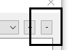

# Межпроектный обмен сигналами #

## Содержание ##

1. [Введение](#1-Введение)
2. [Включение редактирования обмена](#2-Как-включить-редактирование-межпроектного-обмена)
3. [Загрузка существующего обмена сигналами](#3-Загрузка-существующего-обмена-сигналами)
4. [Добавление проекта для обмена](#4-Добавление-проекта-для-обмена-сигналами)
5. [Удаление проекта из обмена](#5-Удаление-проекта-из-обмена-сигналами)
6. [Связывание сигналов](#6-Связывание-сигналов)
7. [Изменение связи сигналов](#7-Изменение-связи-сигналов)
8. [Удаление связи сигналов](#8-Удаление-связи-сигналов)
9. [Настройка PAC (контроллера)](#9-Настройка-PAC-контроллера)
10. [Поиск по сигналам и их фильтрация](#10-Сохранение-обмена-сигналами)
11. [Поиск по сигналам и их фильтрация](#11-Поиск-по-сигналам-и-их-фильтрация)
12. [Сообщения об ошибках, предупреждения, информация](#12-Сообщения-об-ошибках-предупреждения-информация)
13. [Ручная доработка старого обмена сигналами в новый](#13-Ручная-доработка-старого-обмена-сигналами-в-новый)

## 1 Введение ##

Межпроектный обмен сигналами (<i>устройствами</i>) позволяет настроить обмен сигналами между проектами. После сохранения обмена, будут сгенерированы (<i>или изменены</i>) файлы проектов, между которыми происходит обмен (<i>в папке с каждым проектом, с которым происходит обмен</i>). Эти файлы будут готовый для загрузки в контроллер.

## 2 Как включить редактирование межпроектного обмена ##

Для того, чтобы начать работу с данным модулем, необходимо включить Eplan, выбрать проект и нажать на пункт "<i>Межконтроллерный обмен сигналами</i>" в меню "<i>EPlaner</i>". Подробнее, на рисунке ниже.

<b>Рисунок</b> - <em>Местонахождение меню для входа в модуль настройки обмена</em>

#### Техническая информация ####

После нажатия этой кнопки, будут обновлены все устройства проекта (<i>обновятся файлы проекта</i>), и будет происходить считывание данных, которые нужны для обмена.

Порядок считывания файлов проекта:
1. main.io.lua
2. main.devices.lua
3. shared.lua (_если есть_)

Если есть <i>shared.lua</i>, будет считано описание обмена и для тех проектов, которые описаны в этом файле. Обмен считывается для того проекта, который открыт в Eplan. Следовательно, полностью файлы <i>shared.lua</i> для остальных проектов не считываются. Для остальных проектов, порядок считывания файлов будет такой же, как описан выше, только наличие <i>shared.lua</i> является обязательным.

Предполагается, что проекты находятся в одной папке, так как путь к папке с проектами считывается из файла конфигурации надстройки.

## 3 Загрузка существующего обмена сигналами ##

Для того, чтобы существующий обмен сигналов был успешно загружен, необходимо, чтобы все связанные проекты имели файл <i>shared.lua</i>. Модуль считыват весь файл <i>shared.lua</i> для текущего открытого (<i>главного</i>) проекта, и нужные куски из остальных (<i>альтернативных проектов</i>). На рисунке ниже показан пример, как может выглядеть обмен между двумя проектами.

<b>Рисунок</b> - <em>Главное окно обмена сигналами между проектами</em>

Описание формы:

1. Список сигналов с их описанием, которые есть в главном проекте
2. Список уже связанных сигналов (_сопоставление_)
3. Список сигналов с их описанием, которые есть в выбранном альтернативном проекте
4. Название главного проекта
5. Строка поиска по сигналам главного проекта
6. Кнопка настройки фильтрации сигналов в главном проекте (_описано в следующих разделах_)
7. Селектор переключения режима обмена сигналами
8. Кнопка настройки контроллеров проектов. Настраиваются альтернативные проекты
9. Селектор переключения проекта, с которым настраивается обмен сигналами
10. Кнопка добавления связи с проектом
11. Кнопка удаления связи с проектом
12. Строка поиска по сигналам выбранного альтернативного проекта
13. Кнопка сохранения результатов редактирования обмена
14. Кнопка отмены редактирования (_сделанные изменения не сохраняются_)

#### Что такое режим, и как этим пользоваться ####

Режим обмена (<i>цифра <b>7</b> на картинке</i>), позволяет переключить направление обмена сигналами. Режим определяется относительно главного проекта. Когда включен режим "<b>Источник >> Приемник</b>" - это значит, что главный проект (<i>PL-Тест-монитора, на рисунке</i>) является <b>источником</b> сигналов, а альтернативный проект является <b>приемником</b> сигналов. Таким образом, сигналы главного проекта будут записаны в <b>shared_devices</b>, а сигналы альтернативного проекта в <b>remote_gateways</b> (<i>настройка PAC для remote_gateways описана в разделах ниже</i>).

Режим обмена "<b>Приемник >> Источник</b>" работает в обратном порядке. В этом режиме, главный проект является приемником сигналов из альтернативного проекта (<b>источника</b>). Сигналы главного проекта будут записаны в <b>remote_gateways</b>, а альтернативного в <b>shared_devices</b>.

#### Множественность проектов ####

Модуль настройки обмена сигналами работает одновременно со всеми проектами, которые есть в списке связуемых проектов. Это позволяет настроить весь обмен между проектами за раз, но также можно настраивать и по одному проекту и сохранять.

#### Примечание ####
Для загрузки контроллерного обмена, который был сделан руками (_до появления этой функциональности_), необходимо привести файл к виду, описааному в [главе 13](#13-Ручная-доработка-старого-обмена-сигналами-в-новый) данного руководства.

## 4 Добавление проекта для обмена сигналами ##

Для добавления обмена сигналами с каким либо проектами, необходимо нажать кнопку со знаком "_Плюс_", на главной форме (_см. рисунок ниже_).

<b>Рисунок</b> - <em>Кнопка добавления проекта для обмена</em>

Откроется диалог, который будет указывать на папку с проектами, и в этой папке необходимо выбрать папку с проектом, с которым нужно добавить обмен сигналами.

<b>Рисунок</b> - <em>Диалог выбора папки с проектом</em>

После выбора папки и подтверждени выбора, система загрузит файлы проекта (_порядок описан в [главе 2](#2-Как-включить-редактирование-межпроектного-обмена)_), и для настройки сигналов будет выбран загруженный проект.

Если у добавляемого проекта есть <i>shared.lua</i> файл, то он будет прочитан.

#### Техническая информация ####
Файл <i>shared.lua</i> читается, что бы знать его структуру, так как у загружаемого проекта есть связи с другими проектами, то их нельзя нарушать. Предполагается, что в этом файле нет связи с главным проектом на момент загрузки (<i>с точки зрения обмена точка-точка это невозможно, т.к. был бы считан обмен в главном проекте</i>).

## 5 Удаление проекта из обмена сигналами ##

Для удаления связи с проектом, необходимо выбрать этот проект в списке проектов и нажать кнопку удаления со знаком "_Минус_", на главной форме (_см. рисунок ниже_).

<b>Рисунок</b> - <em>Кнопка удаления связи с проектом</em>

После этого, подтвердить или отменить действие

<b>Рисунок</b> - <em>Диалоговое окно подтверждения удаления проекта</em>

Если действие будет отменено - ничего не изменится, а если подтверждено - то этот проект будет помечен "<i>На удаление</i>" и убран из списка проектов. Получить к нему доступ будет нельзя.

При сохранении результатов, помеченный на удаление проект будет удален из файлов <i>shared.lua</i>. Если у удаленного проекта нет никакого обмена сигналами с другими проектами, будет удален и сам файл <i>shared.lua</i>

#### Механизм восстановления удаленного проекта ####

Модуль умеет восстанавливтаь удаленный из обмена проект, если он был удален в той же сессии, в которой и восстанавливается. Особенность заключается в том, что проект не удаляется из системы до момента сохранения результатов работы, это позволяет, в случае необходимости, вернуть обратно удаленный проект (<i>если удаление ведется в той же сессии</i>), просто добавив его обратно через механизм добавления проектов, и, система восстановит проект с настройками контроллера и сигналами, которые были на момент удаления обмена с проектом.

## 6 Связывание сигналов ##

Связывание сигналов между собой представляет механизм выбора нужных сигналов в списках, а система автоматически связывает их. Рассмотрим подробнее.

Перед связыванием сигналов, необходимо выбрать режим обмена и проект, с которым нужно обмениваться. От режима обмена зависит, какие сигналы, и куда будут записываться.

Для связывания сигналов нужно сделать два простых действия (см. форму в [главе 3](#3-Загрузка-существующего-обмена-сигналами)):
1. Выбрать сигнал в списке сигналов главного проекта
2. Выбрать сигнал в списке сигналов альтернативного проекта

После этого, система автоматически свяжет эти сигналы. Последовательность в списке выше не важна. Можно выбрать сигналы и в противоположном порядке.

#### Примечание ####

Главными типами сигналов являются сигналы главного проекта. При связывании <b>AI</b> сигнала главного проекта с <b>AO</b> сигналом альтернативного проекта, сигнал будет добавлен в группу <b>AI</b>.

Система не всегда может определить тип сигнала, рассмотрим эти случаи:
1. Оба типа сигнала известны - все связывается автоматически
2. Известен тип сигнала альтернативного проекта - будет выбран противоположный ему тип (_например, выбран <b>AI</b>, будет добавлено в <b>AO</b>_)
3. Известен тип сигнала главного проекта - аналогично пункту <b>1</b>
4. Неизвестны оба типа сигналов - будет показано окно, где надо отметить тип сигнала для главного проекта (_см. рисунок ниже_)

<b>Рисунок</b> - <em>Окно выбора типа сигнала</em>

Описание формы:
1. Кнопки выбора типа сигнала главного (_текущего_) проекта
2. Кнопка сохранения выбора (_произойдет связывание сигналов_)
3. Отмена выбора (_произойдет отмена связывания сигналов_)

После связывания сигнала, все изменения сохраняются в текущей сессии и можно легко менять проект, добавлять, удалять и переключать режимы.

## 7 Изменение связи сигналов ##

## 8 Удаление связи сигналов ##

## 9 Настройка PAC (контроллера) ##

## 10 Сохранение обмена сигналами ##

## 11 Поиск по сигналам и их фильтрация ##

## 12 Сообщения об ошибках, предупреждения, информация ##

## 13 Ручная доработка старого обмена сигналами в новый ##
