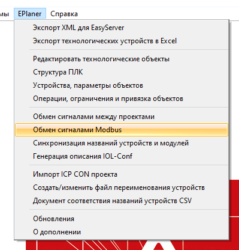
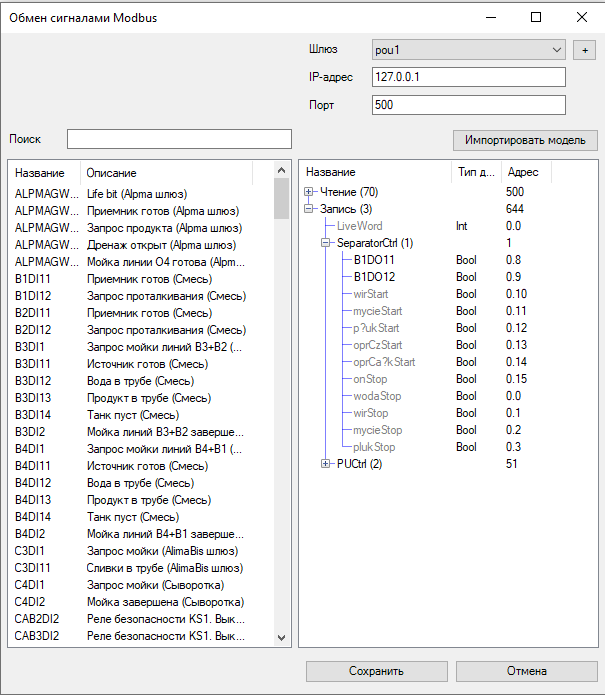
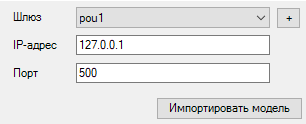
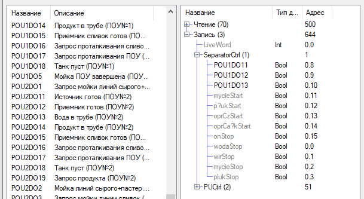

# Обмен сигналами по протоколу Modbus #

## Содержание ##
  
  + [Введение](#введение)
  + [Включение редактора](#включение-редактора)
  + [Загрузка существующего обмена](#загрузка-существующего-обмена)
  + [Создание, выбор и настройка моделей шлюза](#создание-выбор-и-настройка-модели-шлюза)
  + [Привязка сигналов](#настройка-привязки-сигналов)
  + [Сохранение обмена](#сохранение-обмена)
  

## Введение ##

Редактор обмена сигналами по протоколу Modbus позволяет 
настроить обмен с другими контроллерами, у которых известно 
и описано адресное пространство. Адресное пространство разделяется
на области *чтения* и *записи*.

**Чтение** - получает значение или состояние из *связанного проекта*
(Modbus-клиент) и устанавливает его привязанному сигналу *текущего проекта*.

**Запись** - получает значение или состояние привязанного сигнала 
*текущего проекта* и устанавливает его в *связанном проекте* (Modbus-клиент)


## Включение редактора ##

Для начала работы с обменом необходимо открыть проект в *Eplan* и в меню
выбрать `EPlanner` -> `Обмен сигналами Modbus`. 

<p align=center>
    
    <br><br>
    <b>Рисунок</b> - <em>Запуск обмена из меню Eplan</em>
</p>


## Загрузка существующего обмена ##

Существующий обмен проекта загружается автоматически из *Lua* файлов проекта.
Каждая отдельная модель обмена со шлюзом представляет отдельный файл в формате:
`gate_*.lua`, где `*` - название модели. Модуль читает все файлы в данном 
формате из файлов проекта.

После загрузки модуля появляется следующее окно:

<p align=center>
    
    <br><br>
    <b>Рисунок</b> - <em>Окно редактора обмена сигналами</em>
</p>


## Создание, выбор и настройка модели шлюза ##

<p align=center>
    
    <br><br>
    <b>Рисунок</b> - <em>Взаимодействие с моделями обмена</em>
</p>

На приведенном выше рисунке представлена часть окна редактора для
взаимодействия с моделями обмена со шлюзами, а именно:

  - Кнопка `+` - создание новой модели обмена. При активации данной функции
    выпадает новое окно с предложением ввести имя для модели обмена:
    данное имя будет фигурировать в названии файла,
    в который будет сохранена модель, в следующем виде: `gate_pou1.lua` -
    где `pou1` - название.

  - Выпадающий список (`Шлюз`) - позволяет выбрать модель обмена.

  - `IP-адрес` и `Порт` - настройка адреса и порта для Modbus-клиента 
    текущей модели

  - Кнопка `Импортировать модель` - импорт модели шлюза из CSV файла.
    При нажатии открываться окно, где предлагается выбрать CSV файл.
    Обычно файл содержит данные в следующем виде:
    ```csv
                        // "Описание сигнала;Тип;Адрес"
    src;;0              // Начало области чтения
    signal 1;Type;0     //
    rcv;;1              // Начало области записи 
    signal 2;Tpe;1      //
    ```

## Настройка привязки сигналов ##

Чтобы привязать устройство к полю, необходимо выбрать нужное поле и устройство
(в любом порядке), либо перетащить нужный сигнал на поле.

Поле без связи отображается с серым текстом - описание поля.
Если поле уже связано с устройством, то описание в поле заменяется
на имя связанного устройства.

Для удаления привязки необходимо выбрать нужное поле и нажать кнопку
<kbd>Delete</kbd>.

Также есть возможность заменить уже имеющуюся привязку,
повторив действия привязки на уже связанном поле.

<p align=center>
    
    <br><br>
    <b>Рисунок</b> - <em>Привязка сигналов</em>
</p>

Для привязки доступны следующие типы устройств *Eplan*: 
**AO**, **AI**, **DO**, **DI**.

Адресное пространство модели шлюза разделено на области *чтения* и *записи*.
В области *чтения* можно указывать типы **DI** и **AI**, а в области записи -
**DO**, **AO**. При этом в полях с типом **Bool** можно указать только
дискретные сигналы: **DI**, **DO**.


## Сохранение обмена ##

После настройки и сохранения обмена генерируются файлы для каждой модели шлюза
в формате описанном в [загрузке файлов обмена](#загрузка-существующего-обмена).

Файл представляет собой *Lua* модуль с описанием обмена.
Этому модуля устанавливается мета-таблица
[`modbusexchange.lua`](../../src/Lua/modbus_exchange_pattern.lua),
которая выполняет обмен.

Пример файла модели шлюза:
```Lua title="gate_pou1.lua"
--Eplanner version = {Версия надстройки}

local gate =
{
    ip = '127.0.0.1',
    port = 500,
    read =
    {
        offset = 0,
        {
            name = '',
            offset = 500,
            { 0, 0, 'Int', '', 'LiveWord' },
        },
        {
            name = 'Группа',
            offset = 1,
            { 0, 0, 'Word', '', 'Описание сигнала' },
        },
    },
    write =
    {
        offset = 0,
        {
            name = '',
            offset = 644,
            { 0, 0, 'Int', '', 'LiveWord' },
        },
        {
            name = 'Группа',
            offset = 1,
            { 0, 8, 'Bool', 'POU1DO11', 'onStart' },
            { 0, 9, 'Bool', 'POU1DO12', 'wodaStart' },
            { 0, 10, 'Bool', 'POU1DO13', 'wirStart' },
        },
    },
}

local s, mt = pcall( require, 'modbusexchange' )
mt = s and mt or { }
return setmetatable( gate, mt )
```
