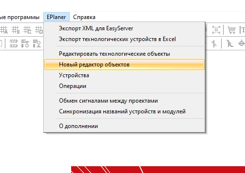

# Описание различий между старым и новым редактором технологических объектов #

## Содержание ##
 + [Предисловие](#Предисловие)
 + [Различия в дереве объектов](#1-Различия-в-дереве-объектов)
 + [Различия в механизме создания, вставки, удаления, перемещения вверх и вниз объектов](#2-Различия-в-механизме-создания-вставки-удаления-перемещения-вверх-и-вниз-объектов)
    + [Убран глобальный индекс объекта](#21-Убран-глобальный-индекс-объекта)
    + [Создание нового объекта](#22-Создание-нового-объекта)
    + [Копирование, вставка и замена объекта](#23-Копирование-вставка-и-замена-объекта)
    + [Удаление объекта](#24-Удаление-объекта)
    + [Перемещение объектов вверх и вниз](#25-Перемещение-объектов-вверх-и-вниз)
 + [Различия в объектах](#3-Различия-в-объектах)
    + [Привязка объектов](#31-Привязка-объектов)
    + [Настройка ограничений](#32-Настройка-ограничений)
    + [Корректировка базовой операции](#33-Корректировка-базовой-операции)

### Предисловие ###

Новый редактор подстроен под модель S-88 рецептурного производства. Мы отошли от универсального объекта и переходим к более уникальным объектам. Появились группы объектов, такие как: "<em>Мастер</em>", "<em>Агрегат</em>", "<em>Аппарат</em>". В данный момент все внутренние объекты являются теми же универсальными объектами, которые были в старом дереве. По большей части, изменилось отображение дерева, и дополнена функциональность.

Для того, чтобы использовать новое дерево объектов (оно открывается поверх старого, заменяя его элементы, таким образом, нельзя работать сразу в двух деревьях). Необходимо в меню "<b>EPlaner</b>" выбрать пункт "<strong>Новый редактор объектов</strong>" (<em>см. картину ниже</em>).

<b>Рисунок</b> - <i>Вызов нового редактора</i>

На текущий момент в дереве отключены операции экспорта, импорта, чтение и сохранение результатов и генерации базы каналов и Excel-файла проекта по новому дереву. Это все будет доступно по мере доработки нового дерева.

### 1 Различия в дереве объектов ###

Дерево объектов поменялось не сильно, между универсальным объектом и корнем дерева появилось разграничение объектов на тип по <em>S-88</em>. Для примера, ниже представлено старое и новое дерево проектов.

<b>Рисунок</b> - <i>Сравнение нового и старого редактора</i>

Добавились такие группы, как "<b>Мастер</b>", "<b>Агрегат</b>", "<b>Аппарат</b>". Причем, группа "<b>Мастер</b>" содержит один единственный объект, и не может содержать подтипов. Группы "<b>Агрегат</b>" и "<b>Аппарат</b>" реализуют один тип объектов. Эти группы могут содержать подгруппы, которые будут являться базовыми объектами. Это привело к тому, что пользователю теперь не нужно задавать базовый объект. Он будет задан автоматически.

### 2 Различия в механизме создания, вставки, удаления, перемещения вверх и вниз объектов ###
Дерево изменило вид, как видно из рисунка в предыдущем разделе, некоторые нюансы все же есть.

#### 2.1 Убран глобальный индекс объекта ####

В новом дереве понятие глобального индекса (<i>номера</i>) объекта было спрятано от пользователя. Пользователь теперь знает только локальный номер объекта, в то время как глобальный номер считает система сама. Глобальный номер объекта создается таким образом, чтобы никогда не было смещения объектов. Таким образом, можно легко добавлять объекты т.к они всегда будут добавляться в конец общего объектного дерева.

#### 2.2 Создание нового объекта ####

Изменен механизм создания объектов. В старом редакторе всегда создавался универсальный объект, в то время как в новом редакторе есть градация с возможностью создания конкретного базового объекта. В новом редакторе существует три варианта создания объекта: из корня дерева, из корня объекта S-88, из корня базового объекта.

<b>Рисунок</b> - <i>Обозначение корней элементов</i>

При создании объектов из первых двух корней (<i>корень дерева и корень объекта S-88</i>), будет вызвано диалоговое окно (<i>см. рисунок ниже</i>). В зависимости от того, из какого корня было оно вызвано, будут активированы или деактивированы возможные варианты. Подробности описаны ниже.

<b>Рисунок</b> - <i>Создание нового объекта</i>

Например, если создание объекта идет из корня дерева, то все списки в окне создания объекта будут доступны. При создании объекта из корня объекта S-88, так как объект уже известен, то будет заблокирован выбор объекта S-88, а при создании объекта из корня базового объекта, сразу будет создан соответствующий конкретный объект базового объекта без каких либо окон.

С точки зрения базового объекта ничего не изменилось. Данные в списках берутся из файла-описания базовых объектов, как и в старом редакторе.

#### 2.3 Копирование, вставка и замена объекта ####

Можно копировать любой объект, но вставить и заменить можно только объект с одинаковым базовым объектом. То есть, мы можем заменить <b>Танк</b> на <b>Танк</b>, но не можем <b>Танк</b> на <b>Линию</b>. Внутри объектов ситуация не изменилась. Мы можем скопировать операцию <b>Танка</b> в операции <b>Линии</b>, но базовая операция должна быть переназначена пользователем.

#### 2.4 Удаление объекта ####

Ничего не изменилось, но нужно учитывать, что при удалении объекта, его глобальный номер будет удален, а, следовательно, все объекты будут сдвинуты относительно предыдущего их положения.

#### 2.5 Перемещение объектов вверх и вниз ####

Перемещение объектов вверх и вниз изменяет из глобальные номера путем замены. Объект <b>Х</b> меняется на <b>У</b> и наоборот, как и было в старом редакторе. Но так как в новой реализации мы пользуемся локальными индексами и объекты сгруппированы, то перемещать объект вверх и вниз можно только в пределах одной группы. Выход в другие группы невозможен.

### 3 Различия в объектах ###

Объект, сам по себе, все ещё тот универсальный, из старого редактора, но с небольшими изменениями и доработками.

#### 3.1 Привязка объектов ####

Привязка агрегатов к аппаратам (<i>хотя, линии у нас относятся к агрегатам, но мы можем привязывать к ним другие агрегаты</i>) теперь выполняется не вручную, а может быть настроена также, как и ограничения (<i>окно "Операции" в режиме редактирования</i>). Пример настройки привязки объектов представлен ниже.

<b>Рисунок</b> - <i>Новая привязка объектов</i>

Как видно из рисунка, там где раньше прописывали руками номера объектов, они все ещё отображаются. Что с ними делать, пока не решено.

#### 3.2 Настройка ограничений ####

Дерево ограничений было изменено в соответствии с деревом объектов. Теперь в нем больше уровней и есть разграничение на аппараты, агрегаты и др. Исправлено изменение ограничений при передвижении объекта вверх или вниз, теперь они работают корректно. В целом, ничего кроме дерева и пары исправлений багов не изменилось.

#### 3.3 Корректировка базовой операции ####

При установке базовой операции в новой операции (<i>когда имя ещё не менялось</i>), автоматически будет установлено новое имя операции в соответствии с именем базовой операции.

**Примечание**: будет дорабатываться по мере разработки новой версии редактора.