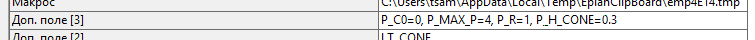
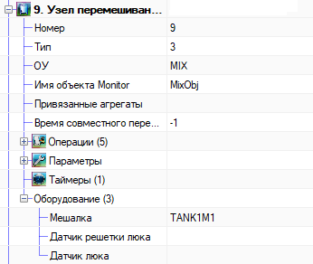

# Содержание

#### Проект

+ [Правила именования проекта](#1-Правила-именования-проекта)

#### Описание надстройки и ее использование
+ [Описание надстройки](#21-Описание-надстройки)
+ [Подключение к Eplan](#22-Подключение-к-Eplan)
+ [Описание автоматически генерируемых Lua-файлов](#23-Описание-автоматически-генерируемых-Lua-файлов)
+ [Настройка каталога проектов](#24-Настройка-каталога-проектов)
+ [Версия надстройки](#25-Версия-надстройки)
+ [Статистика](#26-Статистика)
    + [Оценочная сложность проекта](#261-Оценочная-сложность-проекта)
    + [Модуль простоя надстройки](#262-Модуль-простоя-надстройки)

#### Настройки проекта
+ [Настройка диапазона IP-адресов проекта](#3-Настройки-проекта)

#### Оборудование IO
+ [Настройка узлов и модулей ввода-вывода](#41-Настройка-узлов-и-модулей-ввода-вывода)
+ [Привязка устройств к модулям IO](#42-Привязка-устройств-к-модулям-IO)
    + [Привязка пневмоострова Festo (VTUG)](#421-Привязка-пневмоострова-Festo-VTUG)
    + [Правила написания комментариев к привязке](#422-Правила-написания-комментариев-к-привязке)

#### Операции Eplan
+ [Объекты технологической схемы](#5-Объекты-технологической-схемы)
    + [Операции объектов](#51-Операции-объектов)
    + [Схемы](#52-Схемы)

#### Устройства технологической схемы
+ [Нумерация устройств](#61-Нумерация-устройств)
    + [Технологический объект](#611-Технологический-объект)
    + [Пользовательский объект](#612-Пользовательский-объект)
    + [Устройство](#613-Устройство)
+ [Перечень устройств](#62-Перечень-устройств)
    + [HA. Аварийная звуковая сигнализация. Сирена](#621-HA-Аварийная-звуковая-сигнализация-Сирена)
    + [FQT. Счетчик](#622-FQT-Счетчик)
    + [HL. Световая сигнализация](#623-HL-Световая-сигнализация)
    + [LT. Текущий уровень](#624-LT-Текущий-уровень)
    + [GS. Датчик положения](#625-GS-Датчик-положения)
    + [M. Мотор (электродвигатель)](#626-M-Мотор-Электродвигатель)
    + [FS. Датчик наличия потока](#627-FS-Датчик-наличия-потока)
    + [LS. Предельный уровень](#628-LS-Предельный-уровень)
    + [QT. Датчик проводимости](#629-QT-Датчик-проводимости)
    + [TE. Температура](#6210-TE-Температура)
    + [SB. Кнопка](#6211-SB-Кнопка)
    + [V. Клапан](#6212-V-Клапан)
    + [VC. Управляемый клапан](#6213-VC-Управляемый-клапан)
    + [DO. Управляющий (выходной) сигнал](#6214-DO-Управляющий-выходной-сигнал)
    + [DI. Входной сигнал](#6215-DI-Входной-сигнал)
    + [AO. Выходная величина](#6216-AO-Выходная-величина)
    + [AI. Входная величина](#6217-AI-Входная-величина)
    + [WT. Датчик веса](#6218-WT-Датчик-веса)
    + [PT. Датчик давления](#6219-PT-Датчик-давления)
    + [Y (DEV_VTUG). Пневмоостров Festo](#6220-Y-DEV_VTUG-Пневмоостров-Festo)
+ [Дополнительные параметры](#63-Дополнительные-параметры)
    + [Описание устройства](#631-Описание-устройства)
    + [Назначение дополнительных полей](#632-Назначение-дополнительных-полей)

#### Редактирование технологических объектов
+ [Общие сведения о технологических объектах](#7-Общие-сведения-о-технологических-объектах)
+ [Описание окна редактора](#71-Описание-окна-редактора)
    + [Добавление устройств в операции в текстовом виде](#711-Добавление-устройств-в-операции-в-текстовом-виде)
    + [Добавление устройств в операции в графическом виде](#712-Добавление-устройств-в-операции-в-графическом-виде)
    + [Добавление устройств в операции в табличном режиме](#713-Добавление-устройств-в-операции-в-табличном-режиме)
    + [Сохранение результатов редактирования](#714-Сохранение-результатов-редактирования)
    + [Использование параметров в объекте](#715-Использование-параметров-в-объекте)
+ [Использование функциональности базового объекта и базовой операции](#72-Использование-функциональности-базового-объекта-и-базовой-операции)
    + [Использование базового объекта и новых полей](#721-Использование-базового-объекта-и-новых-полей)
    + [Использование базовой операции](#722-Использование-базовой-операции)
    + [Оборудование базового объекта](#723-Оборудование-базового-объекта)
    + [Рекомендации по использованию ОУ (обозначений устройств) в объектах](#724-Рекомендации-по-использованию-ОУ-обозначений-устройств-в-объектах)

#### Установка ограничений
+ [Установка ограничений в табличном виде](#8-Установка-ограничений)

#### Синхронизация и экспорт
+ [Синхронизация названий устройств и модулей](#91-Синхронизация-названий-устройств-и-модулей)
+ [Экспорт XML для EasyServer](#92-Экспорт-XML-для-EasyServer)
    + [Экспортируемые параметры](#921-Экспортируемые-параметры)
+ [Экспорт технологических устройств в Excel](#93-Экспорт-технологических-устройств-в-Excel)
    + [Экспорт информации в Excel для работы в SCADA](#931-Экспорт-информации-для-SCADA-из-проекта)

#### Объектная модель по ISA
+ [Объектная модель технологических объектов](#101-Объектная-модель-рецептурного-производства)

## 1 Правила именования проекта ##

Имя проекта является важной частью любого проекта. Оно используется в автоматически генерируемых .lua файлах, а так же в других функциях надстройки.

Имя проекта логически состоит из двух частей: имя площадки, имя проекта.

Правила именования:
- Имя не должно содержать кавычек, скобочек и прочих спецсимволов (_за исключением знака **минус**_);
- Имя площадки задается символами латинского алфавита с возможностью номерного обозначения площадки;
- Имя проекта задается символами кириллического алфавита с возможностью номерного обозначения;
- Знаки пробела используемые в имени проекта должны быть заменены на знак минус.

## 2 Описание надстройки и ее использование ##

### 2.1 Описание надстройки ###

Надстройка EasyEPlanner разработана как Add-In к EPLAN, на данный момент используется EPLAN 2.8. Надстройка используется при разработке проектов в EPLAN и позволяет автоматизировать работу
инженера по автоматизации, а так же инженера-программиста, который описывает проект на языке программирования LUA. С помощью EasyEPlanner описываются технологические объекты (Танк, Бойлер и др.), операции этих объектов, шаги операций, устанавливаются ограничения для операций, а так же множество других свойств технологического объекта. В конечном итоге, EasyEPlanner генерирует LUA файлы, которые загружаются в контроллер.

Надстройка содержит следующие пункты меню:

1. Экспорт XML для EasyServer.
2. Экспорт технологических устройств в Excel.
2. Редактировать технологические объекты.
3. Устройства.
4. Операции.
5. Синхронизация названий устройств и модулей.
6. О дополнении.

Описание каждого из пунктов Вы найдете при прочтении данной документации.

### 2.2 Подключение к Eplan ##

Для того, что бы использовать EasyEPlanner, можно перекомпилировать библиотеку, либо скачать последнюю Release версию проекта. Для подписывания надстройки используйте свой Eplan сервер подписей. Далее, необходимо запустить EPLAN и в меню и перейти в <b>Сервисные программы -> API-Addins</b>. В появившемся окне необходимо нажать кнопку "</b>Загрузить</b>", откроется диалоговое окно, в котором необходимо перейти в папку с надстройкой и выбрать файл "<b>EPLAN.EplAddin.EasyEPlanner.dll</b>", а после нажать кнопку "<b>Открыть</b>". Надстройка загрузится, и появится пункт меню "<b>EPlaner</b>".

<b>ВАЖНО</b>: Периодически обновляйте папку с надстройкой через SVN, а так же, не удаляйте файлы из папки, иначе работа надстройки не гарантируется!

### 2.3 Описание автоматически генерируемых Lua-файлов ### 
Дополнение EasyEPLANner автоматически генерирует некоторые файлы управляющей программы контроллера. Данные файлы находятся в следующем каталоге с проектами (задается в configuration.ini).

Список файлов, описывающих проект:

- __*main.plua*__ - описание управляющей программы. При отсутствии данного файла, он генерируется автоматически с шаблонами необходимых функций. Если данный файл уже существует, то тогда он остаётся прежним;
- __*main.wago.lua*__ - описание привязки устройств к модулям I/O Wago. В данном файле вначале идет список удаленных узлов (BC - bus couplers) с указанием их параметров (IP-адрес, тип и т.п.) и наполнения - модулей ввода/вывода (I/O modules). Далее идет список технологических устройств (S88 term - control modules) с указанием каналов ввода\вывода, которые с ними связаны. Внутри каналов описывается к какому BC они привязаны, к каким портам подключены и смещения адресного пространства. Помимо каналов внутри технологических устройств могут быть его различные параметры.
- __*main.io.lua*__ - описание привязки устройств к модулям I/O (_Полная копия **main.wago.lua**_);
- __*main.devices.lua*__ - описывает список всех устройств проекта. В файле переменным Lua присваиваются устройства из проекта, с которыми в последствии будет работать ПЛК;
- __*main.modbus_srv.lua*__ - описание взаимодействия с modbus-клиентами;
- __*main.objects.lua*__ - описание объектов проекта. Описание из редактора технологических объектов. Сначала описываются технологические объекты (_Танк, Бойлер и др._). Внутри этих объектов могут описываться различные параметры, таймеры, указываться свойства этого объекта, а так же список операций с шагами и действиями;
- __*main.profibus.lua*__ - описание profibus шины;
- __*main.restrictions.lua*__ - описание ограничений, которые устанавливаются для технологических объектов через редактор технологических объектов. Устанавливаются в числовом виде, поэтому лучше просматривать их через редактор в EPLAN;
- __*main.rm_PACs.lua*__ - описание взаимодействия с удаленными PAC. Находится в бета-версии.
- __*prg.lua*__ - описание базовой функциональности объектов. В текущей реализации в файле сначала описываются переменные, к которым присваиваются те или иные объекты, после идет добавление базовой функциональности, в перспективе будет добавлена так же базовая инициализация объектов. Файл генерируется так же на основе данных редактора технологических устройств.

На текущий момент файлы **main.wago.lua** и **main.io.lua** имеют одно и то же содержание, потому что они используются в разных версиях управляющей программы. В старых проектах используется файл **main.wago.lua** (*до EPLAN 2.8*), а в новых (*нынешних*) проектах используется **main.io.lua**.

### 2.4 Настройка каталога проектов ##

Дополнение позволяет настраивать каталог для записи и считывания __lua__ файлов проектов. Для этих целей в каталоге с дополнением есть файл __configuration.ini__.

В файле напротив ключа __folder_path__ в кавычках указывается путь к каталогу проектов. Например: _folder_path="**C:\Folder1\folder2**"_

### 2.5 Версия надстройки ###

В меню EasyEplanner есть  пункт - _О дополнении_. С помощью этого пункта можно узнать текущую версию надстройки, которая подключена к Вашему Eplan. Нажав этот пункт меню будет показано диалоговое окно, в котором будет обозначена версия надстройки.

Версия генерируется по следующему шаблону - `Год.Месяц.Сборка.Ревизия`.

**Сборка** - число дней, начиная с __1__ января __2000__ года.
**Ревизия** - число секунд от полуночи, независимо от часового пояса.

### 2.6 Статистика ###

#### 2.6.1 Оценочная сложность проекта ####
В надстройке осуществляется генерация статистики относительно сложности проекта (по заранее заданным значениям). В частности, измеряется количество строк кода в файле `main.plua` (_предельное значение для статистики - 1000 строк кода_), измеряется количество аппаратов в проекте (_предельное значение - 10 штук_), агрегатов (_50 штук_) и количество тэгов (_5000 штук_). На основе этих значений генерируются SVG-картинки, которые могут говорить о сложности проекта. Картинки будут находиться в папке с описанием проекта (_docs/statistics_).

Файлы:
* agregates_total.svg - количество агрегатов проекта.
* lines_total.svg - количество строк кода в файле `main.plua`.
* tags_total.svg - количество тэгов в проекте.
* units_total.svg - количество аппаратов в проекте.

#### 2.6.2 Модуль простоя надстройки ####

В надстройке осуществляется мониторинг активности. Если в течении одного часа у пользователя не было активности в Windows (_заблокировал компьютер, ушел домой и др._), то надстройка автоматически произведет сохранение проекта, его закрытие и завершит работу Eplan, тем самым, освобождая плавающую лицензию (_если используется такой тип лицензирования)_.

## 3 Настройки проекта ##

Помимо корректного имени, в проекте необходимо задать диапазон IP-адресов, который был заложен для этого проекта. Этот диапазон задается в свойствах проекта, в полях "_Пользователь, доп. поле[1]_", и "_Пользователь, доп. поле[2]_".

* *Пользователь, доп. поле[1]* - начальное значение диапазона.
* *Пользователь, доп. поле[2]* - конечное значение диапазона.

По заданному диапазону проверяются все устройства, содержащие IP-адрес, на корректное заполнение.

Пример корректного IP-адреса: "_192.168.1.0._". IP-адрес задается без кавычек и разделяется точками.

## 4 Оборудование IO ##

**ВАЖНО:** Все устройства (устройства, узлы ввода-вывода и др.), добавляемые в проект должны быть расположены на ФСА (функциональная схема автоматизации) для того, что бы надстройка их считывала. Если устройства на ФСА нет, то оно не будет прочитано! Дополнительные поля устройств заполняются также на ФСА. Также __важно__, что бы в устройстве на ФСА был включен флажок - "Главная функция", а в его макросах на других схемах - отключена.

### 4.1 Настройка узлов и модулей ввода-вывода

Именование узлов осуществляется в следующем виде: буква A и номер, кратный 100. Пример: "A100", "A200". В проекте узлы должны идти последовательно от "A100" (<em>для WAGO - старые проекты</em>), а для новых типов проекта (<em>Phoenix Contact</em>) необходимо учитывать, что узловой контроллер (<em>на котором находится управляющая программа</em>) именуется как "A1".

У узлов так-же можно задавать параметры:

1. Доп. поле[1] - признак пропуска устройства (если в поле написано значение - 1, то устройство игнорируется);
2. Начальный адрес карты ПЛК (_в окне "Блок ПЛК"_) - указывается IP-адрес устройства.

Информация о модулях ввода-вывода получается на основе описания модуля (_сведения об изделии_). В проекте должно быть главное изделие для модуля (_узел_).

### 4.2 Привязка устройств к модулям IO ###

Для связывания клеммы модуля ввода-вывода и устройства необходимо чтобы функциональный текст (клеммы) соответствовал названию канала устройства. Для упрощения данной процедуры реализовано окно списком устройств и каналов.

<b>Рисунок</b> - <i>Окно "Устройства"</i>

Вызов данного окна осуществляется через пункт меню <b>"EPlaner" -> "Устройства"</b>

<b>Рисунок</b> - <i>Путь к окну "Устройства"</i>

Для привязки клеммы необходимо при активном функциональном тексте клеммы <b>дважды</b> нажать (<i>double click</i>) на требуемый канал в окне устройств (<i>пример, выделено зеленым</i>).

**Примечание**: для клапанов с AS-интерфейсом и IO-Link Mixproof клапана привязывается только 1 из 2 каналов (_AI или AO_).

<b>Рисунок</b> - <i>Пример привязки к модулю ввода-вывода</i>

После двойного клика соответствующий текст автоматически занесется в функциональный текст. При необходимости привязки более одного устройства к одной и той же клемме необходимо <b>зажать</b> при этом клавишу <b>Ctrl</b> (<i>к тексту допишется данное устройство</i>). Для размещения названия устройства на новой строке, необходимо пользоваться символом новой строки (¶), необходимо вставить символ между строками (<i>например, скопировав его предварительно из Word</i>).

При привязке действуют следующие ограничения:
* К модулю AI привязывается AI сигнал;
* К модулю AO привязывается AO сигнал;
* К модулю DI привязывается DI сигнал;
* К модулю DO привязывается DO сигнал;
* К модулю IO-Link от Wago привязываются AO, AI сигналы;
* К модулю IO-Link от Phoenix Contact привязываются AO, AI, DO, DI сигналы;
* К модулю DO/DI от Phoenix Contact привязываются DO и DI сигналы;

**Примечание**: 
1. Для IO-Link модуля Phoenix Contact дополнительно, после комментария к сигналу, (прим., _Пуск_, как на рисунке ниже) через символ новой строки указывается тип канала. Тип канала указывается не всегда, только если устройство имеет более двух каналов для привязки. Тип канала указывается **ТОЛЬКО** для DI или DO канала. Тип каналов может быть: 
    * DI (для каналов DI); 
    * DO (для каналов DO).
2. Если устройство по какой-то причине не привязывается, пожалуйста, проверьте все клеммы  устройства ввода-вывода, к которому вы хотите привязаться. Клеммы не должны иметь галочек "_Главная функция_".

<b>Рисунок</b> - <i>Пример функционального текста для модуля Phoenix Contact IO-Link</i>

<b>Рисунок</b> - <i>Пример функционального текста</i>

<b>Рисунок</b> - <i>Отображение введенного функционального текста</i>

### 4.2.1 Привязка пневмоострова Festo (VTUG) ###

Пневмоостров Festo (_DEV_VTUG - старые проекты, Y - новые_) поддерживает обычную привязку к своим клеммам, а так же множественную привязку. Важно, что бы привязка осуществилась - это наличие привязки самого пневмоострова к клемме модуля ПЛК.

На электрической схеме указывается, к какой клемме ПЛК привязан пневмоостров, а на схеме обзора пневмоострова (_или электрической схеме, в зависимости от расположения_) происходит привязка клапанов к клеммам пневмоострова. __Важно__: использовать способы раздельно, для каждого из устройств.

**Примечание:** только тип пневмоострова Y привязывается описываемым способом. Для старых типов - DEV_VTUG, необходимо использовать обычный способ привязки (старый тип устарел, но используется в старых проектах). Поддерживается "переходное состояние", когда DEV_VTUG заменен на Y, но используется старый тип привязки. При использовании старого типа привязки с новым типом пневмоострова не гарантируется работа функции - _Синхронизация названий устройств и модулей_.

<b>Рисунок</b> - <i>Привязка пневмоострова на схеме обзора</i>

На первой части рисунка - пневмоостров без клемм и его привязка к модулю ввода-вывода. На втором рисунке - привязка к клеммам в прямоугольном макросе пневмоострова на схеме "Пневмоостров.Обзор".

<b>Рисунок</b> - <i>Привязка пневмоострова на электрической схеме</i>

Помимо всего описанного выше, необходимо указать тип используемого пневмоострова. Для этого, схематически располагаем пневмоостров на ФСА и прописываем в доп. поле 2 тип используемой версии (см. пункт 5.2.3). Незабываем про флажок "Главная функция".

<b>Рисунок</b> - <i>Указание типа используемой версии пневмоострова</i>

### 4.2.2 Правила написания комментариев к привязке ###

При множественной привязке, в функциональный текст будет заноситься лишь обозначение устройств (_ОУ_) друг за другом (_прим., "+V1 +V2 +V3"_), причем можно задавать её как в строку (_задается изначально_), так и в столбец (_необходимо расставить символы переноса строки между ОУ_). Разделитель при множественной привязке - символ переноса на новую строку.

При одинарной привязке в функциональный текст заносится так же комментарий. 

Для установки комментария необходимо учитывать следующие правила:

+ Комментарий должен начинаться с заглавной буквы;
+ Комментарий не должен содержать в себе ОУ (прим, +V3);
+ Комментарий может содержать буквы латинского и кириллического алфавита в любом регистре (_верхний, нижний_), а так же буквенно цифровые обозначения (_прим., CR2, B4 и др._);
+ Комментарий не должен содержать спецсимволы, скобочки, и др. (_за исключением символа - **№**_).

Пример корректного комментария: **"Подача в объект OBJECT2"**.

##  5 Объекты технологической схемы ##

Объектами являются физические танки, линии и т.д. Логически они делятся на аппараты, агрегаты, блоки управления.

### 5.1 Операции объектов ###

Операции может включать оператор. Во время операции происходит включение\выключение устройств, обработка значений с датчиков и т.д. Операции выделяются исходя из системного подхода. Операции разделяются на <i>основные</i> и <i>вспомогательные</i>. Каждая операция имеет название, характеризуется единым для всех проектов описанием (<i>т.е. операция “наполнение” одинакова для всех проектов и характеризуется следующими параметрами: объемом наполнения, проводимость смеси, проводимость воды</i>). Операции описываются в графическом виде в редакторе операций Eplaner.

Для операции определяется:
1.	Номера операций, на которые можно перейти после данной операцию (_из схемы операций_).
2.	Значения параметров, необходимые для выполнения операции.

Операции состоят из шагов. Операция может находится в состоянии __выполнение__, __пауза__, __остановка__.

<b>Рисунок</b> - <i>Переход между состояниями операций</i>

### 5.2 Схемы ###

<b>Рисунок</b> - <i>Схема описания операций в Eplan</i>

<b>Рисунок</b> - <i>Схема операций</i>

## 6 Устройства технологической схемы

### 6.1 Нумерация устройств ###
Для идентификации используются заглавные латинские символы, символ подчеркивания, спецсимволы  (<b>==</b> ,<b>=</b> , <b>+</b>, <b>-</b>) и <b>цифры</b>.

Идентификация объектов осуществляется следующим обозначением:  
<b>==</b> площадка <b>=</b> проект <b>+</b> технологический объект <b>#</b> пользовательский объект <b>-</b> устройство.

#### 6.1.1 Технологический объект ####
Название технологического объекта (_танка, линии…_).
Примеры типовых технологических объектов:
* __M2__ –  линия №2;
* __KOAG2__ – коагулятор №2;
* __TCW1__ – бачек с холодной водой №1;
* __THW1__ – бачек с горячей водой №1.

#### 6.1.2 Пользовательский объект ####
Содержит дополнительную информацию.

#### 6.1.3 Устройство ####

Содержит код устройства и номер (<i><b>V1</b> – клапан №1</i>). Устройство уникально в пределах технологического объекта.

### 6.2 Перечень устройств ###

Ниже приведено описание используемых технологических устройств. Для каждого устройства также могут задаваться дополнительные поля (<i>смотри раздел <b>5.3</b> "Дополнительные параметры"</i>).

#### 6.2.1 HA. Аварийная звуковая сигнализация. Сирена ####
Обозначение: __HA__.  
Каналы ввода/вывода: __DO__ – _1_.  
Пример: __HA1__. Аварийная звуковая сигнализация. Сирена.

<b>Рисунок</b> - <i>Пример аварийной звуковой сигнализации, сирены</i>

#### 6.2.2 FQT. Счетчик ####
Обозначение: **FQT**.  
Подтип: **FQT**.
Каналы ввода/вывода: **AI** – _1_.  
Название каналов: __AI1__ – _объем_.  

Обозначение: **FQT**.
Подтип: **FQT_F**.
Каналы ввода/вывода: **AI** – _2_.  
Название каналов: __AI1__ – _поток_, __AI2__ – _объем_.  

Обозначение: **FQT**.  
Подтип: **FQT_F_OK**.
Каналы ввода/вывода: **AI** – _2_, **DI** - _1_.  
Название каналов: __DI1__ – _сотояние_, __AI1__ – _поток_, __AI2__ – _объем_.

Пример: __+OBJ1-FQT1__. Объект 1. Объем.

#### 6.2.3 HL. Световая сигнализация ####
Обозначение: __HL__.  
Каналы ввода/вывода: __DO__ – _1_.  
Пример: __HL1__. Аварийная сигнализация. Зеленый.

#### 6.2.4 LT. Текущий уровень ####
Обозначение: __LT__.  
Каналы ввода/вывода: __AI__ – _1_.  
Пример: __+OBJ1-LT1__. Объект №1. Текущий уровень.

#### 6.2.5 GS. Датчик положения ####
Обозначение: **GS**.  
Каналы ввода/вывода: **DI** – *1*.  
Пример: **+OBJ2-GS1**. Объект №2. Датчик люка.

#### 6.2.6 М. Мотор (электродвигатель) ####
Обозначение: **M**.  
Подтип: **M**.
Каналы ввода/вывода: **DI** – *1*.  
Название каналов: **DI1** – *обратная связь*.  

Обозначение: **M**.  
Подтип: **M_FREQ**.
Каналы ввода/вывода: **DI** – *1*, **AO** – *1*.  
Название каналов: **DI1** – *обратная связь*, **AO1** – *частота вращения*.  

Обозначение: **M**.  
Подтип: **M_REV**.
Каналы ввода/вывода: **DO** – *1*, **DI** – *1*.  
Название каналов: **DO1** – *реверс*, **DI1** – *обратная связь*.  

Обозначение: **M**.  
Подтип: **M_REV_FREQ**.
Каналы ввода/вывода: **DO** – *1*, **DI** – *1*, **AO** – *1*.  
Название каналов: **DO1** – *реверс*, **DI1** – *обратная связь*, **AO1** – *частота вращения*.  

Обозначение: **M**.  
Подтип: **M_REV_2**.
Каналы ввода/вывода: **DO** – *1*, **DI** – *1*.  
Название каналов: **DO1** – *реверс*, **DI1** – *обратная связь*.  

Обозначение: **M**.  
Подтип: **M_REV_FREQ_2**.
Каналы ввода/вывода: **DO** – *1*, **DI** – *1*, **AO** – *1*.  
Название каналов: **DO1** – *реверс*, **DI1** – *обратная связь*, **AO1** – *частота вращения*.  

Обозначение: **M**.  
Подтип: **M_REV_2_ERROR**.
Каналы ввода/вывода: **DO** – *1*, **DI** – *1*.  
Название каналов: **DO1** – *реверс*, **DI1** – *авария*.  

Обозначение: **M**.  
Подтип: **M_REV_FREQ_2_ERROR**.
Каналы ввода/вывода: **DO** – *1*, **DI** – *2*, **AO** – *1*.  
Название каналов: **DO1** – *реверс*, **DI1** – *авария*, **DI2** – *обратная связь*, **AO1** – *частота вращения*. 

Пример: **+OBJ1-M1**. Объект 1. Пуск.

#### 6.2.7 FS. Датчик наличия потока ####
Обозначение: **FS**.  
Каналы ввода/вывода: **DI** – *1*.  
Пример: **FS1**. Датчик наличия потока.

#### 6.2.8 LS. Предельный уровень ####
Обозначение: **LS**.  
Каналы ввода/вывода: **DI** – *1*.  
Дополнительные поля: 
* Тип подключения: _max_, _min_.

Обозначение: **LS**.  
Подтип: **IO-Link**
Каналы ввода/вывода: **AI** – *1* (AOAI).  
Дополнительные поля: 
* Тип подключения: _max_, _min_.

Пример: **+TANK1-LS2**. Танк №1. Верхний уровень.

#### 6.2.9 QT. Датчик проводимости ####
Обозначение: **QT**.  
Подтип: **QT, QT_IOLINK**.
Каналы ввода/вывода: **AI** – _1_.  

Обозначение: **QT**.  
Подтип: **QT_OK**.
Каналы ввода/вывода: **AI** – _1_, **DI** - _1_.  

Пример: **OBJ1+-QT1**. Объект 1. Датчик проводимости.

#### 6.2.10 TE. Температура ####
Обозначение: **TE**.  
Каналы ввода/вывода: **AI** – *1*.  
Пример: **+OBJ1-TE1**. Объект №1. Температура.

#### 6.2.11 SB. Кнопка ####
Обозначение: **SB**.  
Каналы ввода/вывода: **DI** – *1*.  
Пример: **+OBJ1-SB1**. Объект №1. В дренаж.

#### 6.2.12 V. Клапан ####
Обозначение: **V**.  
Каналы ввода/вывода:
1. V_DO1: **DO** - _1_;
2. V_DO2: **DO** - _2_;
3. V_DO1_DI1_FB_OFF, V_DO1_DI1_FB_ON: **DO** - _2_;
4. V_DO1_DI2: **DO** - _1_, **DI** - _2_;
5. V_DO2_DI2, V_DO2_DI2_BISTABLE: **DO** - _2_; **DI** - _2_;
6. V_MIXPROOF, V_BOTTOM_MIXPROOF: **DO** - _3_; **DI** - _2_;
7. V_IOLINK_MIXPROOF, V_AS_MIXPROOF, V_AS_DO1_DI2, V_IOLINK_DO1_DI2: **AO** - _1_, **AI** - _1_;
8. V_IOLINK_VTUG_DO1: **AO** - _1_;
9. V_IOLINK_VTUG_DO1_FB_OFF, V_IOLINK_VTUG_DO1_FB_ON: **AO** - _1_, **DI** - _1_.

Название каналов: **DO** – *открыть НС*, *открыть ВС*, *открыть*, *закрыть*, *открыть мини*; **DI** – *открыт*, *закрыт*, **AO**, **AI**.  
Пример: **+OBJ1-V7**. Объект №1. Дренаж.

#### 6.2.13 VC. Управляемый клапан ####
Обозначение: **VС**.  
Каналы ввода/вывода: **AO** – *1*.  
Пример: **VC3**. Паровой клапан.

#### 6.2.14 DO. Управляющий (выходной) сигнал ####
Обозначение: **DO**.  
Каналы ввода/вывода: **DO** – *1*.  
Пример: **OBJ2+-DO2**. Объект 2. Готовность объекта

#### 6.2.15 DI. Входной сигнал ####
Обозначение: **DI**.  
Каналы ввода/вывода: **DI** – *1*.  
Пример: **DI10**. Приемник готов.

#### 6.2.16 AO. Выходная величина ####
Обозначение: **AO**.  
Каналы ввода/вывода: **AO** – *1*.  
Пример: **AO1**. Задание производительности.

#### 6.2.17 AI. Входная величина ####
Обозначение: **AI**.  
Каналы ввода/вывода: **AI** – *1*.  
Пример: **AI1**. Ток двигателя.

#### 6.2.18 WT. Датчик веса ####
Обозначение: **WT**.  
Каналы ввода/вывода: **AI** – *2*.  
Пример: **WT1**. Весы танка 1.

#### 6.2.19 PT. Датчик давления ####
Обозначение: **PT**.  
Каналы ввода/вывода: **AI** – *1*.  
Пример: **OBJ1+-PT10**. Объект 1.  Датчик давления.

#### 6.2.20 Y (DEV_VTUG). Пневмоостров Festo ####
Обозначение: **Y**, **DEV_VTUG** - старые проекты.  
Каналы ввода/вывода: **AO** – *1*. (AOAI)
Пример: **OBJ1+CAB1-Y1**. Проект OBJ1, шкаф №1, устройство пневмоостров Festo.

### 6.3 Дополнительные параметры ###
Дополнительные параметры указываются через свойства устройства.

#### 6.3.1 Описание устройства ###
В поле «Примечание» записывается описание устройства. Пример смотри ниже.

<b>Рисунок</b> - <i>Запись описания устройства</i>

#### 6.3.2 Назначение дополнительных полей ####
1. **Доп. поле [1]**. Определяет обрабатывать или нет данное устройство при экспорте для PAC (_например, ручная заслонка не управляется автоматически_). Если оно содержит значение - **1**, то данное устройство не обрабатывается.

2. **Доп. поле [2]**. Определяет подтип устройства. Описание:

Параметр | Описание
------------ | -------------
NONE | Подтип не определен.
V_DO1 | Клапан с одним каналом управления.
V_DO2 |Клапан с двумя каналами управления.
V_DO1_DI1_FB_OFF |Клапан с одним каналом управления и одной обратной связью (_выключенное состояние_).
V_DO1_DI1_FB_ON | Клапан с одним каналом управления и одной обратной связью (_включенное состояние_).
V_DO1_DI2 | Клапан с одним каналом управления и двумя обратными связями.
V_DO2_DI2 | Клапан с двумя каналами управления и двумя обратными связями.
V_MIXPROOF | Клапан противосмешивающий (_2 канала управления и 2 обратные связи_).
V_IOLINK_MIXPROOF | Клапан противосмешивающий с **IO-Link**.
V_AS_MIXPROOF | Клапан противосмешивающий с **AS интерфейсом**.
V_BOTTOM_MIXPROOF | Клапан донный. 
V_AS_DO1_DI2 | Клапан с одним каналом управления и двумя обратными связями с **AS интерфейсом**.
V_IOLINK_DO1_DI2 | Клапан с одним каналом управления и двумя обратными связями с **IO-Link**.
V_DO2_DI2_BISTABLE | Клапан с двумя каналами управления и двумя обратными связями бистабильный.
V_IOLINK_VTUG_DO1 | **IO-Link VTUG** клапан с одним каналом управления.
V_IOLINK_VTUG_DO1_FB_OFF | **IO-Link VTUG** клапан с одним каналом управления и одной обратной связью (_выключенное состояние_).
V_IOLINK_VTUG_DO1_FB_ON | **IO-Link VTUG** клапан с одним каналом управления и одной обратной связью (_включенное состояние_).
LS_MIN | Предельный уровень по схеме минимум.
LS_MAX | Предельный уровень по схеме максимум.
LS_IOLINK_MIN | **IO-Link** уровень. Подключение по схеме минимум.
LS_IOLINK_MAX | **IO-Link** уровень. Подключение по схеме максимум.
LS_VIRT | Виртуальный датчик предельного уровня.
TE | Температура
TE_IOLINK | Температура **IO-Link** без дополнительных параметров.
M | Мотор без управления частотой вращения.
M_FREQ | Мотор с управлением частотой вращения.
M_REV | Мотор с реверсом (*совместный*) без управления частотой вращения.
M_REV_FREQ | Мотор с реверсом (*совместный*) с управлением частотой вращения.
M_REV_2 | Мотор с реверсом (*отдельный*) без управления частотой вращения.
M_REV_FREQ_2 | Мотор с реверсом (*отдельный*) с управлением частотой вращения.
M_REV_2_ERROR | Мотор с реверсом (*отдельный*). Отдельный сигнал аварии.
M_REV_FREQ_2_ERROR | Мотор с реверсом с управлением частотой вращения. Реверс включается отдельно. Отдельный сигнал ошибки.
M_ATV | Мотор, управляемый частотным преобразователем Altivar. Связь с частотным преобразователем по Ethernet. Реверс и аварии опциональны.
FQT | Счетчик.
FQT_F | Счетчик с расходом.
FQT_F_OK | Счетчик с расходом с диагностикой.
FQT_VIRT | Виртуальный счетчик (*без привязки к модулям*).
QT | Концентратомер.
QT_OK | Концентратомер с диагностикой.
QT_IOLINK | **IO-Link** концентратомер.
LT | Датчик текущего уровня.
LT_CYL | Датчик уровня для танка цилиндрической формы.
LT_CONE | Датчик уровня для цилиндрического танка с дном в форме конуса.
LT_TRUNC | Датчик текущего уровня для танка с дном в форме усеченного конуса
LT_IOLINK | **IO-Link** текущий уровень с возможностью задания параметров для танка.
LT_VIRT | Виртуальный датчик текущего уровня.
DI | Дискретный входной сигнал
DI_VIRT | Виртуальный дискретный входной сигнал
АI | Аналоговый входной сигнал
АI_VIRT | Виртуальный аналоговый входной сигнал
DO | Дискретный входной сигнал
DO_VIRT | Виртуальный дискретный входной сигнал
АО | Аналоговый выходной сигнал
АО_VIRT | Виртуальный аналоговый выходной сигнал
Y | Пневмоостров Festo
DEV_VTUG_8 | SPECIAL Festo valve terminal (16 клапанов)
DEV_VTUG_16 | SPECIAL Festo valve terminal (32 клапана)
DEV_VTUG_24 | SPECIAL Festo valve terminal (48 клапанов)
PT | Датчик давления
PT_IOLINK | **IO-Link** датчик давления 
DEV_SPAE | **IO-Link** датчик давления воздуха

Пример приведен ниже:

<b>Рисунок</b> - <i>Пример добавления типа устройству</i>

3. **Доп. поле [3]**. Определяет дополнительные параметры. 
Параметры задаются в следующем виде: **«имя_параметра»=«значение_параметра»**. 
Список параметров приведен ниже.

<b>Рисунок</b> - <i>Пример добавления доп. параметров к устройству</i>

* ___V___
    * __P_ON_TIME__		Время включения, _мс_. (_Для клапанов с обратной связью_).

* ___AI___
    * __P_C0__ - Сдвиг нуля.
    * __P_MIN_V__ -	Минимальное значение.
    * __P_MAX_V__ -	Максимальное значение.

* ___AO___
    * __P_MIN_V__ -	Минимальное значение.
    * __P_MAX_V__ -	Максимальное значение.

* ___FS___
    * __P_DT__ - Время порогового фильтра, _мс_.

* ___QT___
    * __P_C0__ - Сдвиг нуля.
    * __P_MIN_V__ - Минимальное значение.
    * __P_MAX_V__ - Максимальное значение.

* ___GS___
    * __P_DT__ - Время порогового фильтра, _мс_.

* ___LS___
    * __P_DT__ - Время порогового фильтра, _мс_.

* ___DI___
    * __P_DT__ - Время порогового фильтра, _мс_.

* ___LT___
    * __P_C0__ - Сдвиг нуля.
    * __P_ERR__ - Аварийное значение уровня.

* ___LT_CYL___
    * __P_C0__ - Сдвиг нуля.
    * __P_MAX_P__ - Давление, на которое настроен датчик, _бар_.
    * __P_R__ - Радиус танка, _м_.
    * __P_ERR__ - Аварийное значение уровня.

* ___LT_CONE___
    * __P_C0__ - Сдвиг нуля.
    * __P_MAX_P__ - Давление, на которое настроен датчик, _бар_.
    * __P_R__ - Радиус танка, _м_.
    * __P_H_CONE__ - Высота конической части танка, _м_.
    * __P_ERR__ - Аварийное значение уровня.

* ___LT_TRUNC___
    * __P_C0__ - Сдвиг нуля.
    * __P_MAX_P__ - Давление, на которое настроен датчик, _бар_.
    * __P_R__ - Радиус танка, _м_.
    * __P_H_TRUNC__ - Высота усеченной части танка, _м_.
    * __P_ERR__ - Аварийное значение уровня.

* ___LT_IOLINK___
    * __P_C0__ - Сдвиг нуля.
    * __P_MAX_P__ - Давление, на которое настроен датчик, _бар_.
    * __P_R__ - Радиус танка, _м_.
    * __P_H_CONE__ - Высота конической части танка, _м_ (изначально - 0).
    * __P_ERR__ - Аварийное значение уровня.

Параметр **P_H_CONE** задается по необходимости. Если он не задан - это обычный **LT_IOLINK** или **P_H_CYL** (*нет разницы*). Задается только один из параметров, задаваемое значение - цифра *1*. Если значение не задается, то не обязательно писать, что этот параметр равен *0*, его можно удалить из устройства, он автоматически станет *0*.

* ___TE___
    * __P_C0__ - Сдвиг нуля.
    * __P_ERR__ - Аварийное значение температуры.

* ___M___
    * __P_ON_TIME__ - Время включения, _мс_.

* ___FQT___
    * __P_C0__ - Сдвиг нуля.
    * __P_MIN_F__ - Минимальное значение потока.
    * __P_MAX_F__ - Максимальное значение потока.
    * __P_DT__ - Время ожидания появления расхода после включения связанного насоса, _мс_.

* ___WT___
    * __P_C0__ - Сдвиг нуля, _кг_.
    * __P_DT__ - Точность датчика, в _кг_. Для фильтрации.
    * __P_NOMINAL_W__ - Характеристика датчика: номинальный вес, _кг_.
    * __P_RKP__ - Характеристика датчика: рабочий коэффициент передачи, _мВ/В_.

* ___PT___
    * __P_C0__ - Сдвиг нуля, _ед_.
    * __P_MIN_V__ - Минимальное значение.
    * __P_MAX_V__ - Максимальное значение.

4. **Доп. поле [4]**. Определяет дополнительные свойства. Свойства задаются в следующем виде: **«имя_свойства»=«’значение_ свойства’»**. Список свойств описан ниже. Если нет значения свойства, то тогда оно устанавливается в пустое значение (_например, связанный насос для счетчика – **MT=''**_).

* ___FQT___
    * __MT__ - Насосы, качающие через данный счетчик. Необходимы для анализа работоспособности счетчика (_насос работает – счетчик должен показывать расход_).

* ___DO___
    * __DST__ - Получатель сигнала.
* ___DI___
    * __SRC__ - Отправитель сигнал.

* ___M___
    * __IP__ - IP-адрес для частотного преобразователя, управляемого через Ethernet (M_ATV) по шаблону: _IP='-.-.-.-'_.

5.	**Доп. поле [5]**. Определяет дополнительные рабочие параметры.  Рабочие параметры всегда устанавливаются при загрузке контроллера, они хранятся в оперативной памяти и не передаются на сервер. Рабочие параметры задаются в следующем виде: **«имя_рабочего_параметра»=«значение_рабочего_параметра»**. Список рабочих параметров приведен ниже.

* ___V___
    * **R_AS_NUMBER** - AS-номер, с единицы. (_Для клапанов с **AS-интерфейсом**_).
    * **R_VTUG_NUMBER** - VTUG-номер, с единицы. (_Для клапанов с **IO-Link интерфейсом**_, в новом типе привязки пневмоострова задается автоматически).

## 7 Общие сведения о технологических объектах ##

<b>Технологический процесс</b> (<em>техпроцесс</em>) – процесс производства какого-либо продукта (<em>полуфабриката</em>). 
<b>Технологический объект</b> - объект, в котором (<em>который</em>) непосредственно осуществляется (<em>осуществляет</em>) техпроцесс. Технологический объект характеризуется наличием связанными с ним операциями. К технологическим объектам относятся танк, гребенка, автомат и т.д. 
<b>Операция</b> – часть техпроцесса, которую непосредственно может запустить (<em>включить</em>) или остановить (<em>выключить</em>) оператор.  
<b>Шаг</b> - часть операции, которой непосредственно не может управлять оператор.
Таким образом, инженер по автоматизации описывает техпроцесс через описание технологических объектов, их операций и шагов, дополнительных параметров.

### 7.1 Описание окна редактора ###

Вызвать редактор можно через меню <strong>EasyEplanner->Редактировать технологические объекты</strong>. Все объекты представляются в иерархической древовидной структуре. Первый уровень – проект, второй – технологические объекты (<em>аппарат, агрегат</em>), третий – свойства технологических объектов.

<b>Рисунок</b> - <i>Пример иерархии объектов</i>

Для редактирования любого узла дерева применяются следующие команды (_клавиши_):
* удаление – **DEL**,
* вставка – **INS**,
* редактирование текстового представления – **клик по активному узлу дерева или F2**,
* отмена редактирования – **ESC** (_во время редактирования_),
* ввод редактирования – **ENTER** (_во время редактирования_),
* копирование узла – **CTR + C**,
* вставка узла – **CTR + V**, при этом надо находиться на родительском узле, куда мы вставляем скопированный элемент.
* вставка узла – **CTR + B**, необходимо находиться на узле, который хотим заменить ранее скопированным,
* перемещение узла вверх – **Shift + Up**,
* перемещение узла вниз – **Shift + Down**.
При копировании – вставке/замене объекта копируются все поля исходного объекта необходимо учитывать следующие нюансы:
* Номер объекта меняется на номер объекта, на место которого вставляем объект
* Копируется полный список операций и происходит копирование устройств, которые используются в операции. При этом происходит корректная замена номера объекта на новый. Это происходит в случае совпадения у двух объектов поля ОУ. Так при копировании операций из объекта __Танк 1__ с устройством __TANK1V1__ и заменой в объекте __Танк 3__ устройство изменит свое имя на __TANK3V1__.
* При копировании операций происходит копирование ограничений, описанных в операции. Для ограничений, относящихся к данному объекту (_«Ограничения внутри объекта», «Ограничения на последующие операции»_), происходит замена старого номера объекта на новый.
* Можно копировать не только отдельные строки параметров, операций, а также целые группы параметров, ограничений, операций.

Типы устройств которые можно добавлять в действия:

1. Включать - **DO**, **M**, **V**;
2. Включать реверс - **M**;
3. Выключать - **DO**, **M**, **V**;
4. Верхние седла - **V** с подтипами **V_MIXPROOF**, **V_AS_MIXPROOF**, **V_IOLINK_MIXPROOF**;
5. Нижние седла - **V** с подтипами **V_MIXPROOF**, **V_AS_MIXPROOF**, **V_IOLINK_MIXPROOF**;
6. Сигналы для включения - **DI**, **GS**;
7. Мойка (DI, DO, устройства)
    * DI - **DI**, **SB**;
    * DO - **DO**;
    * Устройства - **DO**, **M**, **V**;
    * Реверсивные устройства - **M**;
8. Группы DI -> DO - **DI**, **DO**, **SB**;
9. Группы AI -> AO - **AI**, **AO**, **M**.

#### 7.1.1 Добавление устройств в операции в текстовом виде ####

Необходимо включить режим редактирования (<em>иконка синего карандаша вверху окна редактора</em>) и выбрать (<em>выделить</em>) нужный узел.

<b>Рисунок</b> - <i>Пример выбора узла</i>

Далее кликнуть по нему и перейти в режим редактирования.

<b>Рисунок</b> - <i>Пример режима редактирования</i>

Последовательно через пробел записать требуемые устройства (<em>как на рисунке с включенным режимом редактирования</em>) и завершить ввод нажав <b>Enter</b> (<em><b>Esc</b> - отмена изменений</em>), получив измененный результат и состояние строки, как на рисунке с примером выбора узла.

#### 7.1.2 Добавление устройств в операции в графическом виде ####

Необходимо перейти в данный режим, нажав следующие кнопки:

<b>Рисунок</b> - <i>Кнопки для работы с графическим режимом</i>

Необходимо выделить нужный узел.

<b>Рисунок</b> - <i>Выбор узла</i>

На карте подсвечиваются участвующие устройства (устройства <em>выключать</em> - серого цвета, <em>остальное</em> - зеленого цвета).

<b>Рисунок</b> - <i>Пример подсветки объектов</i>

Путем клика на необходимых устройствах, добавляем или удаляем их из шага. После завершения редактирования шага переходим к следующему (<em>клик по требуемому узлу</em>).

#### 7.1.3 Добавление устройств в операции в табличном режиме ####

Необходимо вызвать окно с устройствами, вызвав его из меню (<em>смотри главу 1</em>), или же, если включен режим редактирования (<em>смотри предыдущий подпункт</em>), то окно вызовется само при выборе узла для редактирования.

<b>Рисунок</b> - <i>Редактирование узла в табличном режиме</i>

Путем отметки (<em>снятия отметки</em>) соответствующие устройства добавляются (<em>удаляются</em>) из действия.

#### 7.1.4 Сохранение результатов редактирования ####

Результаты редактирования сохраняются при закрытии проекта (<em>как при закрытии проекта отдельно, так и при закрытии окна EPlan с включенным проектом</em>), а так же с помощью кнопки "Синхронизация и сохранение" (<em>сине-зеленый круг справа на картинке</em>).

<b>Рисунок</b> - <i>Кнопка сохранения и синхронизации</i>

#### 7.1.5 Использование параметров в объекте ####

В технологическом объекте задаются параметры объекта. Сейчас используются "Параметры float", а остальные три типа параметров не используются (они устарели и будут в будущих версиях удалены).

В дополнении присутствует механизм проверки параметров. С помощью этого механизма выявляются совпадения имен (Lua имен) параметров, так как имена должны быть уникальны. Механизм не проверяет параметры с пустым именем или со стандартным (Lua имя - "P").

<b>Рисунок</b> - <i>Параметры технологического объекта</i>

Также окно параметров содержится в каждой операции технологического объекта.

 

<b>Рисунок</b> - <i>Параметры операции технологического объекта</i>

Для удобства использования, в параметрах объекта есть поле "Операция", которое позволяет указать к какой операции относится параметр.
 

<b>Рисунок</b> - <i>Поле "Операции" в параметрах объекта</i>

После того, как это поле будет заполнено, то в заданной операции отобразится параметр, который был записан в поле "Операции" в параметрах объекта. В нынешней редакции можно задавать множество операций. Для этого необходимо перечислить номера операций через пробел (см. рисунок ниже). Для задания одного параметра необходимо указать его номер в поле, без пробелов.

<b>Рисунок</b> - <i>Поле "Операции" в параметрах объекта</i>

После того, как все номера операций перечислены и зафиксированы, то в заданных операциях объекта отобразятся эти параметры.

<b>Рисунок</b> - <i>Пример отображения параметров в операции</i>

### 7.2 Использование функциональности базового объекта и базовой операции ####

#### 7.2.1 Использование базового объекта и новых полей ####

Для установки базового объекта, необходимо использовать редактор технологических объектов с включенным режимом редактирования. 
Что бы выбрать базовый объект, нужно два раза нажать на пустую строку напротив названия технологического объекта (<em>прим., Танк, Гребенка, Мастер</em>).

<b>Рисунок</b> - <i>Выбор базового объекта</i>

В технологическом объекте существуют 2 поля: <code>S88Level</code>, <code>Привязанные устройства</code>. Поле <code>Привязанные устройства</code> - указывает глобальные номера объектов,
которые привязаны к этому объекту (<em>прим., к Танку 1 привязан Узел перемешивания 1, см. рисунок</em>).
Поле <code>S88Level</code> - указывает уровень объекта по S88. Стандартное значение поля - <code>1</code> (<em>аппарат</em>), <code>2</code> (<em>агрегат</em>). 
Если объект является агрегатом, то к нему не могут быть привязаны устройства и поле <code>Привязанные устройства</code> заблокируется для редактирования.

<b>Рисунок</b> - <i>Работа с полями S88 и Привязанные устройства</i>

##### Примечание:

* Базовый объект выбирается, что бы генерировался файл prg.lua
* Если привязанных устройств больше 1, то привязка осуществляется через _пробел_ (_прим., `number1 number2 numberN`_).
* Поле `S88Level` устанавливается автоматически, в зависимости от выбранного базового объекта и закрыто для редактирования.
Во избежание проблем, **строго указывать согласно описанию выше**.

#### 7.2.2 Использование базовой операции ####

Выбор базовой операции в базовом объекте осуществляется таким же образом, с тем лишь исключением, что выбирать нужно напротив названия операции.

<b>Рисунок</b> - <i>Выбор базовой операции</i>

В <code>Операции</code> добавлено ещё один раскрывающийся элемент <code>Дополнительные сигналы</code>. В зависимости от выбранной операции, появляется разное количество полей, которое необходимо заполнить. Заполнять можно вручную или при помощи клика по добавляемому сигналу на ФСА.

<b>Рисунок</b> - <i>Дополнительные поля операции</i>

##### Примечание:

* Если базовая операция не выбрана, то дополнительных полей не появится.
* Появляющиеся поля используются при формировании prg.lua.
* Если операции в списке нет, то эта операция не реализована.
* На каждый объект может быть выбрана только 1 базовая операция конкретного типа (прим., только 1 операция наполнения на объект).

#### 7.2.3 Оборудование базового объекта ####
В технологическом объекте есть вкладка `Оборудование`. Эта вкладка содержит физическое оборудование выбранного базового технологического объекта. Например, для базового объекта `Узел перемешивания` добавляются 3 устройства: датчик люка, датчик решетки, мешалка. Все устройства можно добавлять как руками, так и по клику на соответствующее устройство на ФСА. Пример добавления на рисунке ниже.

<b>Рисунок</b> - <i>Оборудование базового объекта</i>

Если какого-то оборудования нет в объекте, но оно есть в списке, то это оборудование можно не заполнять.

Примечание: оборудование можно добавлять по клику на объект в схеме.

В дополнении присутствует система автоматической привязки оборудования к объекту. Это происходит во время выбора/смены базового объекта, а также при открытии/закрытии/обновлении/сохранении проекта. Привязка осуществляется, только, если данное поле с оборудованием было пустым. Автоматическая привязка работает на основании того, что стандартизированы имена устройств и их номера, которые используются для того или иного оборудования. Система формирует ОУ устройства (на основании ОУ объекта и его номера), составляет имя устройства, проверяет его наличие и привязывает, если устройство есть на схеме.

Базовое обозначение устройств и куда они привяжутся:
* Узел перемешивания
    * Мешалка - `M1`
    * Датчик решетки люка - `GS2`
    * Датчик крышки люка - `GS1`
    * Датчик текущего уровня - `LT1`
* Танк
    * Датчик крышки люка - `GS1`
    * Датчик верхнего уровня - `LS2`
    * Датчик нижнего уровня - `LS1`
    * Датчик текущего уровня - `LT1`
    * Датчик температуры - `TE1`
* Узел охлаждения
    * Датчик температуры - `TE1`
* Бачок ледяной воды
    * Насос - `M1`
    * Датчик верхнего уровня - `LS2`
    * Датчик нижнего уровня - `LS1`

#### 7.2.4 Рекомендации по использованию ОУ (_обозначений устройств_) в объектах ####
* Для линии указывать букву, которая обозначает линию - `B`, `C` и др.
* Для узлов перемешивания/охлаждения/подогрева указывать ОУ - `MIX`/`COOLER`/`HEATER` соответственно (_регистр не важен_). Если узел перемешивания/охлаждения/подогрева принадлежит только одному объекту, то для его ОУ можно использовать обозначение того объекта, к которому он принадлежит. Например, для линии с ОУ `C` можно использовать такое же ОУ для узла.

### 8 Установка ограничений ###

Для каждой операции в объекте создана дополнительная группа полей: «Ограничения внутри объекта», «Общие ограничения», «Ограничения на последующие операции» , которые предназначены для настройки ограничений для данной операции.

<b>Рисунок</b> - <i>Местонахождение ограничений</i>

Ограничения представляются парами вида {N, M}, где <b>N</b> – номер объекта, в котором проверяем на включенность операцию <b>M</b>. Ограничения проверяются перед включением операции, в которой прописываются пары. «Ограничения внутри объекта» предназначены для описания недоступных операций внутри объекта. К примеру, для операции «Наполнение» можем указать операцию «Сквашивание», нам не нужно проверять «Сквашивание» во всех других объектах. «Общие ограничения» описывают недоступные операции с другими объектами. В поле «Ограничения на последующие операции» указываются операции объекта, которые нельзя включить после текущей, например, после операции «Выдача» нельзя включить «Наполнение». Редактировать ограничения можно вручную или через окно со списком операций. Его можно вызвать из меню <b>"EasyEplanner" -> "Операции"</b> (<em>смотри пример в главе 1</em>). Если окно для редактирования технологических объектов находится в режиме редактирования, то при переходе на строку с ограничениями у узлов дерева с операциями появятся _CheckBox_ для выбора необходимых ограничений.

<b>Рисунок</b> - <i>Редактирование ограничений</i>

После редактирования и закрытия проекта все ограничения экспортируются в отдельный файл <b>main.restrictions.lua</b>, который в дальнейшем записывается в контроллер. Перезагрузка данного файла возможна без перезагрузки программы. Для работы с ограничениями созданы следующие системные параметры:

* __CMD__ - Для перезагрузки файла ограничений в CMD пишем 100, если все ОК, то вернется 0, иначе 1 и строка с описанием ошибки будет в CMD_ANSWER.
* __CMD_ANSWER__ – Строка с описанием ошибки перезагрузки ограничений.
* __P_RESTRICTIONS_MODE__ – Параметр для включения/выключения ограничений - 0 - авто, 1 - ручной, 2 – полуручной (_через время P_RESTRICTIONS_MANUAL_TIME вернется в автоматический режим_). 
* __P_RESTRICTIONS_MANUAL_TIME__ - Работа модуля ограничений в ручном режиме заданное время, мс.

### 9 Синхронизация и экспорт

#### 9.1 Синхронизация названий устройств и модулей ####

Синхронизирует привязанные устройства, а именно: поля "Примечание" у устройств. Поле задается на функциональной схеме автоматизации (<em>ФСА</em>) и потом используется при привязке к модулям ввода-вывода. Если после выполнения привязки изменить это поле на ФСА, то там, где это устройство уже привязано, останется старое значение этого поля. Данная функция решает эту проблему. Будет полезно, когда за основу берется уже существующий проект или при изменении назначения устройств и др.

**Примечание**: 
1. Во избежание неправильного срабатывания функции синхронизации (_когда проект в EasyEplaner описан не полностью или с ошибками_), пожалуйста, делайте резервирование проекта перед вызовом функции синхронизации.
2. Учтите, что проекты, в которых DEV_VTUG попросту заменен на Y (обозначение пневмоострова) будут обрабатываться с удалением множественной привязки, потому что считается, что переход от старого вида привязки к новому (хоть и устройства привязаны) завершен не полностью. Что бы этого не происходило, необходимо полностью перейти на новый вид привязки пневмоострова Y (_см. раздел 3.2.2_)

Также, если было удалено какое-либо привязанное устройство, то запустив синхронизацию это устройство автоматически будет удалено из всех привязок к модулям ввода-вывода.
 

В зависимости от типа устройства, и количества привязанных устройств алгоритм синхронизации будет отличаться.
 

* Для одинарных устройств (_когда к одному каналу привязано одно устройство_) будет всегда добавляться текст из поля "_Примечание_", даже если его удалить вручную, то при синхронизации текст автоматически запишется в функциональный текст в привязываемом модуле ввода-вывода.

Если к модулю ввода-вывода привязано более 1 устройства, то есть на каждый канал устройства в функциональном тексте приходится два и более устройства (<em>это возможно только при привязке клапанов к пневмоострову и AS-i интерфейсу</em>), то в дело вступают другие алгоритмы обработки данных.
 

* Для AS-интерфейса комментарии не пишутся и не обновляются, но в AS-интерфейсе учитывается параметр *R_AS_NUMBER*, в зависимости от которого клапана размещаются в функциональном тексте. Для корректного отображения необходимо правильно настроить отображение функционального текста во вкладке "_Отображение_" (_см. конец подпункта_). Так же для модулей AS-интерфейса автоматически в свойство "Доп. поле[20]" записываются порядковые числа от 1 до 62 (_максимальное количество клапанов, которое может быть привязано для AS-i 3.0_) с разделителем, который представляет собой символ новой строки. С помощью этих порядковых номеров создается видимое отображение, которое показывает какой *R_AS_NUMBER* у клапана и какие *R_AS_NUMBER* свободны.

<b>Рисунок</b> - <i>Пример отображения для AS-i</i>

* Для пневмоострова обновление происходит более просто. Если к клемме пневмоострова привязано одно устройство, то синхронизация происходит по такому же алгоритму, как и для одинарных устройств, а если к клемме привязано более одного устройства, то возможны два варианта:
    * Если пневмоостров с привязкой находится на многополюсной схеме соединений , то у него будут убраны комментарии;
    * Если пневмоостров с привязкой находится на схеме типа "Обзор", то комментарии будут оставлены.

##### Настройка окна "Отображение" для AS-i модуля

Для того, что бы AS-i отображался нормально (и привязка, и порядковые номера), необходимо провести первоначальную настройку отображения функционального текста. **ВАЖНО** - порядковые номера клапанов записываются в Доп. поле [20] автоматически.

Ниже на рисунках показано, как должно быть настроено.

<b>Рисунок</b> - <i>Настройка отображения функционального текста</i>

<b>Рисунок</b> - <i>Настройка отображения Доп. поле [20]</i>

<b>Рисунок</b> - <i>Результат настройки</i>

То есть, отображение должно быть настроено так, что бы напротив цифры 1 из Доп. поле [20] было первое значение привязки, а функция синхронизации сама расположит модули в нужном порядке.

Так же, можно использовать альтернативную настройку отображения для Доп. поле [20] (_при условии, что отображение Функционального текста настроено так, как описано выше_).

<b>Рисунок</b> - <i>Альтернативная настройка отображения Доп. поле [20]</i>

При использовании альтернативной настройки расположение цифр в Доп. поле [20] нельзя поменять с помощью свойств _Абсцисса_ и _Ордината_.

#### 9.2 Экспорт XML для EasyServer ####

Позволяет создать базу каналов для EasyServer. При нажатии на данный пункт меню появится окно, для настройки экспорта:

<b>Рисунок</b> - <i>Окно экспорта базы каналов</i>

При открытии окна, селекторы устанавливаются в стандартные положения (_как на картинке_).

Указывается: 
1. Необходимость создавать новый файл базы каналов (первая пара селекторов - "_Да_", "_Нет, использовать существующую_"), или же использовать существующую. После выбора в селекторе необходимо нажать кнопку "_Обзор_" и выбрать, куда сохранить базу каналов, или выбрать файл базы каналов (_в зависимости от выбранного режима_). Для сохранения новой базы каналов можно использовать стандартный путь (_который задан в строке на картинке_).

2. Необходимость в группировке тегов в один подтип (вторая пара селекторов - "_Да_", "_Нет_"). В зависимости от выбранного режима группировки, объекты будут по разному сгруппированы в базе каналов.

3. Формат записи базы каналов (третья пара селекторов - "_По индексам_", "_По именам_"). Позволяет выбрать формат записи имен объектов. По индексам - обычный, старый вариант. По именам - новый вариант, когда вместо OBJECT используется поле "Имя объекта Monitor" и номер объекта.

_Примечание:_ для корректного экспорта базы каналов, необходимо, чтобы в редакторе технологических объектов было правильно заполнено поле "Имя объекта Monitor" в объектах. Если эти поля в объектах будут совпадать, то эти объекты будут отключенны (закомментированы) в базе каналов. Например, если есть объекты со значением поля TankObj с одинаковыми номерами (TankObj1 и TankObj1, тип не влияет), то база каналов закомментирует эти объекты. Поэтому, важно, что бы поле "Имя объекта Monitor" было уникально для каждого типа объектов. Например, _Танк молока 1_, _Танк воды 1_ можно обозначить, как _TankMilkObj_ и _TankWaterObj_. Надстройка предупреждает пользователя о совпадающих именах в объектах.

##### 9.2.1 Экспортируемые параметры #####

Если не указан подтип устройства, то эти параметры экспортируются для любого типа этого устройства. Первый уровень списка - устройство, второй - подтип, третий это параметры с комментариями.

1. Устройство - **V**
    * **V_DO1**, **V_DO2**, **V_IOLINK_VTUG_DO1**
        * ST - состояние;
        * M - ручной режим;
    * **V_DO1_DI1_FB_ON**, **V_IOLINK_VTUG_DO1_FB_ON**, **V_DO1_DI1_FB_OFF**, **V_IOLINK_VTUG_DO1_FB_OFF**
        * ST - состояние;
        * M - ручной режим;
        * P_ON_TIME - время включения;
        * P_FB - включение/выключение обратной связи;
        * FB_OFF_ST - текущее состояние обратной связи (на отключенное состояние);
    * **V_DO1_DI2**, **V_DO2_DI2**, **V_DO2_DI2_BISTABLE**, **V_MIXPROOF**, **V_AS_MIXPROOF**, **V_AS_DO1_DI2**, **V_BOTTOM_MIXPROOF**
        * ST - состояние;
        * M - ручной режим;
        * P_ON_TIME - время включения;
        * P_FB - включение/выключение обратной связи;
        * FB_OFF_ST - текущее состояние обратной связи (на отключенное состояние);
        * FB_ON_ST - текущее состояние обратной связи (на включенное состояние);
    * **V_IOLINK_MIXPROOF**, **V_IOLINK_DO1_DI2**
        * ST - состояние;
        * M - ручной режим;
        * P_ON_TIME - время включения;
        * P_FB - включение/выключение обратной связи;
        * FB_OFF_ST - текущее состояние обратной связи (на отключенное состояние);
        * FB_ON_ST - текущее состояние обратной связи (на включенное состояние);
        * V - аналоговое значение;
        * BLINK - световая индикация устройства;
        * CS - сигнал управления;
        * ERR - ошибка;
2. Устройство - **VC**
    * ST - состояние;
    * M - ручной режим;
    * V - аналоговое значение;
3. Устройство - **M**
    * **M**, **M_FREQ**
    * ST - состояние;
    * M - ручной режим;
    * P_ON_TIME - время включения;
    * V - аналоговое значение;
    * **M_REV**, **M_REV_FREQ**, **M_REV_2**, **M_REV_FREQ_2**, **M_REV_2_ERROR**
        * ST - состояние;
        * M - ручной режим;
        * P_ON_TIME - время включения;
        * V - аналоговое значение;
        * R - реверс;
    * **M_ATV**
        * ST - состояние;
        * M - ручной режим;
        * P_ON_TIME - время включения;
        * V - аналоговое значение;
        * R - реверс;
        * EST - расширенное состояние;
        * RPM - обороты в минуту;
        * FRQ - частота;
4. Устройство - **LS** 
    * **LS_MIN**, **LS_MAX**, **LS_VIRT**
        * ST - состояние;
        * M - ручной режим;
        * P_DT - дельта;
    * **LS_IOLINK_MAX**, **LS_IOLINK_MIN**
        * ST - состояние;
        * M - ручной режим;
        * P_DT - дельта;
        * V - аналоговое значение;
5. Устройство - **FS**
    * ST - состояние;
    * M - ручной режим;
    * P_DT - дельта;
6. Устройство - **GS**
    * ST - состояние;
    * M - ручной режим;
    * P_DT - дельта;
7. Устройство - **TE**
    * **TE**, **TE_IOLINK**
        * ST - состояние;
        * M - ручной режим;
        * P_CZ - сдвиг нуля;
        * V - аналоговое значение;
8. Устройство - **LT**
    * **LT**
        * M - ручной режим;
        * V - аналоговое значение;
        * P_CZ - сдвиг нуля;
        * P_ERR - значение ошибки (значение во время ошибки датчика);
    * **LT_CYL**
        * M - ручной режим;
        * V - аналоговое значение;
        * P_CZ - сдвиг нуля;
        * P_MAX_P - максимальное давление;
        * P_R - радиус танка;
        * CLEVEL - пересчитанный уровень;
    * **LT_CONE**, **LT_IOLINK**
        * M - ручной режим;
        * V - аналоговое значение;
        * P_CZ - сдвиг нуля;
        * P_MAX_P - максимальное давление;
        * P_R - радиус танка;
        * CLEVEL - пересчитанный уровень;
        * P_H_CONE - высота конусной части танка;
    * **LT_TRUNC**
        * M - ручной режим;
        * V - аналоговое значение;
        * P_CZ - сдвиг нуля;
        * P_MAX_P - максимальное давление;
        * P_R - радиус танка;
        * CLEVEL - пересчитанный уровень;
        * P_H_TRUNC - высота усеченной части танка (нигде и никогда не использовалось);
9. Устройство - **HA**
    * ST - состояние;
    * M - ручной режим;
10. Устройство - **HL**
    * ST - состояние;
    * M - ручной режим;
    * P_DT - дельта;
11. Устройство - **SB**
    * ST - состояние;
    * M - ручной режим;
    * P_DT - дельта;
12. Устройство - **DI**
    * **DI**
        * ST - состояние;
        * M - ручной режим;
        * P_DT - дельта;
    * **DI_VIRT**
        * ST - состояние;
        * M - ручной режим;
13. Устройство - **DO**
    * ST - состояние;
    * M - ручной режим;
14. Устройство - **AI**
    * **AI**, **AI_VIRT**
        * ST - состояние;
        * M - ручной режим;
        * P_MIN_V - минимальное значение;
        * P_MAX_V - максимальное значение;
        * V - аналоговое значение;
15. Устройство - **AO**
    * M - ручной режим
    * V - аналоговое значение;
16. Устройство - **PT**
    * **PT**
        * ST - состояние;
        * M - ручной режим;
        * P_MIN_V - минимальное значение;
        * P_MAX_V - максимальное значение;
        * P_CZ - сдвиг нуля;
        * V - аналоговое значение;
    * **PT_IOLINK**
        * ST - состояние;
        * M - ручной режим;
        * P_MIN_V - минимальное значение;
        * P_MAX_V - максимальное значение;
        * V - аналоговое значение;
    * **DEV_SPAE**
        * M - ручной режим;
        * V - аналоговое значение;
17. Устройство - **FQT**
    * **F** 
        * ST - состояние;
        * M - ручной режим;
        * V - относительное (пользовательское) значение;
        * ABS_V - абсолютное значение;
    * **FQT_F**, **FQT_VIRT**
        * ST - состояние;
        * M - ручной режим;
        * V - относительное (пользовательское) значение;
        * ABS_V - абсолютное значение;
        * P_MIN_FLOW - минимальное значение потока;
        * P_MAX_FLOW - максимальное значение потока;
        * P_CZ - сдвиг нуля;
        * F - расход;
        * P_DT - дельта;
    * **FQT_F_OK**
        * ST - состояние;
        * M - ручной режим;
        * V - относительное (пользовательское) значение;
        * ABS_V - абсолютное значение;
        * P_MIN_FLOW - минимальное значение потока;
        * P_MAX_FLOW - максимальное значение потока;
        * P_CZ - сдвиг нуля;
        * F - расход;
        * P_DT - дельта;
        * OK - проверка расходомера;
18. Устройство - **QT**
    * **QT**
        * ST - состояние;
        * M - ручной режим;
        * P_MIN_V - минимальное значение;
        * P_MAX_V - максимальное значение;
        * V - аналоговое значение;
        * P_CZ - сдвиг нуля;
    * **QT_OK**
        * ST - состояние;
        * M - ручной режим;
        * P_MIN_V - минимальное значение;
        * P_MAX_V - максимальное значение;
        * V - аналоговое значение;
        * P_CZ - сдвиг нуля;
        * OK - проверка концентратомера
    * **QT_IOLINK**
        * ST - состояние;
        * M - ручной режим;
        * V - аналоговое значение;
        * P_CZ - сдвиг нуля;
19. Устройство - **WT**
    * ST - состояние;
    * M - ручной режим;
    * V - аналоговое значение;
    * P_NOMINAL_W - номинальная нагрузка;
    * P_DT - дельта;
    * P_RKP - рабочий коэффициент передачи;
    * P_CZ - сдвиг нуля;

Протоколируются: TE_V, QT_V, FQT_F, PT_V, VC_V, M_V, M_ST, LT_CLEVEL, V_ST, LS_ST, FS_ST, GS_ST,
 SB_ST, DI_ST, DO_ST, SB_ST, HL_ST, HA_ST, AO_V, AI_V.

Устанавливается период: TE_V, QT_V, LT_V, PT_V, AO_V, AI_V, FQT_F, M_V, VC_V, LT_CLEVEL, V_V.

#### 9.3 Экспорт технологических устройств в Excel ####

Экспорт выполняемый этим пунктом меню создает Excel-файл, в котором содержится различная информация, а именно: 
+ Описание модулей ввода-вывода (_привязка, цветовое обозначение_, номера клемм); 
+ Перечисление всех технологических устройств с типами и подтипами, а так же с параметрами при их наличии;
+ Сводная таблица всех устройств (_сколько и каких устройств установлено_);
+ Подключение устройств (_текстовое описание, как в окне "Устройства"_);
+ Параметры объектов (_из редактора технологических объектов_);
+ Описание операций и устройств (_из редактора технологических объектов_).

##### 9.3.1 Экспорт информации для SCADA из проекта #####

Также, надстройка при закрытии проекта (_или Eplan при открытом проекте_), генерирует новый файл Excel в папке _DOC_ с названием _"<Название проекта> auto report"_. Этот файл предназначен для инженеров, которые разрабатывают проекты в SCADA системе. Данные, находящиеся в этом файле, покрывают их потребность в использовании Eplan. Таким образом, это позволяет меньше использовать плавающие лицензии Eplan, если их недостаточное количество.

### 10 Объектная модель по ISA (S88, S95)

#### 10.1 Объектная модель рецептурного производства ####

<b>Рисунок</b> - <i>Объектная модель без модулей управления</i>

<b>Рисунок</b> - <i>Объектная модель модулей управления</i>

