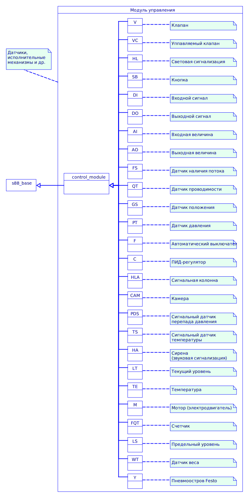

# Содержание

#### Проект

+ [Правила именования проекта](#1-Правила-именования-проекта)

#### Описание надстройки и ее использование
+ [Описание надстройки](#21-Описание-надстройки)
+ [Подключение к Eplan](#22-Подключение-к-Eplan)
+ [Описание автоматически генерируемых Lua-файлов](#23-Описание-автоматически-генерируемых-Lua-файлов)
+ [Настройка каталога проектов](#24-Настройка-каталога-проектов)
+ [Версия надстройки](#25-Версия-надстройки)
+ [Статистика](#26-Статистика)
    + [Оценочная сложность проекта](#261-Оценочная-сложность-проекта)
    + [Модуль простоя надстройки](#262-Модуль-простоя-надстройки)

#### Настройки проекта
+ [Настройка диапазона IP-адресов проекта](#31-Настройка-диапазона-IP-адресов-проекта)
+ [Настройка тестирования проекта](#32-Настройка-тестирования-проекта)
+ [Импортирование старых проектов](#33-импортирование-старых-проектов)
    + [Как получить описание старого проекта](#331-как-получить-описание-старого-проекта)
    + [Как настроить правильную работу импорта проектов](#332-как-настроить-правильную-работу-импорта-проектов)
    + [Как импортировать описание старого проекта](#333-как-импортировать-описание-старого-проекта) 
#### Оборудование IO
+ [Настройка узлов и модулей ввода-вывода](#41-Настройка-узлов-и-модулей-ввода-вывода)
+ [Привязка устройств к модулям IO](#42-Привязка-устройств-к-модулям-IO)
    + [Привязка пневмоострова Festo (VTUG)](#421-Привязка-пневмоострова-Festo-VTUG)
    + [Правила написания комментариев к привязке](#422-Правила-написания-комментариев-к-привязке)
+ [Поддерживаемые модули ввода-вывода](#43-Поддерживаемые-модули-ввода-вывода)

#### Операции Eplan
+ [Объекты технологической схемы](#5-Объекты-технологической-схемы)
    + [Операции объектов](#51-Операции-объектов)
    + [Схемы](#52-Схемы)

#### Устройства технологической схемы
+ [Нумерация устройств](#61-Нумерация-устройств)
    + [Технологический объект](#611-Технологический-объект)
    + [Пользовательский объект](#612-Пользовательский-объект)
    + [Устройство](#613-Устройство)
+ [Перечень устройств](#62-Перечень-устройств)
    + [HA. Аварийная звуковая сигнализация. Сирена](#621-HA-Аварийная-звуковая-сигнализация-Сирена)
    + [FQT. Счетчик](#622-FQT-Счетчик)
    + [HL. Световая сигнализация](#623-HL-Световая-сигнализация)
    + [LT. Текущий уровень](#624-LT-Текущий-уровень)
    + [GS. Датчик положения](#625-GS-Датчик-положения)
    + [M. Мотор (электродвигатель)](#626-M-Мотор-Электродвигатель)
    + [FS. Датчик наличия потока](#627-FS-Датчик-наличия-потока)
    + [LS. Предельный уровень](#628-LS-Предельный-уровень)
    + [QT. Датчик проводимости](#629-QT-Датчик-проводимости)
    + [TE. Температура](#6210-TE-Температура)
    + [SB. Кнопка](#6211-SB-Кнопка)
    + [V. Клапан](#6212-V-Клапан)
    + [VC. Управляемый клапан](#6213-VC-Управляемый-клапан)
    + [DO. Управляющий (выходной) сигнал](#6214-DO-Управляющий-выходной-сигнал)
    + [DI. Входной сигнал](#6215-DI-Входной-сигнал)
    + [AO. Выходная величина](#6216-AO-Выходная-величина)
    + [AI. Входная величина](#6217-AI-Входная-величина)
    + [WT. Датчик веса](#6218-WT-Датчик-веса)
    + [PT. Датчик давления](#6219-PT-Датчик-давления)
    + [Y (DEV_VTUG). Пневмоостров Festo](#6220-Y-DEV_VTUG-Пневмоостров-Festo)
    + [F. Автоматический выключатель](#6221-F-Автоматический-выключатель)
    + [С. Регулятор](#6222-ПИД-регулятор)
    + [HLA. Сигнальная колонна](#6223-HLA-Сигнальная-колонна)
    + [CAM. Камера](#6224-CAM-Камера)
    + [PDS. Сигнальный датчик разницы давления](#6225-pds-сигнальный-датчик-разницы-давления)
    + [TS. Сигнальный датчик температуры](#6226-ts-сигнальный-датчик-температуры)
    + [G. Блок питания с автоматическим выключателем](#6227-G-Блок-питания-с-автоматическим-выключателем)
+ [Дополнительные параметры](#63-Дополнительные-параметры)
    + [Описание устройства](#631-Описание-устройства)
    + [Назначение дополнительных полей](#632-Назначение-дополнительных-полей)
+ [Изделия устройств](#64-Изделия-устройств)
+ [Работа с ПИД-регулятором](#65-Работа-с-ПИД-регулятором)

#### Редактирование технологических объектов
+ [Общие сведения о технологических объектах](#7-Общие-сведения-о-технологических-объектах)
+ [Описание окна редактора](#71-Описание-окна-редактора)
    + [Неопознанные объекты при загрузке описания проекта](#711-Неопознанные-объекты-при-загрузке-описания-проекта)
    + [Создание объектов](#712-Создание-объектов)
    + [Копирование, вставка и замена объекта](#713-Копирование-вставка-и-замена-объекта)
    + [Удаление объекта](#714-Удаление-объекта)
    + [Перемещение объектов вверх и вниз](#715-Перемещение-объектов-вверх-и-вниз)
    + [Добавление устройств в операции в текстовом виде](#716-Добавление-устройств-в-операции-в-текстовом-виде)
    + [Добавление устройств в операции в графическом виде](#717-Добавление-устройств-в-операции-в-графическом-виде)
    + [Добавление устройств в операции в табличном режиме](#718-Добавление-устройств-в-операции-в-табличном-режиме)
    + [Сохранение результатов редактирования](#719-Сохранение-результатов-редактирования)
    + [Использование параметров в объекте](#7110-Использование-параметров-в-объекте)
    + [Модификация названий устройств](#7111-модификация-названий-устройств)
+ [Описание действий](#72-Описание-действий)
+ [Использование функциональности базового объекта и базовой операции](#73-Использование-функциональности-базового-объекта-и-базовой-операции)
    + [Привязка базовых объектов друг к другу](#731-Привязка-базовых-объектов-друг-к-другу)
    + [Использование базовой операции](#732-Использование-базовой-операции)
    + [Использование базового шага](#733-Использование-базового-шага)
    + [Использование оборудования базового объекта](#734-Использование-оборудования-базового-объекта)
    + [Использование дополнительных свойств объекта](#735-Использование-дополнительных-свойств-объекта)
    + [Использование системных параметров в базовом объекте](#736-Использование-системных-параметров-в-базовом-объекте)
    + [Список базовых объектов, операций, параметров, шагов и оборудования](#737-Список-базовых-объектов-операций-параметров-шагов-и-оборудования)
    + [Рекомендации по использованию ОУ (обозначений устройств) в объектах](#738-Рекомендации-по-использованию-ОУ-обозначений-устройств-в-объектах)
+ [Экспорт объектов из редактора и обратный импорт](#74-Экспорт-объектов-из-редактора-и-обратный-импорт)
    + [Экспорт объектов](#741-Экспорт-объектов)
    + [Импорт объектов](#742-Импорт-объектов)
+ [Автоматическая вставка объектов из макросов](#75-Автоматическая-вставка-объектов-из-макросов)
+ [Сброс базового объекта в редакторе](#76-Сброс-базового-объекта)
+ [Использование групп с типовым объектом](#77-использование-групп-с-типовым-объектом)
    + [Добавление тех. объектов в типовой объект](#771-создание-группы-с-типовым-объектом-и-добавление-тех-объектов-в-группу)
    + [Действия](#772-действия)
    + [Параметры](#773-параметры)
    + [Привязанные агрегаты](#774-привязанные-агрегаты)

#### Установка ограничений
+ [Установка ограничений в табличном виде](#8-Установка-ограничений)

#### Синхронизация и экспорт
+ [Синхронизация названий устройств и модулей](#91-Синхронизация-названий-устройств-и-модулей)
+ [Экспорт XML для EasyServer](#92-Экспорт-XML-для-EasyServer)
    + [Экспортируемые параметры](#921-Экспортируемые-параметры)
+ [Экспорт технологических устройств в Excel](#93-Экспорт-технологических-устройств-в-Excel)
    + [Экспорт информации в Excel для работы в SCADA](#931-Экспорт-информации-для-SCADA-из-проекта)

#### Объектная модель по ISA
+ [Объектная модель технологических объектов](#101-Объектная-модель-рецептурного-производства)

#### Система помощи OSTIS
+ [Использование OSTIS как системы помощи](#11-Система-помощи-OSTIS)

#### Межпроектный обмена сигналами ####
+ [Настройка межпроектного обмена сигналами](#12-Межпроектный-обмен-сигналами)

#### Работа с описанием базовых объектов ####
+ [Настройка и программирование описания базовых объектов](#13-Настройка-и-программирование-описания-базовых-объектов)

### IOL-Conf
+ [Автоматическая генерация описания для IOL-Conf](#14-Автоматическая-генерация-описания-для-IOL-Conf)
    + [Генерация шаблонов устройств и модуля ввода-вывода](#141-Генерация-шаблонов-устройств-и-модуля-ввода-вывода)
    + [Настройка параметров устройств](#142-Настройка-параметров-устройств)
    + [Возможные сообщения окна логов, и пути их решения](#143-Возможные-сообщения-окна-логов-и-пути-их-решения)

## 1 Правила именования проекта ##

Имя проекта является важной частью любого проекта. Оно используется в автоматически генерируемых .lua файлах (*PAC_name*), а так же в других функциях надстройки. Имя проекта берется из названия файла-ярлыка проекта (_предоставляется API Eplan_). 

Имя проекта логически состоит из двух частей: имя площадки, имя проекта.

Правила именования:
- Имя не должно содержать кавычек, скобочек и прочих спецсимволов (_за исключением знака **минус**_);
- Имя площадки задается символами латинского алфавита с возможностью номерного обозначения площадки;
- Имя проекта задается символами кириллического алфавита с возможностью номерного обозначения;
- Знаки пробела, используемые в имени проекта, должны быть заменены на знак минус.

## 2 Описание надстройки и ее использование ##

### 2.1 Описание надстройки ###
<p align="justify">Надстройка EasyEPlanner разработана как Add-In к EPLAN, на данный момент используется EPLAN 2.9. Надстройка используется при разработке проектов в EPLAN и позволяет автоматизировать работу
инженера по автоматизации, а так же инженера-программиста, который описывает проект на языке программирования LUA. С помощью EasyEPlanner описываются технологические объекты (Танк, Бойлер и др.), операции этих объектов, шаги операций, устанавливаются ограничения для операций, а так же множество других свойств технологического объекта. В конечном итоге EasyEPlanner генерирует LUA файлы, которые загружаются в контроллер.</p>

Надстройка содержит следующие пункты меню:

1. Экспорт XML для EasyServer.
2. Экспорт технологических устройств в Excel.
3. Редактировать технологические объекты.
4. Устройства, параметры объектов.
5. Операции, ограничения и привязка объектов.
6. Синхронизация названий устройств и модулей.
7. Генерация описания IOL-Conf.
8. О дополнении.

Описание каждого из пунктов Вы найдете при прочтении данной документации.

### 2.2 Подключение к Eplan ##
<p align="justify">Для того, чтобы использовать EasyEPlanner, можно перекомпилировать библиотеку либо скачать последнюю Release версию проекта. Для подписывания надстройки используйте свой Eplan сервер подписей. Далее, необходимо запустить EPLAN и в меню перейти в <b>Сервисные программы -> API-Addins</b>. В появившемся окне необходимо нажать кнопку "</b>Загрузить</b>", откроется диалоговое окно, в котором необходимо перейти в папку с надстройкой и выбрать файл "<b>EPLAN.EplAddin.EasyEPlanner.dll</b>", а после нажать кнопку "<b>Открыть</b>". Надстройка загрузится, и появится пункт меню "<b>EPlaner</b>".</p>
<p align="justify"><b>ВАЖНО</b>: Периодически обновляйте папку с надстройкой через SVN, а так же не удаляйте файлы из папки, иначе работа надстройки не гарантируется!</p>

### 2.3 Описание автоматически генерируемых Lua-файлов ### 
Дополнение EasyEPLANner автоматически генерирует некоторые файлы управляющей программы контроллера. Данные файлы находятся в следующем каталоге с проектами (задается в configuration.ini).

Список файлов, описывающих проект:

- __*main.plua*__ - описание управляющей программы. При отсутствии данного файла, он генерируется автоматически с шаблонами необходимых функций. Если данный файл уже существует, то тогда он остаётся прежним;
- __*main.io.lua*__ - описание привязки устройств к модулям I/O. В данном файле вначале идет список удаленных узлов (BC - bus couplers) с указанием их параметров (IP-адрес, тип и т.п.) и наполнения - модулей ввода/вывода (I/O modules). Далее идет список технологических устройств (S88 term - control modules) с указанием каналов ввода\вывода, которые с ними связаны. Внутри каналов описывается к какому BC они привязаны, к каким портам подключены и смещения адресного пространства. Помимо каналов внутри технологических устройств могут быть его различные параметры;
- __*main.modbus_srv.lua*__ - описание взаимодействия с modbus-клиентами;
- __*main.objects.lua*__ - описание объектов проекта. Описание из редактора технологических объектов. Сначала описываются технологические объекты (_Танк, Бойлер и др._). Внутри этих объектов могут описываться различные параметры, таймеры, указываться свойства этого объекта, а так же список операций с шагами и действиями;
- __*main.profibus.lua*__ - описание profibus шины;
- __*main.restrictions.lua*__ - описание ограничений, которые устанавливаются для технологических объектов через редактор технологических объектов. Устанавливаются в числовом виде, поэтому лучше просматривать их через редактор в EPLAN;
- __*main.rm_PACs.lua*__ - описание взаимодействия с удаленными PAC. Находится в бета-версии.
- __*prg.lua*__ - описание базовой функциональности объектов. В текущей реализации в файле сначала описываются переменные, к которым присваиваются те или иные объекты, после идет добавление базовой функциональности, в перспективе будет добавлена так же базовая инициализация объектов. Файл генерируется так же на основе данных редактора технологических устройств.

### 2.4 Настройка каталога проектов ##

Дополнение позволяет настраивать каталог для записи и считывания __lua__ файлов проектов. Для этих целей в каталоге с дополнением есть файл __configuration.ini__. Если пути не указаны, будет выведена ошибка.

В файле напротив ключа __folder_path__ в кавычках указывается путь к каталогу проектов. Например: _folder_path="**C:\Folder1\folder2**"_.

Также есть возможность указания в файле configuration.ini нескольких путей к проектам. Если заданы пути, но ни один из них не существует - описание будет сохранено по первому найденному пути. Если задано и существует несколько путей, будет сохранено по первому существующему пути. Разделитель для путей - "**;**" (_точка с запятой_).

Например: _folder_path="**C:\Folder1\folder2**;**D:\Folder3\folder4**"_.

### 2.5 Версия надстройки ###

В меню EasyEplanner есть пункт - _О дополнении_. С помощью этого пункта можно узнать текущую версию надстройки, которая подключена к Вашему Eplan. Нажав этот пункт меню будет показано диалоговое окно, в котором будет обозначена версия надстройки.

Версия генерируется по следующему шаблону - `Год.Месяц.Сборка.Ревизия`.

**Сборка** - число дней, начиная с __1__ января __2000__ года.
**Ревизия** - число секунд от полуночи, независимо от часового пояса.

### 2.6 Статистика ###

#### 2.6.1 Оценочная сложность проекта ####
В надстройке осуществляется генерация статистики относительно сложности проекта (по заранее заданным значениям). В частности, измеряется количество строк кода в файле `main.plua` (_предельное значение для статистики - 1000 строк кода_), измеряется количество аппаратов в проекте (_предельное значение - 10 штук_), агрегатов (_50 штук_), количество тэгов (_5000 штук_) и количество устройств (_1000 штук_). На основе этих значений генерируются SVG-картинки, которые могут говорить о сложности проекта. Картинки будут находиться в папке с описанием проекта (_docs/statistics_).

Файлы:
* agregates_total.svg - количество агрегатов проекта.
* lines_total.svg - количество строк кода в файле `main.plua`.
* tags_total.svg - количество тэгов в проекте.
* units_total.svg - количество аппаратов в проекте.
* devices_total.svg - количество устройств в проекте.
* io_link_usage.svg - количество используемых IO-Link модулей ввода-вывода в процентном отношении к общему количеству модулей ввода-вывода.
* io_couplers_total.svg - количество узлов ввода-вывода.
* io_modules_total.svg - общее количество используемых модулей вовда-вывода.

#### 2.6.2 Модуль простоя надстройки ####

В надстройке осуществляется мониторинг активности. Если в течении одного часа у пользователя не было активности в Windows (_заблокировал компьютер, ушел домой и др._), то надстройка автоматически произведет сохранение проекта, его закрытие и завершит работу Eplan, тем самым, освобождая плавающую лицензию (_если используется такой тип лицензирования)_.

## 3 Настройка проекта ##
### 3.1 Настройка диапазона IP-адресов проекта ###

Помимо корректного имени, в проекте необходимо задать диапазоны IP-адресов, которые были заложены для этого проекта. Эти диапазоны задаются в свойствах проекта, в поле "_Пользователь, доп. поле[1]_".

Диапозон IP-адресов задается через дефис (**-**), а несколько диапозонов через запятую. Пример:
__"10.0.16.230 - 10.0.16.240, 10.0.16.250-10.0.16.260"__.
Данная запись задает 2 диапозона IP-адресов.

По заданным диапазонам проверяются все устройства, содержащие IP-адрес, на корректное заполнение.

Пример корректного IP-адреса: "_192.168.1.0_". IP-адрес задается без кавычек и разделяется точками.

### 3.2 Настройка тестирования проекта ###

Надстройка позволяет тестировать проект на работоспособность. Тесты написаны не на весь функционал, проект тестируется частично.

В данный момент, чтобы включить тестирование, необходимо в файле конфигурации **configuration.ini** указать в секции **TestSettings** параметр **ProjectsTestEnabled** в **True**. Если этого параметра в секции нет, то будет использовано стандартное значение - **False**.

Пример:
```
[TestSettings]
ProjectTestEnabled=True
```

Если переключить этот параметр в **False**, то тестирование не будет включаться.

Тестирование автоматически запускается каждый раз, когда происходит обновление файлов проекта. Например, при ручном обновлении файлов проекта. Результат работы скрипта выводится в общее окно логов. В зависимости от результатов его работы, могут быть разные сообщения:

1. **Тестирование проекта прошло успешно.** - Это сообщение означает, что текущие тесты проведены успешно, но это не гарантирует 100% работоспособности проекта, так как тесты не покрывают все случаи.
2. **В системе не найден LUA, тестирование проекта невозможно.** - Это сообщение говорит о том, что в системе не найден LUA, его надо установить.
3. **Тестирование проекта завершилось с ошибками. Проект не работоспособен.** - Это сообщение говорит о том, что тесты завершились с ошибкой. После этого сообщения обычно выводятся логи проведенных тестов, где видно, какие ошибки привели к его некорректной работе.

Если после завершения тестирования появилась ошибка (**Не найден канал xxxx (например, AODOAIDI)**), нужно предпринять следующие действия:

1. **Заходим в пункт меню EPlaner и заново генерируем описание IOL-Conf.**
2. **В этом же пункте меню выбираем "Синхронизация названий устройств и модулей".**

Для корректного запуска тестов, тестовый скрипт должен быть обновлен до последней версии. Система пытается найти тестовый скрипт в директории `..\..\spec\main.lua`, относительно папки с файлами проекта. Также, помимо настроенного каталога с проектами, нужно чтобы скрипты управляющей программы тоже были настроены. Это каталог `..\..\sys-scripts` относительно папки с файлами проекта, также `..\..\editor` относительно папки с файлами проекта. Аргументы командной строки хранятся в папке `CMD` этого проекта.

### 3.3 Импортирование старых проектов ###

#### 3.3.1 Как получить описание старого проекта ####

Для импортирования проекта понадобится файл `main.wago.plua`. Чтобы получить данный файл, необходимо приложением `wprg4` открыть нужный проект с расширением `.ds4`, после чего экспортировать его: `Устройства` -> `Экспорт для WAGO 750-860` - как показано на рисунке ниже. После чего в папке с проектом появится нужный файл (`Внимание`: файл с описанием при экспорте заменяет старый файл описания другого проекта).

<p align="center"></p>

<p align="center"><b>Рисунок</b> - <i>Экспорт проекта для WAGO</i></p>

#### 3.3.2 Как настроить правильную работу импорта проектов ####

Для корректной работы импорта описания старых проектов необходимо в файле конфигурации (`configuration.ini`) указать путь к EPLAN макросам модулей ввода-вывода, если такой настройки еще не установлено: необходимо в секции `[path]` добавить переменную `wago_macros_path = "ДИСК:\путь\к\папке\с\макросами"`.

Сама папка с макросами должна быть структурирована в соответствие с последними изменениями в этой папке, а именно:
они должны быть разбиты по папкам соответствующим своим группам и именоваться по следующему формату `750-x00` (**x** - номер группы). Макрос выбирается по названию `WAGO.750-xyy.ema` (**xyy** - номер модуля).

Если у макроса есть какая-то модификация(вариация) типа `WAGO.750-xyy_025-000.ema`, то такой макрос выбран не будет, требуется строгое название макроса, который будет использоваться.

#### 3.3.3 Как импортировать описание старого проекта ####

Для импортирования описания старого проекта необходимо в меню выбрать следующую функцию: `EPlaner` -> `Импорт ICP-CON проекта`.
В открывшемся окне проводника необходимо выбрать файл проекта `main.wago.plua`. После этого начнется импорт старого проекта.

Примечания по импорту проекта: 
 - В старых проектах использовались 4 типа узла:
     + 750-315 - RS-485
     + 750-815 - RS-485 (Programmable)
     + 750-341 - Ethernet coupler 
     + 750-841 - Ethernet (Programmable)
   
    Так как в текущих проектах нет описания первых двух узлов RS-485, то они заменяются на соответствующие Ethernet узлы
 
 - Страницы в EPLAN генерируются с названиями по-умолчанию в соответствии с рисунком ниже:

    <p align="center"></p>

    <p align="center"><b>Рисунок</b> - <i>Структура импортированного проекта</i></p>

 - Устройства ввода-вывода импортируются с разделением по объектам в местах установки (EPLAN) по аналогии с модулями. Места установки не всегда правильно расшифровываются, и под каждым устройством указан комментарий из ICP-CON, по нему можно сверять корректность.

 - После импорта устройств и модулей, настраивается привязка их привязка.

 - В логах указываются некоторые ошибки при импортировании проекта.


## 4 Оборудование IO ##

**ВАЖНО:** Все устройства (устройства, узлы ввода-вывода и др.), добавляемые в проект должны быть расположены на ФСА (функциональная схема автоматизации) для того, что бы надстройка их считывала. Если устройства на ФСА нет, то оно не будет прочитано! Дополнительные поля устройств заполняются также на ФСА. Также __важно__, чтобы в устройстве на ФСА был включен флажок - "Главная функция", а в его макросах на других схемах - отключена.

<p align="justify"><b>Контроль адресного пространства узла.</b> Узлы имеют ограниченное адресное пространство и максимальное количество подключаемых модулей: для <i>WAGO</i> - <b>64 модуля и 2 кБ</b>, <i>Phoenix Contact</i> - <b>63 модуля и 1482 байта</b>. При добавлении в узел модуля, превосходящего максимальное количество подключаемых модулей или адресное пространство, появляется соответствующая ошибка и модуль не сохраняется в описании (<i>Для WAGO ограничение по адресному пространству пока отсутствует</i>).</p>

### 4.1 Настройка узлов и модулей ввода-вывода

<p align="justify">Именование узлов осуществляется в следующем виде: буква A и номер, кратный 100. Пример: "A100", "A200". В проекте узлы должны идти последовательно от "A100" (<em>для WAGO - старые проекты</em>), а для новых типов проекта (<em>Phoenix Contact</em>) необходимо учитывать, что узловой контроллер (<em>на котором находится управляющая программа</em>) именуется как "A1".</p>

У узлов также можно задавать параметры:

1. Доп. поле[1] - признак пропуска устройства (если в поле написано значение - 1, то устройство игнорируется);
2. Начальный адрес карты ПЛК (_в окне "Блок ПЛК"_) - указывается IP-адрес устройства.

Информация о модулях ввода-вывода получается на основе описания модуля (_сведения об изделии_). В проекте должно быть главное изделие для модуля (_узел_).

### 4.2 Привязка устройств к модулям IO ###

<p align="justify">Для связывания клеммы модуля ввода-вывода и устройства необходимо, чтобы функциональный текст (клеммы) соответствовал названию канала устройства. Для упрощения данной процедуры реализовано окно со списком устройств и каналов.</p>


<p align="center"></p>

<p align="center"><b>Рисунок</b> - <i>Окно "Устройства"</i></p>

<p align="justify">Вызов данного окна осуществляется через пункт меню <b>"EPlaner" -> "Устройства"</b></p>

<p align="center"></p>

<p align="center"><b>Рисунок</b> - <i>Путь к окну "Устройства"</i></p>

<p align="justify">Для привязки клеммы необходимо при активном функциональном тексте клеммы <b>дважды</b> нажать (<i>double click</i>) на требуемый канал в окне устройств (<i>пример, выделено зеленым</i>).</p>

**Примечание**: для клапанов с AS-интерфейсом и IO-Link Mixproof клапана привязывается только 1 из 2 каналов (_AI или AO_).

<p align="center"></p>

<p align="center"><b>Рисунок</b> - <i>Пример привязки к модулю ввода-вывода</i></p>

<p align="justify">После двойного клика соответствующий текст автоматически занесется в функциональный текст. При необходимости привязки более одного устройства к одной и той же клемме необходимо <b>зажать</b> при этом клавишу <b>Ctrl</b> (<i>к тексту допишется данное устройство</i>). Для размещения названия устройства на новой строке необходимо пользоваться символом новой строки (¶), необходимо вставить символ между строками (<i>например, скопировав его предварительно из Word</i>).</p>

При привязке действуют следующие ограничения:
* К модулю AI привязывается AI сигнал;
* К модулю AO привязывается AO сигнал;
* К модулю DI привязывается DI сигнал;
* К модулю DO привязывается DO сигнал;
* К модулю IO-Link от Wago привязываются AO, AI сигналы;
* К модулю IO-Link от Phoenix Contact привязываются AO, AI, DO, DI сигналы;
* К модулю DO/DI от Phoenix Contact привязываются DO и DI сигналы;

**Примечание**: 
1. Для IO-Link модуля Phoenix Contact дополнительно, после комментария к сигналу, (прим., _Пуск_, как на рисунке ниже) через символ новой строки указывается тип канала. Тип канала указывается не всегда, только если устройство имеет более двух каналов для привязки. Тип канала указывается **ТОЛЬКО** для DI или DO канала. Тип каналов может быть: 
    * DI (для каналов DI); 
    * DO (для каналов DO).
2. Если устройство по какой-то причине не привязывается, пожалуйста, проверьте все клеммы  устройства ввода-вывода, к которому вы хотите привязаться. Клеммы не должны иметь галочек "_Главная функция_".
3. Если случайно выбрана не сигнальная клемма (например, питание), то привязки устройства по двойному щелчку не произойдёт. Если же функциональный текст клеммы был заполнен вручную, то надстройка отобразит соответствующую ошибку.

<p align="center"></p>

<p align="center"><b>Рисунок</b> - <i>Пример функционального текста для модуля Phoenix Contact IO-Link</i></p>

<p align="center"></p>

<p align="center"><b>Рисунок</b> - <i>Пример функционального текста</i></p>

<p align="center"></p>

<p align="center"><b>Рисунок</b> - <i>Отображение введенного функционального текста</i></p>

### 4.2.1 Привязка пневмоострова Festo (VTUG) ###

Пневмоостров Festo (_DEV_VTUG - старые проекты, Y - новые_) поддерживает обычную привязку к своим клеммам, а так же множественную привязку. Важно, чтобы привязка осуществилась - это наличие привязки самого пневмоострова к клемме модуля ПЛК.

На электрической схеме указывается, к какой клемме ПЛК привязан пневмоостров, а на схеме обзора пневмоострова (_или электрической схеме, в зависимости от расположения_) происходит привязка клапанов к клеммам пневмоострова. __Важно__: использовать способы раздельно для каждого из устройств.

**Примечание:**
* Только тип пневмоострова Y привязывается описываемым способом. Для старых типов DEV_VTUG необходимо использовать обычный способ привязки (старый тип устарел, но используется в старых проектах). Поддерживается "переходное состояние", когда DEV_VTUG заменен на Y, но используется старый тип привязки. При использовании старого типа привязки с новым типом пневмоострова не гарантируется работа функции - _Синхронизация названий устройств и модулей_.
* Пневмоостров, который расположен на ФСА и на схеме обзора, должен иметь галочку "Главная функция".

<p align="center"></p>

<p align="center"><b>Рисунок</b> - <i>Привязка пневмоострова на электрической схеме</i></p>

На первой части рисунка - пневмоостров без клемм и его привязка к модулю ввода-вывода. На втором рисунке - привязка к клеммам в прямоугольном макросе пневмоострова на схеме "Пневмоостров.Обзор".

<p align="center"></p>

<p align="center"><b>Рисунок</b> - <i>Привязка пневмоострова на схеме обзора</i></p>

Помимо всего описанного выше, необходимо указать тип используемого пневмоострова. Для этого схематически располагаем пневмоостров на ФСА и прописываем в доп. поле 2 тип используемой версии (см. пункт 5.2.3). Не забываем про флажок "Главная функция".

<p align="center"></p>

<p align="center"><b>Рисунок</b> - <i>Указание типа используемой версии пневмоострова</i></p>

### 4.2.2 Правила написания комментариев к привязке ###

При множественной привязке, в функциональный текст будет заноситься лишь обозначение устройств (_ОУ_) друг за другом (_прим., "+V1 +V2 +V3"_), причем можно задавать её как в строку (_задается изначально_), так и в столбец (_необходимо расставить символы переноса строки между ОУ_). Разделитель при множественной привязке - символ переноса на новую строку.

При одинарной привязке в функциональный текст заносится так же комментарий. 

Для установки комментария необходимо учитывать следующие правила:

+ Комментарий должен начинаться с заглавной буквы;
+ Комментарий не должен содержать в себе ОУ (прим, +V3);
+ Комментарий может содержать буквы латинского и кириллического алфавита в любом регистре (_верхний, нижний_), а также буквенно-цифровые обозначения (_прим., CR2, B4 и др._);
+ Комментарий не должен содержать спецсимволы, скобочки, и др. (_за исключением символа - **№**_).

Пример корректного комментария: **"Подача в объект OBJECT2"**.

### 4.3 Поддерживаемые модули ввода-вывода ###
В этом разделе находится список модулей ввода-вывода, которые поддерживаются надстройкой. Данные хранятся в файле **sys_io_modules.lua**, если этот файл удалить, то будет создан файл со стандартным шаблоном описания, который надо будет заполнить. В файле находится подсказка по заполнению данных, которая облегчает внесение изменений. Файл находится в папке Lua.

| Производитель   | Название (Номер)                 | Тип         | Примечание                                     |
| --------------- | -------------------------------- | ----------- | ---------------------------------------------- |
| WAGO            | 750-450                          | AI          | 4 канала RTD                                   |
| WAGO            | 750-461                          | AI          | 2 канала RTD                                   |
| WAGO            | 750-466                          | AI          | 2 канала RTD                                   |
| WAGO            | 750-491                          | AI          | 1 канал resistance measuring bridge            |
| WAGO            | 750-496                          | AI          | 8 каналов                                      |
| WAGO            | 750-638                          | AI          | Счетчик                                        |
| WAGO            | 750-554                          | AO          | 2 канала                                       |
| WAGO            | 750-555                          | AO          | 4 канала                                       |
| WAGO            | 750-655                          | AI/AO       | AS-интерфейс                                   |
| WAGO            | 750-657                          | AI/AO       | IO-Link                                        |
| WAGO            | 750-402                          | DI          | 4 канала                                       |
| WAGO            | 750-430                          | DI          | 8 каналов                                      |
| WAGO            | 750-1405                         | DI          | 16 каналов                                     |
| WAGO            | 750-1415                         | DI          | 8 каналов                                      |
| WAGO            | 750-1420                         | DI          | 4 канала                                       |
| WAGO            | 750-504                          | DO          | 4 канала                                       |
| WAGO            | 750-512                          | DO          | 2 канала relay module                          |
| WAGO            | 750-530                          | DO          | 8 каналов                                      |
| WAGO            | 750-1504                         | DO          | 16 каналов                                     |
| WAGO            | 750-1515                         | DO          | 8 каналов                                      |
| WAGO            | 750-600                          | -           | Конечный модуль                                |
| WAGO            | 750-602                          | -           | Питание                                        |
| WAGO            | 750-612                          | -           | Питание                                        |
| WAGO            | 750-627                          | -           | Расширение шины                                |
| WAGO            | 750-628                          | -           | Расширение шины                                |
| Phoenix Contact | AXL F CNT2 INC2 1F (2688093)     | AI          | 4 канала, счетчик                              |
| Phoenix Contact | AXL F AI4 I 1H (2688491)         | AI          | 4 канала                                       |
| Phoenix Contact | AXL F RTD4 1H (2688556)          | AI          | 4 канала RTD                                   |
| Phoenix Contact | AXL F AO4 1H (2688527)           | AO          | 4 канала                                       |
| Phoenix Contact | AXL F IOL8 2H (1027843)          | AI/AO/DI/DO | IO-Link с привязкой DI/DO, 8 каналов           |
| Phoenix Contact | AXL F DI16/4 2F (2688022)        | DI          | 16 каналов                                     |
| Phoenix Contact | AXL F DO16/3 2F (2688048)        | DO          | 16 каналов                                     |
| Phoenix Contact | AXL F DI8/3 DO8/3 2H (2702071)   | DI/DO       | 8 каналов DI и 8 каналов DO                    |
| Phoenix Contact | AXL F DI8/1 DO8/1 1H (2701916)   | DI/DO       | 8 каналов DI и 8 каналов DO                    |
| Phoenix Contact | AXL F AI2 AO2 1H 0-10V (2702072) | AI/AO       | 2 канала AI и 2 канала DI                      |
| Phoenix Contact | AXL F RS UNI 1H (2688666)        | AI/AO       | Коммуникационный модуль RS-232, RS-485, RS-422 |
| Phoenix Contact | AXL F AI8 1F (2688064)           | AI          | 8 каналов                                      |
| Phoenix Contact | AXL F SGI2 1H (2702911)          | AI          | Измерительный модуль тензодатчика              |
| Phoenix Contact | AXL SE AI4 I 4-20 (1088062)      | AI          | 4 канала                                       |
| Phoenix Contact | AXL SE AI4 U 0-10 (1088126)      | AI          | 4 канала                                       |
| Phoenix Contact | AXL SE RTD4 PT100 (1088106)      | AI          | 4 канала RTD                                   |
| Phoenix Contact | AXL SE RTD4 PT1000 (1182190)     | AI          | 4 канала RTD                                   |
| Phoenix Contact | AXL SE CNT1 (1088131)            | AI          | 1 канал, счетчик                               |
| Phoenix Contact | AXL SE AO4 I 4-20 (1088123)      | AO          | 4 канала                                       |
| Phoenix Contact | AXL SE IOL4 (1088132)            | AI/AO/DI/DO | IO-Link с привязкой DI/DO, 4 канала            |
| Phoenix Contact | AXL SE DI16/1 (1088127)          | DI          | 16 каналов                                     |
| Phoenix Contact | AXL SE DO16/1 (1088129)          | DO          | 16 каналов                                     |
| Phoenix Contact | AXL SE SC-A (1088134)            | -           | Заглушка                                       |
| Phoenix Contact | AXL SE PD16 24V (1337223)        | -           | Распределитель потенциала                      |
| Phoenix Contact | AXL SE PD16 GND (1337224)        | -           | Распределитель потенциала                      |

Поддерживаемые контроллеры и каплеры, которые берутся из файла **sys_io_nodes.lua**. Он работает аналогично **sys_io_modules.lua**:
| Производитель   | Название (Номер)  |
| --------------- | ----------------- |
| WAGO            | 750-863           |
| WAGO            | 750-341           |
| WAGO            | 750-841           |
| WAGO            | 750-352           |
| WAGO            | 750-362           |
| WAGO            | 750-8202          |
| WAGO            | 750-8203          |
| WAGO            | 750-8204          |
| WAGO            | 750-8206          |
| Phoenix Contact | AXL F BK ETH      |
| Phoenix Contact | AXL F BK ETH NET2 |
| Phoenix Contact | AXC F 1152        |
| Phoenix Contact | AXC F 2152        |
| Phoenix Contact | AXC F 3152        |

##  5 Объекты технологической схемы ##

<p align="justify">Объектами являются физические танки, линии и т.д. Логически они делятся на аппараты, агрегаты, блоки управления.</p>

### 5.1 Операции объектов ###
<p align="justify">Операции может включать оператор. Во время операции происходит включение\выключение устройств, обработка значений с датчиков и т.д. Операции выделяются, исходя из системного подхода. Они разделяются на <i>основные</i> и <i>вспомогательные</i>. Каждая операция имеет название, характеризуемое единым для всех проектов описанием (<i>т.е. операция “наполнение” одинакова для всех проектов и характеризуется следующими параметрами: объемом наполнения, проводимость смеси, проводимость воды</i>). Операции описываются в графическом виде в редакторе операций Eplaner.</p>

Для операции определяется:
1.	Номера операций, на которые можно перейти после данной операцию (_из схемы операций_).
2.	Значения параметров, необходимых для выполнения операции.

Операции состоят из шагов. Операция может находиться в состоянии __простой__, __выполнение__, __пауза__, __остановка__, __запуск__, __становится в паузу__, __выходит из паузы__, __останавливается__.

<p align="center"></p>

<p align="center"><b>Рисунок</b> - <i>Переход между состояниями операций</i></p>

### 5.2 Схемы ###
<p align="center"></p>

<p align="center"><b>Рисунок</b> - <i>Схема описания операций в Eplan</i></p>

## 6 Устройства технологической схемы

### 6.1 Нумерация устройств ###
Для идентификации используются заглавные латинские символы, символ подчеркивания, спецсимволы  (<b>==</b> ,<b>=</b> , <b>+</b>, <b>-</b>) и <b>цифры</b>.

Идентификация объектов осуществляется следующим обозначением:  
<b>==</b> площадка <b>=</b> проект <b>+</b> технологический объект <b>#</b> пользовательский объект <b>-</b> устройство.

#### 6.1.1 Технологический объект ####
Название технологического объекта (_танка, линии…_). Всегда содержит название латиницей и цифровой номер.
Примеры типовых технологических объектов:
* __M2__ –  линия №2;
* __KOAG2__ – коагулятор №2;
* __TCW1__ – бачок с холодной водой №1;
* __THW1__ – бачок с горячей водой №1.

#### 6.1.2 Пользовательский объект ####
Содержит дополнительную информацию.

#### 6.1.3 Устройство ####
<p align="justify">Содержит код устройства и номер (<i><b>V1</b> – клапан №1</i>). Устройство уникально в пределах технологического объекта.</p>

### 6.2 Перечень устройств ###
<p align="justify">Ниже приведено описание используемых технологических устройств. Для каждого устройства также могут задаваться дополнительные поля (<i>смотри раздел <b>5.3</b> "Дополнительные параметры"</i>).</p>

#### 6.2.1 HA. Аварийная звуковая сигнализация. Сирена ####
Обозначение: __HA__.  
Каналы ввода/вывода: __DO__ – _1_.  
Пример: __HA1__. Аварийная звуковая сигнализация. Сирена.

<p align="center"></p>

<p align="center"><b>Рисунок</b> - <i>Пример аварийной звуковой сигнализации, сирены</i></p>

#### 6.2.2 FQT. Счетчик ####
Обозначение: **FQT**.  
Подтип: **FQT**.  
Каналы ввода/вывода: **AI** – _1_.  
Название каналов: __AI1__ – _объем_.

Обозначение: **FQT**.  
Подтип: **FQT_F**.  
Каналы ввода/вывода: **AI** – _2_.  
Название каналов: __AI1__ – _поток_, __AI2__ – _объем_.

Обозначение: **FQT**.  
Подтип: **FQT_F_IOLINK**.  
Каналы ввода/вывода: **AI** – _1_.

Пример: __+OBJ1-FQT1__. Объект 1. Объем.  

#### 6.2.3 HL. Световая сигнализация ####
Обозначение: __HL__.  
Каналы ввода/вывода: __DO__ – _1_.  
Пример: __HL1__. Аварийная сигнализация. Зеленый.

#### 6.2.4 LT. Текущий уровень ####
Обозначение: __LT__, **LT_CYL**, **LT_CONE**, **LT_TRUNC**.  
Каналы ввода/вывода: __AI__ – _1_.  
Пример: __+OBJ1-LT1__. Объект №1. Текущий уровень.

Обозначение: **LT_IOLINK**.  
Каналы ввода/вывода: __AI__ – _2_.  
Пример: __+OBJ1-LT1__. Объект №1. Текущий уровень.

#### 6.2.5 GS. Датчик положения ####
Обозначение: **GS**.  
Подтипы: **GS**, **GS_INVERSE**.  
Каналы ввода/вывода: **DI** – *1*.  
Пример: **+OBJ2-GS1**. Объект №2. Датчик люка.

#### 6.2.6 М. Мотор (электродвигатель) ####
Обозначение: **M**.  
Подтип: **M**.  
Каналы ввода/вывода: **DO** - *1*, **DI** – *1*.  
Название каналов: **DO1** - *пуск*, **DI1** – *обратная связь*.

Обозначение: **M**.  
Подтип: **M_FREQ**.
Каналы ввода/вывода: **DO** - *1*, **DI** – *1*, **AO** – *1*.  
Название каналов: **DO1** - *пуск*, **DI1** – *обратная связь*, **AO1** – *частота вращения*.

Обозначение: **M**.  
Подтип: **M_REV**.
Каналы ввода/вывода: **DO** – *2*, **DI** – *1*.  
Название каналов: **DO1** - *пуск*, **DO2** – *реверс*, **DI1** – *обратная связь*.

Обозначение: **M**.  
Подтип: **M_REV_FREQ**.
Каналы ввода/вывода: **DO** – *2*, **DI** – *1*, **AO** – *1*.  
Название каналов: **DO1** - *пуск*, **DO2** – *реверс*, **DI1** – *обратная связь*, **AO1** – *частота вращения*.

Обозначение: **M**.  
Подтип: **M_REV_2**.
Каналы ввода/вывода: **DO** – *2*, **DI** – *1*.  
Название каналов: **DO1** - *пуск*, **DO2** – *реверс*,  **DI1** – *обратная связь*.

Обозначение: **M**.  
Подтип: **M_REV_FREQ_2**.
Каналы ввода/вывода: **DO** – *2*, **DI** – *1*, **AO** – *1*.  
Название каналов: **DO1** - *пуск*, **DO2** – *реверс*, **DI1** – *обратная связь*, **AO1** – *частота вращения*.

Обозначение: **M**.  
Подтип: **M_REV_2_ERROR**.
Каналы ввода/вывода: **DO** – *2*, **DI** – *1*.  
Название каналов: **DO1** - *пуск*, **DO2** – *реверс*, **DI1** – *авария*.

Обозначение: **M**.  
Подтип: **M_REV_FREQ_2_ERROR**.
Каналы ввода/вывода: **DO** – *2*, **DI** – *2*, **AO** – *1*.  
Название каналов: **DO1** - *пуск*, **DO2** – *реверс*, **DI1** – *авария*, **DI2** – *обратная связь*, **AO1** – *частота вращения*.

Обозначение: **M**.  
Подтип: **M_ATV**, **M_ATV_LINEAR**.  
Каналы ввода/вывода: управляется через Ethernet.

Пример: **+OBJ1-M1**. Объект 1. Пуск.

#### 6.2.7 FS. Датчик наличия потока ####
Обозначение: **FS**.  
Каналы ввода/вывода: **DI** – *1*.  
Пример: **FS1**. Датчик наличия потока.

#### 6.2.8 LS. Предельный уровень ####
Обозначение: **LS_MIN**, **LS_MAX**.  
Каналы ввода/вывода: **DI** – *1*.  
Дополнительные поля:
* Тип подключения: _max_, _min_.

Обозначение: **LS**.  
Подтип: **IO_LINK_MIN**, **IO_LINK_MAX**
Каналы ввода/вывода: **AI** – *1* (AOAI).  
Дополнительные поля:
* Тип подключения: _max_, _min_.

Пример: **+TANK1-LS2**. Танк №1. Верхний уровень.

#### 6.2.9 QT. Датчик проводимости ####
Обозначение: **QT**.  
Подтип: **QT, QT_IOLINK**.  
Каналы ввода/вывода: **AI** – _1_.

Обозначение: **QT**.  
Подтип: **QT_OK**.  
Каналы ввода/вывода: **AI** – _1_, **DI** - _1_.

Пример: **OBJ1+-QT1**. Объект 1. Датчик проводимости.

#### 6.2.10 TE. Температура ####
Обозначение: **TE**.  
Подтип: **TE**, **TE_IOLINK**, **TE_ANALOG**.  
Каналы ввода/вывода: **AI** – *1*.  
Пример: **+OBJ1-TE1**. Объект №1. Температура.

#### 6.2.11 SB. Кнопка ####
Обозначение: **SB**.  
Каналы ввода/вывода: **DI** – *1*.  
Пример: **+OBJ1-SB1**. Объект №1. В дренаж.

#### 6.2.12 V. Клапан ####
Обозначение: **V**.  
Каналы ввода/вывода:
1. V_DO1: **DO** - _1_;
2. V_DO2: **DO** - _2_;
    - **DO** - _Закрыть_
    - **DO** - _Открыть_
3. V_DO1_DI1_FB_OFF, V_DO1_DI1_FB_ON: **DO** - _1_, **DI** - _1_;
4. V_DO1_DI2: **DO** - _1_, **DI** - _2_;
    - **DI** - _Закрыт_
    - **DI** - _Открыт_
5. V_DO2_DI2, V_DO2_DI2_BISTABLE: **DO** - _2_; **DI** - _2_;
    - **DO** - _Закрыть_
    - **DO** - _Открыть_
    - **DI** - _Закрыт_
    - **DI** - _Открыт_
6. V_MIXPROOF: **DO** - _3_; **DI** - _2_;
    - **DO** - _Открыть_
    - **DO** - _Открыть НС_
    - **DO** - _Открыть ВС_
    - **DI** - _Закрыт_
    - **DI** - _Открыт_
7. V_BOTTOM_MIXPROOF: **DO** - _3_; **DI** - _2_;
    - **DO** - _Открыть_
    - **DO** - _Открыть мини_
    - **DO** - _Открыть НС_
    - **DI** - _Закрыт_
    - **DI** - _Открыт_
8. V_IOLINK_MIXPROOF, V_AS_MIXPROOF, V_AS_DO1_DI2, V_IOLINK_DO1_DI2: **AO** - _1_, **AI** - _1_;
9. V_IOLINK_VTUG_DO1: **AO** - _1_;
10. V_IOLINK_VTUG_DO1_FB_OFF, V_IOLINK_VTUG_DO1_FB_ON: **AO** - _1_, **DI** - _1_.
11. V_IOLINK_VTUG_DO1_DI2: **AO** - _1_, **DI** - _2_.
    - **DI** - _Закрыт_
    - **DI** - _Открыт_
12. V_MINI_FLUSHING: **DO** - _2_; **DI** - _2_;
    - **DO** - _Открыть_
    - **DO** - _Открыть мини_
    - **DI** - _Закрыт_
    - **DI** - _Открыт_
13. V_IOL_TERMINAL_MIXPROOF_DO3: **AO** - _3_;
    - **AO** - _Открыть_
    - **AO** - _Открыть верхнее седло_
    - **AO** - _Открыть нижнее седло_

Пример: **+OBJ1-V7**. Объект №1. Дренаж.

#### 6.2.13 VC. Управляемый клапан ####
Обозначение: **VС**.  
Каналы ввода/вывода: **AO** – *1*.  
Пример: **VC3**. Паровой клапан.

#### 6.2.14 DO. Управляющий (выходной) сигнал ####
Обозначение: **DO**.  
Каналы ввода/вывода: **DO** – *1*.  
Пример: **OBJ2+-DO2**. Объект 2. Готовность объекта

#### 6.2.15 DI. Входной сигнал ####
Обозначение: **DI**.  
Каналы ввода/вывода: **DI** – *1*.  
Пример: **DI10**. Приемник готов.

#### 6.2.16 AO. Выходная величина ####
Обозначение: **AO**.  
Каналы ввода/вывода: **AO** – *1*.  
Пример: **AO1**. Задание производительности.

#### 6.2.17 AI. Входная величина ####
Обозначение: **AI**.  
Каналы ввода/вывода: **AI** – *1*.  
Пример: **AI1**. Ток двигателя.

#### 6.2.18 WT. Датчик веса ####
Обозначение: **WT**.  
Каналы ввода/вывода: **AI** – *2*.  
Пример: **WT1**. Весы танка 1.

Подтип: **WT_RS232**.  
Каналы ввода/вывода: **AI** – *1*, **AO** - *1*.  

Подтип: **WT_ETH**.
Каналы ввода/вывода: отсутствуют.

Подтип: **WT_PXC_AXL**.  
Каналы ввода/вывода: **AI** – *1*, **AO** - *1*.  

#### 6.2.19 PT. Датчик давления ####
Обозначение: **PT**.  
Подтип: **PT**, **PT_IOLINK**,  
Каналы ввода/вывода: **AI** – *1*.  
Пример: **OBJ1+-PT10**. Объект 1.  Датчик давления.

#### 6.2.20 Y (DEV_VTUG). Пневмоостров Festo ####
Обозначение: **Y**, **DEV_VTUG** - старые проекты.  
Каналы ввода/вывода: **AO** – *1*. (AOAI)  
Пример: **OBJ1+CAB1-Y1**. Проект OBJ1, шкаф №1, устройство пневмоостров Festo.

#### 6.2.21 F. Автоматический выключатель ####
Обозначение: **F**.  
Каналы ввода/вывода: **AI** - *1*, **AO** - *1* (AOAI)  
Пример: **OBJ1+CAB1-F1**. Проект OBJ1, шкаф №1, устройство автоматический выключатель.

#### 6.2.22 C. Регулятор ####
Обозначение: Любое обозначение устройства, с символом - **C** на крайней позиции.  
Каналы ввода/вывода: отсутствуют, виртуальное устройство. Только внутренние параметры.</br>
Подтип: **C_PID**(Или пустая строка), **C_THLD**.</br>
Пример: **OBJ1+TANK1-TC1**. Проект OBJ1, Танк №1, ПИД-регулятор температуры танка №1.

#### 6.2.23 HLA. Сигнальная колонна ####
Обозначение: **HLA**.  

Подтип: **HLA** или пустой (_аналог HLA_).  
Каналы ввода/вывода: **DO** - 4 (_красный, желтый, зеленый и сирена_).  

Подтип: **HLA_VIRT**  
Каналы ввода/вывода: 0  

Подтип: **HLA_IOLINK**  
Каналы ввода/вывода:**AI** - *1*, **AO** - *1* (AOAI)  

Пример: **OBJ1+TANK1-HLA1**. Проект OBJ1, танк №1, сигнальная колонна №1.  

В сигнальной колонне используется три лампочки – зеленая, желтая, красная – и сирена.

Мигающий красный цвет – авария, тревога (*неподавленная*). Частота мигания *2* Гц.
Дополнительно включается сирена, которую можно отключить из проекта (_клик по значку_) либо она также отключиться после подтверждения тревог, пропадания аварий.

Мигающий желтый свет – неподтвержденное сообщение. Частота мигания *0.5* Гц.

Зеленый цвет – есть включенные операции (аппарата).

#### 6.2.24 CAM. Камера ####
Обозначение: **CAM**.  
Каналы ввода/вывода:
1. CAM_DO1_DI1 - **DO** - _1_, **DI** - _1_;
2. CAM_DO1_DI2 - **DO** - _1_, **DI** - _2_;
3. CAM_DO1_DI3 - **DO** - _1_, **DI** - _3_.

Название каналов: **DO** - _сигнал активации_. **DI** - _готовность_, _результат обработки 1_, _результат обработки 2_.  
Пример: **OBJ1+LINE1-CAM1**. Проект OBJ1, линия №1, камера №1.  

#### 6.2.25 PDS. Сигнальный датчик разницы давления ####
Обозначение: **PDS**.  
Каналы ввода/вывода: **DI** – *1*.  
Пример: **+OBJ2-PDS1**. Объект №2. Сигнальный датчик разницы давления.

#### 6.2.26 TS. Сигнальный датчик температуры ####
Обозначение: **TS**.  
Каналы ввода/вывода: **DI** – *1*.  
Пример: **+OBJ2-TS1**. Объект №2. Сигнальный датчик температуры.

#### 6.2.27 G. Блок питания с автоматическим выключателем ####
Обозначение: **G**.  
Каналы ввода/вывода: **AI** - *1*, **AO** - *1* (AOAI)  
Пример: **OBJ1+CAB1-G1**. Проект OBJ1, шкаф №1, устройство автоматический выключатель.


### 6.3 Дополнительные параметры ###
Дополнительные параметры указываются через свойства устройства.

Параметры и свойства устройства(Доп.поля 3 и 4) можно заполнить в дереве устройств("Eplaner" -> "Устройства, параметры объектов"). Для этого необходимо включить отображение параметров и свойств объектов. Измененные параметры и свойства сразу сохраняются в устройстве на схеме.

<p align="center"></p>

<p align="center"><b>Рисунок</b> - <i>Редактирование параметров и свойств в дереве устройств</i></p>


#### 6.3.1 Описание устройства ###
В поле «Примечание» записывается описание устройства. Пример приведён ниже.

<p align="center"></p>

<p align="center"><b>Рисунок</b> - <i>Запись описания устройства</i></p>

#### 6.3.2 Назначение дополнительных полей ####
1. **Доп. поле [1]**. Определяет обрабатывать или нет данное устройство при экспорте для PAC (_например, ручная заслонка не управляется автоматически_). Если оно содержит значение - **1**, то данное устройство не обрабатывается. Или можно снять галочку "<em>Главная функция</em>" у устройства.</p>
2. **Доп. поле [2]**. Определяет подтип устройства. Описание:

| Параметр                    | Описание                                                                                                             |
| --------------------------- | -------------------------------------------------------------------------------------------------------------------- |
| NONE                        | Подтип не определен.                                                                                                 |
| V_DO1                       | Клапан с одним каналом управления.                                                                                   |
| V_DO2                       | Клапан с двумя каналами управления.                                                                                  |
| V_DO1_DI1_FB_OFF            | Клапан с одним каналом управления и одной обратной связью (*выключенное состояние*).                                 |
| V_DO1_DI1_FB_ON             | Клапан с одним каналом управления и одной обратной связью (*включенное состояние*).                                  |
| V_DO1_DI2                   | Клапан с одним каналом управления и двумя обратными связями.                                                         |
| V_DO2_DI2                   | Клапан с двумя каналами управления и двумя обратными связями.                                                        |
| V_MIXPROOF                  | Клапан противосмешивающий (*2 канала управления и 2 обратные связи*).                                                |
| V_IOLINK_MIXPROOF           | Клапан противосмешивающий с **IO-Link**.                                                                             |
| V_AS_MIXPROOF               | Клапан противосмешивающий с **AS интерфейсом**.                                                                      |
| V_BOTTOM_MIXPROOF           | Клапан с промывкой и двумя обратными связями (донный).                                                               |
| V_AS_DO1_DI2                | Клапан с одним каналом управления и двумя обратными связями с **AS интерфейсом**.                                    |
| V_IOLINK_DO1_DI2            | Клапан с одним каналом управления и двумя обратными связями с **IO-Link**.                                           |
| V_DO2_DI2_BISTABLE          | Клапан с двумя каналами управления и двумя обратными связями бистабильный.                                           |
| V_IOLINK_VTUG_DO1           | **IO-Link VTUG** клапан с одним каналом управления.                                                                  |
| V_IOLINK_VTUG_DO1_FB_OFF    | **IO-Link VTUG** клапан с одним каналом управления и одной обратной связью (*выключенное состояние*).                |
| V_IOLINK_VTUG_DO1_FB_ON     | **IO-Link VTUG** клапан с одним каналом управления и одной обратной связью (*включенное состояние*).                 |
| V_IOLINK_VTUG_DO1_DI2       | **IO-Link VTUG** клапан с одним каналом управления и двумя обратными связями (*включенное и выключенное состояния*). |
| V_VIRT                      | Виртуальный клапан.                                                                                                  |
| V_MINI_FLUSHING             | Клапан с миниклапаном промывки и двумя обратными связями.                                                            |
| V_IOL_TERMINAL_MIXPROOF_DO3 | Противосмешивающий клапан с управление от пневмоострова IO-Link                                                      |
| LS_MIN                      | Предельный уровень по схеме минимум.                                                                                 |
| LS_MAX                      | Предельный уровень по схеме максимум.                                                                                |
| LS_IOLINK_MIN               | **IO-Link** уровень. Подключение по схеме минимум.                                                                   |
| LS_IOLINK_MAX               | **IO-Link** уровень. Подключение по схеме максимум.                                                                  |
| LS_VIRT                     | Виртуальный датчик предельного уровня.                                                                               |
| TE                          | Температура.                                                                                                         |
| TE_IOLINK                   | Температура **IO-Link** без дополнительных параметров.                                                               |
| TE_VIRT                     | Виртуальный датчик температуры.                                                                                      |
| TE_ANALOG                   | Аналоговый датчик температуры 4-20 мА.                                                                               |
| M                           | Мотор без управления частотой вращения.                                                                              |
| M_FREQ                      | Мотор с управлением частотой вращения.                                                                               |
| M_REV                       | Мотор с реверсом (*совместный*) без управления частотой вращения.                                                    |
| M_REV_FREQ                  | Мотор с реверсом (*совместный*) с управлением частотой вращения.                                                     |
| M_REV_2                     | Мотор с реверсом (*отдельный*) без управления частотой вращения.                                                     |
| M_REV_FREQ_2                | Мотор с реверсом (*отдельный*) с управлением частотой вращения.                                                      |
| M_REV_2_ERROR               | Мотор с реверсом (*отдельный*). Отдельный сигнал аварии.                                                             |
| M_REV_FREQ_2_ERROR          | Мотор с реверсом с управлением частотой вращения. Реверс включается отдельно. Отдельный сигнал ошибки.               |
| M_ATV                       | Мотор, управляемый частотным преобразователем Altivar. Связь с ЧП по Ethernet. Реверс и аварии опциональны.          |
| M_VIRT                      | Виртуальный мотор.                                                                                                   |
| M_ATV_LINEAR                | Аналогично M_ATV, только есть параметры для расчета линейной скорости.                                               |
| FQT                         | Счетчик.                                                                                                             |
| FQT_F                       | Счетчик с расходом.                                                                                                  |
| FQT_VIRT                    | Виртуальный счетчик (*без привязки к модулям*).                                                                      |
| FQT_IOLINK                  | Счетчик с расходом IO-Link.                                                                                          |
| QT                          | Концентратомер.                                                                                                      |
| QT_OK                       | Концентратомер с диагностикой.                                                                                       |
| QT_IOLINK                   | **IO-Link** концентратомер.                                                                                          |
| QT_VIRT                     | Виртуальный концентратомер.                                                                                          |
| LT                          | Датчик текущего уровня.                                                                                              |
| LT_CYL                      | Датчик уровня для танка цилиндрической формы.                                                                        |
| LT_CONE                     | Датчик уровня для цилиндрического танка с дном в форме конуса.                                                       |
| LT_TRUNC                    | Датчик текущего уровня для танка с дном в форме усеченного конуса.                                                   |
| LT_IOLINK                   | **IO-Link** текущий уровень с возможностью задания параметров для танка.                                             |
| LT_VIRT                     | Виртуальный датчик текущего уровня.                                                                                  |
| DI                          | Дискретный входной сигнал.                                                                                           |
| DI_VIRT                     | Виртуальный дискретный входной сигнал.                                                                               |
| АI                          | Аналоговый входной сигнал.                                                                                           |
| АI_VIRT                     | Виртуальный аналоговый входной сигнал.                                                                               |
| DO                          | Дискретный входной сигнал.                                                                                           |
| DO_VIRT                     | Виртуальный дискретный входной сигнал.                                                                               |
| АО                          | Аналоговый выходной сигнал.                                                                                          |
| АО_VIRT                     | Виртуальный аналоговый выходной сигнал.                                                                              |
| Y                           | Пневмоостров Festo.                                                                                                  |
| DEV_VTUG_8                  | SPECIAL Festo valve terminal (16 клапанов).                                                                          |
| DEV_VTUG_16                 | SPECIAL Festo valve terminal (32 клапана).                                                                           |
| DEV_VTUG_24                 | SPECIAL Festo valve terminal (48 клапанов).                                                                          |
| PT                          | Датчик давления.                                                                                                     |
| PT_IOLINK                   | **IO-Link** датчик давления.                                                                                         |
| PT_VIRT                     | Виртуальный датчик давления.                                                                                         |
| F                           | **IO-Link** автоматический выключатель.                                                                              |
| F_VIRT                      | Виртуальный автоматический выключатель.                                                                              |
| VC                          | Аналоговый клапан.                                                                                                   |
| VC_IOLINK                   | **IO-Link** аналоговый клапан.                                                                                       |
| VC_VIRT                     | Виртуальный аналоговый клапан.                                                                                       |
| HLA                         | Дискретная сигнальная колонна (*4 DO сигнала на каждый из цветов и сирену*).                                         |
| HLA_VIRT                    | Виртуальная сигнальная колонна.                                                                                      |
| HLA_IOLINK                  | IO-Link сигнальная колонна.                                                                                          |
| FS                          | Датчик наличия потока.                                                                                               |
| FS_VIRT                     | Виртуальный датчик наличия потока.                                                                                   |
| GS                          | Датчик положения.                                                                                                    |
| GS_VIRT                     | Виртуальный датчик положения.                                                                                        |
| GS_INVERSE                  | Датчик положения инверсный (0 - активное значение).                                                                  |
| HA                          | Сирена.                                                                                                              |
| HA_VIRT                     | Виртуальная сирена.                                                                                                  |
| HL                          | Сигнальная лампа.                                                                                                    |
| HL_VIRT                     | Виртуальная сигнальная лампа.                                                                                        |
| SB                          | Кнопка.                                                                                                              |
| SB_VIRT                     | Виртуальная кнопка.                                                                                                  |
| WT                          | Весы.                                                                                                                |
| WT_VIRT                     | Виртуальные весы.                                                                                                    |
| WT_RS232                    | Весы с интерфейсом RS-232.                                                                                           |
| WT_ETH                      | Весы с ethernet.                                                                                                     |
| WT_PXC_AXL                  | Весы Axioline F (для модулей Phoenix Contact).                                                                       |
| CAM_DO1_DI1                 | Камера с сигналом активации и результатом обработки.                                                                 |
| CAM_DO1_DI2                 | Камера с сигналом активации, результатом обработки и готовностью.                                                    |
| CAM_DO1_DI3                 | Камера с сигналом активации, двумя результатами обработки и готовностью.                                             |
| PDS                         | Сигнальный датчик разницы давления.                                                                                  |
| PDS_VIRT                    | Виртуальный сигнальный датчик разницы давления.                                                                      |
| TS                          | Сигнальный датчик температуры.                                                                                       |
| TS_VIRT                     | Виртуальный сигнальный датчик температуры.                                                                           |
| C_PID                       | ПИД-регулятор.                                                                                                       |
| C_THLD                      | Пороговый регулятор.                                                                                                 |
| G_IOL_4                     | **IO-Link** блок питания на 4 канала с автоматическим выключателем.                                                  |
| G_IOL_8                     | **IO-Link** блок питания на 8 канала с автоматическим выключателем.                                                  |


Пример приведен ниже:

<p align="center"></p>

<p align="center"><b>Рисунок</b> - <i>Пример добавления типа устройству</i></p>

3. **Доп. поле [3]**. Определяет дополнительные параметры. 
Параметры задаются в следующем виде: **«имя_параметра»=«значение_параметра»**. 

<p align="center"></p>

<p align="center"><b>Рисунок</b> - <i>Пример добавления доп. параметров к устройству</i></p>

Список параметров приведен ниже.

<table>
    <thead>
        <tr>
            <th> <p align="center"> <b> Тип
            <th> <p align="center"> <b> Параметр
            <th> <p align="center" colspan = 2> <b> Примечание
        </tr>
    </thead>
    <thbody>
        <tr> <td> <b> 
        V 
            <td> <b> P_ON_TIME <td> Время включения, <i>мс</i> (<i>для клапанов с обратной связью</i>)
        <tr> <td rowspan = 3> <b> 
        AI
            <td> <b> P_C0    <td> Сдвиг нуля <tr>
            <td> <b> P_MIN_V <td> Минимальное значение <tr>
            <td> <b> P_MAX_V <td> Максимальное значение
        <tr> <td rowspan = 2> <b> 
        AO
            <td> <b> P_MIN_V <td> Минимальное значение <tr>
            <td> <b> P_MAX_V <td> Максимальное значение
        <tr> <td> <b> 
        FS  
            <td> <b> P_DT <td> Время порогового фильтра, <i>мс</i>
        <tr> <td rowspan = 3> <b> 
        QT
            <td> <b> P_C0    <td> Сдвиг нуля <tr>
            <td> <b> P_MIN_V <td> Минимальное значение <tr>
            <td> <b> P_MAX_V <td> Максимальное значение
        <tr> <td> <b> 
        QT_IOLINK 
            <td> <b> P_ERR <td> Аварийное значение 
        <tr> <td> <b> 
        GS 
            <td> <b> P_DT <td> Время порогового фильтра, <i>мс</i>
        <tr> <td> <b> 
        LS 
            <td> <b> P_DT <td> Время порогового фильтра, <i>мс</i>
        <tr><td><b> 
        LS_IOLINK 
            <td> <b> P_ERR <td> Аварийное значение
        <tr> <td> <b> 
        DI 
            <td> <b> P_DT <td> Время порогового фильтра, <i>мс</i>
        <tr> <td rowspan = 2> <b> 
        LT
            <td> <b> P_C0  <td> Сдвиг нуля <tr>
            <td> <b> P_ERR <td> Аварийное значение уровня
        <tr> <td rowspan = 4> <b> 
        LT_CYL
            <td> <b> P_C0    <td> Сдвиг нуля <tr>
            <td> <b> P_MAX_P <td> Давление на которое настроен датчик, <i>бар</i> <tr>
            <td> <b> P_R     <td> Радиус танка, <i>м</i> <tr>
            <td> <b> P_ERR   <td> Аварийное значение уровня
        <tr> <td rowspan = 5> <b> 
        LT_CONE
            <td> <b> P_C0     <td> Сдвиг нуля <tr>
            <td> <b> P_MAX_P  <td> Давление на которое настроен датчик, <i>бар</i> <tr>
            <td> <b> P_R      <td> Радиус танка, <i>м</i> <tr>
            <td> <b> P_H_CONE <td> Высота конической части танка, <i>м</i> <tr>
            <td> <b> P_ERR    <td> Аварийное значение уровня
        <tr> <td rowspan = 5> <b> 
        LT_TRUNC
            <td> <b> P_C0      <td> Сдвиг нуля <tr>
            <td> <b> P_MAX_P   <td> Давление на которое настроен датчик, <i>бар</i> <tr>
            <td> <b> P_R       <td> Радиус танка, <i>м</i> <tr>
            <td> <b> P_H_TRUNC <td> Высота усеченной части танка, <i>м</i> <tr>
            <td> <b> P_ERR     <td> Аварийное значение уровня 
        <tr> <td rowspan = 5> <b> 
        LT_IOLINK
            <td> <b> P_C0      <td> Сдвиг нуля <tr>
            <td> <b> P_MAX_P   <td> Давление на которое настроен датчик, <i>бар</i> <tr>
            <td> <b> P_R       <td> Радиус танка, <i>м</i> <tr>
            <td> <b> P_H_CONE  <td> Высота конической части танка, <i>м</i> (по умолчанию - 0) <tr>
            <td> <b> P_ERR     <td> Аварийное значение уровня
        <tr> <td rowspan = 2> <b> 
        TE
            <td> <b> P_C0  <td> Сдвиг нуля <tr> 
            <td> <b> P_ERR <td> Аварийное значение температуры
        <tr> <td> <b> 
        М (кроме M_ATV_LINEAR)
            <td> <b> P_ON_TIME <td> Время включения, <i>мс</i>
        <tr> <td rowspan = 3> <b> 
        M_ATV_LINEAR
            <td> <b> P_ON_TIME         <td> Время включения, <i>мс</i> <tr>
            <td> <b> P_SHAFT_DIAMETER  <td> Диаметр вала, <i>м</i> <tr> 
            <td> <b> P_TRANSFER_RATIO  <td> Передаточное число
        <tr> <td rowspan = 5> <b> 
        FQT_F
            <td> <b> P_MIN_F        <td> Минимальное значение потока <tr> 
            <td> <b> P_MAX_F        <td> Максиальное значение потока <tr>
            <td> <b> P_C0           <td> Сдвиг нуля <tr> 
            <td> <b> P_DT           <td> Время ожидания появления расхода после включения связанного насоса, <i>мс<tr>
            <td> <b> P_ERR_MIN_FLOW <td> Параметр для обработки ошибки счета импульсов
        <tr> <td rowspan = 3> <b> 
        FQT_IOLINK
            <td> <b> P_C0           <td> Сдвиг нуля <tr> 
            <td> <b> P_DT           <td> Время ожидания появления расхода после включения связанного насоса, <i>мс<tr>
            <td> <b> P_ERR_MIN_FLOW <td> Параметр для обработки ошибки счета импульсов
        <tr> <td rowspan = 4> <b> 
        WT
            <td> <b> P_C0  <td> Сдвиг нуля, <i>кг<tr> 
            <td> <b> P_DT  <td> Точность датчика, <i>кг</i> (для фильтрации) <tr>
            <td> <b> P_NOMINAL_W  <td> Номинальный вес, <i>кг<tr>
            <td> <b> P_RKP  <td> Рабочий коэффициент передачи, <i>мВ/В</i>
        <tr> <td rowspan = 1> <b> 
        WT_RS232
            <td> <b> PC_0 <td> Сдвиг нуля
        <tr> <td rowspan = 1> <b> 
        WT_ETH
            <td> <b> PC_0 <td> Сдвиг нуля
        <tr> <td rowspan = 1> <b> 
        WT_PXC_AXL
            <td> <b> P_DT <td> Время порогового фильтра
        <tr> <td rowspan = 3> <b> 
        PT
            <td> <b> P_C0 <td> Сдвиг нуля <tr> 
            <td> <b> P_MAX_V <td> Максимальное значение <tr>
            <td> <b> P_MIN_V <td> Минимальное значение
        <tr> <td rowspan = 1> <b> 
        PT_IOLINK
            <td> <b> P_ERR <td> Аварийное значение
        <tr> <td rowspan = 17> <b> 
        C_PID<br>(ПИД-регулятор)
            <td> <b>                     <td> <p align=center> Описание – значение по умолчанию <tr>
            <td> <b> P_k                 <td> Коэффициент усиления – 1 <tr> 
            <td> <b> P_Ti                <td> Время интегрирования – 15 <tr>
            <td> <b> P_Td                <td> Время дифференцирования - 0.01 <tr>
            <td> <b> P_dt                <td> Интервал расчета – 1000 мс. <tr> 
            <td> <b> P_max               <td> Максимиальное входное значение – 100 (ед. измерения датчика) <tr>
            <td> <b> P_min               <td> Минимальное входное значение – 0 (ед. измерения датчика) <tr>
            <td> <b> P_acceleration_time <td> Время выхода на режим регулирования – 30 <i>с</i> <tr> 
            <td> <b> P_is_manual_mode    <td> Ручной режим – 0 (false)<tr>
            <td> <b> P_U_manual          <td> Заданное ручное значение – 65% <tr>
            <td> <b> P_k2                <td> Коэффициент усиления 2 – 0 <tr> 
            <td> <b> P_Ti2               <td> Время интегрирования 2 – 0 <tr>
            <td> <b> P_Td2               <td> Время дифферинцирования 2 – 0 <tr>
            <td> <b> P_out_max           <td> Максимальное выходное значение – 100% <tr> 
            <td> <b> P_out_min           <td> Минимальное выходное значние – 0% <tr>
            <td> <b> P_is_reverse        <td> Выход обратного действия – 0 (false) <tr>
            <td> <b> P_is_zero_start     <td> Нулевое стартовое значение – 1 (true)
        <tr> <td rowspan = 2> <b> 
        C_THLD<br>(пороговый регулятор)
            <td> <b> P_is_reverse <td> Выход обратного действия (1 - true, 0 - false). Задает вектор изменения измеряемой величины. <tr> 
            <td> <b> P_delta <td> Дельта срабатывания, % <tr>
        <tr> <td rowspan = 4> <b> 
        CAM
            <td> <b> P_READY_TIME <td> Предельное время отсутствия готовности к работе, с (для <i>CAM_DO1_DI2</i> и <i>CAM_DO1_DI3</i>)
    </thbody>
</table>

4. **Доп. поле [4]**. Определяет дополнительные свойства. Они задаются в следующем виде: **«имя_свойства»=«’значение_ свойства’»**. Список свойств описан ниже. Если нет значения свойства, то оно устанавливается в пустое значение (_например, связанный насос для счетчика – **MT=''**_). Для некоторых устройсв доступно добавление нескольких значений в некоторые свойства через запятую (_например, **MT='dev1,dev2'**_), такие свойства будут отмечены __*__ в списке ниже.

<table>
    <thhed>
        <th> <p align="center"> <b> Тип
        <th> <p align="center"> <b> Свойства
        <th> <p align="center" colspan = 2> <b> Примечание
    </thhed>
    <thbody>
    <tr> <td rowspan = 1>
    FQT
        <td> <b> MT <td> Насосы, качающие через данный счетчик. Необходимы для анализа работоспособности счетчика (насос работает – счетчик должен показывать расход)
    <tr> <td rowspan = 1>
    LT_IOLINK
        <td> <b> PT <td> Датчик давления, указывающий дополнительное избыточное давление. Необходим для коррекции показаний (из значения основного датчика отнимается данное избыточное давление)
    </thbody>
    <tr> <td rowspan = 1>
    DO
        <td> <b> DST <td> Получатель сигнала
    </thbody>
    <tr> <td rowspan = 1>
    DI
        <td> <b> PT <td> Отправитель сигнал
    </thbody>
    <tr> <td rowspan = 1>
    M
        <td> <b> IP <td> IP-адрес для частотного преобразователя, управляемого через Ethernet (M_ATV, M_ATV_LINEAR) по шаблону: _IP='-.-.-.-'_
    </thbody>
    <tr> <td rowspan = 2>
    Регулятор (С)
        <td> <b> IN_VALUE <td> Устройство, задающее входную величину для регулятора (датчик, сигнал AI) <tr>
        <td> <b> OUT_VALUE <td> Устройство, задающее входную величину для регулятора (датчик, сигнал AI)
    </thbody>
    <tr> <td rowspan = 1>
    CAM
        <td> <b> IP <td> IP-адрес камеры: IP='-.-.-.-'
    </thbody>
    <tr> <td rowspan = 1>
    HLA_VIRT, HLA_IOLINK
        <td> <b> SIGNALS_SEQUENCE 
        <td> Последовательность сигналов (лампочек) и сирены на сигнальной колонне, начиная с нижнего элемента (<i>прим., SIGNALS_SEQUENCE='ABGYR'</i>). <b>A</b> - сирена, <b>B</b> - синяя лампа, <b>G</b> - зеленая лампа, <b>Y</b> - желтая лампа, <b>R</b> - красная лампа. <b>Правила</b>: дублировать символы нельзя, а длина последовательности должна быть от <b>1</b> до <b>5</b> символов (<i>т.е наличие компонента сигнальной колонны - обязательно</i>).
    </thbody>
</table>


5.	**Доп. поле [5]**. Определяет дополнительные рабочие параметры.  Рабочие параметры всегда устанавливаются при загрузке контроллера, они хранятся в оперативной памяти и не передаются на сервер. Рабочие параметры задаются в следующем виде: **«имя_рабочего_параметра»=«значение_рабочего_параметра»**. Список рабочих параметров приведен ниже.

* ___V___
    * **R_AS_NUMBER** - AS-номер, с единицы. (_Для клапанов с **AS-интерфейсом**_).
    * **R_VTUG_NUMBER** - VTUG-номер, с единицы. (_Для клапанов с **IO-Link интерфейсом**_, в новом типе привязки пневмоострова задается автоматически).

* ___HLA___
    * **R_CONST_RED** - Тип красного сигнала устройства при подаче на него сигнала DO. (_Постоянный или мигающий)_. Указываем **1** - если мигающий, **0** - если постоянный.

### 6.4 Изделия устройств ###
Надстройка контролирует задание изделий в устройствах. Это нужно для более полного описания проектов, а также для корректного расчета IO-Link адресов устройств (для IO-Link устройств) и генерирования файлов проекта.

Изделия не проверяются в устройствах следующих типов: __VC__ (*кроме **VC_IOLINK***), __M__ (*кроме **M_ATV, M_ATV_LINEAR***), __DI__, __DO__, __AI__, __AO__, __C__, __CAM__ и во всех виртуальных подтипах.

Список IO-Link устройств (их изделий) содержится в файле _sys_iolink_devices.lua_. В этом файле можно добавить новые изделия (если таковых не было раньше в проектах), задать для них области ввода-вывода. Это позволит системе корректно рассчитать IO-Link адреса устройств.

Добавлять новые данные в файл можно в любой момент, но они применятся только после закрытия и повторного открытия программы EPLAN.

Список поддерживаемых изделий с областями ввода-вывода:

| Тип          | Номер типа                                             | Input (Bytes) | Output (Bytes) |
| ------------ | ------------------------------------------------------ | ------------- | -------------- |
| V            | AL.9615-4003-06                                        | 4             | 1              |
| V            | AL.9615-4003-08                                        | 4             | 1              |
| V            | AL.9615-4004-20                                        | 4             | 1              |
| V            | DEF.SORIO-1SV                                          | 4             | 1              |
| V            | GEA.TA15P8IAJ                                          | 4             | 1              |
| V            | GEA.TA15L8IAJ                                          | 4             | 1              |
| FQT          | SMR12GGXFRKG/US-100                                    | 8             | 0              |
| QT           | IFM.LDL100                                             | 12            | 0              |
| QT           | IFM.LDL200                                             | 12            | 0              |
| PT           | IFM.PI2715                                             | 2             | 0              |
| PT           | IFM.PI2794                                             | 2             | 0              |
| PT           | IFM.PI2797                                             | 2             | 0              |
| PT и LT      | IFM.PM1704                                             | 4             | 0              |
| PT           | IFM.PM1705                                             | 4             | 0              |
| PT и LT      | IFM.PM1707                                             | 4             | 0              |
| PT           | IFM.PM1708                                             | 4             | 0              |
| PT           | IFM.PM1709                                             | 4             | 0              |
| PT           | IFM.IFM.PM1715                                         | 4             | 0              |
| PT           | FES.8001446                                            | 2             | 0              |
| PT и LT      | IFM.PM1706                                             | 2             | 0              |
| LT           | IFM.LR2750                                             | 2             | 0              |
| TE           | IFM.TA2502                                             | 2             | 0              |
| TE           | IFM.TA2532                                             | 2             | 0              |
| TE           | IFM.TA2535                                             | 2             | 0              |
| TE           | IFM.TA2435                                             | 2             | 0              |
| TE           | E&H.TM311-AAC0BH2BBB2A1                                | 4             | 0              |
| LS           | IFM.LMT100                                             | 2             | 0              |
| LS           | IFM.LMT102                                             | 2             | 0              |
| LS           | IFM.LMT104                                             | 2             | 0              |
| LS           | IFM.LMT105                                             | 2             | 0              |
| LS           | E&H.FTL33-GR7N2ABW5J                                   | 2             | 0              |
| DEV_VTUG и Y | FES.VTUG-10-MSDR-B1Y-25V20-G18FD-DTFD-M7SFD-12K+M1SCVA | 0             | 4              |
| DEV_VTUG и Y | FES.VTUG-10-VRLK-B1Y-G18FD-DTFD-M7SFD-12K+SCVA         | 0             | 4              |
| DEV_VTUG и Y | FES.VTUG-10-VRLK-B1Y-G18FD-DTFD-M7SFD-16K+SCVA         | 0             | 4              |
| DEV_VTUG и Y | FES.VTUG-10-VRLK-B1Y-G18FD-DTFD-M7SFD-8K+SCVA          | 0             | 2              |
| DEV_VTUG и Y | FES.VTUG-10-VRLK-B1Y-G18FDL-DTFDL-M7SFD-4K+SCVA        | 0             | 2              |
| F            | PXC.2910411                                            | 8             | 3              |
| VC           | BURKERT.8694                                           | 10            | 5              |
| HLA          | PXC.1191993                                            | 0             | 2              |
| G            | TRIO3-PS/1AC/24DC/10/4C/IOL                            | 18            | 7              |

Для **M_ATV** и **M_ATV_LINEAR** надо указывать изделие, которое содержит номер частотного преобразователя (_если не задано, то берется **360**. Дополнительно существует ещё **630**_).

### 6.5 Работа с регулятором ###

Регулятор используется как обычное устройство на функциональной схеме автоматизации. У него есть определенный перечень параметров и дополнительных свойств, узнать который можно [здесь](#632-Назначение-дополнительных-полей). Регулятор задается согласно ГОСТу т.е в обозначении устройства буква C (регулирование) должна стоять на крайней позиции.
**Пример**: _FC1_, _TC1_ и др.

<p align="justify">Базовые свойства ПИД-регулятора, которые записываются в <b>Доп. поле [3]</b> заданы стандартными значениями, которые описаны в перечне дополнительных свойств и параметров. Если нужно переопределить стандартное значение, то необходимо в <b>Доп. поле [3]</b> записать только переопределяемое значение (<i>см. рисунок ниже</i>).</p>

<p align="center"></p>
<p align="center"><b>Рисунок</b> - <i>Переопределение параметров ПИД-регулятора</i></p>

<p align="justify">В <b>Доп. поле [4]</b> задаются входы и выходы регулятора. Входом может быть <b>датчик</b>, <b>сигнал AI</b> или <b>другое устройство</b>. Для ПИД-регулятора выходом должны быть только устройства типа <b>VC</b>, <b>AO</b>, <b>M</b> или <b>ПИД-регулятор</b>. Когда выходом ПИД-регулятора указывается другой регулятор, то образуется <b>каскадное</b> регулирование, где выход одного ПИД-регулятора является заданием для связанного регулятора. Для порогового регулятора выходом могуты быть дискретные устройства, такие как: <b>DO</b>, <b>V</b> или <b>M</b>.</p>

<p align="center"></p>
<p align="center"><b>Рисунок</b> - <i>Образование каскадного регулирования</i></p>

<p align="justify">При вводе несуществующих входов и выходов будет выведено сообщение о несуществующих устройствах. Дополнительно проверяется выход ПИД-регулятора на корректность ввода описанных ранее разрешенных устройств.</p>
<p align="justify">Использование (<i>запуск</i>) ПИД-регулятора осуществляется через использование (<i>см. рисунок ниже</i>) его в шагах операции. ПИД-регулятор добавляется во вкладку шага "<i>Устройства</i>" в группе во вкладке "<b>Устройства</b>", а в поле "<b>Производительность</b>" указывается его задание (<i>параметр или сигнал AI</i>).</p>

<p align="center"></p>
<p align="center"><b>Рисунок</b> - <i>Использование ПИД-регулятора в шагах</i></p>

## 7 Общие сведения о технологических объектах ##

<p align="justify"><b>Технологический процесс</b> (<em>техпроцесс</em>) – процесс производства какого-либо продукта (<em>полуфабриката</em>).</br>
<b>Технологический объект</b> - объект, в котором (<em>который</em>) непосредственно осуществляется (<em>осуществляет</em>) техпроцесс. Технологический объект характеризуется наличием связанными с ним операциями. К технологическим объектам относятся танк, гребенка, автомат и т.д.</br>
<b>Операция</b> – часть техпроцесса, которую непосредственно может запустить (<em>включить</em>) или остановить (<em>выключить</em>) оператор.</br>
<b>Шаг</b> - часть операции, которой непосредственно не может управлять оператор.</br>
<b>Действие</b> - входят в шаги, отвечают за типовую функциональность (открытие\закрытие устройств и т.п.).</br>

Таким образом, инженер по автоматизации описывает техпроцесс через описание технологических объектов, их операций и шагов, дополнительных параметров.</p>

 В данной главе представлено описание для измененного редактора технологических объектов. Для того, чтобы посмотреть изменения относительно старого редактора технологических объектов, нужно обратиться к [документации](NewEditor.md). Новый редактор модифицирует текущее дерево с оглядкой на модель рецептурного производства **S-88**.

### 7.1 Описание окна редактора ###
<p align="justify">Вызвать редактор можно через меню <strong>EasyEplanner->Редактировать технологические объекты</strong>. Все объекты представляются в иерархической древовидной структуре S88. </p>

<p align="center"></p>

<p align="center"><b>Рисунок</b> - <i>Окно редактора</i></p>

Описание панели инструментов редактора (подписаны числами черного цвета под кнопками):  
1.  - Развернуть/свернуть дерево объектов до определенного уровня. 
2.  - Включить подсветку устройств на схеме автоматизации.
3.  - Включить режим редактирования.
4.  - Сохранение и синхронизация объектов.
5.  - Создать новый объект в выделенной точке (вставка нового объекта) (**Ins**).
6.  - Удалить выделенный объект <kbd>Delete</kbd>.
7.  - Вырезать выделенный объект <kbd>Ctrl</kbd>+<kbd>X</kbd>.
8.  - Копировать выделенный объект <kbd>Ctrl</kbd>+<kbd>C</kbd>.  
9.  - Вставить скопированный объект в выделенное место как новый <kbd>Ctrl</kbd>+<kbd>V</kbd>.
10.  - Вставить скопированный объект в выделенное место с заменой выделенного объекта <kbd>Ctrl</kbd> + <kbd>B</kbd>. 
11.  - Переместить выделеный объект выше <kbd>Ctrl</kbd>+<kbd>&uarr;</kbd>.
12.  - Переместить выделенный объект ниже <kbd>Ctrl</kbd>+<kbd>&darr;</kbd>.  
13.  - Импорт объектов в проект.
14.  - Экспорт объектов из проекта. 
15.  - Сброс базового объекта.
16.  - Скрыть пустые поля.  
17.  - Поиск.
18.  - Настройка панели инструментов.

**Поиск**:

 - <p align="justify">текстовый фильтр по элементам дерева, как по отображаемому, так и по редактируемому значению, можно использовать совместно со скрытием пустых полей. Если нажимать на стрелку "Вниз" в правой части поискового поля, то в дереве будут по очереди выделяться найденные элементы.</p>

    

 - Поиск включает в себя 2 настройки: 
    
    + <b><ins>ab</ins></b> - _Слово целиком_. Ищет слова только целиком, как указано в поисковой строке, то есть при запросе "<b>TANK1V1</b>" устройства _TANK1V11 TANK1V12_ не будут включены в поиск.
    
    + <b>.*</b> - _Использовать регулярные выражения_. При включении этой настройки поиск поддерживает [регулярные выражения](https://ru.wikipedia.org/wiki/Регулярные_выражения).
    
    + Примеры регулярных выражений (функция слова целиком работает также для регулярного выражения):

        * "<b>TANK1V[1-3]</b>" - найдет все поля с устройствами в диапозоне: _TANK1V1_ ,_TANK1V2_ и _TANK1V3_;

        * "<b>TANK1V(1|11|21)</b>" - найдет поля с устройствами: _TANK1V1_ ,_TANK1V11_ и _TANK1V21_;

        * "<b>TANK1V1\d</b>" - найдет все устройства _TANK1V..._ с номерами 10-19;

        * Для упрощения запросов также была реализована поддержка логических выражений с использованием **||** и **&&**: "<b>TANK1V1 || TANK1V2 && TANK1V3</b>" - ищет строки, содержащие _TANK1V1_ или _TANK1V2_ и _TANK1V3_;

        * Для более сложных выражений смотрите [документацю]((https://ru.wikipedia.org/wiki/Регулярные_выражения)) по регулярным выражениям.

<p align="justify">Пользователь может настроить панель инструментов под себя, убрав неиспользуемые инструменты. Для этого в правом верхнем углу присутствует специальный инструмент для настройки панели. Пример настройки панели привелене на рисунке ниже.</p>

<div align=center>

<br><p\><b>Рисунок</b> - Настройка панели инструментов<i></i>
</div>

<p align="justify">Контекстное меню редактора, вызываемое щелчком **ПКМ** по элементу дерева, содержит основные операции с элементами дерева. Также меню предпологает сокрытие недоступных для элемента функций, как показано на рисунке ниже.</p>

<div align=center>

<br><p\><b>Рисунок</b> - Контекстное меню<i></i>
</div>

<p align="justify">При копировании или вырезке элемента в контекстном меню на операциях вставить и заменить при наведении выскакивает подсказка, которая показывает скопированный объект.</p>

<div align=center>

<br><p\><b>Рисунок</b> - Подсказка скопированного объекта в контекстном меню<i></i>
</div>

Имя объекта состоит из следующих составляющих: локальный номер в списке, имя, номер объекта, глобальный номер объекта. Например, объект - **1. Танк 2 (#4)**. Его составляющие:
1. Локальный номер - "**1.**";
2. Имя - "**Танк**";
3. Номер объекта - "**2**";
4. Глобальный номер объекта - "**(#4)**".

Для редактирования любого узла дерева применяются следующие команды (_клавиши_) клавиатуры:
* Удаление – <kbd>Delete</kbd>;
* Вставка – <kbd>Insert</kbd>;
* Редактирование текстового представления – **двойной клик по активному узлу дерева**;
* Отмена редактирования – <kbd>Esc</kbd> (_во время редактирования_);
* Ввод редактирования – <kbd>Enter</kbd> (_во время редактирования_), или клик по другой строке;
* Копирование узла – <kbd>Ctrl</kbd>+<kbd>C</kbd>;
* Вставка узла – <kbd>Ctrl</kbd>+<kbd>V</kbd>, при этом надо находиться на родительском узле, куда мы вставляем скопированный элемент;
* Вставка узла – <kbd>Ctrl</kbd>+<kbd>B</kbd>, необходимо находиться на узле, который хотим заменить ранее скопированным;
* Вырезка узла - <kbd>Ctrl</kbd>+<kbd>X</kbd>, необходимо находиться в узле, который надо вырезать. Работает только для неопознанных объектов;
* Перемещение узла вверх – <kbd>Ctrl</kbd>+<kbd>&uarr;</kbd>
* Перемещение узла вниз – <kbd>Ctrl</kbd>+<kbd>&darr;</kbd>;
* Выделение нескольких элементов – <kbd>Shift</kbd>+<kbd>&uarr;</kbd> / <kbd>Shidt</kbd>+<kbd>&darr;</kbd>;
* Выделение элемента / снятие выделения с элемента – <kbd>Ctrl</kbd>+<kbd>ЛКМ</kbd>;
* Быстрое выделение элементов (выделяются все элементы одного типа относящиеся к одной группе, технологические объекты выделяются также по одному технологическому типу) – <kbd>Ctrl</kbd>+2x<kbd>ЛКМ</kbd>;
* При копировании – вставке/замене объекта копируются все поля исходного объекта необходимо учитывать следующие нюансы:
    * Номер объекта меняется на номер объекта, на место которого вставляем объект
    * Копируется полный список операций и происходит копирование устройств, которые используются в операции. При этом происходит корректная замена номера объекта на новый (Подробнее описано [здесь](#7111-модификация-названий-устройств)). Это происходит в случае совпадения у двух объектов поля ОУ. Так при копировании операций из объекта __Танк 1__ с устройством __TANK1V1__ и заменой в объекте __Танк 3__ устройство изменит свое имя на __TANK3V1__.
    * При копировании операций происходит копирование ограничений, описанных в операции. Для ограничений, относящихся к данному объекту (_«Ограничения внутри объекта», «Ограничения на последующие операции»_), происходит замена старого номера объекта на новый.
    * Можно копировать не только отдельные строки параметров, операций, а также целые группы параметров, ограничений, операций.

##### Модификация названий устройств #####


#### 7.1.1 Неопознанные объекты при загрузке описания проекта ####
<p align="justify">Если базовый объект будет не распознан системой, добавляемый при загрузке объект будет добавлен в группу "<em>Неопознанные объекты</em>". Пример на рисунке ниже.</p>

<p align="center"></p>

<p align="center"><b>Рисунок</b> - <i>Неопознанные объекты</i></p>

<p align="justify">Неопознанный объект может им и оставаться. Но над ним нельзя выполнять никаких действий, кроме как: "<b>Удалить</b>", "<b>Вырезать</b>" и "<b>Редактировать</b>". Если не переносить базовый объект в другие объекты, то он будет сохраняться как неопознанный объект. То есть, этот объект остается объектом, но его нельзя никуда копировать (только через вырезку), и новые неопознанные объекты также нельзя добавлять.</p>

<p align="justify">Вырезать объект можно с помощью сочетания клавиш <b>Ctrl + X</b>. После вырезки, объект станет перечеркнутым (<em>будет перечеркнут текст, но объект останется активным</em>). Для того, чтобы отменить вырезку, нужно нажать клавишу <b>Esc</b> при любом активном элементе дерева.</p>

<p align="center"></p>

<p align="center"><b>Рисунок</b> - <i>Неопознанные объекты</i></p>

<p align="justify">Для того, чтобы вставить вырезанный объект, необходимо выбрать место, куда его вставить, и нажать сочетание клавиш <b>Ctrl + V</b>. С точки зрения программы, будет перенос объекта из одного места в другое и назначение этому объекту базового объекта, в который он был перенесен. Глобальный номер объекта не изменится.</p>

<p align="center"></p>

<p align="center"><b>Рисунок</b> - <i>Перенесенный объект</i></p>

<p align="justify">Если нужно перенести объект в базовый объект, которого ещё нет, то нужно нажать сочетание клавиш <b>Ctrl + V</b> на элементе дерева выше (<em>например, если есть объект S88, то нажимаем на Агрегат, Аппарат</em>). Если же нет даже объектов S88, то нажимаем на корень проекта (<em>где название проекта</em>) и нажимаем нужное сочетание клавиш. Когда система не может определить, куда перенести объект, будет вызвано окно (<em>по аналогии с созданием нового объекта</em>), где нужно выбрать, куда переносится неопознанный объект.</p>

#### 7.1.2 Создание объектов ####
<p align="justify">В редакторе есть градация с возможностью создания конкретного базового объекта. В новом редакторе существует три варианта создания объекта: из корня дерева, из корня объекта S-88, из корня базового объекта.</p>

<p align="center"></p>

<p align="center"><b>Рисунок</b> - <i>Обозначение корней элементов</i></p>

<p align="justify">При создании объектов из первых двух корней (<i>корень дерева и корень объекта S-88</i>), будет вызвано диалоговое окно (<i>см. рисунок ниже</i>). В зависимости от того, из какого корня было оно вызвано, будут активированы или деактивированы возможные варианты. Подробности описаны ниже.</p>

<p align="center"></p>

<p align="center"><b>Рисунок</b> - <i>Создание нового объекта</i></p>

<p align="justify">Например, если создание объекта идет из корня дерева, то все списки в окне создания объекта будут доступны. При создании объекта из корня объекта S-88, так как объект уже известен, то будет заблокирован выбор объекта S-88, а при создании объекта из корня базового объекта, сразу будет создан соответствующий конкретный объект базового объекта без каких либо окон.</p>

#### 7.1.3 Копирование, вставка и замена объекта ####
<p align="justify">Можно копировать любой объект, но вставить и заменить можно только объект с одинаковым базовым объектом. То есть, мы можем заменить <b>Танк</b> на <b>Танк</b>, но не можем <b>Танк</b> на <b>Линию</b>. Внутри объектов ситуация не изменилась. Мы можем скопировать операцию <b>Танка</b> в операции <b>Линии</b>, но базовая операция должна быть переназначена пользователем.</p>

#### 7.1.4 Удаление объекта ####
<p align="justify">Нужно учитывать, что при удалении объекта его глобальный номер будет удален, а, следовательно, все объекты будут сдвинуты относительно предыдущего их положения.</p>

#### 7.1.5 Перемещение объектов вверх и вниз ####
<p align="justify">Перемещение объектов вверх и вниз изменяет их глобальные номера путем замены. Объект <b>Х</b> меняется на <b>У</b> и наоборот. Но так как в редакторе мы пользуемся локальными индексами и объекты сгруппированы, то перемещать объект вверх и вниз можно только в пределах одной группы. Выход в другие группы невозможен.</p>

#### 7.1.6 Добавление устройств в операции в текстовом виде ####
<p align="justify">Необходимо включить режим редактирования (<em>иконка синего карандаша вверху окна редактора</em>) и выбрать (<em>выделить</em>) нужный узел.</p>

<p align="center"></p>

<p align="center"><b>Рисунок</b> - <i>Пример выбора узла</i></p>

<p align="justify">Далее кликнуть по нему и перейти в режим редактирования.</p>

<p align="center"></p>

<p align="center"><b>Рисунок</b> - <i>Пример режима редактирования</i></p>

<p align="justify">Последовательно через пробел записать требуемые устройства (<em>как на рисунке с включенным режимом редактирования</em>) и завершить ввод нажав <b>Enter</b> (<em><b>Esc</b> - отмена изменений</em>), получив измененный результат и состояние строки, как на рисунке с примером выбора узла.</p>

#### 7.1.7 Добавление устройств в операции в графическом виде ####
<p align="justify">Необходимо перейти в данный режим, нажав следующие кнопки:</p>

<p align="center"></p>

<p align="center"><b>Рисунок</b> - <i>Кнопки для работы с графическим режимом</i></p>

<p align="justify">Необходимо выделить нужный узел.</p>

<p align="center"></p>

<p align="center"><b>Рисунок</b> - <i>Выбор узла</i></p>

<p align="justify">На карте подсвечиваются участвующие устройства (устройства <em>выключать</em> - серого цвета, <em>остальное</em> - зеленого цвета).</p>

<p align="center"></p>

<p align="center"><b>Рисунок</b> - <i>Пример подсветки объектов</i></p>

<p align="justify">Путем клика на необходимых устройствах, добавляем или удаляем их из шага. После завершения редактирования шага переходим к следующему (<em>клик по требуемому узлу</em>).</p>

#### 7.1.8 Добавление устройств в операции в табличном режиме ####
<p align="justify">Необходимо вызвать окно с устройствами, вызвав его из меню (<em>смотри главу 1</em>), или же, если включен режим редактирования (<em>смотри предыдущий подпункт</em>), то окно вызовется само при выборе узла для редактирования.</p>

<p align="center"></p>

<p align="center"><b>Рисунок</b> - <i>Редактирование узла в табличном режиме</i></p>

<p align="justify">Путем отметки (<em>снятия отметки</em>) соответствующие устройства добавляются (<em>удаляются</em>) из действия.</p>

#### 7.1.9 Сохранение результатов редактирования ####
<p align="justify">Результаты редактирования сохраняются при закрытии проекта (<em>как при закрытии проекта отдельно, так и при закрытии окна EPlan с включенным проектом</em>), а так же с помощью кнопки "Синхронизация и сохранение" (<em>сине-зеленый круг справа на картинке</em>).</p>

<p align="center"></p>

<p align="center"><b>Рисунок</b> - <i>Кнопка сохранения и синхронизации</i></p>

#### 7.1.10 Использование параметров в объекте ####

<p align="justify">В технологическом объекте задаются параметры объекта.</p>

<p align="justify">В дополнении присутствует механизм проверки параметров. С помощью этого механизма выявляются совпадения имен (Lua имен) параметров, так как имена должны быть уникальны. Механизм не проверяет параметры с пустым именем или со стандартным (Lua имя - "P"): 

 1. Если Lua имя параметров совпадают, то оно сбрасывается у всех параметров.
 2. При вставке скопированного параметра с уже существующим Lua именем, оно сбрасывается только у вставленного параметра.
 3. Если попытаться изменить Lua имя на уже существующее, то изменения не произойдет.
</p>

<p align="center"></p>

<p align="center"><b>Рисунок</b> - <i>Параметры технологического объекта</i></p>

<p align="justify">Также окно параметров содержится в каждой операции технологического объекта.</p>
 
<p align="center"></p>

<p align="center"><b>Рисунок</b> - <i>Параметры операции технологического объекта</i></p>

<p align="justify">Для удобства использования, в параметрах объекта есть поле "Операция", которое позволяет указать к какой операции относится параметр.</p> 

<p align="center"></p>

<p align="center"><b>Рисунок</b> - <i>Поле "Операции" в параметрах объекта</i></p>

<p align="justify">После того, как это поле будет заполнено, в заданной операции отобразится параметр, который был записан в поле "Операции" в параметрах объекта. В нынешней редакции можно задавать множество операций. Для этого необходимо перечислить номера операций через пробел (см. рисунок ниже). Для задания одного параметра необходимо указать его номер в поле, без пробелов.</p>

<p align="center"></p>

<p align="center"><b>Рисунок</b> - <i>Поле "Операции" в параметрах объекта</i></p>

<p align="justify">После того, как все номера операций перечислены и зафиксированы, в заданных операциях объекта отобразятся эти параметры.</p>

<p align="center"></p>

<p align="center"><b>Рисунок</b> - <i>Пример отображения параметров в операции</i></p>


#### 7.1.11 Модификация названий устройств ####

<p align=justify> Модификация названий привязанных устройств выполняется при изменении названия или номера технологического объекта, которое происходит в следствии редактирования полей, вставке или замене объекта. Так же модификация проводится при открытии и сохранении проекта. </p>

В модификации привязаных устройств учавствуют следующие поля в технологическом объекта: 
 - Все поля дейтсвий;
 - Параметры действий(если к ним привязано устройство);
 - Элементы поля `Доп.свойства`(в операциях);
 - Элементы поля `Оборудование`.

##### Правила модификации устройств #####

Устройства в поле оборудования всегда соответсвуют технологическому объекту, поэтому там правило простое: подставляется устройство с соответствующим объектом или удаляется;

Для остальных полей модификация устройств проводится по следующим правилам:
  - Если у привязанного устройства объект совпадает с изменяемым тех.объектом, то устройство модифицируется в соответсвии с изменением имени/номера объекта (или остается прежним в случае отсутсвия такого устройства):
      * (имя: "OBJ" => "OTHER") : `[OBJ]1V1` => `[OTHER]1V1`; [*][modify]
      * (номер: 1 => 2) : `OBJ[1]V1` => `OBJ[2]V1`; [*][modify]
  - В случае если совпадает название объекта, но номер **НЕ** совпадает и при этом он совпадает с новым номером объекта, то он изменяется на противоположный:
      * (номер: 1 => 2) : `OBJ[2]V1` => `OBJ[1]V2`; [*][modify]
  - Если устройства взяты из типового объекта, то в случае их отсутствия они удаляются;
  - Модификация клапанов **MIXPROOF** и других подтипов осуществляется в следующих условиях:
      * Модифицируемый объкта - **Аппарат**;
      * Имя устойства объекта не совпадат с ОУ тех.объекта;
      * Устройство имеет тип **MIXPROOF** или схожий, а именно:
          + `V_DO1_DI2`
          + `V_DO2_DI2`
          + `V_DO2_DI2_BISTABLE`
          + `V_MIXPROOF`
          + `V_BOTTOM_MIXPROOF`
          + `V_IOLINK_MIXPROOF`
          + `V_AS_MIXPROOF`
          + `V_AS_DO1_DI2`
          + `V_IOLINK_DO1_DI2`
          + `V_IOL_TERMINAL_MIXPROOF_DO3`
    
    При этом модифицируется не номер объекта, а номер устройства (точнее, его часть свопадающая с номером тех.объекта), если такого устройства нет, оно удаляется из привязки:
      * (номер: 1 => 2) : `NO_UNIT1V[1]` => `NO_UNIT1V[2]` [*][modify]
      * (номер: 13 => 14) : `NO_UNIT1V2[13]` => `NO_UNIT1V2[14]` [*][modify]

[modify]: ## "В круглых скобках указывается изменение объекта, далее черех двоеточие результат модификации устройства, где в квадратных скобках указано, что именно изменяется."


### 7.2 Описание действий ####

Список реализованных действий:

1. **Проверяемые устройства**. Проверяются на ошибки устройства во время выполнения шага.
2. **Включать**. Включаются (устанавливаются в активное основное состояние) устройства.
3. **Включение устройств с задержкой**. Включаются (устанавливаются в активное основное состояние) устройства с установленой задежкой в соответствующей группе.
4. **Включать реверс**. Включаются в реверс (устанавливаются в активное реверсное состояние, обычно это двигатели и т.п.) устройства. По завершению действия устройства отключаются.
5. **Выключать**. Отключаются (устанавливаются в пассивное состояние) устройства.
6. **Выключение устройств с задержкой**. Отключаются (устанавливаются в пассивное состояние) устройства с установленой задержкой в соответствующей группе.
7. **Верхние седла**. Включается верхнее седло (устанавливается в активное состояние) для устройства. Обычно используется для промывки противосмешивающих клапанов для шагов операции мойки. По завершению действия устройства отключаются.
8. **Нижние седла**. Включается нижнее седло (устанавливается в активное состояние) для устройства. Обычно используется для промывки противосмешивающих клапанов для шагов операции мойки. По завершению действия устройства отключаются.
9. **Сигналы для включения**. При включении операции проверяются на активность данные устройства - если хотя бы одно из устройств не активно, то выдаётся соответствующее сообщение и операция не включается.
10. **Устройства**. Служит для упрощения типовой логики работы. Устройства, которые находятся в поле *"устройства"* включаются (активируются), а находящиеся в поле *"реверсные устройства"* включаются в реверс (аналогично действию **Включать реверс**) при активном (хотя бы одном) сигнале из поля *"DI"*. Если нет ни одного сигнала из поля *"DI"*, то устройства в поле *"устройства"* отключаются. Сигналы для поля *"DO"* выдаются всегда. По завершению действия все включенные устройства отключаются. Также поле *"Производительность"* служит для задания производительности включаемых моторов. Это может быть устройство **AI** (аналоговый сигнал) или номер параметра. 
11. **Группы DI -> DO DO ...**. Специальное действие - выдача дискретных сигналов при наличии входного дискретного сигнала.
12. **Группы инвертированный DI -> DO DO ...**. Специальное действие - выдача дискретных сигналов при пропадании входного дискретного сигнала.
13. **Группы AI -> AO AO ...**. Специальное действие - выдача аналоговых сигналов при наличии входного  аналогового сигнала.
14. **Сигнал для включения текущего шага**. Служит для автоматического включения шага операции по сигналу **DI**, который записан в действии, и выключения шага по пропаданию этого сигнала, если это было указано в соответствующем параметре. Действие групповое, т.е можно группировать сигналы. Для сигналов, которые записаны в одно действие, действует условие **И** для включение шага, а для сигналов между действиями - **ИЛИ**.
15. **Переход к следующему шагу по условию**. Специальное действие - переход к шагу по выполнении условия: включение и выключение заданных устройств. Действие состоит из групп, которые включают в себя: включение устройств, выключение устройств и номера следующего шага.
Между группами действует условие **ИЛИ**, а внутри группы - **И**.
16. **Переход к состоянию по условию**. Анологичено предыдущему действию для перехода между состояниями согласно схеме в пункте [5.1](#51-операции-объектов). Реализовано для состояний выполнения и ожидания во время выполнения операции.

Помимо описанных выше действий, шаги включают в себя параметры времени (__время шага__ и __максимальное время шага__) для безусловного перехода к шагу, указаному в поле __"номер следуюшего шага"__. В полях __"Время (параметр)"__ и __"Максимальное время шага (параметр)"__ указывается номер параметра, а в самом параметре устанавливается значение времени в ***секундах (с)***.

Для всех действий отслеживаются ошибки входящих в них устройств. Если шаг, в котором данное действие описано, активен и возникает ошибка устройства из данного действия (обратная связь для клапана и т.п.), операция становится на паузу с выдачей соответствующего сообщения.

Для упрощения работы реализованы ограничения на добавляемые в действия устройства. Типы устройств, которые можно добавлять в действия:

1. Проверяемые устройства - любые устройства.
2. Включать (включение устройств с задержкой) - **DO**, **M**, **V**;
3. Включать реверс - **M**;
4. Выключать (выключение устройств с задержкой) - **DO**, **M**, **V**;
5. Верхние седла - **V**, **DO** с подтипами **V_MIXPROOF**, **V_AS_MIXPROOF**, **V_IOLINK_MIXPROOF**, **V_VIRT**, **DO**, **DO_VIRT**;
6. Нижние седла - **V**, **DO** с подтипами **V_MIXPROOF**, **V_AS_MIXPROOF**, **V_IOLINK_MIXPROOF**, **V_VIRT**, **DO**, **DO_VIRT**;
7. Сигналы для включения - **DI**, **GS**;
8. Устройства
    * DI - **DI**, **SB**, **GS**, **FS**, **LS**;
    * DO - **DO**;
    * Устройства - **DO**, **M**, **V**, **VC**, **AO**, **ПИД-регулятор** (_вариации С_);
    * Реверсивные устройства - **M**;
9. Группы DI -> DO DO ... - **DI**, **GS**, **DO**, **SB**, **HL**, **FS**, **LS**;
10. Группы инвертированный DI -> DO DO ... - **DI**, **GS**, **DO**, **SB**, **HL**, **FS**, **LS**;
11. Группы AI -> AO AO ... - **AI**, **AO**, **M**, **VC**, **PT**, **LT**, **QT**, **FQT**, **TE**.
12. Сигнал для включения шага - **DI**,**LS**,**GS**,**SB**,**FS**,**TS**,**PDS**;
13. Перейти в шаг по условию - **V**, **GS**, **DI**, **DO**, **LS**.

### 7.3 Использование функциональности базового объекта и базовой операции ####

<p align="justify">Надстройка хранит описание базовой функциональности в файле. Файл хранится в папке с LUA файлами и заполняется по определенному шаблону (правила описания внутри файла, вначале). Имя файла - <code>sys_base_objects_description.lua</code>. Информация загружается из файла один раз, при запуске EPLAN. Для того, чтобы загрузить новые данные (после изменения файла), необходимо перезапустить EPLAN. При отсутствии этого файла в системе (был случайно удален или др.) этот файл будет создан заново со стандартным описанием (в теневом хранилище), и будет выведена ошибка о том, что файл не найден. Для исправления этой ошибки необходимо перенести созданный файл-шаблон из теневого хранилища в папку, где хранится надстройка, заполнить его и перезагрузить EPLAN.</p>

<p align="justify">Базовый объект выбирается автоматически при создании объекта. Базовый объект описывает, какие базовые операции, оборудование и др. компоненты будет содержать объект помимо своего основного функционала. В зависимости от базового объекта, к объекту могут быть привязаны те или иные объекты. Для этих целей, у объекта есть поле <code>Привязанные агрегаты</code>.</p>

#### 7.3.1 Привязка базовых объектов друг к другу ####
<p align="justify">Привязка позволяет привязать один объект к другому. В данный момент можно привязывать агрегаты к аппаратам, агрегаты к агрегатам, а также, привязывать танки к базовым линиям. Привязка агрегатов к аппаратам и агрегатов к агрегатам описана ниже. Привязка же танков к линиям осуществляется через поле "Группы танков" в базовых объектах линий. Привязка осуществляется по такому же принципу, как и привязка агрегатов к аппарату.</p>

<p align="center"></p>

<p align="center"><b>Рисунок</b> - <i>Привязка групп танков</i></p>

<p align="justify">Привязка агрегатов к аппаратам (<i>хотя, линии у нас относятся к агрегатам, но мы можем привязывать к ним другие агрегаты</i>) теперь выполняется не вручную, а может быть настроена также, как и ограничения (<i>окно "Операции, ограничения, привязка объектов" в режиме редактирования</i>). Пример настройки привязки объектов представлен ниже.</p>

<p align="center"></p>

<p align="center"><b>Рисунок</b> - <i>Новая привязка объектов</i></p>

<b>Примечание:</b> 
1. Подчеркнутые номера - это глобальные номера объектов. Руками их менять нельзя. Объекты нужно привязывать через графический интерфейс. Ровно как и ограничения;
2. К аппаратам нельзя привязать два базовых объекта одного типа . Например, нельзя привязать "_Узел перемешивания 1_" и "_Узел перемешивания 2_" к объекту "_Танк 1_". Произойдет автоматическая отвязка старого и привязка нового объектов (_с сохранением заданных параметров, при условии, что это были объекты одного типа_).
3. К агрегатам можно привязывать множество агрегатов одного типа, но, есть пара моментов использования. Нужно, чтобы были одинаковые имена параметров у агрегатов т.к настройка одного привязанного агрегата будет распространяться сразу на все (_значения параметров будут браться из каждого агрегата, и они могут быть уникальные, но не имена параметров_). Включаться в операции также будут сразу все связанные агрегаты одного типа (нет настройки, чтобы можно было включать, к примеру, _Узел перемешивания 1_ в операции _Х_, и _Узел перемешивания 2_ в операции _Y_.
4. Объекты привязываются в том порядке, в котором их задал пользователь. Порядок привязки ни на что не влияет.

#### 7.3.2 Использование базовой операции ####
<p align="justify">Выбор базовой операции в базовом объекте осуществляется таким же образом, с тем лишь исключением, что выбирать нужно напротив названия операции.</p>

<p align="center"></p>

<p align="center"><b>Рисунок</b> - <i>Выбор базовой операции</i></p>

<p align="justify">В <code>Операции</code> добавлено ещё один раскрывающийся элемент <code>Дополнительные cвойства (<i>Доп. свойства</i>)</code>. В зависимости от выбранной операции, появляется разное количество полей, которое необходимо заполнить. Если в операции нет доп. свойств, то это поле не будет показано (<i>будет скрыто</i>) Заполнять можно вручную или при помощи клика по добавляемому устройству на <b>ФСА</b>. Также доступно редактирование через окно "<b>Устройства, параметры объектов</b>".</p>

<p align="center"></p>

<p align="center"><b>Рисунок</b> - <i>Настройка свойства через окно "Устройства, параметры объектов"</i></p>

<p align="justify">В этом окне можно графическим образом (<i>поставить галочки</i>) отметить, какие устройств или параметры должны быть заданы в поле. Если окно "<b>Устройства, параметры объектов</b>" пустое, значит графическим образом добавлять данные не предусмотрено либо это другие данные, которые таким способом добавлять нельзя.</p>

<p align="center"></p>

<p align="center"><b>Рисунок</b> - <i>Дополнительные поля операции</i></p>

Надстройка проверяет, какие свойства заполнены, а какие нет. Для того, чтобы не было сообщения о незаполненном свойстве (_например, оно не обрабатывается или сложилось так, что его нет, или какие-то другие условия_), необходимо явно задать специальное значение. При обработке данных свойств, система проверяет, не введено ли значение-заглушка (слово "**Нет**"). Проверяется не просто слово "**Нет**", а его наличие в вводимой строке. Если было введено слово "__АбвгднетАбвгд__", то система распознает заглушку "**Нет**" и запишет это значение в поле. При автоматической проверке проекта данные поля считаются корректно заполненными.

<p align="center"></p>

<p align="center"><b>Рисунок</b> - <i>Использование значения-заглушки</i></p>

Типы свойств:
1. Текстовое - значение задается в виде текста вручную, или клик по схеме (если предусмотрено).
2. Булевское - двойной клик, который изменяет значение свойства на противоположное. Если значение отличается от стандартного, то оно будет выделено жирным.

##### Примечание:

* Если базовая операция не выбрана, то дополнительных полей не появится.
* Появляющиеся поля используются при формировании prg.lua.
* Если операции в списке нет, то эта операция не реализована.
* На каждый объект может быть выбрана только 1 базовая операция конкретного типа (прим., только 1 операция наполнения на объект).
* Если в объекте нет какой-то базовой операции т.е она не используется, то её можно удалить без вреда для управляющей программы.

#### 7.3.3 Использование базового шага ####

Базовый шаг позволяет указать те шаги, свойственные для базовой операции, информация о которых будет автоматически записана в файла prg.lua. Тем самым, описанный шаг не нужно будет вручную описывать в программе через файл main.plua. Выбор базового шага осуществляется по такому же принципу, как и выбор базового объекта, базовой операции. Список базовых шагов для каждой базовой операции будет описан в следующем разделе документации.

##### Примечание:
* Если в объекте нет какого-либо базового шага, т.е он не используется, его можно удалить без вреда для управляющей программы.

#### 7.3.4 Использование оборудования базового объекта ####
В технологическом объекте есть вкладка `Оборудование`. Эта вкладка содержит физическое оборудование выбранного базового технологического объекта. Если у объекта нет никакого оборудования, то эта вкладка будет скрыта автоматически. Например, для базового объекта `Узел перемешивания` добавляются 3 устройства: датчик люка, датчик решетки, мешалка. Все устройства можно добавлять как руками, так и по клику на соответствующее устройство на ФСА. Пример добавления на рисунке ниже.

<p align="center"></p>

<p align="center"><b>Рисунок</b> - <i>Оборудование базового объекта</i></p>

Если какого-то оборудования нет в объекте, но оно есть в списке, то это оборудование можно не заполнять.

Примечание: оборудование можно добавлять по клику на объект в схеме.

В дополнении присутствует система автоматической привязки оборудования к объекту. Это происходит во время выбора/смены базового объекта, а также при открытии/закрытии/обновлении/сохранении проекта. Привязка осуществляется, только, если данное поле с оборудованием было заполнено стандартным значением и не является пустым. Автоматическая привязка работает на основании того, что стандартизированы имена устройств и их номера, которые используются для того или иного оборудования. Система формирует ОУ устройства (на основании ОУ объекта и его номера), составляет имя устройства, проверяет его наличие и привязывает, если устройство есть на схеме. Множественная автоматическая привязка устройств отсутствует.

Данный функционал позволяет привязывать более 1 устройства на один тип оборудования.

#### 7.3.5 Использование дополнительных свойств объекта ####

<p align="justify">Оборудование базового объекта является описанием физической структуры объекта, а поле "<i>Доп. свойства</i>" объекта позволяет настроить логику работы объекта (<i>например, игнорирование ошибок или что-то ещё</i>). В этом поле находятся свойства, которые влияют на объект. Если таких свойств у объекта нет, то это поле не будет отображаться т.е будет автоматически скрыто.</p>

<p align="center"></p>

<p align="center"><b>Рисунок</b> - <i>Доп. свойства объекта</i></p>

<p align="justify">В этом поле могут быть параметры булевые (<i>да/нет</i>), или активные параметры, которые могут принимать устройства, параметры и др.</p>

#### 7.3.6 Использование системных параметров в базовом объекте ####
<p align="justify">Функциональность базового объекта добавляет системные параметры в объект, при их наличии. Если системные параметры были заданы в файле описания, они появятся в базовом объекте. Особенность системных параметров в том, что они управляют какими-то общими параметрами. В системных параметрах можно только редактировать значение, все остальное доступно только для чтения.</p>

<p align="center"></p>

<p align="center"><b>Рисунок</b> - <i>Системные параметры объекта</i></p>

#### 7.3.7 Список базовых объектов, операций, параметров, шагов и оборудования ####

Перенесено в репозиторий с описанием базовых объектов. Т.е в ptusa-Lua-dairy-system. Файл ReadMe.md.

#### 7.3.8 Рекомендации по использованию ОУ (_обозначений устройств_) в объектах ####
* Для линии указывать букву, которая обозначает линию - `B`, `C` и др.
* Для узлов перемешивания/охлаждения/подогрева указывать ОУ - `MIX`/`COOLER`/`HEATER` соответственно (_регистр не важен_). Если узел перемешивания/охлаждения/подогрева принадлежит только одному объекту, то для его ОУ можно использовать обозначение того объекта, к которому он принадлежит. Например, для линии с ОУ `C` можно использовать такое же ОУ для узла.

#### 7.4 Экспорт объектов из редактора и обратный импорт ####

<p align="justify">Надстройка позволяет экспортировать объекты, описанные в редакторе в файл, а затем использовать экспортированные объекты в других проектах, предварительно загрузив их (<i>импортировав</i>) в проект. Вызов окон экспорта или импорта вызывается из окна редактора (<i>см. пункт <b>7.1</b></i>).</p>

В импорте и экспорте объектов, глобальные номера объектов будут занулены (_нулевые значения_). Это принято, потому что эти объекты ещё не находятся в общем пуле глобальных объектов основного дерева.

#### 7.4.1 Экспорт объектов ####

<p align="justify">При открытии меню экспорта, появляется специальное окно (<em>см. рисунок</em>), в котором нужно отметить галочками объекты, которые нужно экспортировать и нажать кнопку "<em>Экспортировать</em>". Кнопка "<em>Отмена</em>" - отменяет действие, закрывает окно экспорта. Дополнительные кнопки над списком: "<em>Всё</em>" и "<em>Очистить</em>", позволяют быстро отметить/снять галочки со всех элементов списка.</p>

<p align="center"></p>

<p align="center"><b>Рисунок</b> - <i>Окно экспорта</i></p>

<p align="justify">После нажатия на кнопку "<em>Экспортировать</em>", откроется диалог (<em>стандартный Windows диалог, вызываемый при сохранении файла</em>), в котором надо указать место сохранения и название файла. После нажатия кнопки "<em>Сохранить</em>", окно экспорта будет автоматически закрыто, а файл с объектами появится по указанному пути с указанным именем (см. рисунок ниже).</p>

<p align="center"></p>

<p align="center"><b>Рисунок</b> - <i>Окно сохранения</i></p>

Алгоритм сохранения:
1. Указываем путь к файлу;
2. Указываем имя файла;
3. Жмем кнопку "_Сохранить_".

#### 7.4.2 Импорт объектов ####

<p align="justify">При открытии меню импорта, появляется специальное окно (<em>см. рисунок ниже</em>). В этом окне, необходимо указать через кнопку "<em>Обзор</em>" файл с объектами и загрузить его, затем, отметив нужные объекты галочками в списке, нажать кнопку "<em>Импортировать</em>". Кнопка "<em>Отмена</em>" - отменяет действие и закрывает окно импорта. Дополнительные кнопки над списком: "<em>Всё</em>" и "<em>Очистить</em>", позволяют быстро отметить/снять галочки со всех элементов списка.</p>

**Примечание**: 
1. У всех объектов при импорте привязка сбрасывается, т.к неизвестно, что привязано к нему в проекте и куда он импортируется;
2. В действиях сбрасываются устройства, которые не существуют в проекте, куда импортируется объект;
3. Сбрасываются ограничения операций, т.к они могут в новом проекте не совпадать и вызывать ошибки;
3. Все остальное полностью копируется.

<p align="center"></p>

<p align="center"><b>Рисунок</b> - <i>Окно импорта</i></p>

<p align="justify">Нажав кнопку "<em>Обзор</em>", появится окно (<em>см. рисунок ниже</em>), в котором надо указать путь к файлу (<em>пункт 1 на картинке</em>), выбрать файл и нажать кнопку "<em>Открыть</em>" (<em>пункт 2 на картинке</em>).</p>

<p align="center"></p>

<p align="center"><b>Рисунок</b> - <i>Окно загрузки</i></p>

<p align="justify">После открытия файла с объектами, объекты будут загружены в систему и их список будет выведен в окошке, в котором можно отмечать нужные для импорта объекты (<em>см. рисунок ниже</em>).</p>

<p align="center"></p>

<p align="center"><b>Рисунок</b> - <i>Окно импорта после загрузки объектов</i></p>

<p align="justify">После расстановки галочек на нужных для импорта в проект объектах, необходимо нажать кнопку "<em>Импортировать</em>". Объекты добавятся в <strong>конец</strong> дерева объектов проекта, и окно импорта автоматически закроется.</p>

#### 7.5 Автоматическая вставка объектов из макросов ####

EasyEplanner позволяет автоматически вставлять нужные базовые объекты на основе макросов. То есть, достаточно вставить макрос с нужным описанием, и система автоматически добавит новый базовый объект. Подробнее этот функционал описан [здесь](AutomaticInsertObjectFromEplanMacros.md).

#### 7.6 Сброс базового объекта ####

Сброс базового объекта позволяет сбросить базовый объект. Для того, чтобы сбросить объект, необходимо выделить объект и нажать кнопку сброса ([картинка здесь](#71-Описание-окна-редактора)) под номером <strong>16</strong>. Необходимо включить режим редактирования. Базовый объект превратится в "<strong>Неопознанный объект</strong>" и будет перемещен в соответствующую вкладку редактора объектов. Изменение базового объекта из неопознанного в какой-то определенный объект можно осуществить через механизм вырезания (<em>Ctrl + X</em>). Подробнее - [здесь](#711-Неопознанные-объекты-при-загрузке-описания-проекта).

<p align="justify"><b>Внимание</b>: будут сброшены только поля и свойства, которые зависят от базового объекта. То есть, базовый шаги, базовые операции, оборудование и др. Все остальное - останется. Шаги, операции и устройства в них, а также параметры не поменяются.</p>

#### 7.7 Использование групп с типовым объектом ####

<p align="justify">Типовой объект определяет базовую функциональность для группы технологических объектов. Наследуемые объекты обновляются как при создании на основе типового, так и при редактировании типового объекта. Большая часть полей типового объекта не наследуется, если они не заполнены, а в наследуемых объектах можно задать этим полям различные значения.</p>

<p align=justify>Для корректного перемещения операций и шагов в типовом объекте и такого же перемещения элементов в наследуемых объектах, для них должны быть установлены уникальные названия.</p>

##### 7.7.1 Создание группы с типовым объектом и добавление тех. объектов в группу #####

Создать группу с типовым объектом можно 3-мя способами:
1. Из контекстного меню базового объекта создать новый типовой объект как показано на рисунке ниже, либо использовать комбинацию клавиш <kbd>Ctrl</kbd>+<kbd>Insert</kbd>:

<p align=center>
    
    <br><b>Рисунок</b> - <i>Создание нового типового объекта</i>
</p>

2. Создать типовой объект на основе тех. объекта командой Создать(<kbd>Insert</kbd>), типовой объект приобретёт все поля исходного объекта;

3. Сгруппировать несколько технологических объектов из контекстного меню, как показано на рисунке ниже, либо использовать комбинацию клавиш <kbd>Ctrl</kbd>+<kbd>G</kbd>. В этом случае типовой объект автоматически приобретёт общие поля выделенных объектов:

<p align=center>
    
    <br><b>Рисунок</b> - <i>Группировка нескольких технологических объектов и создание типового объекта на их основе</i>
</p>

<p align="justify">Добавить новые объекты в группу с типовым объектом можно при помощи кнопки "Создать"(Insert) либо вставить копированные/вырезанные объекты, тогда они приобретут функциональность типового объекта и сохранят уже имеющуюся функциональность.</p>

##### 7.7.2 Действия #####

<p align="justify">Устройства, добавленные в действия типового объекта обозначаются в наследуемых объектах специальным выделением, как показано на рисунках ниже. Данные устройства можно редактировать и в наследуемом объекте.</p>

<div align=center>

Действие в типовом объекте |  Действие в наследуемом объекте
:-------------------------:|:-------------------------:
  |  

<p><b>Рисунок</b> - <i>Наследование устройств в действии из типового объекта</i></p>
</div>

<p align = "justify">Устройства, добавленные в действие с названием объекта соответсвующим ОУ технологического объекта будут автоматически изменять номер объекта на технологический номер соответсвующего наследуемого объекта. Можно использовать устройство с любым номерм объекта.</p>

<div align=center>

Типовой танк |  Наследуемый танк №1 | Наследуемый танк №2 
:-------------------------:|:-------------------------:|:---------------:
  |   | 

<p><b>Рисунок</b> - <i>Наследование устройств в действии из типового объекта c определенным ОУ</i></p>
</div>

##### 7.7.3 Параметры ####

<p align="justify">В наследуемые объекты переходят все параметры типового объекта, а также их данные (название, операция, lua-имя...) и значение. Если в параметре в типовом объекте какое-либо поле не заполнено, то данное поле не наследуется и его можно изменять во всех объектах группы. Для значения параметра в типовом объекте можно установить значение "-" (Минус), тогда значение поля не наследуется, и во всех объектах группы может быть установленно разное значение этого параметра, как показано на рисунках ниже.</p>

<div align=center>

Параметр без значения в типовом объекте |  Параметр со значением в наследуемом объекте
:-------------------------:|:-------------------------:
 | 

<p><b>Рисунок</b> - <i>Наследование параметров с пустым значением</i></p>
</div>

<p align="justify"><b>Примечание:</b> В наследуемых объектах можно добавлять дополнительные параметры, но, при добавлении новых параметров в типовой объект, параметры наследуемого объекта будут "Затерты" новыми параметрами.</p>

#### 7.7.4 Привязанные агрегаты ####

<p align=justify>При привязке агрегата к типовому объекту можно привязать группу объектов к группе этого типового объекта. Для этого в привязываемых объектах должны быть заданы типы и они должны находиться в базовом объекте одного подтипа. Тогда привязка произойдёт в соответствии с технологическими номерами объектов. В наследуемых объектах можно дополнительно привязать объекты. Привязанные объекты, унаследованные от типового объекта, подсвечиваются по аналогии с устройствами и действиями, как показано на рисунке ниже. </p>

<p align=center><br><b>Рисунок</b> - <i>Наследование привязанных агрегатов</i></p>

### 8 Установка ограничений ###

<p align="justify">Для каждой операции в объекте создана дополнительная группа полей: «Ограничения внутри объекта», «Общие ограничения», «Ограничения на последующие операции» , которые предназначены для настройки ограничений для данной операции.</p>

<p align="center"></p>

<p align="center"><b>Рисунок</b> - <i>Местонахождение ограничений</i></p>

<p align="justify">Ограничения представляются парами вида {N, M}, где <b>N</b> – номер объекта, в котором проверяем на включенность операцию <b>M</b> Только надо учитывать, что N - глобальный номер объекта, который для пользователя недоступен (<em>осталось от старого редактора</em>). Ограничения проверяются перед включением операции, в которой прописываются пары. «Ограничения внутри объекта» предназначены для описания недоступных операций внутри объекта. К примеру, для операции «Наполнение» можем указать операцию «Сквашивание», нам не нужно проверять «Сквашивание» во всех других объектах. «Общие ограничения» описывают недоступные операции с другими объектами. В поле «Ограничения на последующие операции» указываются операции объекта, которые нельзя включить после текущей. Например, после операции «Выдача» нельзя включить «Наполнение». Редактировать ограничения можно вручную или через окно со списком операций. Его можно вызвать из меню <b>"EasyEplanner" -> "Операции, ограничения, привязка объектов"</b> (<em>смотри пример в главе 1</em>). Если окно для редактирования технологических объектов находится в режиме редактирования, то при переходе на строку с ограничениями у узлов дерева с операциями появятся _CheckBox_ для выбора необходимых ограничений.</p>

<p align="center"></p>

<p align="center"><b>Рисунок</b> - <i>Редактирование ограничений</i></p>

<p align="justify">После редактирования и закрытия проекта все ограничения экспортируются в отдельный файл <b>main.restrictions.lua</b>, который в дальнейшем записывается в контроллер. Перезагрузка данного файла возможна без перезагрузки программы. Для работы с ограничениями созданы следующие системные параметры:</p>

* __CMD__ - Для перезагрузки файла ограничений в CMD пишем 100, если все ОК, то вернется 0, иначе 1 и строка с описанием ошибки будет в CMD_ANSWER.
* __CMD_ANSWER__ – Строка с описанием ошибки перезагрузки ограничений.
* __P_RESTRICTIONS_MODE__ – Параметр для включения/выключения ограничений - 0 - авто, 1 - ручной, 2 – полуручной (_через время P_RESTRICTIONS_MANUAL_TIME вернется в автоматический режим_). 
* __P_RESTRICTIONS_MANUAL_TIME__ - Работа модуля ограничений в ручном режиме заданное время, мс.

### 9 Синхронизация и экспорт

#### 9.1 Синхронизация названий устройств и модулей ####

<p align="justify">Синхронизирует привязанные устройства: поля "Примечание" у устройств. Поле задается на функциональной схеме автоматизации (<em>ФСА</em>) и потом используется при привязке к модулям ввода-вывода. Если после выполнения привязки изменить это поле на ФСА, то там, где это устройство уже привязано, останется старое значение этого поля. Данная функция решает эту проблему. Будет полезно, когда за основу берется уже существующий проект или при изменении назначения устройств и др.</p>

**Примечание**: 
1. Во избежание неправильного срабатывания функции синхронизации (_когда проект в EasyEplaner описан не полностью или с ошибками_), пожалуйста, делайте резервирование проекта перед вызовом функции синхронизации.
2. Учтите, что проекты, в которых DEV_VTUG попросту заменен на Y (обозначение пневмоострова) будут обрабатываться с удалением множественной привязки, потому что считается, что переход от старого вида привязки к новому (хоть и устройства привязаны) завершен не полностью. Что бы этого не происходило, необходимо полностью перейти на новый вид привязки пневмоострова Y (_см. раздел 3.2.2_)

<p align="justify">Также, если было удалено какое-либо привязанное устройство, то, запустив синхронизацию, это устройство автоматически будет удалено из всех привязок к модулям ввода-вывода.</p> 

<p align="justify">В зависимости от типа устройства и количества привязанных устройств алгоритм синхронизации будет отличаться.</p> 

* Для одинарных устройств (_когда к одному каналу привязано одно устройство_) будет всегда добавляться текст из поля "_Примечание_", даже если его удалить вручную, то при синхронизации текст автоматически запишется в функциональный текст в привязываемом модуле ввода-вывода.

<p align="justify">Если к модулю ввода-вывода привязано более 1 устройства, то есть на каждый канал устройства в функциональном тексте приходится два и более устройства (<em>это возможно только при привязке клапанов к пневмоострову и AS-i интерфейсу</em>), то в дело вступают другие алгоритмы обработки данных.</p> 

* Для AS-интерфейса комментарии не пишутся и не обновляются, но в AS-интерфейсе учитывается параметр *R_AS_NUMBER*, в зависимости от которого клапана размещаются в функциональном тексте. Для корректного отображения необходимо правильно настроить отображение функционального текста во вкладке "_Отображение_" (_см. конец подпункта_). Так же для модулей AS-интерфейса автоматически в свойство "Доп. поле [20]" записываются порядковые числа от 1 до 62 (_максимальное количество клапанов, которое может быть привязано для AS-i 3.0_) с разделителем, который представляет собой символ новой строки. С помощью этих порядковых номеров создается видимое отображение, которое показывает какой *R_AS_NUMBER* у клапана и какие *R_AS_NUMBER* свободны.

<p align="center"></p>

<p align="center"><b>Рисунок</b> - <i>Пример отображения для AS-i</i></p>

* Для пневмоострова обновление происходит более просто. Если к клемме пневмоострова привязано одно устройство, то синхронизация происходит по такому же алгоритму, как и для одинарных устройств, а если к клемме привязано более одного устройства, то возможны два варианта:
    * Если пневмоостров с привязкой находится на многополюсной схеме соединений, то у него будут убраны комментарии;
    * Если пневмоостров с привязкой находится на схеме типа "Обзор", то комментарии будут оставлены.

##### Настройка окна "Отображение" для AS-i модуля

Для того, что бы AS-i отображался нормально (и привязка, и порядковые номера), необходимо провести первоначальную настройку отображения функционального текста. **ВАЖНО** - порядковые номера клапанов записываются в Доп. поле [20] автоматически.

Ниже на рисунках показано, как должно быть настроено.

<p align="center"></p>

<p align="center"><b>Рисунок</b> - <i>Настройка отображения функционального текста</i></p>

<p align="center"></p>

<p align="center"><b>Рисунок</b> - <i>Настройка отображения Доп. поле [20]</i></p>

<p align="center"></p>

<p align="center"><b>Рисунок</b> - <i>Результат настройки</i></p>

То есть, отображение должно быть настроено так, чтобы напротив цифры 1 из Доп. поле [20] было первое значение привязки, а функция синхронизации сама расположит модули в нужном порядке.

Так же, можно использовать альтернативную настройку отображения для Доп. поле [20] (_при условии, что отображение Функционального текста настроено так, как описано выше_).

<p align="center"></p>

<p align="center"><b>Рисунок</b> - <i>Альтернативная настройка отображения Доп. поле [20]</i></p>

При использовании альтернативной настройки расположение цифр в Доп. поле [20] нельзя поменять с помощью свойств _Абсцисса_ и _Ордината_.

#### 9.2 Экспорт XML для EasyServer ####

Позволяет создать базу каналов для EasyServer. При нажатии на данный пункт меню появится окно для настройки экспорта:

<p align="center"></p>

<p align="center"><b>Рисунок</b> - <i>Окно экспорта базы каналов</i></p>

При открытии окна селекторы устанавливаются в стандартные положения (_как на картинке_).

Указывается: 
1. Необходимость создавать новый файл базы каналов (первая пара селекторов - "_Да_", "_Нет, использовать существующую_") или же использовать существующую. После выбора в селекторе необходимо нажать кнопку "_Обзор_" и выбрать, куда сохранить базу каналов или выбрать файл базы каналов (_в зависимости от выбранного режима_). Для сохранения новой базы каналов можно использовать стандартный путь (_который задан в строке на картинке_).

2. Необходимость в группировке тегов в один подтип (вторая пара селекторов - "_Да_", "_Нет_"). В зависимости от выбранного режима группировки, объекты будут по-разному сгруппированы в базе каналов.

3. Формат записи базы каналов (третья пара селекторов - "_По индексам_", "_По именам_"). Позволяет выбрать формат записи имен объектов. По индексам - обычный, старый вариант. По именам - новый вариант, когда вместо OBJECT используется поле "Имя объекта Monitor" и номер объекта.

_Примечание:_ для корректного экспорта базы каналов, необходимо, чтобы в редакторе технологических объектов было правильно заполнено поле "Имя объекта Monitor" в объектах. Если эти поля в объектах будут совпадать, то эти объекты будут отключены (закомментированы) в базе каналов. Например, если есть объекты со значением поля TankObj с одинаковыми номерами (TankObj1 и TankObj1, тип не влияет), то база каналов закомментирует эти объекты. Поэтому важно, чтобы поле "Имя объекта Monitor" было уникально для каждого типа объектов. Например, _Танк молока 1_, _Танк воды 1_ можно обозначить, как _TankMilkObj_ и _TankWaterObj_. Надстройка предупреждает пользователя о совпадающих именах в объектах.

Дополнительно база каналов автоматически экспортируется при каждом закрытии проекта (_или закрытие проекта, или завершение Eplan с открытым проектом_). Сохранение осуществляется в папку с проектом Eplan в каталог **chbase**. База каналов будет иметь такое же название, как и имя проекта. В базе каналов теги будут сгруппированы по подтипам, а объекты описаны на основе индексов.

##### 9.2.1 Экспортируемые параметры #####

Если не указан подтип устройства, эти параметры экспортируются для любого типа этого устройства. Первый уровень списка - устройство, второй - подтип, третий - это параметры с комментариями.

1. Устройство - **V**
    * **V_DO1**, **V_DO2**, **V_IOLINK_VTUG_DO1**, **V_IOL_TERMINAL_MIXPROOF_DO3**
        * ST - состояние;
        * M - ручной режим;
    * **V_DO1_DI1_FB_ON**, **V_IOLINK_VTUG_DO1_FB_ON**, **V_DO1_DI1_FB_OFF**, **V_IOLINK_VTUG_DO1_FB_OFF**
        * ST - состояние;
        * M - ручной режим;
        * P_ON_TIME - время включения;
        * P_FB - включение/выключение обратной связи;
        * FB_OFF_ST - текущее состояние обратной связи (на отключенное состояние);
    * **V_DO1_DI2**, **V_DO2_DI2**, **V_DO2_DI2_BISTABLE**, **V_MIXPROOF**, **V_AS_MIXPROOF**, **V_AS_DO1_DI2**, **V_BOTTOM_MIXPROOF**, **V_IOLINK_VTUG_DO1_DI2**, **V_MINI_FLUSHING**
        * ST - состояние;
        * M - ручной режим;
        * P_ON_TIME - время включения;
        * P_FB - включение/выключение обратной связи;
        * FB_OFF_ST - текущее состояние обратной связи (на отключенное состояние);
        * FB_ON_ST - текущее состояние обратной связи (на включенное состояние);
    * **V_IOLINK_MIXPROOF**, **V_IOLINK_DO1_DI2**
        * ST - состояние;
        * M - ручной режим;
        * P_ON_TIME - время включения;
        * P_FB - включение/выключение обратной связи;
        * V - аналоговое значение;
        * BLINK - индикация местонахождения устройства (по умолчанию мигает фиолетовым цветом);
        * CS - сигнал управления;
        * ERR - ошибка;
    * **V_VIRT**
        * ST - состояние;
        * M - ручной режим;
        * V - аналоговое значение;
2. Устройство - **VC**
    * **VC**, **VC_VIRT**
        * ST - состояние;
        * M - ручной режим;
        * V - аналоговое значение;
    * **VC_IOLINK**
        * ST - состояние;
        * M - ручной режим;
        * V - аналоговое значение;
        * BLINK - индикация местонахождения устройства (быстро мигающие светодиоды);
        * NAMUR_ST - состояние по стандарту NAMUR;
        * OPENED - открыт;
        * CLOSED - закрыт;
3. Устройство - **M**
    * **M**
        * ST - состояние;
        * M - ручной режим;
        * P_ON_TIME - время включения;
    * **M_FREQ**
        * ST - состояние;
        * M - ручной режим;
        * P_ON_TIME - время включения;
        * V - аналоговое значение;
    * **M_REV**, **M_REV_FREQ**, **M_REV_2**, **M_REV_FREQ_2**, **M_REV_2_ERROR**
        * ST - состояние;
        * M - ручной режим;
        * P_ON_TIME - время включения;
        * V - аналоговое значение;
        * R - реверс;
    * **M_ATV**
        * ST - состояние;
        * M - ручной режим;
        * P_ON_TIME - время включения;
        * V - аналоговое значение;
        * R - реверс;
        * EST - расширенное состояние;
        * RPM - обороты в минуту;
        * FRQ - частота;
    * **M_ATV_LINEAR**
        * ST - состояние;
        * M - ручной режим;
        * P_ON_TIME - время включения;
        * V - аналоговое значение;
        * R - реверс;
        * EST - расширенное состояние;
        * RPM - обороты в минуту;
        * FRQ - частота;
        * P_SHAFT_DIAMETER - диаметр вала, м.;
        * P_TRANSFER_RATIO - передаточное число;
    * **M_VIRT**
        * ST - состояние;
        * M - ручной режим;
        * V - аналоговое значение;
4. Устройство - **LS**
    * **LS_MIN**, **LS_MAX**, **LS_VIRT**
        * ST - состояние;
        * M - ручной режим;
        * P_DT - дельта;
    * **LS_IOLINK_MAX**, **LS_IOLINK_MIN**
        * ST - состояние;
        * M - ручной режим;
        * V - аналоговое значение;
        * P_DT - дельта;
5. Устройство - **FS**
    * **FS**
        * ST - состояние;
        * M - ручной режим;
        * P_DT - дельта;
    * **FS_VIRT**
        * ST - состояние;
        * M - ручной режим;
        * V - аналоговое значение;
6. Устройство - **GS**
    * **GS**, **GS_INVERSE**
        * ST - состояние;
        * M - ручной режим;
        * P_DT - дельта;
    * **GS_VIRT**
        * ST - состояние;
        * M - ручной режим;
        * V - аналоговое значение;
7. Устройство - **TE**
    * **TE**, **TE_IOLINK**
        * ST - состояние;
        * M - ручной режим;
        * P_CZ - сдвиг нуля;
        * V - аналоговое значение;
    * **TE_VIRT**
        * ST - состояние;
        * M - ручной режим;
        * V - аналоговое значение;
    * **TE_ANALOG**
        * ST - состояние;
        * M - ручной режим;
        * V - аналоговое значение;
        * P_ERR - значение ошибки (значение во время ошибки датчика);
        * P_MIN_V - минимальное значение;
        * P_MAX_V - максимальное значение;
        * P_CZ - сдвиг нуля;
8. Устройство - **LT**
    * **LT**
        * M - ручной режим;
        * V - аналоговое значение;
        * P_CZ - сдвиг нуля;
        * P_ERR - значение ошибки (значение во время ошибки датчика);
    * **LT_CYL**
        * M - ручной режим;
        * V - аналоговое значение;
        * P_CZ - сдвиг нуля;
        * P_MAX_P - максимальное давление;
        * P_R - радиус танка;
        * CLEVEL - пересчитанный уровень;
    * **LT_CONE**, **LT_IOLINK**
        * M - ручной режим;
        * V - аналоговое значение;
        * P_CZ - сдвиг нуля;
        * P_MAX_P - максимальное давление;
        * P_R - радиус танка;
        * CLEVEL - пересчитанный уровень;
        * P_H_CONE - высота конусной части танка;
    * **LT_TRUNC**
        * M - ручной режим;
        * V - аналоговое значение;
        * P_CZ - сдвиг нуля;
        * P_MAX_P - максимальное давление;
        * P_R - радиус танка;
        * CLEVEL - пересчитанный уровень;
        * P_H_TRUNC - высота усеченной части танка (нигде и никогда не использовалось);
    * **LT_VIRT**
        * M - ручной режим;
        * V - аналоговое значение;
9. Устройство - **HA**
    * **HA**, **HA_VIRT**
        * ST - состояние;
        * M - ручной режим;
10. Устройство - **HL**
    * **HL**, **HL_VIRT**
        * ST - состояние;
        * M - ручной режим;
11. Устройство - **SB**
    * **SB**
        * ST - состояние;
        * M - ручной режим;
        * P_DT - дельта;
    * **SB_VIRT**
        * ST - состояние;
        * M - ручной режим;
12. Устройство - **DI**
    * **DI**
        * ST - состояние;
        * M - ручной режим;
        * P_DT - дельта;
    * **DI_VIRT**
        * ST - состояние;
        * M - ручной режим;
13. Устройство - **DO**
    * **DO**, **DO_VIRT**
        * ST - состояние;
        * M - ручной режим;
14. Устройство - **AI**
    * **AI**
        * ST - состояние;
        * M - ручной режим;
        * P_MIN_V - минимальное значение;
        * P_MAX_V - максимальное значение;
        * V - аналоговое значение;
    * **AI_VIRT**
        * ST - состояние;
        * M - ручной режим;
        * V - аналоговое значение;
15. Устройство - **AO**
    * **AO**
        * M - ручной режим;
        * V - аналоговое значение;
        * P_MIN_V - минимальное значение;
        * P_MAX_V - максимальное значение;
    * **AO_VIRT**
        * M - ручной режим;
        * V - аналоговое значение;
16. Устройство - **PT**
    * **PT**
        * ST - состояние;
        * M - ручной режим;
        * P_MIN_V - минимальное значение;
        * P_MAX_V - максимальное значение;
        * P_CZ - сдвиг нуля;
        * V - аналоговое значение;
    * **PT_IOLINK**
        * ST - состояние;
        * M - ручной режим;
        * P_MIN_V - минимальное значение;
        * P_MAX_V - максимальное значение;
        * V - аналоговое значение;
    * **PT_VIRT**
        * ST - состояние;
        * M - ручной режим;
        * V - аналоговое значение значение;
17. Устройство - **FQT**
    * **FQT**
        * ST - состояние;
        * M - ручной режим;
        * V - относительное (пользовательское) значение;
        * ABS_V - абсолютное значение;
    * **FQT_F**, **FQT_VIRT**
        * ST - состояние;
        * M - ручной режим;
        * V - относительное (пользовательское) значение;
        * ABS_V - абсолютное значение;
        * P_MIN_FLOW - минимальное значение потока;
        * P_MAX_FLOW - максимальное значение потока;
        * P_CZ - сдвиг нуля;
        * F - расход;
        * P_DT - дельта;
        * P_ERR_MIN_FLOW - параметр для обработки ошибки счета импульсов;
    * **FQT_IOLINK**
        * ST - состояние;
        * M - ручной режим;
        * V - относительное (пользовательское) значение;
        * ABS_V - абсолютное значение;
        * T - температура;
        * P_ERR_MIN_FLOW - параметр для обработки ошибки счета импульсов;
18. Устройство - **QT**
    * **QT**
        * ST - состояние;
        * M - ручной режим;
        * P_MIN_V - минимальное значение;
        * P_MAX_V - максимальное значение;
        * V - аналоговое значение;
        * P_CZ - сдвиг нуля;
    * **QT_OK**
        * ST - состояние;
        * M - ручной режим;
        * P_MIN_V - минимальное значение;
        * P_MAX_V - максимальное значение;
        * V - аналоговое значение;
        * P_CZ - сдвиг нуля;
        * OK - проверка концентратомера
    * **QT_IOLINK**
        * ST - состояние;
        * M - ручной режим;
        * V - аналоговое значение;
        * P_CZ - сдвиг нуля;
        * T - температура;
    * **QT_VIRT**
        * ST - состояние;
        * M - ручной режим;
        * V - аналоговое значение значение;
19. Устройство - **WT**
    * **WT**
        * ST - состояние;
        * M - ручной режим;
        * V - аналоговое значение;
        * P_NOMINAL_W - номинальная нагрузка;
        * P_DT - дельта;
        * P_RKP - рабочий коэффициент передачи;
        * P_CZ - сдвиг нуля;
    * **WT_VIRT**
        * ST - состояние;
        * M - ручной режим;
        * V - аналоговое значение значение;
    * **WT_RS232**
        * ST - состояние;
        * M - ручной режим;
        * V - аналоговое значение;
        * P_CZ - сдвиг нуля;
    * **WT_ETH**
        * ST - состояние;
        * M - ручной режим;
        * V - аналоговое значение;
        * P_CZ - сдвиг нуля;
    * **WT_PXC_AXL**
        * ST - состояние;
        * M - ручной режим;
        * V - аналоговое значение;
        * P_DT - время порогового фильтра;

20. Устройство - **F**
    * **F**
        * ST - состояние;
        * M - ручной режим;
        * V - аналоговое значение;
        * NOMINAL_CURRENT_CH - Заданный ток канала (_4 канала_);
        * LOAD_CURRENT_CH - Текущий ток канала (_4 канала_);
        * ST_CH - Состояние канала (_4 канала_);
        * ERR - Авария устройства;
        * ERR_CH - Авария канала (_4 канала_);
    * **F_VIRT**
        * ST - состояние;
        * M - ручной режим;
        * V - аналоговое значение;
    
21. Устройство - **ПИД-регулятор** вариации комбинаций с регулированием C (_TC, FC и др._)
    * ST - состояние;
    * M - ручной режим;
    * V - аналоговое значение;
    * Z - задание.
22. Устройство - **HLA**
    * **HLA**
        * ST - состояние;
        * M - ручной режим;
        * L_RED - состояние красной лампочки;
        * L_YELLOW - состояние желтой лампочки;
        * L_GREEN - состояние зелёной лампочки;
        * L_SIREN - состояние сирены;
    * **HLA_VIRT**, **HLA_IOLINK**
        * ST - состояние;
        * M - ручной режим;
        * L_BLUE - состояние голубой лампочки;
        * L_RED - состояние красной лампочки;
        * L_YELLOW - состояние желтой лампочки;
        * L_GREEN - состояние зелёной лампочки;
        * L_SIREN - состояние сирены;
23. Устройство - **CAM**
    * **CAM_DO1_DI1**
        * ST - состояние;
        * M - ручной режим;
        * RESULT - результат обработки;
    * **CAM_DO1_DI2** и **CAM_DO1_DI3**
        * ST - состояние;
        * M - ручной режим;
        * RESULT - результат обработки;
        * READY - готовность;
        * P_READY_TIME - предельное время отсутствия готовности к работе, сек.
24. Устройство - **PDS**
    * **PDS**
        * ST - состояние;
        * M - ручной режим;
        * P_DT - дельта;
    * **PDS_VIRT**
        * ST - состояние;
        * M - ручной режим;
25. Устройство - **TS**
    * **TS**
        * ST - состояние;
        * M - ручной режим;
        * P_DT - дельта;
    * **TS_VIRT**
        * ST - состояние;
        * M - ручной режим;
26. Устройство - **G**
    * **G_IOL_4**
        * ST - состояние;
        * M - ручной режим;
        * V - аналоговое значение;
        * NOMINAL_CURRENT_CH - Заданный ток канала (_4 канала_);
        * LOAD_CURRENT_CH - Текущий ток канала (_4 канала_);
        * ST_CH - Состояние канала (_4 канала_);
        * ERR - Авария устройства;
        * SUM_CURRENTS - Суммарный ток;
        * VOLTAGE - Напряжение;
        * OUT_POWER_90 - Превышение 90% нагрузки;
    * **G_IOL_8**
        * ST - состояние;
        * M - ручной режим;
        * V - аналоговое значение;
        * NOMINAL_CURRENT_CH - Заданный ток канала (_8 каналов_);
        * LOAD_CURRENT_CH - Текущий ток канала (_8 каналов_);
        * ST_CH - Состояние канала (_8 каналов_);
        * ERR - Авария устройства;
        * SUM_CURRENTS - Суммарный ток;
        * VOLTAGE - Напряжение;
        * OUT_POWER_90 - Превышение 90% нагрузки;

Протоколируются: TE_V, QT_V, FQT_F, PT_V, VC_V, M_V, M_ST, LT_CLEVEL, V_ST, LS_ST, FS_ST, GS_ST,
 SB_ST, DI_ST, DO_ST, SB_ST, HL_ST, HA_ST, AO_V, AI_V.

Устанавливается период: TE_V, QT_V, LT_V, PT_V, AO_V, AI_V, FQT_F, M_V, VC_V, LT_CLEVEL, V_V.

__Примечание:__
ПИД-регуляторы экспортируются исходя из базового объекта (_если выбран базовый объект ПИД, то будет экспортирован дополнительно ПИД-регулятор, с номером объекта_).

#### 9.3 Экспорт технологических устройств в Excel ####

Экспорт, выполняемый этим пунктом меню, создает Excel-файл, в котором содержится различная информация, а именно: 
+ Описание модулей ввода-вывода (_привязка, цветовое обозначение_, номера клемм); 
+ Перечисление всех технологических устройств с типами и подтипами, а так же с параметрами при их наличии;
+ Сводная таблица всех устройств (_сколько и каких устройств установлено_);
+ Подключение устройств (_текстовое описание, как в окне "Устройства, параметры объектов"_);
+ Параметры объектов (_из редактора технологических объектов_);
+ Описание операций и устройств (_из редактора технологических объектов_).

##### 9.3.1 Экспорт информации для SCADA из проекта #####

Также, надстройка при закрытии проекта (_или Eplan при открытом проекте_), генерирует новый файл Excel в папке _DOC_ с названием _"<Название проекта> auto report"_. Этот файл предназначен для инженеров, которые разрабатывают проекты в SCADA системе. Данные, находящиеся в этом файле, покрывают их потребность в использовании Eplan. Таким образом, это позволяет меньше использовать плавающие лицензии Eplan, если их недостаточное количество.

### 10 Объектная модель по ISA (S88, S95)

#### 10.1 Объектная модель рецептурного производства ####


<p align="center"><b>Рисунок</b> - <i>Объектная модель без модулей управления</i></p>

<p align="center"></p>

<p align="center"><b>Рисунок</b> - <i>Объектная модель модулей управления</i></p>

### 11 Система помощи OSTIS

Это открытый [проект](https://github.com/savushkin-r-d/s88-ostis) базы знаний (сам проект OSTIS находится [тут](https://github.com/ostis-dev)). Он содержит в себе информацию об объектной модели ISA-88, которая используется при разработке проектов с помощью надстройки EasyEplanner. 

Для использования этой базы знаний необходимо выделить объект в дереве и нажать кнопку <b>F1</b>. Надстройка сгенерирует ссылку и откроет её в браузере по умолчанию. Если описания данного объекта нет, то ссылка будет открыта с главными описанием стандарта ISA-88. 

_Примечание_: если дерево объектов не выделено, то будет открываться стандартное окно справки Eplan. В случае, если дерево будет выделено и не будет выделен никакой элемент, надстройка уведомит об этом пользователя и никакой ссылки открыто не будет.

База знаний поддерживает следующие языки: русский, английский, немецкий, украинский. Наполненность данными в каждом языке может отличаться.

Настройки:
1. Для того, чтобы изменить адрес главной страницы, которая будет открываться, если не найдено описание объекта, нужно открыть файл конфигурации <code>configuration.ini</code>, найти секцию <code>helpSystem</code> и в ключе <code>mainAddress</code> нужно указать адрес, который будет открываться.
2. Для изменения адреса базы знаний ostis (_основной ссылки_), нужно открыть файл конфигурации <code>configuration.ini</code>, найти секцию <code>helpSystem</code> и в ключе <code>address</code> нужно указать адрес, который будет использоваться для генерации ссылок.

_Примечание_: адрес базы знаний (_основной_) используется для дополнения его дополнительными данными в адресной строке и открытию ссылки по новой получившейся ссылке.

### 12 Межпроектный обмен сигналами ###

Данный функционал позволяет настроить обмен сигналами между проектами с помощью удобного графического интерфейса. Модуль автоматически генерирует необходимые файлы сразу во всех проектах, с которыми он взаимодействиями. Полное описание работы с модулем расположено [здесь](InterprojectExchange.md).

### 13 Настройка и программирование описания базовых объектов ###

Базовые объекты не хранятся внутри надстройки, а подгружаются из файлов с их описанием. Надстройка может иметь более **1** файла описания с базовыми объектами. Файлы с описанием хранятся по следующему пути: "**Lua\BaseObjectsDescriptionFiles**". В эту папку нужно загружать **.lua** файлы с описанием базовых объектов. При отсутствии файлов описания в папке с описанием (_или самой папки_), будет создан файл пустого шаблона (_шаблон описан ниже_). Необходимо заполнить базовые объекты по шаблону (заполняя только то, что конкретно нужно Вам), можно в том же файле или в своем собственном. Заполненный файл нужно добавить в директорию, описанную выше.

В Функции **get_main_packages()** записывается список модулей, которые будут добавляться в файле **main.plua** при генерации шаблона.


Файлы описания должны описываться по следующему шаблону:
```LUA
-- Шаблон файла, описывающего базовую функциональность.
-- В этом файле описан один пустой базовый объект, для примера.

-- Базовый объект (название таблицы - eplanName т.е LUA-имя объекта, пишется в любых регистрах):
-- 1. s88Level - уровень объекта по ISA-88 (1 - для юнитов, аппаратов. 2 - для агрегатов).
-- 2. name - русскоязычное название объекта.
-- 3. baseOperations - описание базовых операций объекта.
-- 4. basicName - англоязычное имя объекта, которое фигурирует в функциональности (add_functionality).
-- Это имя должно содержать имя без приписки "basic_"
-- 5. equipment - оборудование базового объекта.
-- 6. aggregateParameters - параметры объекта, который является агрегатом (которые будут добавлены
-- в аппарат, при привязке агрегата к аппарату).
-- 7. bindingName - имя агрегата, используемое при привязке его к аппарату (для аппаратов не обязательно).
-- 8. isPID - является ли объект ПИД-регулятором.
-- 9. objectGroups - группы объектов (танки, линии и др).
-- 10. system_params - системные параметры объекта.
-- 11. parameters - указываются параметры объекта. Можно указать в виде ссылки на другую переменную,
-- которая представляет параметр, или же описать самому в виде lua-таблицы. При описании в виде
-- ссылки на переменную, параметры будут идти по порядку (по индексам), а если описывать через
-- Lua-таблицы, то по ключу Lua-таблицы. Предпочтительный первый вариант, он описан ниже по файлу,
-- а именно, там где определена переменная object_parameters.
-- 12. luaModuleName - имя модуля Lua, в котором описана логика работы базового объекта. Обычно описана
-- в скриптах, которые идут в поставке вместе с этим файлом. На основании этого имени в prg.lua
-- будет генерироваться заголовок подключаемого модуля - require( "luaModuleName").
-- Пустое или отсутствующее значение - модуль не будет подключен.
-- 13. monitorName - имя объекта Monitor, которое будет задаваться при автоматической настройке объекта
-- при его добавлении в дерево. Если не задано - будет задаваться стандартное значение - TankObj.
-- 14. baseProperties - базовые (дополнительные) свойства объекта. Добавляются также, как и параметры
-- базовой операции. За исключением того, что доступны только bool и active параметры.
-- 15. deprecated - устарел объект или нет. Если устарел - не будет показан в списке базовых объектов,
-- но его можно использовать в уже существующих проектах, где такие объекты используются. Для этого
-- надо добавлять его через Insert в группе объектов.

-- Базовые операции (baseOperations) (название таблицы - это Lua-имя операции, пишется в верхнем регистре):
-- 1. name - русскоязычное название операции.
-- 2. params - параметры операции, могут быть активными, булевыми.
-- 3. state - состояние базовой операции, в котором находятся шаги.
-- 4. defaultPosition - позиция операции при автоматической настройке, когда осуществляется вставка
-- объекта. Если поле отсутствует - операция не будет настраиваться автоматически.
-- Значения этого поля должны быть от 1 и не пересекаться (опционально).

-- Базовое состояние (state) - название таблицы, это LUA-имя состояния. Пока что это весь функционал
-- состояния. Внутри состояния указываются базовые шаги (steps).
-- Существующие состояния: IDLE (Простой), RUN (Выполнение), PAUSE (Пауза), STOP (Остановка), STARTING (Запускается), PAUSING (Становится в паузу), UNPAUSING (Выходит из паузы), STOPPING (Останавливается).

-- Базовые шаги - шаг базовой операции (steps). Название таблицы - LUA-имя базового шага, в верхнем регистре.
-- Внутри таблицы указываются следующие поля:
-- 1. name = строковое обозначение имени шага.
-- 2. defaultPosition - по аналогии с defaultPosition в базовой операции, только относится
-- к базовому шагу (опционально).

-- Активные параметры (active) - параметры, которые отображаются и сохраняются, имеют общую обработку,
-- которая характерна для всех таких параметров (название таблицы - это Lua-имя параметра,
-- пишется в верхнем регистре):
-- 1. name - русскоязычное имя параметра.
-- 2. defaultValue - значение по-умолчанию (опционально).
-- 3. displayObjects - список параметров, указывающий, что будет отображаться в окне
-- графической настройки параметра (окно "Устройства"), при настройке параметра.
-- Таблица displayObjects может отсутствовать.
-- Допустимые свойства: signals - будут добавлены сигналы AO, AI, DO, DI;
-- parameters - будут добавлены все параметры объекта.
-- Пример: displayObjects = { "signals", "parameters" } - будут добавлены сигналы и параметры.

-- Булевые параметры (bool) - аналог активных параметров, только имеют два значения - да или нет
-- (название таблицы - это Lua-имя параметра, пишется в верхнем регистре):
-- 1. name - русскоязычное имя параметра.
-- 2. defaultValue - значение по-умолчанию.

-- Главный параметр агрегата (main) - аналог булевого параметра. Является главным управляющим
-- параметром агрегата (управляет доступностью параметров). Имеет только два значения - да или нет
-- (название таблицы - это Lua-имя параметра, пишется в верхнем регистре):
-- 1. name - русскоязычное имя параметра.
-- 2. defaultValue - значение по-умолчанию.

-- Параметр оборудования (equipment) - параметр для оборудования. Обработка схожая с действиями
-- в шагах операции. Этот тип параметра создается, когда заполняется equipment в объекте.
-- Создается таблице equipment. Имеет общую обработку,которая характерна для
-- всех таких параметров (название таблицы - это Lua-имя параметра,
-- пишется в верхнем регистре):
-- 1. name - русскоязычное имя параметра.
-- 2. defaultValue - значение по-умолчанию (опционально).

-- Группы объектов (objectGroups) - группы объектов (в основном для линий). Внутри этой переменной
-- указываются группы объектов, которые нужны в объекте.
-- Название таблицы - Lua-имя группы, пишется в любом регистре:
-- 1. name - русскоязычное название группы.
-- 2. allowedObjects - указывается один из доступных типов объекта в виде строки (units, aggregates, all).
-- Стандартное значение - aggregates, оно будет использоваться, если не указать это поле.

-- Оборудование - параметр оборудования.
-- Параметры объекта, как агрегата - по аналогии с активными и булевскими параметрами и
-- главным параметром агрегата, он является обязательным для агрегата. main-параметр задается только один!

-- Системные параметры объекта (systemParams) - системные параметры объекта, которые используются
-- в контроллере. Доступны только для чтения, можно менять только значение.
-- Индекс таблицы - указывает его номер в списке параметров.
-- 1. name - русскоязычное название параметра
-- 2. meter - единица измерения параметра
-- 3. defaultValue - стандартное значение параметра
-- 4. nameLua - LUA-имя параметра

base_tech_objects = function()
return
    {
        uniqueEplanName = { -- Уникальное Lua-имя объекта
            name = "",
            s88Level = 0,
            baseOperations =
            {
                uniqueOperationLuaName = { -- Уникальное Lua-имя операции
                    name = "",
                    params =
                    {
                        active = -- Активные параметры
                        {
                            uniqueLuaName = { name = "Имя", defaultValue = "Значение по-умолчанию" },
                        },
                        bool = -- Булевые активные параметры
                        {
                            uniqueLuaName = { name = "Имя", defaultValue = "Значение по-умолчанию" },
                        },
                    },
                    state = -- Состояние
                    {
                        RUN =
                        {
                            steps = -- Шаги
                            {
                                uniqueLuaName = { name = "Имя" }
                            },
                       },
                    },
                },
            },
            basicName = "",
            equipment = -- Оборудование
            {
                uniqueLuaName = { name = "Имя", defaultValue = "Значение по-умолчанию" },
            },
            aggregateParameters = -- Параметры агрегата
            {
                uniqueLuaName = { name = "Имя", defaultValue = "Значение по-умолчанию" },
            },
            bindingName = "Lua-имя для привязки",
            system_params =
            {
                 [ 1 ] =
                     {
                         name = "Название параметра",
                         meter = "ед.изм",
                         defaultValue = 20,
                         nameLua = "parLuaName",
                     },
            },
            parameters = { object_parameters.ParLuaName1, },
            luaModuleName = "name",
            monitorName = "TankObj",
            baseProperties =
            {
                active = -- Активные параметры
                        {
                            uniqueLuaName = { name = "Имя", defaultValue = "Значение по-умолчанию", displayObjects = { "signals" }, },
                        },
                        bool = -- Булевые активные параметры
                        {
                            uniqueLuaName = { name = "Имя", defaultValue = "Значение по-умолчанию" },
                        },
            },
        },
    }
end

-- Здесь содержится общий пул параметров, для базовых объектов. Параметры
-- настраиваются следующим образом:
-- 1. luaName - указывается строковое Lua-имя параметра. Это Lua-имя дублируется
-- в названии переменной (таблицы) параметра.
-- 2. name - указывается строковое отображаемое название.
-- 3. value - указывается начальное значение параметра.
-- (целое число или число с плавающей запятой).
-- 4. meter - указывается единица измерения в виде строки.
object_parameters =
{
    ParLuaName1 = {
        luaName = "ParLuaName1",
        name = "Название параметра",
        value = 20,
        meter = "сек",
    },
}

-- Здесь содержится список путей к модулям, добавляемым в шаблон управляющей программы "main.plua"
get_main_packages = function()
    return 
    {
        ";./dairy-sys/?.lua",
    }
end
```

### 14 Автоматическая генерация описания для IOL-Conf ###

Для **IO-Link** модулей ввода-вывода **Phoenix Contact** и **IO-Link** устройств можно сгенерировать автоматическое описание, которое может быть загружено через **IOL-Conf** в модуль ввода-вывода, тем самым получим автоматическую настройку на основе описания **EPLAN**.

**Примечание**: **IODD** файлы должны быть загружены в **IOL-Conf** для автоматической настройки адресов ввода-вывода на клеммах модуля ввода-вывода.

В надстройке есть каталог **IOL-Conf**, внутри него каталоги **Devices** и **Modules**.

**Modules** - служит для хранения шаблонов описания модулей ввода-вывода **IO-Link** в **.lrp** формате. Название файла шаблона должно совпадать с названием изделия в EPLAN.  
**Devices** - аналогично каталогу **Modules**, только для **IO-Link** устройств.

Механизм генерации пропускает модуль или устройство в очереди на генерацию описания, если не найден шаблон. Если не найден шаблон устройства, пропустит устройство, а если не найден шаблон модуля, то пропустит весь модуль в т.ч. и устройства расположенные на нем.

Готовые конфигурации будут сохранены в каталоге **IOL-Conf** в папке с файлами проекта, файлы конфигурации разделены по модулям и имеют имя, как на схемах ФСА (_A100, A200, и т.д._) в формате **.lrp**.

#### 14.1 Генерация шаблонов устройств и модуля ввода-вывода ####

Для того, чтобы получить шаблон для модуля ввода-вывода, нужно подключиться к модулю через **IOL-Conf**, выбрать его и сохранить конфиг.

<p align="center"></p>

Нужно обязательно выбрать только что-то одно (_модуль или устройство_)

<p align="center"></p>

И нажать кнопку сохранить. После этого, ввести название изделия и сохранить.

**Примечание**: корректное сохранение модуля ввода-вывода возможно, если в нем не определены устройства (_порты пусты_).

<p align="center"></p>

#### 14.2 Настройка параметров устройств ####

Функционал поддерживает настройку параметров устройства по его изделию. Для этого нужно знать имя параметра, которое нужно настроить, и значение, которое нужно указать. Имя параметра можно посмотреть в шаблоне устройства, в атрибуте **Id**.

Указываются параметры в **Доп. поле[7]** устройства.

<p align="center"></p>

Параметры записываются в виде: `<Название параметра>=<Значение>`, разделителем параметров является **запятая**. Разделитель целой части чисел - **точка**.

**ВАЖНО**: Если изменяемый параметр в шаблоне имеет **InternalValue** и **Value** равные **0**, то параметр не может быть установлен. Эта проблема решается установкой значения отличного от нуля. Это происходит из-за расчета градиента (_коэффициента_), на основе которого работает IOL-Conf. Пользователь указывает лишь **Value**, а **InternalValue** уже рассчитывается на основе строк шаблона по пропорции.

#### 14.3 Возможные сообщения окна логов, и пути их решения ####

**E** - exception/ошибка.
**S** - solution/exception

**E**: Шаблон <*путь к шаблону*> с ошибкой.  
**S**: Что-то не так с шаблоном, который предоставил **IOL-Conf**. Шаблон нужно повторно выгрузить (*при условии, что его не правили вручную*). Обычно, это значит, что изменилась схема **XML** и нужно менять её в EasyEplanner.

**E**: В устройстве <имя устройства в EPLAN> задано свойство <имя свойства>, его не существует в шаблоне устройства <изделие устройства>.  
**S**: Было задан параметр, которого в шаблоне нет. Либо изменился шаблон, либо пользователь ошибся при вводе имени параметра. Проверьте шаблоны, возможно неправильно связан с изделием, либо он изменился и такого свойства в нем больше нет.

**E**: Шаблон <*путь к шаблону*> уже существует.  
**S**: Такой шаблон уже был прочитан и добавлен в список шаблонов. Проверьте папки **Devices** и **Modules**, где-то совпадают имена файлов шаблонов.

**E**: Параметр клеммы <*название параметра*> модуля <*имя модуля ввода-вывода прим., А100*> <*изделие модуля*> не найден.  
**S**: Имя параметров портов (*в шаблоне они в атрибуте **Id***) сейчас зашито в код т.к оно везде одинаковое, а именно "**V_PortConfig_ХХ**", где **ХХ** - номер, двузначный (*01, 02, 03, и т.д*). Нужно проверять шаблон, поменялся ли он. Если да (*более 2-х типов названий*), то надо поправить EasyEplanner. Конфигуратор не может настроить режимы работы клемм на модуле ввода-вывода.

**E**: В шаблоне изделия <**имя изделия**>, параметр <**параметр изделия из шаблона**> содержит **Value** или **InternalValue** равное **0**. Деление на **0**. Установите другие значения в шаблоне.  
**S**: Это происходит, когда стандартное значение **InternalValue** и **Value** равняется **0**. Я не могу посчитать множитель градиента (*на который мы умножаем **Value**, чтобы получить **InternalValue***). Поэтому, нужно в шаблоне изменить этот параметр (*через IOL-Conf*) на допустимые значения. После этого, все будет считаться как нужно. Если параметр не изменяется, но имеет **Value** и **InternalValue** равное **0**, то это допустимо.

**E**: Невозможно проверить существование папок с шаблонами IOL-Conf.  
**S**: Эта ошибка не должна вообще появляться. Она появляется если EasyEplanner не может найти путь к dll. Такое возможно при условии, что кто-то испортил исходный код и не протестировал изменения. Вероятность ошибка 1%.

**E**: Невозможно найти генерируемые файлы проекта.  
**S**: Файлы проекта не найдены. Возможно такое, когда кто-то правил код и не проверил изменения. Также, такое возможно, если в файле configuration.ini не указывать вообще никакой путь к файлам проекта, но тогда описание становится неправильным. У нас по умолчанию уже какие-то пути да заданы. Вероятность ошибки 1%.

**E**: Каталоги не созданы, сначала создайте каталоги.  
**S**: Только достигается из кода. Кто-то изменил последовательность методов и передал неверные данные. Вероятность и причины появления такие же, как и в предыдущих двух ошибках.

**E**: Отсутствуют описания устройств.  
**S**: В папке **Devices** нет ни одного шаблона, который мог бы быть считан. Будет показана эта ошибка, но описание модулей будет сгенерировано.

**E**: Отсутствуют описания модулей ввода-вывода.  
**S**: В папке **Modules** нет ни одного шаблона, который мог бы быть считан. Генерация работать не будет.

**E**: Шаблоны не загружены, загрузите шаблоны.  
**S**: Кто-то в коде пропустил этап загрузки шаблонов или сломал их. Вероятность ошибки 1%. Происходит по вине программиста.
