>[!TIP]
Русский вариант находится [здесь](ReadMe.md)

# Змест

#### Праект

+ [Правілы наймення праекта](#1-Правілы-наймення-праекта)

#### Апісанне надбудовы і яе выкарыстанне
+ [Апісанне надбудовы](#21-Апісанне-надбудовы)
+ [Падключэнне да Eplan](#22-Падключэнне-да-Eplan)
+ [Апісанне аўтаматычна генераваных Lua-файлаў](#23-Апісанне-аўтаматычна-генераваных-Lua-файлаў)
+ [Настройка каталога праектаў](#24-Настройка-каталога-праектаў)
+ [Версія надбудовы](#25-Версія-надбудовы)
+ [Статыстыка](#26-Статыстыка)
    + [Ацэначная складанасць праекта](#261-Ацэначная-складанасць-праекта)
    + [Модуль прастою надбудовы](#262-Модуль-прастою-надбудовы)

#### Настройкі праекта
+ [Настройка дыяпазону IP-адрасоў праекта](#31-Настройка-дыяпазону-IP-адрасоў-праекта)
+ [Настройка тэсціравання праекта](#32-Настройка-тэсціравання-праекта)
+ [Імпартаванне старых праектаў](#33-Імпартаванне-старых-праектаў)
    + [Апісанне старога праекта](#331-Апісанне-старога-праекта)
    + [Настройка правільнай працы імпарту прылад](#332-Настройка-правільнай-працы-імпарту-прылад)
    + [Перайменаванне старых прылад](#333-Перайменаванне-старых-прылад)
    + [Імпарт апісання старога праекта на ФСА](#334-Імпарт-апісання-старога-праекта-на-ФСА)
    + [Дакумент адпаведнасці назваў прылад](#335-Дакумент-адпаведнасці-назваў-прылад)

#### Абсталяванне IO
+ [Настройка вузлоў і модуляў уводу-вываду](#41-Настройка-вузлоў-і-модуляў-уводу-вываду)
+ [Прывязка прылад да модуляў IO](#42-Прывязка-прылад-да-модуляў-IO)
    + [Прывязка пнеўмавострава Festo (VTUG)](#421-Прывязка-пнеўмавострава-Festo-VTUG)
    + [Правілы напісання каментароў да прывязкі](#422-Правілы-напісання-каментароў-да-прывязкі)
+ [Падтрымліваемыя модулі ўводу-вываду](#43-Падтрымліваемыя-модулі-ўводу-вываду)

#### Аперацыі Eplan
+ [Аб'екты тэхналагічнай схемы](#5-Аб'екты-тэхналагічнай-схемы)
    + [Аперацыі аб'ектаў](#51-Аперацыі-аб'ектаў)
    + [Схемы](#52-Схемы)

#### Структура ПЛК [<sup>[StructPLC.md]</sup>](StructPLC.md)

#### Прылады тэхналагічнай схемы
+ [Нумарацыя прылад](#61-Нумарацыя-прылад)
    + [Тэхналагічны аб'ект](#611-Тэхналагічны-аб'ект)
    + [Карыстальніцкі аб'ект](#612-Карыстальніцкі-аб'ект)
    + [Прылада](#613-Прылада)
+ [Пералік прылад](#62-Пералік-прылад)
    + [HA. Аварыйная гукавая сігналізацыя. Сірэна](#621-HA-Аварыйная-гукавая-сігналізацыя-Сірэна)
    + [FQT. Лічыльнік](#622-FQT-Лічыльнік)
    + [HL. Светлавая сігналізацыя](#623-HL-Светлавая-сігналізацыя)
    + [LT. Бягучы ўзровень](#624-LT-Бягучы-ўзровень)
    + [GS. Датчык становішча](#625-GS-Датчык-становішча)
    + [M. Матор (электрарухавік)](#626-M-Матор-электрарухавік)
    + [FS. Датчык наяўнасці патоку](#627-FS-Датчык-наяўнасці-патоку)
    + [LS. Гранічны ўзровень](#628-LS-Гранічны-ўзровень)
    + [QT. Датчык праводнасці](#629-QT-Датчык-праводнасці)
    + [TE. Тэмпература](#6210-TE-Тэмпература)
    + [SB. Кнопка](#6211-SB-Кнопка)
    + [V. Клапан](#6212-V-Клапан)
    + [VC. Кіраваны клапан](#6213-VC-Кіраваны-клапан)
    + [DO. Кіраўнік (выхадны) сігнал](#6214-DO-Кіраўнік-выхадны-сігнал)
    + [DI. Уваходны сігнал](#6215-DI-Уваходны-сігнал)
    + [AO. Выходная велічыня](#6216-AO-Выходная-велічыня)
    + [AI. Уваходная велічыня](#6217-AI-Уваходная-велічыня)
    + [WT. Датчык вагі](#6218-WT-Датчык-вагі)
    + [PT. Датчык ціску](#6219-PT-Датчык-ціску)
    + [Y (DEV_VTUG). Пнеўмавостраў Festo](#6220-Y-DEV_VTUG-Пнеўмавостраў-Festo)
    + [F. Аўтаматычны выключальнік](#6221-F-Аўтаматычны-выключальнік)
    + [С. ПІД-рэгулятар](#6222-С-ПІД-рэгулятар)
    + [HLA. Сігнальная калона](#6223-HLA-Сігнальная-колона)
    + [CAM. Камера](#6224-CAM-Камера)
    + [PDS. Сігнальны датчык розніцы ціску](#6225-PDS-Сігнальны-датчык-розніцы-ціску)
    + [TS. Сігнальны датчык тэмпературы](#6226-TS-Сігнальны-датчык-тэмпературы)
    + [G. Блок харчавання з аўтаматычным выключальнікам](#6227-G-Блок-харчавання-з-аўтаматычным-выключальнікам)
    + [WATCHDOG. Прылада праверкі сувязі](#6228-WATCHDOG-Прылада-праверкі-сувязі)
    + [EY. Пераўтваральнік IO-Link](#6229EY-Пераўтваральнік-IO-Link)
+ [Дадатковыя параметры](#63-Дадатковыя-параметры)
    + [Апісанне прылады](#631-Апісанне-прылады)
    + [Прызначэнне дадатковых палёў](#632-Прызначэнне-дадатковых-палёў)
+ [Вырабы прылад](#64-Вырабы-прылад)
+ [Праца з ПІД-рэгулятарам](#65-Праца-з-ПІД-рэгулятарам)

#### Рэдагаванне тэхналагічных аб'ектаў
+ [Агульныя звесткі аб тэхналагічных аб'ектах](#7-Агульныя-звесткі-аб-тэхналагічных-аб'ектах)
+ [Апісанне акна рэдактара](#71-Апісанне-акна-рэдактара)
    + [Неапазнаныя аб'екты пры загрузцы апісання праекта](#711-Неапазнаныя-аб'екты-пры-загрузцы-апісання-праекта)
    + [Стварэнне аб'ектаў](#712-Стварэнне-аб'ектаў)
    + [Капіраванне, устаўка і замена аб'екта](#713-Капіраванне-устаўка-і-замена-аб'екта)
    + [Выдаленне аб'екта](#714-Выдаленне-аб'екта)
    + [Перамяшчэнне аб'ектаў уверх і ўніз](#715-Перамяшчэнне-аб'ектаў-уверх-і-ўніз)
    + [Даданне прылад у аперацыі ў тэкставым выглядзе](#716-Даданне-прылад-у-аперацыі-ў-тэкставым-выглядзе)
    + [Даданне прылад у аперацыі ў графічным выглядзе](#717-Даданне-прылад-у-аперацыі-ў-графічным-выглядзе)
    + [Даданне прылад у аперацыі ў таблічным рэжыме](#718-Даданне-прылад-у-аперацыі-ў-таблічным-рэжыме)
    + [Захаванне вынікаў рэдагавання](#719-Захаванне-вынікаў-рэдагавання)
    + [Выкарыстанне параметраў у аб'екце](#7110-Выкарыстанне-параметраў-у-аб'екце)
    + [Мадыфікацыя назваў прылад](#7111-Мадыфікацыя-назваў-прылад)
+ [Апісанне дзеянняў](#72-Апісанне-дзеянняў)
+ [Выкарыстанне функцыянальнасці базавага аб'екта і базавай аперацыі](#73-Выкарыстанне-функцыянальнасці-базавага-аб'екта-і-базавай-аперацыі)
    + [Прывязка базавых аб'ектаў адзін да аднаго](#731-Прывязка-базавых-аб'ектаў-адзін-да-аднаго)
    + [Выкарыстанне базавай аперацыі](#732-Выкарыстанне-базавай-аперацыі)
    + [Выкарыстанне базавага кроку](#733-Выкарыстанне-базавага-кроку)
    + [Выкарыстанне абсталявання базавага аб'екта](#734-Выкарыстанне-абсталявання-базавага-аб'екта)
    + [Выкарыстанне дадатковых уласцівасцяў аб'екта](#735-Выкарыстанне-дадатковых-уласцівасцяў-аб'екта)
    + [Выкарыстанне сістэмных параметраў у базавым аб'екце](#736-Выкарыстанне-сістэмных-параметраў-у-базавым-аб'екце)
    + [Спіс базавых аб'ектаў, аперацый, параметраў, крокаў і абсталявання](#737-Спіс-базавых-аб'ектаў-аперацый-параметраў-крокаў-і-абсталявання)
    + [Рэкамендацыі па выкарыстанні ПП у аб'ектах](#738-Рэкамендацыі-па-выкарыстанні-ПП-у-аб'ектах)
+ [Экспарт аб'ектаў з рэдактара і зваротны імпарт](#74-Экспарт-аб'ектаў-з-рэдактара-і-зваротны-імпарт)
    + [Экспарт аб'ектаў](#741-Экспарт-аб'ектаў)
    + [Імпарт аб'ектаў](#742-Імпарт-аб'ектаў)
+ [Аўтаматычная ўстаўка аб'ектаў з макрасаў](#75-Аўтаматычная-ўстаўка-аб'ектаў-з-макрасаў)
+ [Скід базавага аб'екта ў рэдактары](#76-Скід-базавага-аб'екта-ў-рэдактары)
+ [Выкарыстанне груп з тыпавым аб'ектам](#77-Выкарыстанне-груп-з-тыпавым-аб'ектам)
    + [Стварэнне групы і даданне тэх. аб'ектаў](#771-Стварэнне-групы-і-даданне-тэх-аб'ектаў)
    + [Дзеянні](#772-Дзеянні)
    + [Параметры](#773-Параметры)
    + [Прывязаныя агрэгаты](#774-Прывязаныя-агрэгаты)
+ [Аўтазапаўненне](#78-Аўтазапаўненне)
    + [Аўтазапаўненне параметраў](#781-Аўтазапаўненне-параметраў)

#### Ўстаноўка абмежаванняў
+ [Ўстаноўка абмежаванняў у таблічным выглядзе](#8-Ўстаноўка-абмежаванняў-у-таблічным-выглядзе)

#### Сінхранізацыя і экспарт
+ [Сінхранізацыя назваў прылад і модуляў](#91-Сінхранізацыя-назваў-прылад-і-модуляў)
+ [Экспарт XML для EasyServer](#92-Экспарт-XML-для-EasyServer)
    + [Экспартуемыя параметры](#921-Экспартуемыя-параметры)
+ [Экспарт тэхналагічных прылад у Excel](#93-Экспарт-тэхналагічных-прылад-у-Excel)
    + [Экспарт інфармацыі ў Excel для SCADA](#931-Экспарт-інфармацыі-ў-Excel-для-SCADA)

#### Аб'ектная мадэль па ISA
+ [Аб'ектная мадэль тэхналагічных аб'ектаў](#101-Аб'ектная-мадэль-тэхналагічных-аб'ектаў)

#### Сістэма дапамогі OSTIS
+ [Выкарыстанне OSTIS як сістэмы дапамогі](#11-Выкарыстанне-OSTIS-як-сістэмы-допамогі)

#### Міжпраектны абмен сігналамі
+ [Настройка міжпраектнага абмену сігналамі](#12-Настройка-міжпраектнага-абмену-сігналамі)
+ [Абмен сігналамі па пратаколе Modbus](ModbusExchange.md)

#### Праца з апісаннем базавых аб'ектаў
+ [Настройка і праграмаванне апісання базавых аб'ектаў](#13-Настройка-і-праграмаванне-апісання-базавых-аб'ектаў)

### IOL-Conf
+ [Аўтаматычная генерацыя апісання для IOL-Conf](#14-Аўтаматычная-генерацыя-апісання-для-IOL-Conf)
    + [Стварэнне шаблонаў прылад і модуляў уводу/вываду](#141-Стварэнне-шаблонаў-прылад-і-модуляў-уводу-вываду)
    + [Настройка параметраў прылад](#142-Настройка-параметраў-прылад)
    + [Магчымыя паведамленні акна логаў і шляхі іх рашэння](#143-Магчымыя-паведамленні-акна-логаў-і-шляхі-іх-рашэння)


## 1 Правілы наймення праекта ##

Імя праекту з'яўляецца важнай часткай любога праекта. Яно выкарыстоўваецца ў аўтаматычна генераваных .lua файлах (*PAC_name*), а гэтак жа ў іншых функцыях надбудовы. Імя праекта бярэцца з назвы файла-цэтліка праекта (прадастаўляецца API Eplan_).

Імя праекта лагічна складаецца з дзвюх частак: імя пляцоўкі, імя праекта.

Правілы наймення:
- Імя не павінна змяшчаць двукоссяў, дужак і іншых спецзнакаў (_за выключэннем знака **мінус**_);
- Імя пляцоўкі задаецца сімваламі лацінскага алфавіту з магчымасцю нумарнога абазначэння пляцоўкі;
- Імя праекта задаецца сімваламі кірылічнага алфавіту з магчымасцю нумарнога абазначэння;
- Знакі прабелу, якія выкарыстоўваюцца ў імені праекта, павінны быць заменены на знак мінус.

## 2 Апісанне надбудовы і яе выкарыстанне ##

### 2.1 Апісанне надбудовы ###
<p align="justify">Надбудова EasyEPlanner распрацавана як Add-In да EPLAN, на дадзены момант выкарыстоўваецца EPLAN 2.9. Надбудова выкарыстоўваецца пры распрацоўцы праектаў у EPLAN і дазваляе аўтаматызаваць працу
інжынера па аўтаматызацыі, а таксама інжынера-праграміста, які апісвае праект на мове праграмавання LUA. З дапамогай EasyEPlanner апісваюцца тэхналагічныя аб'екты (Танк, Бойлер і інш.), аперацыі гэтых аб'ектаў, крокі аперацый, усталёўваюцца абмежаванні для аперацый, а гэтак жа мноства іншых уласцівасцяў тэхналагічнага аб'екта. У канчатковым выніку EasyEPlanner генеруе LUA файлы, якія загружаюцца ў кантролер.</p>

Надбудова змяшчае наступныя пункты меню:

1. Экспарт XML для EasyServer.
2. Экспарт тэхналагічных прылад у Excel.
3. Рэдагаваць тэхналагічныя аб'екты.
4. Прылады, параметры аб'ектаў.
5. Аперацыі, абмежаванні і прывязка аб'ектаў.
6. Сінхранізацыя назваў прылад і модуляў.
7. Генерацыя апісання IOL-Conf.
8. Аб дапаўненні.

Апісанне кожнага з пунктаў Вы знойдзеце пры чытанні дадзенай дакументацыі.

### 2.2 Падключэнне да Eplan ##
<p align="justify">Для таго, каб выкарыстоўваць EasyEPlanner, можна перакампіляваць бібліятэку або спампаваць апошнюю Release версію праекта. Для падпісвання надбудовы выкарыстоўвайце свой Eplan сервер подпісаў. Далей, неабходна запусціць EPLAN і ў меню перайсці ў <b>Сэрвісныя праграмы -> API-Addins</b>. У якое з'явілася акне неабходна націснуць кнопку "</b>Загрузіць</b>", адкрыецца дыялогавае акно, у якім неабходна перайсці ў тэчку з надбудовай і абраць файл "<b>EPLAN.EplAddin.EasyEPlanner.dll</b>", а пасля націснуць кнопку "<b>Адкрыць</b>". Надбудова загрузіцца, і з'явіцца пункт меню "<b>EPlaner</b>".</p>
<p align="justify"><b>ВАЖНА</b>: Перыядычна абнаўляйце тэчку з надбудовай праз SVN, а таксама не выдаляйце файлы з тэчкі, інакш праца надбудовы не гарантуецца!</p>

### 2.3 Апісанне аўтаматычна генераваных Lua-файлаў ###
Дадатак EasyEPLANner аўтаматычна генеруе некаторыя файлы кіравальнай праграмы кантролера. Дадзеныя файлы знаходзяцца ў наступным каталогу з праектамі (задаецца ў configuration.ini).

Спіс файлаў, якія апісваюць праект:

- __*main.plua*__ - апісанне кіравальнай праграмы. Пры адсутнасці дадзенага файла, ён генеруецца аўтаматычна з шаблонамі неабходных функцый. Калі дадзены файл ужо існуе, то тады ён застаецца ранейшым;
- __*main.io.lua*__ - апісанне прывязкі прылад да модуляў I/O. У дадзеным файле спачатку ідзе спіс выдаленых вузлоў (BC - bus couplers) з указаннем іх параметраў (IP-адрас, тып і да т.п.) і напаўненні - модуляў уводу/высновы (I/O modules). Далей ідзе спіс тэхналагічных прылад (S88 term - control modules) з указаннем каналаў уводу\высновы, якія з імі злучаны. Усярэдзіне каналаў апісваецца да якога BC яны прывязаныя, да якіх партоў падлучаныя і зрушэнні адраснай прасторы. Апроч каналаў усярэдзіне тэхналагічных прылад могуць быць яго розныя параметры;
- __*main.modbus_srv.lua*__ - апісанне ўзаемадзеяння з modbus-кліентамі;
- __*main.objects.lua*__ - апісанне аб'ектаў праекту. Апісанне з рэдактара тэхналагічных аб'ектаў. Спачатку апісваюцца тэхналагічныя аб'екты (Танк, Бойлер і інш.). Усярэдзіне гэтых аб'ектаў могуць апісвацца розныя параметры, таймеры, паказвацца ўласцівасці гэтага аб'екта, а гэтак жа спіс аперацый з крокамі і дзеяннямі;
- __*main.profibus.lua*__ - апісанне profibus шыны;
- __*main.restrictions.lua*__ - апісанне абмежаванняў, якія ўстанаўліваюцца для тэхналагічных аб'ектаў праз рэдактар ​​тэхналагічных аб'ектаў. Усталёўваюцца ў лікавым выглядзе, таму лепш праглядаць іх праз рэдактар ​​у EPLAN;
- __*main.rm_PACs.lua*__ - апісанне ўзаемадзеяння з выдаленымі PAC. Знаходзіцца ў бэта-версіі.
- __*prg.lua*__ - апісанне базавай функцыянальнасці аб'ектаў. У бягучай рэалізацыі ў файле спачатку апісваюцца зменныя, да якіх прысвойваюцца тыя ці іншыя аб'екты, пасля ідзе даданне базавай функцыянальнасці, у даляглядзе будзе дададзеная гэтак жа базавая ініцыялізацыя аб'ектаў. Файл генеруецца таксама на аснове дадзеных рэдактара тэхналагічных прылад.

### 2.4 Настройка каталога праектаў ##

Дадатак дазваляе наладжваць каталог для запісу і счытванні __lua__ файлаў праектаў. Для гэтых мэт у каталогу з дадаткам ёсць файл __configuration.ini__. Калі шляхі не пазначаны, будзе выведзена памылка.

У файле насупраць ключа __folder_path__ у двукоссі паказваецца шлях да каталога праектаў. Напрыклад: _folder_path="**C:\Folder1\folder2**"_.

Таксама ёсць магчымасць указання ў файле configuration.ini некалькіх шляхоў да праектаў. Калі зададзены шляхі, але ніводны з іх не існуе - апісанне будзе захавана па першым знойдзеным шляху. Калі зададзена і існуе некалькі шляхоў, будзе захавана па першым існуючым шляху. Раздзяляльнік для шляхоў - "**;**" (_кропка з коскі_).

Напрыклад: _folder_path="**C:\Folder1\folder2**;**D:\Folder3\folder4**"_.

### 2.5 Версія надбудовы ###

У меню EasyEplanner ёсць пункт - _Аб дадатку_. З дапамогай гэтага пункта можна даведацца пра бягучую версію надбудовы, якая падключана да Вашага Eplan. Націснуўшы гэты пункт меню будзе паказана дыялогавае акно, у якім будзе пазначана версія надбудовы.

Версія генеруецца па наступным шаблоне - `Год.Месяц.Зборка.Рэвізія`.

**Зборка** - колькасць дзён, пачынаючы з __1__ студзеня __2000__ гады.
**Рэвізія** - лік секунд ад паўночы, незалежна ад гадзіннага пояса.

### 2.6 Статыстыка ###

#### 2.6.1 Ацэначная складанасць праектаа ####
У надбудове ажыццяўляецца генерацыя статыстыкі адносна складанасці праекта (па загадзя зададзеным значэнням). У прыватнасці, вымяраецца колькасць радкоў кода ў файле `main.plua` (_лімітавае значэнне для статыстыкі - 1000 радкоў кода_), вымяраецца колькасць апаратаў у праекце (_лімітавае значэнне - 10 штук_), агрэгатаў (_50 штук_), колькасць тэгаў (_5000 штук_) і колькасць прылад (_10. На аснове гэтых значэнняў генеруюцца SVG-карцінкі, якія могуць казаць аб складанасці праекту. Малюнкі будуць знаходзіцца ў тэчцы з апісаннем праекту (_docs/statistics_).

Файлы:
* agregates_total.svg – колькасць агрэгатаў праекта.
* lines_total.svg - колькасць радкоў кода ў файле `main.plua`.
* tags_total.svg - колькасць тэгаў у праекце.
* units_total.svg - колькасць апаратаў у праекце.
* devices_total.svg - колькасць прылад у праекце.
* io_link_usage.svg - колькасць выкарыстоўваных IO-Link модуляў уводу-высновы ў адсоткавым стаўленні да агульнай колькасці модуляў уводу-высновы.
* io_couplers_total.svg - колькасць вузлоў уводу-высновы.
* io_modules_total.svg - агульная колькасць выкарыстоўваных модуляў вовда-высновы.

#### 2.6.2 Модуль прастою надбудовы ####

У надбудове ажыццяўляецца маніторынг актыўнасці. Калі на працягу адной гадзіны ў карыстача не было актыўнасці ў Windows (_заблакаваў кампутар, сышоў дадому і інш._), то надбудова аўтаматычна зробіць захаванне праекта, яго закрыццё і завершыць працу Eplan, тым самым, вызваляючы якая плавае ліцэнзію (_калі выкарыстоўваецца такі тып ліцэнзавання)_.

## 3 Настройкі праекта ##
### 3.1 Настройка дыяпазону IP-адрасоў праекта ###

Апроч карэктнага імя, у праекце неабходна задаць дыяпазоны IP-адрасоў, якія былі закладзены для гэтага праекту. Гэтыя дыяпазоны задаюцца ва ўласцівасцях праекту, у поле "_Карыстальнік, доп. поле[1]_".

Дыяпазон IP-адрасоў задаецца праз злучок (**-**), а некалькі дыяпазонаў праз коску. Прыклад:
__"10.0.16.230 - 10.0.16.240, 10.0.16.250-10.0.16.260"__.
Дадзены запіс задае 2 дыяпазоны IP-адрасоў.

Па зададзеных дыяпазонах правяраюцца ўсе прылады, якія змяшчаюць IP-адрас, на карэктнае запаўненне.

Прыклад карэктнага IP-адрасы: "_192.168.1.0_". IP-адрас задаецца без двукоссяў і падзяляецца кропкамі.

### 3.2 Настройка тэсціравання праекта ###

Надбудова дазваляе тэсціраваць праект на працаздольнасць. Тэсты напісаны не на ўвесь функцыянал, праект тэсціруецца часткова.

У дадзены момант, каб уключыць тэставанне, неабходна ў файле канфігурацыі **configuration.ini** пазначыць у секцыі **TestSettings** параметр **ProjectsTestEnabled** у **True**. Калі гэтага параметра ў секцыі няма, тое будзе выкарыстана стандартнае значэнне - **False**.

Прыклад:
```
[TestSettings]
ProjectTestEnabled=True
```

Калі пераключыць гэты параметр у **False**, тое тэставанне не будзе ўключацца.

Тэставанне аўтаматычна запускаецца кожны раз, калі адбываецца абнаўленне файлаў праекту. Напрыклад, пры ручным абнаўленні файлаў праекту. Вынік працы скрыпту выводзіцца ў агульнае акно логаў. У залежнасці ад вынікаў яго працы могуць быць розныя паведамленні:

1. **Тэставанне праекта прайшло паспяхова.** - Гэта паведамленне азначае, што бягучыя тэсты праведзены паспяхова, але гэта не гарантуе 100% працаздольнасці праекта, так як тэсты не пакрываюць усе выпадкі.
2. **У сістэме не знойдзены LUA, тэсціраванне праекта немагчыма.** - Гэта паведамленне кажа аб тым, што ў сістэме не знойдзены LUA, яго трэба ўсталяваць.
3. **Тэставанне праекта завяршылася з памылкамі. Праект не працаздольны. ** - Гэта паведамленне кажа аб тым, што тэсты завяршыліся з памылкай. Пасля гэтага паведамлення звычайна выводзяцца логі праведзеных тэстаў, дзе бачна, якія памылкі прывялі да яго некарэктнай працы.

Калі пасля завяршэння тэставання з'явілася памылка (**Не знойдзены канал xxxx (напрыклад, AODOAIDI)**), трэба распачаць наступныя дзеянні:

1. **Заходзім у пункт меню EPlaner і зноўку які генеруецца апісанне IOL-Conf.**
2. **У гэтым жа пункце меню выбіраемы "Сінхранізацыя назваў прылад і модуляў".**

Для карэктнага запуску тэстаў, тэставы скрыпт павінен быць абноўлены да апошняй версіі. Сістэма спрабуе знайсці тэставы скрыпт у дырэкторыі `..\..\spec\main.lua`, адносна тэчкі з файламі праекту. Таксама, апроч наладжанага каталога з праектамі, трэба каб скрыпты кіравальнай праграмы таксама былі наладжаныя. Гэта каталог `..\..\sys-scripts` адносна тэчкі з файламі праекту, таксама `..\..\editor` адносна тэчкі з файламі праекту. Аргументы каманднага радка захоўваюцца ў тэчцы `CMD` гэтага праекту.

### 3.3 Імпартаванне старых праектаў ###

Для імпарту старых праектаў (ICP CON) у меню EPlanner ёсць наступныя функцыі:
- `Імпарт ICP CON праекта` -
  функцыя для імпарту праекта<sup>[[3.3.4]](#334-імпарт-апісанні-старога-праекта-на-фса)</sup>.

- `Стварыць/змяніць файл перайменавання прылад` -
  функцыя для перайменавання старых прылад для наступнага імпартавання
  праекта<sup>[[3.3.3]](#333-перайменаванне-старых-прылад)</sup>.

- `Дакумент адпаведнасці назваў прылад CSV` - стварае csv-дакумент са схемай адпаведнасці назваў прылад
  у старым і новым праекце<sup>[[3.3.5]](#335-дакумент-адпаведнасці-назваў-прылад)</sup>.

#### 3.3.1 Апісанне старога праекта ####

Для імпартавання праекту спатрэбіцца файл `main.wago.plua`. Каб атрымаць дадзены файл, неабходна дадаткам
[`wprg.exe`](https://github.com/savushkin-r-d/wago_dsx/releases/latest)
адкрыць патрэбны праект з пашырэннем `.ds4`, пасля чаго экспартаваць яго:
`Прылады` -> `Экспарт для WAGO 750-860` - як паказана на малюнку ніжэй.
Пасля чаго ў тэчцы з праектам з'явіцца патрэбны файл
(`Увага`: файл з апісаннем пры экспарце замяняе стары файл апісання іншага праекта).

<p align="center"></p>

<p align="center"><b>Рысунак</b> - <i>Экспарт праекта для WAGO</i></p>

#### 3.3.2 Настройка правільнай працы імпарту прылад ####

Для карэктнай працы імпарту апісання старых праектаў неабходна ў файле канфігурацыі (`configuration.ini`)
пазначыць шлях да EPLAN макрасаў модуляў уводу-вываду, калі такой наладкі яшчэ не ўстаноўлена:
неабходна ў секцыі `[path]` дадаць зменную `wago_import_macros_path = "ДЫСК:\шлях\да\тэчкі\з\макрасамі"`
і `wago_macros_path = "ДЫСК:\шлях\да\тэчкі\з\макрасамі"`.
Пошук праводзіцца спачатку па `wago_import_macros_path`, а пасля па `wago_macros_path`.

Першы каталог з макрасамі выкарыстоўваецца для макрасаў са спецыяльнымі настройкамі для карэктнага імпарту,
другі - шлях да асноўнага каталога з макрасамі. Для карэктнага аўтаматычнага імпарту і наладкі модуляў
неабходна скапіяваць макрас клемніка ў каталог `wago_macros_import_path` з усталяванай "Галоўнай функцыяй".
Інакш клемнікі будуць імпартавацца без перайменавання, і назоў модуля прыйдзецца змяняць у ручную.
Пры гэтым у логу можна будзе ўбачыць памылку `"Не атрымалася праіндэксаваць модуль -Axxx на старонцы n"`.

Сама тэчка з макрасамі павінна быць структураваная ў адпаведнасць з апошнімі зменамі ў гэтай тэчцы, а менавіта:
яны павінны быць разбітыя па тэчках адпаведным сваім групам і менавацца па наступным фармаце `750-x00` (**x** - нумар групы).
Макрас выбіраецца па назве `WAGO.750-xyy.ema` (**xyy** - нумар модуля).

Калі ў макраса ёсць нейкая мадыфікацыя (варыяцыя) тыпу `WAGO.750-xyy_025-000.ema`, то такі макрас абраны не будзе,
патрабуецца строгае назву макраса, які будзе выкарыстоўвацца.

#### 3.3.3 Перайменаванне старых прылад ####

Перад імпартаваннем старога праекта можна загадзя скласці файл з наладай перайменавання прылад.
Для гэтага неабходна ў меню абраць функцыю: `EPlaner` -> `Стварыць/змяніць файл перайменавання прылад`.
У якое адкрылася акне правадыра неабходна абраць файл праекту `main.wago.plua`. Далей з'явіцца наступнае акно:

<p align="center"></p>

<p align="center"><b>Рысунак</b> - <i>Настройка перайменавання старых прылад</i></p>

У дадзеным акне можна наладзіць перайменаванне прылад.
Усе вочкі рэдагуюцца па падвойнай пстрычцы (акрамя першых двух слупкоў).
Далей файл перайменавання неабходна захаваць, націснуўшы кнопку прымяніць або зачыніўшы акно.
У далейшым змяніць налады перайменавання можна непасрэдна ў захаваным файле,
альбо паўтарыўшы ўсе дзеянні апісаныя вышэй і націснуўшы на кнопку ў акне `Выкарыстоўваць файл перайменавання`,
што падгрузіць захаваны файл і можна працягнуць яго рэдагаванне.

**Заўвага:**
На ўкладцы `Параметры па змаўчанні` наладжваюцца стандартныя значэнні параметраў
для пэўных тыпаў прылад, але ў файл яны не захоўваюцца, таму на бягучым этапе
дадзеная ўкладка не выкарыстоўваецца.

#### 3.3.4 Імпарт апісання старога праекта на ФСА ####

Для імпартавання апісання старога праекту неабходна ў меню абраць наступную функцыю: `EPlaner` -> `Імпарт ICP-CON праекту`.
У якое адкрылася акне правадыра неабходна абраць файл праекту `main.wago.plua`. Пасля гэтага пачнецца імпарт старога праекту.

Падчас імпартавання выклікаецца акно перайменавання прылад як і ў пункце [3.3.3](#333-перайменаванне-старых-прылад).
Праца з гэтым акном праводзіцца таксама як апісана ў дадзеным пункце.
Пасля націску кнопкі `Ужыць` ці зачыненні акна, ужываецца перайменаванне прылад і працягваецца імпарт прылад.
Таксама на дадзеным этапе наладжваюцца параметры па змаўчанні для прылад на якая адпавядае ўкладцы:
параметры наладжваюцца ў межах тыпаў прылад.

**Заўвагі па імпарце праекта:**
- У старых праектах выкарыстоўваліся 4 тыпу вузла:
+ 750-315 - RS-485
+ 750-815 - RS-485 (Programmable)
+ 750-341 - Ethernet coupler
+ 750-841 - Ethernet (Programmable)

Так як у бягучых праектах няма апісання першых двух вузлоў RS-485, то яны замяняюцца на адпаведныя Ethernet вузлы.

- Старонкі ў EPLAN генеруюцца з назвамі па-змаўчанні ў адпаведнасці з малюнкам ніжэй:

<p align="center"></p>

<p align="center"><b>Рысунак</b> - <i>Структура імпартаванага праекта</i></p>

- Прылады ўводу-вываду імпартуюцца з падзелам па аб'ектах у месцах усталёўкі (EPLAN) па аналогіі з модулямі.
  Месцы ўсталёўкі не заўсёды правільна расшыфроўваюцца, і пад кожнай прыладай паказаны каментар з ICP-CON,
  па ім можна звяраць карэктнасць.

- Пры імпартаванні прылад правяраюцца назовы ўжо дададзеных прылад:
  калі прылада з такой назвай ужо ёсць, то на ФСА яно не будзе дададзена.
  Для правільнай прывязкі будзе падцягнута новае апісанне з існуючай прылады
  і ў існуючай прыладзе будзе абноўлена доп. поле[10] са старой назвай у ICP CON.

- Пасля імпарту прылад і модуляў, наладжваецца іх прывязка.

- У логах паказваюцца некаторыя памылкі пры імпартаванні праекту.

#### 3.3.5 Дакумент адпаведнасці назваў прылад ####

Для таго, каб стварыць дакумент адпаведнасці назоваў прылад паміж старым (ICP CON) і новым праектам,
неабходна ў меню абраць наступную функцыю: `EPlaner` -> `Дакумент адпаведнасці назоваў прылад CSV`.
Дадзеная функцыя прапануе захаваць файл у фармаце `*.csv` - тэкставы фармат таблічных дадзеных.
Для адкрыцця дадзенага файла ў Excel неабходна абраць укладку `Дадзеныя` -> "З тэкставага/CSV-файла" (залежыць ад версіі excel).
Гэтак жа пры імпарце CSV-файла неабходна абраць кадоўку `UTF-8`.

<p align="center">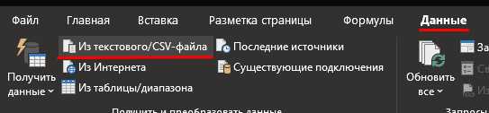</p>

<p align="center"><b>Рысунак</b> - <i>Адкрыццё дакумента адпаведнасці назваў прылад у Excel</i></p>

**Заўвага**:
Для карэктнай працы дадзенага функцыяналу неабходна, каб у прыладах на ФСА было прапісана доп. поле[10],
дзе ўсталёўваецца стары назоў прылады ў ICP CON. Дадзенае поле запаўняецца аўтаматычна на этапе
[3.3.4](#334-імпарт-апісанні-старога-праекта-на-фса), Аднак калі прылады ствараюцца ўручную,
то неабходна ўручную праставіць дадзенае поле. Або ў далейшым дапоўніць дадзенае поле ўжо ў Excel.

**Дадаткова**:
Надбудова таксама прапануе захаваць дадзены файл на этапе [3.3.4](#334-імпарт-апісанні-старога-праекта-на-фса),
тут ужо не патрабуецца наяўнасць доп. поле[10]. Але калі назвы ў далейшым будуць мяняцца,
то ў дадзенай функцыі няма неабходнасці.

## 4 Абсталяванне IO ##

**ВАЖНА:** Усе прылады (прылады, вузлы ўводу-высновы і інш.), якія дадаюцца ў праект павінны быць размешчаны на ФСА (функцыянальная схема аўтаматызацыі) для таго, што б надбудова іх счытвала. Калі прылады на ФСА няма, тое яно не будзе прачытана! Дадатковыя палі прылад запаўняюцца таксама на ФСА. Таксама __важно__, каб у прыладзе на ФСА быў уключаны сцяжок - "Галоўная функцыя", а ў яго макрасах на іншых схемах - адключаная.

<p align="justify"><b>Кантроль адраснай прасторы вузла.</b> Вузлы маюць абмежаваную адрасную прастору і максімальную колькасць падключаемых модуляў: для <i>WAGO</i> - <b>64 модуля і 2 кБ</b>, <i>Phoenix Contact</i> - <b>6. Пры даданні ў вузел модуля, праўзыходнага максімальная колькасць падключаюцца модуляў або адрасную прастору, з'яўляецца адпаведная памылка і модуль не захоўваецца ў апісанні (<i>Для WAGO абмежаванне па адраснай прасторы пакуль адсутнічае</i>).</p>

### 4.1 Настройка вузлоў і модуляў уводу-вываду

<p align="justify">Назва вузлоў ажыццяўляецца ў наступным выглядзе: літара A і нумар, кратны 100. Прыклад: "A100", "A200". У праекце вузлы павінны ісці паслядоўна ад "A100" (<em>для WAGO - старыя праекты</em>), а для новых тыпаў праекту (<em>Phoenix Contact</em>) неабходна ўлічваць, што вузлавы кантролер (<em>на якім знаходзіцца кіравальная праграма</em>) завецца як "A1".</p>

У вузлоў таксама можна задаваць параметры:

1. Дад. поле[1] - прыкмета пропуску прылады (калі ў поле напісана значэнне - 1, то прылада ігнаруецца);
2. Пачатковы адрас карты ПЛК (у акне "Блок ПЛК") - паказваецца IP-адрас прылады.

Інфармацыя аб модулях уводу-высновы атрымліваецца на аснове апісання модуля (звесткі аб вырабе). У праекце павінен быць галоўны выраб для модуля (вузел).

### 4.2 Прывязка прылад да модуляў IO ###

<p align="justify">Для злучэння клемы модуля ўводу-высновы і прылады неабходна, каб функцыянальны тэкст (клемы) адпавядаў назову канала прылады. Для спрашчэння дадзенай працэдуры рэалізавана акно са спісам прылад і каналаў.</p>


<p align="center"></p>

<p align="center"><b>Рысунак</b> - <i>Акно "Прылады"</i></p>

<p align="justify">Выклік дадзенага акна ажыццяўляецца праз пункт меню <b>"EPlaner" -> "Прылады"</b></p>

<p align="center"></p>

<p align="center"><b>Рысунак</b> - <i>Шлях да акна "Прылады"</i></p>

<p align="justify">Для прывязкі клемы неабходна пры актыўным функцыянальным тэксце клемы <b>двойчы</b> націснуць (<i>double click</i>) на патрабаваны канал у акне прылад (<i>прыклад, вылучана зялёным</i>).</p>

**Нататка**: для клапанаў з AS-інтэрфейсам і IO-Link Mixproof клапана прывязваецца толькі 1 з 2 каналаў (_AI або AO_).

<p align="center"></p>

<p align="center"><b>Рысунак</b> - <i>Прыклад прывязкі да модуля ўводу-вываду</i></p>

<p align="justify">Пасля падвойнага кліку адпаведны тэкст аўтаматычна занясецца ў функцыянальны тэкст. Пры неабходнасці прывязкі больш адной прылады да адной і той жа клемы неабходна <b>заціснуць</b> пры гэтым клавішу <b>Ctrl</b> (<i>да тэксту дапішацца дадзеная прылада</i>). Для размяшчэння назвы прылады на новым радку неабходна карыстацца сімвалам новага радка (¶), неабходна ўставіць сімвал паміж радкамі (<i>напрыклад, скапіяваўшы яго папярэдне з Word</i>).</p>

Пры прывязцы дзейнічаюць наступныя абмежаванні:
* Да модулю AI прывязваецца AI сігнал;
* Да модулю AO прывязваецца AO сігнал;
* Да модулю DI прывязваецца DI сігнал;
* Да модулю DO прывязваецца DO сігнал;
* Да модулю IO-Link ад Wago прывязваюцца AO, AI сігналы;
* Да модулю IO-Link ад Phoenix Contact прывязваюцца AO, AI, DO, DI сігналы;
* Да модулю DO/DI ад Phoenix Contact прывязваюцца DO і DI сігналы;

**Заўвага**:
1. Для IO-Link модуля Phoenix Contact дадаткова, пасля каментара да сігналу, (заўв., _Пуск_, як на малюнку ніжэй) праз сімвал новага радка паказваецца тып канала. Тып канала паказваецца не заўсёды, толькі калі прылада мае больш за два каналы для прывязкі. Тып канала паказваецца **ТОЛЬКІ** для DI ці DO канала. Тып каналаў можа быць:
* DI (для каналаў DI);
* DO (для каналаў DO).
2. Калі прылада па нейкай прычыне не прывязваецца, калі ласка, праверце ўсе клемы прылады ўводу-вываду, да якога вы хочаце прывязацца. Клеммы не павінны мець галачак "Галоўная функцыя_".
3. Калі выпадкова абрана не сігнальная клема (напрыклад, сілкаванне), то прывязкі прылады па падвойнай пстрычцы не адбудзецца. Калі ж функцыянальны тэкст клемы быў запоўнены ўручную, то надбудова адлюструе адпаведную памылку.

<p align="center"></p>

<p align="center"><b>Рысунак</b> - <i>Прыклад функцыянальнага тэксту для модуля Phoenix Contact IO-Link</i></p>

<p align="center"></p>

<p align="center"><b>Рысунак</b> - <i>Прыклад функцыянальнага тэксту</i></p>

<p align="center"></p>

<p align="center"><b>Рысунак</b> - <i>Адлюстраванне ўведзенага функцыянальнага тэксту</i></p>

### 4.2.1 Прывязка пнеўмавострава Festo (VTUG) ###

Пнеўмавостраў Festo (_DEV_VTUG - старыя праекты, Y - новыя_) падтрымлівае звычайную прывязку да сваіх клем, а гэтак жа множную прывязку. Важна, каб прывязка ажыццявілася - гэта наяўнасць прывязкі самага пнеўмавострава да клемы модуля ПЛК.

На электрычнай схеме паказваецца, да якой клемы ПЛК прывязаны пнеўмавостраў, а на схеме агляду пнеўмавострава (_ці электрычнай схеме, у залежнасці ад размяшчэння_) адбываецца прывязка клапанаў да клем пнеўмавострава. __Важна__: выкарыстоўваць спосабы паасобна для кожнай з прылад.

**Заўвага:**
* Толькі тып пнеўмавострава Y прывязваецца апісваным спосабам. Для старых тыпаў DEV_VTUG неабходна выкарыстоўваць звычайны спосаб прывязкі (стары тып састарэлы, але выкарыстоўваецца ў старых праектах). Падтрымліваецца "пераходны стан", калі DEV_VTUG заменены на Y, але выкарыстоўваецца стары тып прывязкі. Пры выкарыстанні старога тыпу прывязкі з новым тыпам пнеўмавострава не гарантуецца праца функцыі - _Сінхранізацыя назоваў прылад і модуляў_.
* Пнеўмавостраў, які размешчаны на ФСА і на схеме агляду, павінен мець галачку "Галоўная функцыя".

<p align="center"></p>

<p align="center"><b>Рысунак</b> - <i>Прывязка пнеўмавострава на электрычнай схеме</i></p>

На першай частцы малюнка - пнеўмавостраў без клем і яго прывязка да модуля ўводу-высновы. На другім малюнку - прывязка да клем у прастакутным макрасе пнеўмавострава на схеме "Пнеўмавостраў.Агляд".

<p align="center"></p>

<p align="center"><b>Рысунак</b> - <i>Прывязка пнеўмавострава на схеме агляду</i></p>

Апроч усяго апісанага вышэй, неабходна паказаць тып выкарыстоўванага пнеўмавострава. Для гэтага схематычна размяшчаем пнеўмавостраў на ФСА і прапісваем у доп. поле 2 тып выкарыстоўванай версіі (гл. пункт 5.2.3). Не забываемся пра сцяжок "Галоўная функцыя".

<p align="center"></p>

<p align="center"><b>Рысунак</b> - <i>Указанне тыпу версіі пнеўмавострава, якая выкарыстоўваецца</i></p>

### 4.2.2 Правілы напісання каментароў да прывязкі ###

Пры множнай прывязцы, у функцыянальны тэкст будзе заносіцца толькі пазначэнне прылад (_ОУ_) сябар за сябрам (_заўв., "+V1 +V2 +V3"_), прычым можна задаваць яе як у радок (_задаецца першапачаткова_), так і ў слупок (_неабходна расставіць знакі пераносу радка паміж ОУ_). Раздзяляльнік пры множнай прывязцы - сімвал пераносу на новы радок.

Пры адзінарнай прывязцы ў функцыянальны тэкст заносіцца гэтак жа каментар.

Для ўсталёўкі каментара неабходна ўлічваць наступныя правілы:

+ Каментарый павінен пачынацца з загалоўнай літары;
+ Каментарый не павінен утрымоўваць у сабе ОУ (заўв., +V3);
+ Каментарый можа змяшчаць літары лацінскага і кірылічнага алфавіту ў любым рэгістры (_верхні, ніжні_), а таксама літарна-лічбавыя абазначэння (_заўв., CR2, B4 і інш.);
+ Каментарый не павінен утрымоўваць спецзнакі, клямарчыкі, і інш. (_за выключэннем знака - **№**_).

Прыклад карэктнага каментара: **"Падача ў аб'ект OBJECT2"**.

### 4.3 Падтрымліваемыя модулі ўводу-вываду ###
У гэтым раздзеле знаходзіцца спіс модуляў уводу-вываду, якія падтрымліваюцца надбудовай. Дадзеныя захоўваюцца ў файле **sys_io_modules.lua**, калі гэты файл выдаліць, то будзе створаны файл са стандартным шаблонам апісання, які трэба будзе запоўніць. У файле знаходзіцца падказка па запаўненні дадзеных, якая палягчае занясенне змен. Файл знаходзіцца ў тэчцы Lua.

| Вытворца   | Назва (Нумар)                 | Тып         | Заўвага                                     |
| --------------- | -------------------------------- | ----------- | ---------------------------------------------- |
| WAGO            | 750-450                          | AI          | 4 канала RTD                                   |
| WAGO            | 750-461                          | AI          | 2 канала RTD                                   |
| WAGO            | 750-466                          | AI          | 2 канала RTD                                   |
| WAGO            | 750-491                          | AI          | 1 канал resistance measuring bridge            |
| WAGO            | 750-496                          | AI          | 8 каналов                                      |
| WAGO            | 750-638                          | AI          | Лічыльнік                                      |
| WAGO            | 750-554                          | AO          | 2 канала                                       |
| WAGO            | 750-555                          | AO          | 4 канала                                       |
| WAGO            | 750-655                          | AI/AO       | AS-інтэрфейс                                   |
| WAGO            | 750-657                          | AI/AO       | IO-Link                                        |
| WAGO            | 750-402                          | DI          | 4 канала                                       |
| WAGO            | 750-430                          | DI          | 8 каналаў                                      |
| WAGO            | 750-1405                         | DI          | 16 каналаў                                     |
| WAGO            | 750-1415                         | DI          | 8 каналаў                                      |
| WAGO            | 750-1420                         | DI          | 4 канала                                       |
| WAGO            | 750-504                          | DO          | 4 канала                                       |
| WAGO            | 750-512                          | DO          | 2 канала relay module                          |
| WAGO            | 750-530                          | DO          | 8 каналаў                                      |
| WAGO            | 750-1504                         | DO          | 16 каналаў                                     |
| WAGO            | 750-1515                         | DO          | 8 каналаў                                      |
| WAGO            | 750-600                          | -           | Канчатковы модуль                              |
| WAGO            | 750-602                          | -           | Сілкаванне                                     |
| WAGO            | 750-612                          | -           | Сілкаванне                                     |
| WAGO            | 750-627                          | -           | Пашырэнне шыны                                 |
| WAGO            | 750-628                          | -           | Пашырэнне шыны                                 |
| Phoenix Contact | AXL F CNT2 INC2 1F (2688093)     | AI          | 4 канала, лічыльнік                            |
| Phoenix Contact | AXL F AI4 I 1H (2688491)         | AI          | 4 канала                                       |
| Phoenix Contact | AXL F RTD4 1H (2688556)          | AI          | 4 канала RTD                                   |
| Phoenix Contact | AXL F AO4 1H (2688527)           | AO          | 4 канала                                       |
| Phoenix Contact | AXL F IOL8 2H (1027843)          | AI/AO/DI/DO | IO-Link с прывязкай DI/DO, 8 каналаў           |
| Phoenix Contact | AXL F DI16/4 2F (2688022)        | DI          | 16 каналаў                                     |
| Phoenix Contact | AXL F DO16/3 2F (2688048)        | DO          | 16 каналаў                                     |
| Phoenix Contact | AXL F DO16/2 2H (1027904)        | DO          | 16 каналаў                                     |
| Phoenix Contact | AXL F DI8/3 DO8/3 2H (2702071)   | DI/DO       | 8 каналаў DI и 8 каналаў DO                    |
| Phoenix Contact | AXL F DI8/1 DO8/1 1H (2701916)   | DI/DO       | 8 каналаў DI и 8 каналаў DO                    |
| Phoenix Contact | AXL F AI2 AO2 1H 0-10V (2702072) | AI/AO       | 2 канала AI и 2 канала DI                      |
| Phoenix Contact | AXL F RS UNI 1H (2688666)        | AI/AO       | Камунікацыйны модуль RS-232, RS-485, RS-422    |
| Phoenix Contact | AXL F AI8 1F (2688064)           | AI          | 8 каналаў                                      |
| Phoenix Contact | AXL F SGI2 1H (2702911)          | AI          | Вымяральны модуль тэнзадатчыка                 |
| Phoenix Contact | AXL SE AI4 I 4-20 (1088062)      | AI          | 4 канала                                       |
| Phoenix Contact | AXL SE AI4 U 0-10 (1088126)      | AI          | 4 канала                                       |
| Phoenix Contact | AXL SE RTD4 PT100 (1088106)      | AI          | 4 канала RTD                                   |
| Phoenix Contact | AXL SE RTD4 PT1000 (1182190)     | AI          | 4 канала RTD                                   |
| Phoenix Contact | AXL SE CNT1 (1088131)            | AI          | 1 канал, лічыльнік                             |
| Phoenix Contact | AXL SE AO4 I 4-20 (1088123)      | AO          | 4 канала                                       |
| Phoenix Contact | AXL SE IOL4 (1088132)            | AI/AO/DI/DO | IO-Link з прывязкай DI/DO, 4 канала            |
| Phoenix Contact | AXL SE DI16/1 (1088127)          | DI          | 16 каналаў                                     |
| Phoenix Contact | AXL SE DO16/1 (1088129)          | DO          | 16 каналаў                                     |
| Phoenix Contact | AXL SE SC-A (1088134)            | -           | Заглушка                                       |
| Phoenix Contact | AXL SE PD16 24V (1337223)        | -           | Размеркавальнік патэнцыялу                     |
| Phoenix Contact | AXL SE PD16 GND (1337224)        | -           | Размеркавальнік патэнцыялу                     |

Падтрымліваюцца кантролеры і каплеры, якія бяруцца з файла **sys_io_nodes.lua**. Ён працуе аналагічна **sys_io_modules.lua**:

| Вытворца        | Назва (нумар)     |
| --------------- | ----------------- |
| WAGO            | 750-863           |
| WAGO            | 750-341           |
| WAGO            | 750-841           |
| WAGO            | 750-352           |
| WAGO            | 750-362           |
| WAGO            | 750-8202          |
| WAGO            | 750-8203          |
| WAGO            | 750-8204          |
| WAGO            | 750-8206          |
| Phoenix Contact | AXL F BK ETH      |
| Phoenix Contact | AXL F BK ETH NET2 |
| Phoenix Contact | AXC F 1152        |
| Phoenix Contact | AXC F 2152        |
| Phoenix Contact | AXC F 3152        |

##  5 Аб'екты тэхналагічнай схемы ##

<p align="justify">Объектами являются физические танки, линии и т.д. Логически они делятся на аппараты, агрегаты, блоки управления.</p>

### 5.1 Аперацыі аб'ектаў ###
<p align="justify">Аперацыі можа ўключаць аператар. Падчас аперацыі адбываецца ўключэнне\выключэнне прылад, апрацоўка значэнняў з датчыкаў і т.д. Аперацыі выдзяляюцца, зыходзячы з сістэмнага падыходу. Яны падзяляюцца на асноўныя і дапаможныя. Кожная аперацыя мае назву, якое характарызуецца адзіным для ўсіх праектаў апісаннем (г.зн. аперацыя "напаўненне" аднолькавая для ўсіх праектаў і характарызуецца наступнымі параметрамі: аб'ёмам напаўнення, праводнасць сумесі, праводнасць вады). Аперацыі апісваюцца ў графічным выглядзе ў рэдактары аперацый Eplaner.</p>

Для аперацыі вызначаецца:
1. Нумары аперацый, на якія можна перайсці пасля дадзенай аперацыю (з схемы аперацый).
2. Значэнні параметраў, неабходных для выканання аперацыі.

Аперацыі складаюцца з крокаў. Аперацыя можа знаходзіцца ў стане __просты__, __выкананне__, __паўза__, __прыпынак__, __запуск__, __становіцца ў паўзу__, __выходзіць з паўзы__, __спыняецца__.

<p align="center"></p>

<p align="center"><b>Рысунак</b> - <i>Пераход паміж станамі аперацый</i></p>

Стан аперацыі можа быць абрана для запуску пры старце праграмы.
Для аднаго аб'екта магчымы выбар для запуску толькі адной аперацыі ў некаторым стане.
Для гэтага трэба ў стане абраць опцыю `Запускаць пры старце праграмы`.
(Астатнія станы аўтаматычна скідаюць гэтую опцыю).

<p align="center"></p>

<p align="center"><b>Рысунак</b> - <i>Выбар стану аперацыі для запуску</i></p>

### 5.2 Схемы ###
<p align="center"></p>

<p align="center"><b>Рысунак</b> - <i>Схема апісання аперацый у Eplan</i></p>

## 6 Прылады тэхналагічнай схемы

### 6.1 Нумарацыя прылад ###
Для ідэнтыфікацыі выкарыстоўваюцца вялікія лацінскія літары, знак падкрэслівання, спецыяльныя сімвалы (<b>=</b>,<b>=</b>, <b>+</b>, <b>-</b>) і <b>лічбы</b>.

Аб'екты ідэнтыфікуюцца з дапамогай наступнай натацыі:
<b>==</b> сайт <b>=</b> праект <b>+</b> тэхналагічны аб'ект <b>#</b> аб'ект карыстальніка <b>-</b> прылада.

#### 6.1.1 Тэхналагічны аб'ект ####
Назва тэхналагічнага аб'екта (_танка, лініі…_). Заўсёды змяшчае назву лацінкай і лічбавы нумар.
Прыклады тыпавых тэхналагічных аб'ектаў:
* __M2__ - лінія № 2;
* __KOAG2__ – каагулятар №2;
* __TCW1__ – бачок з халоднай вадой №1;
* __THW1__ - бачок з гарачай вадой №1.

#### 6.1.2 Карыстальніцкі аб'ект ####
Змяшчае дадатковую інфармацыю.

#### 6.1.3 Прылада ####
<p align="justify">Змяшчае код прылады і нумар (<i><b>V1</b> – клапан №1</i>). Прылада ўнікальна ў межах тэхналагічнага аб'екта.</p>

### 6.2 Пералік прылад ###
<p align="justify">Ніжэй прыведзена апісанне выкарыстоўваных тэхналагічных прылад. Для кожнай прылады таксама могуць задавацца дадатковыя палі (<i>глядзі падзел <b>5.3</b> "Дадатковыя параметры"</i>).</p>

#### 6.2.1 HA. Аварыйная гукавая сігналізацыя. Сірэна ####
Абазначэнне: __HA__.
Каналы ўводу/высновы: __DO__ – _1_.
Прыклад: __HA1__. Аварыйная гукавая сігналізацыя. Сірэна.

<p align="center"></p>

<p align="center"><b>Рысунак</b> - <i>Прыклад аварыйнай гукавой сігналізацыі, сірэны</i></p>

#### 6.2.2 FQT. Лічыльнік ####
Абазначэнне: **FQT**.
Падтып: **FQT**.
Каналы ўводу/высновы: **AI** – _1_.
Назва каналаў: __AI1__ - _аб'ём_.

Абазначэнне: **FQT**.
Падтып: **FQT_F**.
Каналы ўводу/высновы: **AI** – _2_.
Назва каналаў: __AI1__ - _струмень_, __AI2__ - _аб'ём_.

Абазначэнне: **FQT**.
Падтып: **FQT_F_IOLINK**.
Каналы ўводу/высновы: **AI** – _1_.

Прыклад: __+OBJ1-FQT1__. Аб'ект 1. Аб'ём.

#### 6.2.3 HL. Светлавая сігналізацыя ####
Абазначэнне: __HL__.
Каналы ўводу/высновы: __DO__ – _1_.
Прыклад: __HL1__. Аварыйная сігналізацыя. Зялёны.

#### 6.2.4 LT. Бягучы ўзровень ####
Абазначэнне: __LT__, **LT_CYL**, **LT_CONE**, **LT_TRUNC**.
Каналы ўводу/высновы: __AI__ – _1_.
Прыклад: __+OBJ1-LT1__. Аб'ект №1. Бягучы ўзровень.

Абазначэнне: **LT_IOLINK**.
Каналы ўводу/высновы: __AI__ – _2_.
Прыклад: __+OBJ1-LT1__. Аб'ект №1. Бягучы ўзровень.

#### 6.2.5 GS. Датчик становішча ####
Абазначэнне: **GS**.
Падтыпы: **GS**, **GS_INVERSE**.
Каналы ўводу/высновы: **DI** – *1*.
Прыклад: **+OBJ2-GS1**. Аб'ект №2. Датчык люка.

#### 6.2.6 М. Матор (электрарухавік) ####
Абазначэнне: **M**.
Падтып: **M**.
Каналы ўводу/высновы: **DO** - *1*, **DI** – *1*.
Назва каналаў: **DO1** - *пуск*, **DI1** - *зваротная сувязь*.

Абазначэнне: **M**.
Падтып: **M_FREQ**.
Каналы ўводу/высновы: **DO** - *1*, **DI** – *1*, **AO** – *1*.
Назва каналаў: **DO1** - *пуск*, **DI1** – *зваротная сувязь*, **AO1** – *частата кручэння*.

Абазначэнне: **M**.
Падтып: **M_REV**.
Каналы ўводу/высновы: **DO** – *2*, **DI** – *1*.
Назва каналаў: **DO1** - *пуск*, **DO2** – *рэверс*, **DI1** – *зваротная сувязь*.

Абазначэнне: **M**.
Падтып: **M_REV_FREQ**.
Каналы ўводу/высновы: **DO** – *2*, **DI** – *1*, **AO** – *1*.
Назва каналаў: **DO1** - *пуск*, **DO2** – *рэверс*, **DI1** – *зваротная сувязь*, **AO1** – *частата кручэння*.

Абазначэнне: **M**.
Падтып: **M_REV_2**.
Каналы ўводу/высновы: **DO** – *2*, **DI** – *1*.
Назва каналаў: **DO1** - *пуск*, **DO2** – *рэверс*, **DI1** – *зваротная сувязь*.

Абазначэнне: **M**.
Падтып: **M_REV_FREQ_2**.
Каналы ўводу/высновы: **DO** – *2*, **DI** – *1*, **AO** – *1*.
Назва каналаў: **DO1** - *пуск*, **DO2** – *рэверс*, **DI1** – *зваротная сувязь*, **AO1** – *частата кручэння*.

Абазначэнне: **M**.
Падтып: **M_REV_2_ERROR**.
Каналы ўводу/высновы: **DO** – *2*, **DI** – *1*.
Назва каналаў: **DO1** - *пуск*, **DO2** – *рэверс*, **DI1** – *аварыя*.

Абазначэнне: **M**.
Падтып: **M_REV_FREQ_2_ERROR**.
Каналы ўводу/высновы: **DO** – *2*, **DI** – *2*, **AO** – *1*.
Назва каналаў: **DO1** - *пуск*, **DO2** – *рэверс*, **DI1** – *аварыя*, **DI2** – *зваротная сувязь*, **AO1** – *частата кручэння*.

Абазначэнне: **M**.
Падтып: **M_ATV**, **M_ATV_LINEAR**.
Каналы ўводу/высновы: кіруецца праз Ethernet.

Прыклад: **+OBJ1-M1**. Аб'ект 1. Пуск.

#### 6.2.7 FS. Датчык наяўнасці патоку ####
Абазначэнне: **FS**.
Каналы ўводу/высновы: **DI** – *1*.
Прыклад: **FS1**. Датчык наяўнасці патоку.

#### 6.2.8 LS. Гранічны ўзровень ####
Абазначэнне: **LS_MIN**, **LS_MAX**.
Каналы ўводу/высновы: **DI** – *1*.
Дадатковыя палі:
* Тып падключэння: _max_, _min_.

Абазначэнне: **LS**.
Падтып: **IO_LINK_MIN**, **IO_LINK_MAX**
Каналы ўводу/высновы: **AI** – *1* (AOAI).
Дадатковыя палі:
* Тып падключэння: _max_, _min_.

Прыклад: **+TANK1-LS2**. Танк №1. Верхні ўзровень.

#### 6.2.9 QT. Датчык праводнасці ####
Абазначэнне: **QT**.
Падтып: **QT, QT_IOLINK**.
Каналы ўводу/высновы: **AI** – _1_.

Абазначэнне: **QT**.
Падтып: **QT_OK**.
Каналы ўводу/высновы: **AI** – _1_, **DI** - _1_.

Прыклад: **OBJ1+-QT1**. Аб'ект 1. Датчык праводнасці.

#### 6.2.10 TE. Тэмпература ####
Абазначэнне: **TE**.
Падтып: **TE**, **TE_IOLINK**, **TE_ANALOG**.
Каналы ўводу/высновы: **AI** – *1*.
Прыклад: **+OBJ1-TE1**. Аб'ект №1. Тэмпература.

#### 6.2.11 SB. Кнопка ####
Абазначэнне: **SB**.
Каналы ўводу/высновы: **DI** – *1*.
Прыклад: **+OBJ1-SB1**. Аб'ект №1. У дрэнаж.

#### 6.2.12 V. Клапан ####
Абазначэнне: **V**.
Каналы ўводу/высновы:
1. V_DO1: **DO** - _1_;
2. V_DO2: **DO** - _2_;
- **DO** - _Закрыць_
- **DO** - _Адкрыць_
3. V_DO1_DI1_FB_OFF, V_DO1_DI1_FB_ON: **DO** - _1_, **DI** - _1_;
4. V_DO1_DI2: **DO** - _1_, **DI** - _2_;
- **DI** - _Закрыты_
- **DI** - _Адкрыты_
5. V_DO2_DI2, V_DO2_DI2_BISTABLE: **DO** - _2_; **DI** - _2_;
- **DO** - _Закрыць_
- **DO** - _Адкрыць_
- **DI** - _Закрыты_
- **DI** - _Адкрыты_
6. V_MIXPROOF: **DO** - _3_; **DI** - _2_;
- **DO** - _Адкрыць_
- **DO** - _Адкрыць НС_
- **DO** - _Адкрыць нд_
- **DI** - _Закрыты_
- **DI** - _Адкрыты_
7. V_BOTTOM_MIXPROOF: **DO** - _3_; **DI** - _2_;
- **DO** - _Адкрыць_
- **DO** - _Адкрыць міні_
- **DO** - _Адкрыць НС_
- **DI** - _Закрыты_
- **DI** - _Адкрыты_
8. V_IOLINK_MIXPROOF, V_AS_MIXPROOF, V_AS_DO1_DI2, V_IOLINK_DO1_DI2: **AO** - _1_, **AI** - _1_;
9. V_IOLINK_VTUG_DO1: **AO** - _1_;
10. V_IOLINK_VTUG_DO1_FB_OFF, V_IOLINK_VTUG_DO1_FB_ON: **AO** - _1_, **DI** - _1_.
11. V_IOLINK_VTUG_DO1_DI2: **AO** - _1_, **DI** - _2_.
- **DI** - _Закрыты_
- **DI** - _Адкрыты_
12. V_MINI_FLUSHING: **DO** - _2_; **DI** - _2_;
- **DO** - _Адкрыць_
- **DO** - _Адкрыць міні_
- **DI** - _Закрыты_
- **DI** - _Адкрыты_
13. V_IOL_TERMINAL_MIXPROOF_DO3: **AO** - _3_;
- **AO** - _Адкрыць_
- **AO** - _Адкрыць верхняе сядло_
- **AO** - _Адкрыць ніжняе сядло_

Прыклад: **+OBJ1-V7**. Аб'ект №1. Дрэнаж.

#### 6.2.13 VC. Кіраваны клапан ####
Абазначэнне: **VС**.
Каналы ўводу/высновы: **AO** – *1*.
Прыклад: **VC3**. Паравы клапан.

#### 6.2.14 DO. Кіраўнік (выхадны) сігнал ####
Абазначэнне: **DO**.
Каналы ўводу/высновы: **DO** – *1*.
Прыклад: **OBJ2+-DO2**. Аб'ект 2. Гатоўнасць аб'екта

#### 6.2.15 DI. Уваходны сігнал ####
Абазначэнне: **DI**.
Каналы ўводу/высновы: **DI** – *1*.
Прыклад: **DI10**. Прымач гатовы.

#### 6.2.16 AO. Выходная велічыня ####
Абазначэнне: **AO**.
Каналы ўводу/высновы: **AO** – *1*.
Прыклад: **AO1**. Заданне прадукцыйнасці.

#### 6.2.17 AI. Выходная велічыня ####
Абазначэнне: **AI**.
Каналы ўводу/высновы: **AI** – *1*.
Прыклад: **AI1**. Ток рухавіка.

#### 6.2.18 WT. Датчык вагі ####
Абазначэнне: **WT**.
Каналы ўводу/высновы: **AI** – *2*.
Прыклад: **WT1**. Шалі танка 1.

Падтып: **WT_RS232**.
Каналы ўводу/высновы: **AI** – *1*, **AO** - *1*.

Падтып: **WT_ETH**.
Каналы ўводу/высновы: адсутнічаюць.

Падтып: **WT_PXC_AXL**.
Каналы ўводу/высновы: **AI** – *1*, **AO** - *1*.

#### 6.2.19 PT. Датчык ціску ####
Абазначэнне: **PT**.
Падтып: **PT**, **PT_IOLINK**,
Каналы ўводу/вываду: **AI** – *1*.
Прыклад: **OBJ1+-PT10**. Аб'ект 1. Датчык ціску.

#### 6.2.20 Y (DEV_VTUG). Пнеўмавостраў Festo ####
Абазначэнне: **Y**, **DEV_VTUG** - старыя праекты.
Каналы ўводу/высновы: **AO** – *1*. (AOAI)
Прыклад: **OBJ1+CAB1-Y1**. Праект OBJ1, шафа №1, прылада пнеўмавостраў Festo.

#### 6.2.21 F. Аўтаматычны выключальнік ####
Абазначэнне: **F**.
Каналы ўводу/высновы: **AI** - *1*, **AO** - *1* (AOAI)
Прыклад: **OBJ1+CAB1-F1**. Праект OBJ1, шафа №1, прылада аўтаматычны выключальнік.

#### 6.2.22 C. ПІД-рэгулятар ####
Абазначэнне: Любое абазначэнне прылады, з сімвалам - **C** на крайняй пазіцыі.
Каналы ўводу/высновы: адсутнічаюць, віртуальная прылада. Толькі ўнутраныя параметры.</br>
Падтып: **C_PID**(Або пусты радок), **C_THLD**.</br>
Прыклад: **OBJ1+TANK1-TC1**. Праект OBJ1, Танк №1, ПІД-рэгулятар тэмпературы танка №1.

#### 6.2.23 HLA. Сігнальная калона ####
Абазначэнне: **HLA**.

Падтып: **HLA** ці пусты (_аналаг HLA_).
Каналы ўводу/высновы: **DO** - 4 (_чырвоны, жоўты, зялёны і сірэна_).

Падтып: **HLA_VIRT**
Каналы ўводу/высновы: 0

Падтып: **HLA_IOLINK**
Каналы ўводу/высновы:**AI** - *1*, **AO** - *1* (AOAI)

Прыклад: **OBJ1+TANK1-HLA1**. Праект OBJ1, танк №1, сігнальная калона №1.

У сігнальнай калоне выкарыстоўваецца тры лямпачкі - зялёная, жоўтая, чырвоная - і сірэна.

Які мігціць чырвоны колер - аварыя, трывога (*непрыгнечаная*). Частата мігцення * 2 * Гц.
Дадаткова ўключаецца сірэна, якую можна адключыць з праекту (_клік па значку_) альбо яна таксама адключыцца пасля пацверджання трывог, знікненні аварый.

Мігатлівае жоўтае святло - непацверджанае паведамленне. Частата мігцення *0.5* Гц.

Зялёны колер - ёсць уключаныя аперацыі (апарата).

#### 6.2.24 CAM. Камера ####
Абазначэнне: **CAM**.
Каналы ўводу/высновы:
1. CAM_DO1_DI1 - **DO** - _1_, **DI** - _1_;
2. CAM_DO1_DI2 - **DO** - _1_, **DI** - _2_;
3. CAM_DO1_DI3 - **DO** - _1_, **DI** - _3_.

Назва каналаў: **DO** - _сігнал актывацыі_. **DI** - _гатоўнасць_, _вынік апрацоўкі 1_, _вынік апрацоўкі 2_.
Прыклад: **OBJ1+LINE1-CAM1**. Праект OBJ1, лінія №1, камера №1.

#### 6.2.25 PDS. Сігнальны датчык розніцы ціску ####
Абазначэнне: **PDS**.
Каналы ўводу/высновы: **DI** – *1*.
Прыклад: **+OBJ2-PDS1**. Аб'ект №2. Сігнальны датчык розніцы ціску.

#### 6.2.26 TS. Сігнальны датчык тэмпературы ####
Абазначэнне: **TS**.
Каналы ўводу/высновы: **DI** – *1*.
Прыклад: **+OBJ2-TS1**. Аб'ект №2. Сігнальны датчык тэмпературы.

#### 6.2.27 G. Блок харчавання з аўтаматычным выключальнікам ####
Абазначэнне: **G**.
Каналы ўводу/высновы: **AI** - *1*, **AO** - *1* (AOAI)
Прыклад: **OBJ1+CAB1-G1**. Праект OBJ1, шафа №1, прылада аўтаматычны выключальнік.

#### 6.2.28 WATCHDOG. Прылада праверкі сувязі ####
Абазначэнне: **WATCHDOG**.
Прыклад: **+OBJ2-WATCHDOG1**. Аб'ект №2. Прылада праверкі сувязі.

#### 6.2.29 EY Пераўтваральнік IO-Link ####
Абазначэнне: **EY**.
Прыклад: **+OBJ2-EY1**. Аб'ект №2. Пераўтваральнік IO-Link.

Падлучэнне прылад ажыццяўляецца па аналогіі з пнеўмавостравам.
Да пераўтваральніка можна падлучыць прыладу з падтыпамі (*_EY): **AO_EY**, **VC_EY**.
Пры падлучэнні прылад да пераўтваральніка аўтаматычна запаўняецца ўласцівасць `TERMINAL` з назовам пераўтваральніка і
`R_EY_NUMBER` з нумарам канала пераўтваральніка.

### 6.3 Дадатковыя параметры ###
Дадатковыя параметры паказваюцца праз уласцівасці прылады.

Параметры і ўласцівасці прылады(Дап.палі 3 і 4) можна запоўніць у дрэве прылад("Eplaner" -> "Прылады, параметры аб'ектаў"). Для гэтага неабходна ўключыць адлюстраванне параметраў і ўласцівасцяў аб'ектаў. Змененыя параметры і ўласцівасці адразу захоўваюцца ў прыладзе на схеме.

<p align="center">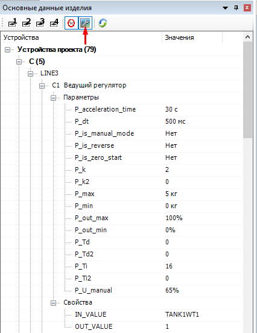</p>

<p align="center"><b>Рысунак</b> - <i>Рэдагаванне параметраў і ўласцівасцяў у дрэве прылад</i></p>


#### 6.3.1 Апісанне прылады ###
У полі "Заўвага" запісваецца апісанне прылады. Прыклад прыведзены ніжэй.

<p align="center"></p>

<p align="center"><b>Рысунак</b> - <i>Запіс апісання прылады</i></p>

#### 6.3.2 Прызначэнне дадатковых палёў ####
1. **Доп. поле [1]**. Вызначае апрацоўваць ці не дадзенае прылада пры экспарце для PAC (_напрыклад, ручная засланка не кіруецца аўтаматычна_). Калі яно змяшчае значэнне - **1**, то дадзеная прылада не апрацоўваецца. Ці можна зняць галачку "<em>Галоўная функцыя</em>" ля прылады.</p>
2. **Доп. поле [2]**. Вызначае падтып прылады. Апісанне:

| Параметр                    | Апісанне                                                                                                             |
| --------------------------- | -------------------------------------------------------------------------------------------------------------------- |
| NONE                        | Падтып не вызначаны.                                                                                                 |
| V_DO1                       |Клапан з адным каналам кіравання.                                                                                   |
| V_DO2                       | Клапан з двума каналамі кіравання.                                                                                  |
| V_DO1_DI1_FB_OFF            | Клапан з адным каналам кіравання і адной зваротнай сувяззю (*выключаны стан*).                                 |
| V_DO1_DI1_FB_ON             |Клапан з адным каналам кіравання і адной зваротнай сувяззю (*уключаны стан*).                                  |
| V_DO1_DI2                   | Клапан з адным каналам кіравання і двума зваротнымі сувязямі.                                                         |
| V_DO2_DI2                   | Клапан з двума каналамі кіравання і двума зваротнымі сувязямі.                                                        |
| V_MIXPROOF                  | Клапан супрацьзмешвальны (*2 канала кіравання і 2 зваротныя сувязі*).                                                |
| V_IOLINK_MIXPROOF           | Клапан супрацьзмешвальны з **IO-Link**.                                                                             |
| V_AS_MIXPROOF               | Клапан супрацьзмешвальны з **AS інтэрфейсам**.                                                                      |
| V_BOTTOM_MIXPROOF           | Клапан з прамываннем і двума зваротнымі сувязямі (донны).                                                               |
| V_AS_DO1_DI2                | Клапан з адным каналам кіравання і двума зваротнымі сувязямі з **AS інтэрфейсам**.                                    |
| V_IOLINK_DO1_DI2            | Клапан з адным каналам кіравання і двума зваротнымі сувязямі з **IO-Link**.                                           |
| V_DO2_DI2_BISTABLE          | Клапан з двума каналамі кіравання і двума зваротнымі сувязямі бістабільны.                                           |
| V_IOLINK_VTUG_DO1           | **IO-Link VTUG** клапан з адным каналам кіравання.                                                                  |
| V_IOLINK_VTUG_DO1_FB_OFF    | **IO-Link VTUG** клапан з адным каналам кіравання і адной зваротнай сувяззю (*выключаны стан*).                |
| V_IOLINK_VTUG_DO1_FB_ON     | **IO-Link VTUG** клапан з адным каналам кіравання і адной зваротнай сувяззю (*уключаны стан*).                 |
| V_IOLINK_VTUG_DO1_DI2       | **IO-Link VTUG** клапан з адным каналам кіравання і двума зваротнымі сувязямі (*уключаны і выключаны стану*). |
| V_VIRT                      | Віртуальны клапан.                                                                                                  |
| V_MINI_FLUSHING             | Клапан з мініклапанам прамывання і двума зваротнымі сувязямі.                                                            |
| V_IOL_TERMINAL_MIXPROOF_DO3 | Супрацьзмешвальны клапан з кіраванне ад пнеўмавострава IO-Link                                                      |
| LS_MIN                      | Гранічны ўзровень па схеме мінімум.                                                                                 |
| LS_MAX                      | Гранічны ўзровень па схеме максімум.                                                                                |
| LS_IOLINK_MIN               | **IO-Link** ўзровень. Падлучэнне па схеме мінімум.                                                                   |
| LS_IOLINK_MAX               | **IO-Link** ўзровень. Падлучэнне па схеме максімум.                                                                  |
| LS_VIRT                     | Віртуальны датчык гранічнага ўзроўню.                                                                               |
| TE                          | Тэмпература.                                                                                                         |
| TE_IOLINK                   | Тэмпература **IO-Link** без дадатковых параметраў.                                                               |
| TE_VIRT                     | Віртуальны датчык тэмпературы.                                                                                      |
| TE_ANALOG                   | Аналагавы датчык тэмпературы 4-20 мА.                                                                               |
| M                           | Матор без кіравання частатой кручэння.                                                                              |
| M_FREQ                      | Матор з кіраваннем частатой кручэння.                                                                               |
| M_REV                       | Матор з рэверсам (*сумесны*) без кіравання частатой кручэння.                                                    |
| M_REV_FREQ                  | Матор з рэверсам (*сумесны*) з кіраваннем частатой кручэння.                                                     |
| M_REV_2                     | Матор з рэверсам (*асобны*) без кіравання частатой кручэння.                                                     |
| M_REV_FREQ_2                | Матор з рэверсам (*асобны*) з кіраваннем частатой кручэння.                                                      |
| M_REV_2_ERROR               | Матор з рэверсам (*асобны*). Асобны сігнал аварыі.                                                             |
| M_REV_FREQ_2_ERROR          | Матор з рэверсам з кіраваннем частатой кручэння. Рэверс уключаецца асобна. Асобны сігнал памылкі.               |
| M_ATV                       | Матор, кіраваны частотным пераўтваральнікам Altivar. Сувязь з ПП па Ethernet. Рэверс і аварыі апцыянальныя.          |
| M_VIRT                      | Віртуальны матор.                                                                                                   |
| M_ATV_LINEAR                | Аналагічна M_ATV, толькі есць параметры для разліку лінейнай хуткасці.                                               |
| FQT                         | Лічыльнік.                                                                                                            |
| FQT_F                       | Лічыльнік з выдаткам.                                                                                                  |
| FQT_VIRT                    | Віртуальны лічыльнік (*без прывязкі да модуляў*).                                                                      |
| FQT_IOLINK                  | Лічыльнік з выдаткам IO-Link.                                                                                          |
| QT                          | Канцэнтратамер.                                                                                                      |
| QT_OK                       | Канцэнтратамер з дыягностыкай.                                                                                       |
| QT_IOLINK                   | **IO-Link** канцэнтратамер.                                                                                          |
| QT_VIRT                     | Віртуальны канцэнтратамер.                                                                                   |
| LT                          | Датчык бягучага ўзроўню.                                                                               |
| LT_CYL                      | Датчык ўзроўню для танка цыліндрычнай формы.                                                                   |
| LT_CONE                     | Датчык ўзроўню для цыліндрычнага танка з дном у форме конусу.                                                     |
| LT_TRUNC                    | Датчык бягучага ўзроўню для танка з дном у форме ўсечанага конусу.                                                   |
| LT_IOLINK                   | **IO-Link** бягучы ўзровень з магчымасцю задання параметраў для танка.                                             |
| LT_VIRT                     | Віртуальны датчык бягучага ўзроўню.                                                                                  |
| DI                          | Дыскрэтны ўваходны сігнал.                                                                                          |
| DI_VIRT                     | Віртуальны дыскрэтны ўваходны сігнал.                                                                               |
| АI                          | Аналагавы ўваходны сігнал.                                                                                           |
| АI_VIRT                     | Віртуальны аналагавы ўваходны сігнал.                                                                               |
| DO                          | Дыскрэтны ўваходны сігнал.                                                                                           |
| DO_VIRT                     | Віртуальны дыскрэтны ўваходны сігнал.                                                                               |
| АО                          | Аналагавы выходны сігнал.                                                                                          |
| АО_VIRT                     | Віртуальны аналагавы выходны сігнал.                                                                              |
| Y                           | Пнеўмавостраў Festo.                                                                                                  |
| DEV_VTUG_8                  | SPECIAL Festo valve terminal (16 клапанаў).                                                                          |
| DEV_VTUG_16                 | SPECIAL Festo valve terminal (32 клапана).                                                                           |
| DEV_VTUG_24                 | SPECIAL Festo valve terminal (48 клапанаў).                                                                          |
| PT                          | Датчык ціску.                                                                                                     |
| PT_IOLINK                   | **IO-Link** датчык ціску.                                                                                        |
| PT_VIRT                     | Віртуальны датчык ціску.                                                                                         |
| F                           | **IO-Link** аўтаматычны выключальнік.                                                                              |
| F_VIRT                      | Віртуальны аўтаматычны выключальнік.                                                                              |
| VC                          | Аналагавы клапан.                                                                                                   |
| VC_IOLINK                   | **IO-Link** аналагавы клапан.                                                                                       |
| VC_VIRT                     | Віртуальны аналагавы клапан.                                                                                       |
| HLA                         | Дыскрэтная сігнальная калона (*4 DO сігналу на кожны з кветак і сірэну*).                                         |
| HLA_VIRT                    | Віртуальная сігнальная калона.                                                                                      |
| HLA_IOLINK                  | IO-Link сігнальная калона.                                                                                          |
| FS                          | Датчык наяўнасці патоку.                                                                                               |
| FS_VIRT                     | Віртуальны датчык наяўнасці патоку.                                                                                   |
| GS                          | Датчык становішча.                                                                                                    |
| GS_VIRT                     | Віртуальны датчык становішча.                                                                                        |
| GS_INVERSE                  | Датчык становішча інверсны (0 – актыўнае значэнне).                                                                  |
| HA                          | Сірэна.                                                                                                              |
| HA_VIRT                     | Віртуальная сірэна.                                                                                                  |
| HL                          | Сігнальная лямпа.                                                                                                    |
| HL_VIRT                     | Віртуальная сігнальная лямпа.                                                                                        |
| SB                          | Кнопка.                                                                                                              |
| SB_VIRT                     | Віртуальная кнопка.                                                                                                  |
| WT                          | Шалі.                                                                                                                |
| WT_VIRT                     | Віртуальныя шалі.                                                                                                    |
| WT_RS232                    | Шалі з інтэрфейсам RS-232.                                                                                           |
| WT_ETH                      | Шалі з ethernet.                                                                                                     |
| WT_PXC_AXL                  | Шалі Axioline F (для модуляў Phoenix Contact).                                                                       |
| CAM_DO1_DI1                 | Камера з сігналам актывацыі і вынікам апрацоўкі.                                                                 |
| CAM_DO1_DI2                 | Камера з сігналам актывацыі, вынікам апрацоўкі і гатоўнасцю.                                                    |
| CAM_DO1_DI3                 | Камера з сігналам актывацыі, двума вынікамі апрацоўкі і гатоўнасцю.                                             |
| PDS                         | Сігнальны датчык розніцы ціску.                                                                                  |
| PDS_VIRT                    | Віртуальны сігнальны датчык розніцы ціску.                                                                      |
| TS                          | Сігнальны датчык тэмпературы.                                                                                       |
| TS_VIRT                     | Віртуальны сігнальны датчык тэмпературы.                                                                           |
| C_PID                       | ПІД-рэгулятар.                                                                                                      |
| C_THLD                      | Парогавы рэгулятар.                                                                                                 |
| G_IOL_4                     | **IO-Link** блок харчавання на 4 канала з аўтаматычным выключальнікам.                                                  |
| G_IOL_8                     | **IO-Link** блок харчавання на 8 канала з аўтаматычным выключальнікам.                                                  |
| WATCHDOG                    | Прылада праверкі сувязі                                                                                            |
| DEV_CONV_AO2                | Канвэртар **IO-Link** -> **AO** (2 каналы).                                                                          |


Разгортка прыведзена ніжэй:

<p align="center"></p>

<p align="center"><b>Рысунак</b> - <i>Прыклад дадання тыпу прылады</i></p>

3. **Дад. поле [3]**. Вызначае дадатковыя параметры.
   Параметры прызначаюцца наступным чынам: **“parameter_name”=“parameter_value”**.

<p align="center"></p>

<p align="center"><b>Рысунак</b> - <i>Прыклад дадання дадатковых параметраў да прылады</i></p>

Спіс параметраў прыведзены ніжэй.

<table>
    <thead>
        <tr>
            <th> <p align="center"> <b> Тып
            <th> <p align="center"> <b> Параметр
            <th> <p align="center" colspan = 2> <b> Заўвага
        </tr>
    </thead>
    <thbody>
        <tr> <td> <b>
        V
            <td> <b> P_ON_TIME <td> Час уключэння, <i>мс</i> (<i>для клапанаў з зваротнай сувяззю</i>)
        <tr> <td rowspan = 3> <b>
        AI
            <td> <b> P_C0    <td> Зрух за нуль <tr>
            <td> <b> P_MIN_V <td> Мінімальнае значэнне <tr>
            <td> <b> P_MAX_V <td> Максімальнае значэнне
        <tr> <td rowspan = 2> <b>
        AO
            <td> <b> P_MIN_V <td> Мінімальнае значэнне <tr>
            <td> <b> P_MAX_V <td> Максімальнае значэнне
        <tr> <td> <b>
        FS  
            <td> <b> P_DT <td> Час парогавага фільтра, <i>мс Час парогавага фільтра, <i>мс</i>
        <tr> <td rowspan = 3> <b>
        QT
            <td> <b> P_C0    <td> Зрух за нуль <tr>
            <td> <b> P_MIN_V <td> Мінімальнае значэнне <tr>
            <td> <b> P_MAX_V <td> Максімальнае значэнне
        <tr> <td> <b>
        QT_IOLINK
            <td> <b> P_ERR <td> Аварыйнае значэнне
        <tr> <td> <b>
        GS
            <td> <b> P_DT <td> Час парогавага фільтра, <i>мс</i>
        <tr> <td> <b>
        LS
            <td> <b> P_DT <td> Час парогавага фільтра, <i>мс</i>
        <tr><td><b>
        LS_IOLINK
            <td> <b> P_ERR <td> Аварыйнае значэнне
        <tr> <td> <b>
        DI
            <td> <b> P_DT <td> Час парогавага фільтра, <i>мс</i>
        <tr> <td rowspan = 2> <b>
        LT
            <td> <b> P_C0  <td> Зрух за нуль <tr>
            <td> <b> P_ERR <td> Аварыйнае значэнне ўзроўню
        <tr> <td rowspan = 4> <b>
        LT_CYL
            <td> <b> P_C0    <td> Зрух за нуль <tr>
            <td> <b> P_MAX_P <td> Ціск на які настроены датчык, <i>бар</i> <tr>
            <td> <b> P_R     <td> Радыус танка, <i>м</i> <tr>
            <td> <b> P_ERR   <td> Аварыйнае значэнне ўзроўню
        <tr> <td rowspan = 5> <b>
        LT_CONE
            <td> <b> P_C0     <td> Зрух за нуль <tr>
            <td> <b> P_MAX_P  <td> Ціск на які настроены датчык, <i>бар</i> <tr>
            <td> <b> P_R      <td> Радыус танка, <i>м</i> <tr>
            <td> <b> P_H_CONE <td> Вышыня канічнай часткі танка, <i>м</i> <tr>
            <td> <b> P_ERR    <td> Аварыйнае значэнне ўзроўню
        <tr> <td rowspan = 5> <b>
        LT_TRUNC
            <td> <b> P_C0      <td> Зрух за нуль <tr>
            <td> <b> P_MAX_P   <td> Ціск на які настроены датчык, <i>бар</i> <tr>
            <td> <b> P_R       <td> Радыус танка, <i>м</i> <tr>
            <td> <b> P_H_TRUNC <td> Вышыня ўсечанай часткі танка, <i>м</i> <tr>
            <td> <b> P_ERR     <td> Аварыйнае значэнне ўзроўню
        <tr> <td rowspan = 5> <b>
        LT_IOLINK
            <td> <b> P_C0      <td> Зрух за нуль <tr>
            <td> <b> P_MAX_P   <td> Ціск на які настроены датчык, <i>бар</i> <tr>
            <td> <b> P_R       <td> Радыус танка, <i>м</i> <tr>
            <td> <b> P_H_CONE  <td> Вышыня канічнай часткі танка, <i>м</i> (па змаўчанні - 0) <tr>
            <td> <b> P_ERR     <td> Аварыйнае значэнне ўзроўню
        <tr> <td rowspan = 2> <b>
        TE
            <td> <b> P_C0  <td> Зрух за нуль <tr>
            <td> <b> P_ERR <td> Аварыйнае значэнне тэмпературы
        <tr> <td rowspan = 2> <b>
        TE_IOLINK
            <td> <b> P_C0  <td> Зрух за нуль <tr>
            <td> <b> P_ERR <td> Аварыйнае значэнне тэмпературы
        <tr> <td rowspan = 4> <b>
        TE_ANALOG
            <td> <b> P_C0  <td> Зрух за нуль <tr>
            <td> <b> P_ERR <td> Аварыйнае значэнне тэмпературы <tr>
            <td> <b> P_MIN_V <td> Мінімальнае значэнне <tr>
            <td> <b> P_MAX_V <td> Максімальнае значэнне
        <tr> <td> <b>
        М (акрамя M_ATV_LINEAR)
            <td> <b> P_ON_TIME <td> Час уключэння, <i>мс</i>
        <tr> <td rowspan = 3> <b>
        M_ATV_LINEAR
            <td> <b> P_ON_TIME         <td> Час уключэння, <i>мс</i> <tr>
            <td> <b> P_SHAFT_DIAMETER  <td> Дыяметр вала, <i>м</i> <tr>
            <td> <b> P_TRANSFER_RATIO  <td> Перадаткавы лік
        <tr> <td rowspan = 5> <b>
        FQT_F
            <td> <b> P_MIN_F        <td> Мінімальнае значэнне патоку <tr>
            <td> <b> P_MAX_F        <td> Максіяльнае значэнне патоку <tr>
            <td> <b> P_C0           <td> Зрух за нуль <tr>
            <td> <b> P_DT           <td> Час чакання з'яўлення выдатку пасля ўключэння звязанай помпы, <i>мс<tr>
            <td> <b> P_ERR_MIN_FLOW <td> Параметр для апрацоўкі памылкі рахункі імпульсаў
        <tr> <td rowspan = 3> <b>
        FQT_IOLINK
            <td> <b> P_C0           <td> Зрух за нуль <tr>
            <td> <b> P_DT           <td> Час чакання з'яўлення выдатку пасля ўключэння звязанай помпы, <i>мс<tr>
            <td> <b> P_ERR_MIN_FLOW <td> Параметр для апрацоўкі памылкі рахункі імпульсаў
        <tr> <td rowspan = 4> <b>
        WT
            <td> <b> P_C0  <td> Зрух за нуль, <i>кг<tr>
            <td> <b> P_DT  <td> Дакладнасць датчыка, <i>кг</i> (для фільтрацыі) <tr>
            <td> <b> P_NOMINAL_W  <td> Намінальная вага, <i>кг<tr>
            <td> <b> P_RKP  <td> Рабочы каэфіцыент перадачы, <i>мВ/В</i>
        <tr> <td rowspan = 1> <b>
        WT_RS232
            <td> <b> PC_0 <td> Зрух за нуль
        <tr> <td rowspan = 1> <b>
        WT_ETH
            <td> <b> PC_0 <td> Зрух за нуль
        <tr> <td rowspan = 3> <b>
        WT_PXC_AXL
              <td> <b> P_DT <td> Час парогавага фільтра <tr>
            <td> <b> P_C0 <td> Зрух за нуль <tr>
            <td> <b> P_K <td> Каэфіцыент прапарцыйнасці
        <tr> <td rowspan = 3> <b>
        PT
            <td> <b> P_C0 <td> Зрух за нуль <tr>
            <td> <b> P_MAX_V <td> Максімальнае значэнне <tr>
            <td> <b> P_MIN_V <td> Мінімальнае значэнне
        <tr> <td rowspan = 1> <b>
        PT_IOLINK
            <td> <b> P_ERR <td> Аварыйнае значэнне
        <tr> <td rowspan = 17> <b>
        C_PID<br>(ПІД-рэгулятар)
            <td> <b>                     <td> <p align=center> Апісанне - значэнне па змаўчанні <tr>
            <td> <b> P_k                 <td> Каэфіцыент узмацнення – 1 <tr>
            <td> <b> P_Ti                <td> Час інтэгравання – 15 <tr>
            <td> <b> P_Td                <td> Час дыферэнцыявання - 0.01 <tr>
            <td> <b> P_dt                <td> Інтэрвал разліку – 1000 мс. <tr>
            <td> <b> P_max               <td> Максіміяльнае ўваходнае значэнне - 100 (адз. вымярэння датчыка) <tr>
            <td> <b> P_min               <td>Мінімальнае ўваходнае значэнне - 0 (адз. вымярэння датчыка) <tr>
            <td> <b> P_acceleration_time <td> Час выхаду на рэжым рэгулявання – 30 <i>с</i> <tr>
            <td> <b> P_is_manual_mode    <td> Ручны рэжым – 0 (false)<tr>
            <td> <b> P_U_manual          <td> Зададзенае ручное значэнне – 65% <tr>
            <td> <b> P_k2                <td> Каэфіцыент узмацнення 2 – 0 <tr>
            <td> <b> P_Ti2               <td> Час інтэгравання 2 – 0 <tr>
            <td> <b> P_Td2               <td> Час дыферэнцыявання 2 – 0 <tr>
            <td> <b> P_out_max           <td> Максімальнае выходнае значэнне – 100% <tr>
            <td> <b> P_out_min           <td> Мінімальнае выходнае значэнне – 0% <tr>
            <td> <b> P_is_reverse        <td> Вынахад зваротнага дзеяння – 0 (false) <tr>
            <td> <b> P_is_zero_start     <td> Нулявое стартавае значэнне – 1 (true)
        <tr> <td rowspan = 2> <b>
        C_THLD<br>(рэгулятар парога)
            <td> <b> P_is_reverse <td> Вынахад зваротнага дзеяння (1 - true, 0 - false). Задае вектар змены вымяранай велічыні. <tr>
            <td> <b> P_delta <td> Дэльта спрацоўвання. <tr>
        <tr> <td> <b>
        CAM
            <td> <b> P_READY_TIME <td> Лімітавы час адсутнасці гатоўнасці да працы, з (для <i>CAM_DO1_DI2</i> и <i>CAM_DO1_DI3</i>)
        <tr> <td rowspan = 2> <b>
        WATCHDOG
            <td> <b> P_T_GEN <td> Інтэрвал генерацыі выходных імпульсаў, <i>мс</i> <tr>
            <td> <b> P_T_ERR <td> Інтэрвал чакання змены ўваходу, <i>мс</i>
    </thbody>
</table>

4. **Доп. поле [4]**. Вызначае дадатковыя ўласцівасці. Яны задаюцца ў наступным выглядзе: **«імя_уласцівасці»=«’значэнне_ уласцівасці’»**. Спіс уласцівасцяў апісаны ніжэй. Калі няма значэння ўласцівасці, тое яно ўсталёўваецца ў пустое значэнне (_напрыклад, злучаная помпа для лічыльніка – **MT=''**_). Для некаторых устройсв даступна даданне некалькіх значэнняў у некаторыя ўласцівасці праз коску (_напрыклад, **MT='dev1,dev2'**_), такія ўласцівасці будуць адзначаны __*__ у спісе ніжэй.

<table>
    <thhed>
        <th> <p align="center"> <b> Тып
        <th> <p align="center"> <b> Уласцівасці
        <th> <p align="center" colspan = 2> <b> Заўвага
    </thhed>
    <thbody>
    <tr> <td rowspan = 1>
    FQT
        <td> <b> MT <td> Помпы, якія пампуюць праз дадзены лічыльнік. Неабходныя для аналізу працаздольнасці лічыльніка (помпа працуе – лічыльнік павінен паказваць выдатак)
    <tr> <td rowspan = 1>
    LT_IOLINK
        <td> <b> PT <td> Датчык ціску, які паказвае дадатковы залішні ціск. Неабходны для карэкцыі паказанняў (з значэння асноўнага датчыка адымаецца дадзены залішні ціск)
    </thbody>
    <tr> <td rowspan = 1>
    DO
        <td> <b> DST <td> Атрымальнік сігналу
    </thbody>
    <tr> <td rowspan = 1>
    DI
        <td> <b> PT <td> Адпраўнік сігнал
    </thbody>
    <tr> <td rowspan = 1>
    M
        <td> <b> IP <td> IP-адрас для частотнага пераўтваральніка, які кіруецца праз Ethernet (M_ATV, M_ATV_LINEAR) па шаблоне: _IP='-.-.-.-'_
    </thbody>
    <tr> <td rowspan = 2>
    Регулятор (С)
      <td> <b> IN_VALUE <td> Прылада, якое задае ўваходную велічыню для рэгулятара (датчык, сігнал AI) <tr>
        <td> <b> OUT_VALUE <td> Прылада, якое задае ўваходную велічыню для рэгулятара (датчык, сігнал AI)
    </thbody>
    <tr> <td rowspan = 1>
    CAM
        <td> <b> IP <td> IP-адрас камеры: IP='-.-.-.-'
    </thbody>
    <tr> <td rowspan = 1>
    HLA_VIRT, HLA_IOLINK
        <td> <b> SIGNALS_SEQUENCE
        <td> Паслядоўнасць сігналаў (лямпачак) і сірэны на сігнальнай калоне, пачынальна з ніжняга элемента (<i>заўв., SIGNALS_SEQUENCE='ABGYR'</i>). <b>A</b> - сірэна, <b>B</b> - сіняя лямпа, <b>G</b> - зялёная лямпа, <b>Y</b> - жоўтая лямпа, <b>R</b> - чырвоная лямпа. <b>Правілы</b>: дубляваць сімвалы нельга, а даўжыня паслядоўнасці павінна быць ад <b>1</b> да <b>5</b> сімвалаў (г.зн. наяўнасць кампанента сігнальнай калоны - абавязкова</i>).
    </thbody>
    <tr> <td rowspan = 4>
    WATCHDOG
        <td> <b> DI_dev <td> Сігнал DI. Прыём сігналу ад іншага кантролера. <tr>
        <td> <b> AI_dev <td> Сігнал AI. Прыём сігналу ад іншага кантролера. <tr>
        <td> <b> DO_dev <td> Сігнал DO. Перадача сігналу ў іншы кантролер. <tr>
        <td> <b> AO_dev <td> Сігнал AO. Перадача сігналу ў іншы кантролер.
    </thbody>
    <tr> <td rowspan = 1>
    [*EY] <br> AO_EY <br> VC_EY
        <td> <b> TERMINAL <td> Пераўтваральнік, да якога прывязана прылада
    </thbody>
</table>


5. **Доп. поле [5]**. Вызначае дадатковыя працоўныя параметры. Рабочыя параметры заўсёды ўстанаўліваюцца пры загрузцы кантролера, яны захоўваюцца ў аператыўнай памяці і не перадаюцца на сервер. Рабочыя параметры задаюцца ў наступным выглядзе: **«імя_працоўнага_параметра»=«значэнне_працоўнага_параметра»**. Спіс працоўных параметраў прыведзены ніжэй.

* ___V___
    * **R_AS_NUMBER** - AS-нумар, з адзінкі. (_Для клапанаў з **AS-інтэрфейсам**_).
    * **R_VTUG_NUMBER** - VTUG-нумар, з адзінкі. (_Для клапанаў з **IO-Link інтэрфейсам**_, у новым тыпе прывязкі пнеўмавострава задаецца аўтаматычна).
* ___HLA___
    * **R_CONST_RED** - Тып чырвонага сігналу прылады пры падачы на ​​яго сігналу DO. (_Пастаянны або мігатлівы)_. Паказваем **1** - калі перарывісты, **0** - калі пастаянны.

* ___VC_EY___, ___AO_EY___ (***EY**)
    * **R_EY_NUMBER** - Нумар канала ў IO-Link пераўтваральніку **EY**.

  ### 6.4 Вырабы прылад ###
  Надбудова кантралюе заданне вырабаў у прыладах. Гэта трэба для больш поўнага апісання праектаў, а таксама для карэктнага разліку IO-Link адрасоў прылад (для IO-Link прылад) і генераванні файлаў праекта.

Вырабы не правяраюцца ў прыладах наступных тыпаў: __VC__ (*акрамя **VC_IOLINK***), __M__ (*акрамя **M_ATV, M_ATV_LINEAR***), __DI__, __DO__, __AI__, __AO__, __C__, __CAM__ і ва ўсіх віртуальных подти.

Спіс IO-Link прылад (іх вырабаў) утрымоўваецца ў файле _sys_iolink_devices.lua_. У гэтым файле можна дадаць новыя вырабы (калі такіх не было раней у праектах), задаць для іх вобласці ўводу-высновы. Гэта дазволіць сістэме карэктна разлічыць IO-Link адрасы прылад.

Дадаваць новыя дадзеныя ў файл можна ў любы момант, але яны прымяняюцца толькі пасля закрыцця і паўторнага адкрыцця праграмы EPLAN.

Спіс падтрымліваемых вырабаў з абласцямі ўводу-вываду:

| Тып          | Нумар тыпа                                             | Input (Bytes) | Output (Bytes) |
| ------------ | ------------------------------------------------------ | ------------- | -------------- |
| V            | AL.9615-4003-06                                        | 4             | 1              |
| V            | AL.9615-4003-08                                        | 4             | 1              |
| V            | AL.9615-4004-20                                        | 4             | 1              |
| V            | DEF.SORIO-1SV                                          | 4             | 1              |
| V            | GEA.TA15P8IAJ                                          | 4             | 1              |
| V            | GEA.TA15L8IAJ                                          | 4             | 1              |
| FQT          | SMR12GGXFRKG/US-100                                    | 8             | 0              |
| FQT          | IFM.SM6100                                             | 8             | 0              |
| QT           | IFM.LDL100                                             | 12            | 0              |
| QT           | IFM.LDL200                                             | 12            | 0              |
| PT           | IFM.PI2715                                             | 2             | 0              |
| PT           | IFM.PI2794                                             | 2             | 0              |
| PT           | IFM.PI2797                                             | 2             | 0              |
| PT и LT      | IFM.PM1704                                             | 4             | 0              |
| PT           | IFM.PM1705                                             | 4             | 0              |
| PT и LT      | IFM.PM1707                                             | 4             | 0              |
| PT           | IFM.PM1708                                             | 4             | 0              |
| PT           | IFM.PM1709                                             | 4             | 0              |
| PT           | IFM.PM1715                                             | 4             | 0              |
| PT           | FES.8001446                                            | 2             | 0              |
| PT и LT      | IFM.PM1706                                             | 4             | 0              |
| PT и LT      | IFM.PM1717                                             | 4             | 0              |
| PT           | E&H.PMP23-CA7N2KB3CJ                                   | 4             | 0              |
| PT           | E&H.PMP23-CA7N1KB3CJ                                   | 4             | 0              |
| LT           | IFM.LR2750                                             | 2             | 0              |
| TE           | IFM.TA2502                                             | 2             | 0              |
| TE           | IFM.TA2532                                             | 2             | 0              |
| TE           | IFM.TA2535                                             | 2             | 0              |
| TE           | IFM.TA2435                                             | 2             | 0              |
| TE           | E&H.TM311-AAC0BH2BBB2A1                                | 4             | 0              |
| LS           | IFM.LMT100                                             | 2             | 0              |
| LS           | IFM.LMT102                                             | 2             | 0              |
| LS           | IFM.LMT104                                             | 2             | 0              |
| LS           | IFM.LMT105                                             | 2             | 0              |
| LS           | IFM.LMT121                                             | 2             | 0              |
| LS           | IFM.LMT202                                             | 2             | 0              |
| LS           | E&H.FTL33-GR7N2ABW5J                                   | 2             | 0              |
| LS           | E&H.FTW33-GR7NWVJ                                      | 2             | 0              |
| LS           | E&H.FTW33-GR7NW5J                                      | 2             | 0              |
| DEV_VTUG и Y | FES.VTUG-10-MSDR-B1Y-25V20-G18FD-DTFD-M7SFD-12K+M1SCVA | 0             | 4              |
| DEV_VTUG и Y | FES.VTUG-10-VRLK-B1Y-G18FD-DTFD-M7SFD-12K+SCVA         | 0             | 4              |
| DEV_VTUG и Y | FES.VTUG-10-VRLK-B1Y-G18FD-DTFD-M7SFD-16K+SCVA         | 0             | 4              |
| DEV_VTUG и Y | FES.VTUG-10-VRLK-B1Y-G18FD-DTFD-M7SFD-8K+SCVA          | 0             | 2              |
| DEV_VTUG и Y | FES.VTUG-10-VRLK-B1Y-G18FDL-DTFDL-M7SFD-4K+SCVA        | 0             | 2              |
| F            | PXC.2910411                                            | 8             | 3              |
| VC           | BURKERT.8694                                           | 10            | 5              |
| HLA          | PXC.1191993                                            | 0             | 2              |
| G            | PXC.1252696                                            | 18            | 7              |
| G            | PXC.1252697                                            | 18            | 7              |
| G            | PXC.1362791                                            | 18            | 7              |
| G            | PXC.1362792                                            | 18            | 7              |
| EY           | IFM.DP1213                                             | 1             | 4              |

Для **M_ATV** і **M_ATV_LINEAR** трэба ўказваць выраб, які змяшчае нумар частотнага пераўтваральніка (_калі не зададзена, то бярэцца **360**. Дадаткова існуе яшчэ **630**_).

### 6.5 Праца з ПІД-рэгулятарам ###

Рэгулятар выкарыстоўваецца як звычайная прылада на функцыянальнай схеме аўтаматызацыі. У яго ёсць пэўны пералік параметраў і дадатковых уласцівасцяў, пазнаць які можна [тут](#632-Прызначэнне-дадатковых-палёў). Рэгулятар задаецца паводле Даста т.е ў пазначэнні прылады літара C (рэгуляванне) павінна стаяць на крайняй пазіцыі.
**Прыклад**: _FC1_, _TC1_ і інш.

<p align="justify">Базавыя ўласцівасці ПІД-рэгулятара, якія запісваюцца ў <b>Доп. поле [3]</b> зададзены стандартнымі значэннямі, якія апісаны ў пераліку дадатковых уласцівасцяў і параметраў. Калі трэба перавызначыць стандартнае значэнне, тое неабходна ў Доп. поле [3]</b> запісаць толькі перавызначанае значэнне (<i>гл. Рысунак ніжэй</i>).</p>

<p align="center"></p>
<p align="center"><b>Рысунак</b> - <i>Перазначэнне параметраў ПІД-рэгулятара</i></p>

<p align="justify">У <b>Доп. поле [4]</b> задаюцца ўваходы і выхады рэгулятара. Уваходам можа быць <b>датчык</b>, <b>сігнал AI</b> або <b>іншая прылада</b>. Для ПІД-рэгулятара вынахадам павінны быць толькі прылады тыпу VC, AO, M або Pb-рэгулятар. Калі выйсцем ПІД-рэгулятара паказваецца іншы рэгулятар, тое ўтворыцца каскаднае рэгуляванне, дзе вынахад аднаго ПІД-рэгулятара з'яўляецца заданнем для злучанага рэгулятара. Для парогавага рэгулятара выхадам могуць быць дыскрэтныя прылады, такія як: DO, V V або M M..

<p align="center">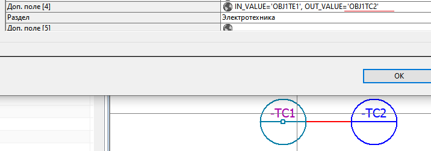</p>
<p align="center"><b>Рысунак</b> - <i>Адукацыя каскаднага рэгулявання</i></p>

<p align="justify">Пры ўводзе неіснуючых уваходаў і выхадаў будзе выведзена паведамленне аб неіснуючых прыладах. Дадаткова правяраецца выхад ПІД-рэгулятара на карэктнасць уводу апісаных раней дазволеных прылад.</p>
<p align="justify">Выкарыстанне (<i>запуск</i>) ПІД-рэгулятара ажыццяўляецца праз выкарыстанне (гл. Рысунак ніжэй</i>) яго ў кроках аперацыі. ПІД-рэгулятар дадаецца ва ўкладку кроку "<i>Прылады</i>" у групе ва ўкладцы "<b>Прылады</b>", а ў поле "<b>Прадукцыйнасць</b>" паказваецца яго заданне (<i>параметр або сігнал AI</i>).</p>

<p align="center"></p>
<p align="center"><b>Рысунак</b> - <i>Выкарыстанне ПІД-кантролера паэтапна</i></p>

## 7 Агульныя звесткі аб тэхналагічных аб'ектах ##

<p align="justify"><b>Тэхналагічны працэс</b> (<em>тэхпрацэс</em>) – працэс вытворчасці якога-небудзь прадукта (<em>паўфабрыката</em>).</br>
<b>Тэхналагічны аб'ект</b> - аб'ект, у якім (<em>які</em>) непасрэдна ажыццяўляецца (<em>ажыццяўляе</em>) тэхпрацэс. Тэхналагічны аб'ект характарызуецца наяўнасцю звязанымі з ім аперацыямі. Да тэхналагічных аб'ектаў адносяцца танк, грабянец, аўтамат і г.д.</br>
<b>Аперацыя</b> - частка тэхпрацэсу, якую непасрэдна можа запусціць (<em>уключыць</em>) або спыніць (<em>выключыць</em>) аператар.</br>
<b>Крок</b> - частка аперацыі, якой непасрэдна не можа кіраваць аператар.</br>
<b>Дзеянне</b> - уваходзяць у крокі, адказваюць за тыпавую функцыянальнасць (адкрыццё\закрыццё прылад і да т.п.).</br>

Такім чынам, інжынер па аўтаматызацыі апісвае тэхпрацэс праз апісанне тэхналагічных аб'ектаў, іх аперацый і крокаў, дадатковых параметраў.</p>

У дадзеным раздзеле прадстаўлена апісанне для змененага рэдактара тэхналагічных аб'ектаў. Для таго, каб паглядзець змены адносна старога рэдактара тэхналагічных аб'ектаў, трэба звярнуцца да [дакументацыі](NewEditor.md). Новы рэдактар ​​мадыфікуе бягучае дрэва з аглядкай на мадэль рэцэптурнай вытворчасці S-88.

### 7.1 Апісанне акна рэдактара ###
<p align="justify">Выклікаць рэдактар ​​можна праз меню <strong>EasyEplanner->Рэдагаваць тэхналагічныя аб'екты</strong>. Усе аб'екты прадстаўляюцца ў іерархічнай дрэвападобнай структуры S88. </p>

<p align="center"></p>

<p align="center"><b>Рысунак</b> - <i>Акно рэдактара</i></p>

Описание панели инструментов редактора (подписаны числами черного цвета под кнопками):
1.  - Разгарнуць/згарнуць дрэва аб'ектаў да вызначанага ўзроўня.
2.  - Уключыць падсвятленне прылад на схеме аўтаматызацыі.
3.  - Уключыць рэжым рэдагавання.
4.  - Захаванне і сінхранізацыя аб'ектаў.
5.  - Стварыць новы аб'ект у выдзеленай кропцы (устаўка новага аб'екта) (**Ins**).
6.  - Выдаліць выдзелены аб'ект <kbd>Delete</kbd>.
7.  - Выразаць вылучаны аб'ект <kbd>Ctrl</kbd>+<kbd>X</kbd>.
8.  - Капіяваць выдзелены аб'ект<kbd>Ctrl</kbd>+<kbd>C</kbd>.  
9.  - Уставіць скапіяваны аб'ект у наадварот месца як новы <kbd>Ctrl</kbd>+<kbd>V</kbd>.
10.  - Уставіць скапіяваны аб'ект у наадварот месца з заменай выдзеленага аб'екта <kbd>Ctrl</kbd> + <kbd>B</kbd>.
11.  - Перамясціць выдзелены аб'ект вышэй <kbd>Ctrl</kbd>+<kbd>&uarr;</kbd>.
12.  - Перамясціць вылучаны аб'ект ніжэй <kbd>Ctrl</kbd>+<kbd>&darr;</kbd>.  
13.  - Імпарт аб'ектаў у праект.
14.  - Экспарт аб'ектаў з праекту.
15.  - Скід базавага аб'екта.
16.  - Схаваць пустыя палі.
17.  - Пошук.
18.  - Настройка панэлі інструментаў.

**Пошук**:

- <p align="justify">тэкставы фільтр па элементах дрэва, як па які адлюстроўваецца, так і па рэдагуемым значэнні, можна выкарыстаць сумесна са ўтойваннем пустых палёў. Калі націскаць на стрэлку "Уніз" у правай частцы пошукавага поля, то ў дрэве будуць па чарзе выдзяляцца знойдзеныя элементы.</p>

  

- Пошук уключае ў сябе 2 налады:

    + <b><ins>ab</ins></b> - _Слова цалкам_. Шукае словы толькі цалкам, як паказана ў пошукавым радку, гэта значыць пры запыце "<b>TANK1V1</b>" прылады _TANK1V11 TANK1V12_ не будуць уключаны ў пошук.

+ <b>.*</b> - _Выкарыстоўваць рэгулярныя выразы_. Пры ўключэнні гэтай наладкі пошук падтрымлівае [рэгулярныя выразы](https://ru.wikipedia.org/wiki/Регулярные_выражения).

    + Прыклады рэгулярных выразаў (функцыя слова цалкам працуе таксама для рэгулярнага выраза):

        * "<b>TANK1V[1-3]</b>" - знойдзе ўсе палі з прыладамі ў дыяпазоне: _TANK1V1_ ,_TANK1V2_ и _TANK1V3_;

        * "<b>TANK1V(1|11|21)</b>" - знойдзе палі з прыладамі: _TANK1V1_ ,_TANK1V11_ и _TANK1V21_;

        * "<b>TANK1V1\d</b>" - знойдзе ўсе прылады _TANK1V..._ с номерами 10-19;

        * Для спрашчэння запытаў таксама была рэалізавана падтрымка лагічных выразаў з выкарыстаннем **||** и **&&**: "<b>TANK1V1 || TANK1V2 && TANK1V3</b>" - шукае радкі, якія змяшчаюць _TANK1V1_ ці _TANK1V2_ и _TANK1V3_;

        * Для больш складаных выразаў глядзіце [дакументацю]((https://ru.wikipedia.org/wiki/Регулярные_выражения)) па рэгулярных выразах.

<p align="justify">Карыстальнік можа наладзіць панэль прылад пад сябе, прыбраўшы невыкарыстоўваныя прылады. Для гэтага ў правым верхнім куце прысутнічае адмысловую прыладу для налады панэлі. Прыклад налады панэлі прыведзены на малюнку ніжэй.</p>

<div align=center>
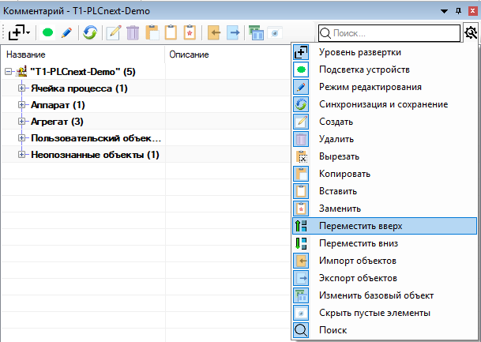
<br><p\><b>Рысунак</b> - Настройка панэлі інструментаў<i></i>
</div>

<p align="justify">Кантэкснае меню рэдактара, выкліканае пстрычкай **ПКМ** па элеменце дрэва, утрымоўвае асноўныя аперацыі з элементамі дрэва. Таксама меню мяркуе ўтойванне недаступных для элемента функцый, як паказана на малюнку ніжэй.</p>

<div align=center>

<br><p\><b>Рисунок</b> - Кантэкстнае меню<i></i>
</div>

<p align="justify">Пры капіяванні або выразцы элемента ў кантэкстным меню на аперацыях уставіць і замяніць пры навядзенні выскоквае падказка, якая паказвае скапіяваны аб'ект.</p>

<div align=center>
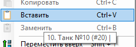
<br><p\><b>Рысунак</b> - Падказка скапіяванага аб'екта ў кантэкстным меню<i></i>
</div>

Імя аб'екта складаецца з наступных складнікаў: лакальны нумар у спісе, імя, нумар аб'екта, глабальны нумар аб'екта. Напрыклад, аб'ект - **1. Танк 2 (#4)**. Яго складнікі:
1. Лакальны нумар - "**1.**";
2. Імя - "**Танк**";
3. Нумар аб'екта - "**2**";
4. Глабальны нумар аб'екта - "**(#4)**".

Для рэдагавання любога вузла дрэва прымяняюцца наступныя каманды (_клавішы_) клавіятуры:
* Выдаленне - <kbd>Delete</kbd>;
* Устаўка - <kbd>Insert</kbd>;
* Рэдагаванне тэкставага прадстаўлення – **двайны клік па актыўным вузле дрэва**;
* Адмена рэдагавання - <kbd>Esc</kbd> (_падчас рэдагавання_);
* Увод рэдагавання – <kbd>Enter</kbd> (_падчас рэдагавання_), або клік па іншым радку;
* Капіяванне вузла - <kbd>Ctrl</kbd>+<kbd>C</kbd>;
* Устаўка вузла - <kbd>Ctrl</kbd>+<kbd>V</kbd>, пры гэтым трэба знаходзіцца на бацькоўскім вузле, куды мы ўстаўляем скапіяваны элемент;
* Устаўка вузла - <kbd>Ctrl</kbd>+<kbd>B</kbd>, неабходна знаходзіцца на вузле, які хочам замяніць раней скапіяваным;
* Выразка вузла - <kbd>Ctrl</kbd>+<kbd>X</kbd>, неабходна знаходзіцца ў вузле, які трэба выразаць. Працуе толькі для неапазнаных аб'ектаў;
* Аўтазапаўненне - <kbd>Ctrl</kbd>+<kbd>A</kbd>;
* Перамяшчэнне вузла ўверх - <kbd>Ctrl</kbd>+<kbd>&uarr;</kbd>;
* Перамяшчэнне вузла ўніз - <kbd>Ctrl</kbd>+<kbd>&darr;</kbd>;
* Вылучэнне некалькіх элементаў - <kbd>Shift</kbd>+<kbd>&uarr;</kbd> / <kbd>Shidt</kbd>+<kbd>&darr;</kbd>;
* Вылучэнне элемента / зняцце вылучэння з элемента - <kbd>Ctrl</kbd>+<kbd>ЛКМ</kbd>;
* Хуткае вылучэнне элементаў (вылучаюцца ўсе элементы аднаго тыпу якія адносяцца да адной групы, тэхналагічныя аб'екты вылучаюцца таксама па адным тэхналагічным тыпе) - <kbd>Ctrl</kbd>+2x<kbd>ЛКМ</kbd>;
* Пры капіяванні – устаўцы/замене аб'екта капіююцца ўсе палі зыходнага аб'екта неабходна ўлічваць наступныя нюансы:
* Нумар аб'екта змяняецца на нумар аб'екта, на месца якога ўстаўляемы аб'ект
* Капіюецца поўны спіс аперацый і адбываецца капіраванне прылад, якія выкарыстоўваюцца ў аперацыі. Пры гэтым адбываецца карэктная замена нумара аб'екта на новы (Больш падрабязна апісана [тут](#7111-мадыфікацыя-назваў-прылад)). Гэта адбываецца ў выпадку супадзення ў двух аб'ектаў поля ОУ. Так пры капіяванні аперацый з аб'екта __Танк 1__ з прыладай __TANK1V1__ і заменай у аб'екце __Танк 3__ прылада зменіць сваё імя на __TANK3V1__.
* Пры капіяванні аперацый адбываецца капіраванне абмежаванняў, апісаных у аперацыі. Для абмежаванняў, якія адносяцца да дадзенага аб'екта (_«Абмежаванні ўнутры аб'екта», «Абмежаванні на наступныя аперацыі»_), адбываецца замена старога нумара аб'екта на новы.
* Можна капіяваць не толькі асобныя радкі параметраў, аперацый, а таксама цэлыя групы параметраў, абмежаванняў, аперацый.

##### Мадыфікацыя назваў прылад #####


#### 7.1.1 Неапазнаныя аб'екты пры загрузцы апісання праекта ####
<p align="justify">Калі базавы аб'ект будзе не распазнаны сістэмай, які дадаецца пры загрузцы аб'ект будзе дададзены ў групу "<em>Неапазнаныя аб'екты</em>". Прыклад на малюнку ніжэй.</p>

<p align="center">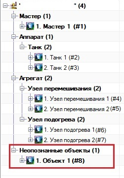</p>

<p align="center"><b>Рысунак</b> - <i>Неапазнаныя аб'екты</i></p>

<p align="justify">Неапазнаны аб'ект можа ім і заставацца. Але над ім нельга выконваць ніякіх дзеянняў, акрамя як: "<b>Выдаліць</b>", "<b>Выразаць</b>" і "<b>Рэдагаваць</b>". Калі не пераносіць базавы аб'ект у іншыя аб'екты, то ён будзе захоўвацца як неапазнаны аб'ект. Гэта значыць, гэты аб'ект застаецца аб'ектам, але яго нельга нікуды капіяваць (толькі праз выразку), і новыя неапазнаныя аб'екты таксама нельга дадаваць.</p>

<p align="justify">Выразаць аб'ект можна з дапамогай спалучэння клавіш <b>Ctrl + X</b>. Пасля выразкі аб'ект стане перакрэсленым (<em>будзе перакрэслены тэкст, але аб'ект застанецца актыўным</em>). Для таго, каб адмяніць выразку, трэба націснуць клавішу <b>Esc</b> пры любым актыўным элеменце дрэва.</p>

<p align="center"></p>

<p align="center"><b>Рысунак</b> - <i>Неапазнаныя аб'екты</i></p>

<p align="justify">Для таго, каб уставіць выразаны аб'ект, неабходна абраць месца, куды яго ўставіць, і націснуць спалучэнне клавіш <b>Ctrl + V</b>. З пункту гледжання праграмы, будзе перанос аб'екта з аднаго месца ў іншае і прызначэнне гэтаму аб'екту базавага аб'екта, у які ён быў перанесены. Глабальны нумар аб'екта не зменіцца.</p>

<p align="center"></p>

<p align="center"><b>Рысунак</b> - <i>Перанесены аб'ект</i></p>

<p align="justify">Калі трэба перанесці аб'ект у базавы аб'ект, якога яшчэ няма, то трэба націснуць спалучэнне клавіш <b>Ctrl + V</b> на элеменце дрэва вышэй (<em>напрыклад, калі ёсць аб'ект S88, то націскаем на Агрэгат, Апарат</em>). Калі ж няма нават аб'ектаў S88, то націскаем на корань праекту (дзе назва праекту) і націскаем патрэбнае спалучэнне клавіш. Калі сістэма не можа вызначыць, куды перанесці аб'ект, будзе выклікана акно (<em>па аналогіі са стварэннем новага аб'екта</em>), дзе трэба абраць, куды пераносіцца неапазнаны аб'ект.</p>

#### 7.1.2 Стварэнне аб'ектаў ####
<p align="justify">У рэдактары ёсць градацыя з магчымасцю стварэння пэўнага базавага аб'екта. У новым рэдактары існуе тры варыянты стварэння аб'екта: з кораня дрэва, з кораня аб'екта S-88, з кораня базавага аб'екта.</p>

<p align="center"></p>

<p align="center"><b>Рысунак</b> - <i>Абазначэнне каранёў элементаў</i></p>

<p align="justify">Пры стварэнні аб'ектаў з першых двух каранёў (<i>корань дрэва і корань аб'екта S-88</i>), будзе выклікана дыялогавае акно (гл. Рысунак ніжэй</i>). У залежнасці ад таго, з якога кораня было яно выклікана, будуць актываваны або дэактываваны магчымыя варыянты. Падрабязнасці апісаны ніжэй.</p>

<p align="center">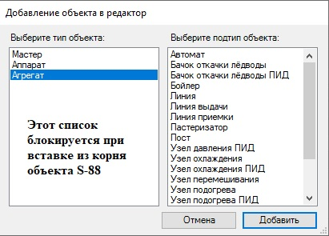</p>

<p align="center"><b>Рысунак</b> - <i>Стварэнне новага аб'екта</i></p>

<p align="justify">Напрыклад, калі стварэнне аб'екта ідзе з кораня дрэва, то ўсе спісы ў акне стварэння аб'екта будуць даступныя. Пры стварэнні аб'екта з кораня аб'екта S-88, бо аб'ект ужо вядомы, то будзе заблакаваны выбар аб'екта S-88, а пры стварэнні аб'екта з кораня базавага аб'екта, адразу будзе створаны які адпавядае пэўны аб'ект базавага аб'екта без якіх-небудзь вокнаў.</p>

#### 7.1.3 Капіраванне, устаўка і замена аб'екта ####
<p align="justify">Можна капіяваць любы аб'ект, але ўставіць і замяніць можна толькі аб'ект з аднолькавым базавым аб'ектам. Гэта значыць, мы можам замяніць <b>Танк</b> на <b>Танк</b>, але не можам <b>Танк</b> на Лінію</b>. Унутры аб'ектаў сітуацыя не змянілася. Мы можам скапіяваць аперацыю <b>Танка</b> ў аперацыі <b>Лініі</b>, але базавая аперацыя павінна быць перапрызначана карыстальнікам.</p>

#### 7.1.4 Выдаленне аб'екта ####
<p align="justify">Трэба ўлічваць, што пры выдаленні аб'екта яго глабальны нумар будзе выдалены, а, такім чынам, усе аб'екты будуць ссунуты адносна папярэдняга іх становішча.</p>

#### 7.1.5 Перамяшчэнне аб'ектаў уверх і ўніз ####
<p align="justify">Перамяшчэнне аб'ектаў уверх і ўніз змяняе іх глабальныя нумары шляхам замены. Аб'ект <b>Х</b> мяняецца на <b>У</b> і наадварот. Але так як у рэдактары мы карыстаемся лакальнымі індэксамі і аб'екты згрупаваны, то перамяшчаць аб'ект уверх і ўніз можна толькі ў межах адной групы. Выхад у іншыя групы немагчымы.</p>

#### 7.1.6 Даданне прылад у аперацыі ў тэкставым выглядзе ####
<p align="justify">Неабходна ўключыць рэжым рэдагавання (<em>іконка сіняга алоўка ўверсе акна рэдактара</em>) і выбраць (<em>вылучыць</em>) патрэбны вузел.</p>

<p align="center"></p>

<p align="center"><b>Рысунак</b> - <i>Прыклад выбару вузла</i></p>

<p align="justify">Далей клікнуць па ім і перайсці ў рэжым рэдагавання.</p>

<p align="center"></p>

<p align="center"><b>Рысунак</b> - <i>Прыклад рэжыму рэдагавання</i></p>

<p align="justify">Паслядоўна праз прабел запісаць патрабаваныя прылады (<em>як на малюнку з уключаным рэжымам рэдагавання</em>) і завяршыць увод націснуўшы <b>Enter</b> (<em><b>Esc</b> - адмена змен</em>), атрымаўшы зменены вынік і стан радка, як на малюнку.

#### 7.1.7 Даданне прылад у аперацыі ў графічным выглядзе ####
<p align="justify">Неабходна перайсці ў гэты рэжым, націснуўшы наступныя кнопкі:</p>

<p align="center"></p>

<p align="center"><b>Рысунак</b> - <i>Кнопкі для працы з графічным рэжымам</i></p>

<p align="justify">Неабходна вылучыць патрэбны вузел.</p>

<p align="center"></p>

<p align="center"><b>Рысунак</b> - <i>Выбар вузла</i></p>

<p align="justify">На карце падсвятляюцца якія ўдзельнічаюць прылады (прылады <em>выключаць</em> - шэрага колеру, <em>астатняе</em> - зялёнага колеру).</p>

<p align="center"></p>

<p align="center"><b>Рысунак</b> - <i>Прыклад падсветкі аб'ектаў</i></p>

<p align="justify">Шляхам кліку на неабходных прыладах, дадаем або выдаляны іх з кроку. Пасля завяршэння рэдагавання кроку пераходзім да наступнага (<em>клік па патрабаваным вузле</em>).</p>

#### 7.1.8 Даданне прылад у аперацыі ў таблічным рэжыме ####
<p align="justify">Неабходна выклікаць акно з прыладамі, выклікаўшы яго з меню (<em>глядзі главу 1</em>), ці ж, калі ўключаны рэжым рэдагавання (<em>глядзі папярэдні падпункт</em>), то акно выклікаецца само пры выбары вузла для рэдагавання.</p>

<p align="center">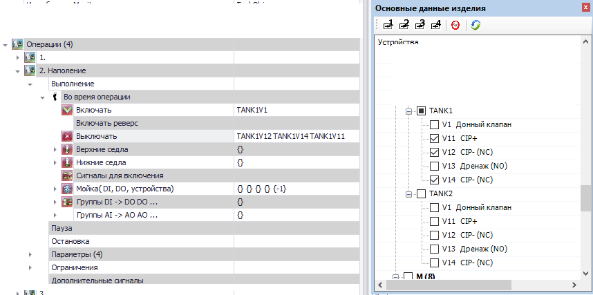</p>

<p align="center"><b>Рысунак</b> - <i>Рэдагаванне вузла ў таблічным рэжыме</i></p>

<p align="justify">Шляхам адзнакі (<em>зняцця адзнакі</em>) адпаведныя прылады дадаюцца (<em>выдаляюцца</em>) з дзеяння.</p>

#### 7.1.9 Захаванне вынікаў рэдагавання ####
<p align="justify">Вынікі рэдагавання захоўваюцца пры зачыненні праекту (<em>як пры зачыненні праекта асобна, так і пры зачыненні акна EPlan з уключаным праектам</em>), а гэтак жа з дапамогай кнопкі "Сінхранізацыя і захаванне" (<em>сіне-зялёнае кола справа на малюнку</em>).

<p align="center"></p>

<p align="center"><b>Рысунак</b> - <i>Кнопка захавання і сінхранізацыі</i></p>

#### 7.1.10 Выкарыстанне параметраў у аб'екце ####

<p align="justify">У тэхналагічным аб'екце задаюцца параметры аб'екта.</p>

<p align="justify">У поле "Параметры" ёсць функцыя аўтазапаўнення (<kbd>Ctrl</kbd>+<kbd>A</kbd>).
Пры выкарыстанні дадзенай функцыі поля параметраў аўтаматычна запаўняюцца ў адпаведнасці з
апісаннем базавага аб'екта, у базавых аб'ектах гэтыя параметры прапісваюцца ў базавых аперацыях.
Пасля генерацыі параметраў адной базавай аперацыі дадаюцца 2 пустыя параметры.</p>

<p align="justify">У дадатку прысутнічае механізм праверкі параметраў. З дапамогай гэтага механізму выяўляюцца супадзенні імёнаў (Lua імёнаў) параметраў, бо імёны павінны быць унікальныя. Механізм не правярае параметры з пустым імем або са стандартным (Lua імя - "P"):

1. Калі Lua імя параметраў супадаюць, тое яно скідаецца ва ўсіх параметраў.
2. Пры ўстаўцы скапіяванага параметра з ужо існуючым Lua імем, яно скідаецца толькі ва ўстаўленага параметра.
3. Калі паспрабаваць змяніць Lua імя на ўжо існуючае, то змены не адбудзецца.
</p>

<p align="center">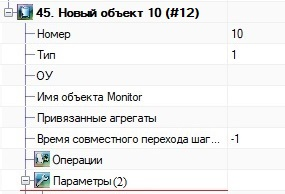</p>

<p align="center"><b>Рысунак</b> - <i>Параметры тэхналагічнага аб'екта</i></p>

<p align="justify">Таксама акно параметраў змяшчаецца ў кожнай аперацыі тэхналагічнага аб'екта.</p>

<p align="center"></p>

<p align="center"><b>Рысунак</b> - <i>Параметры аперацыі тэхналагічнага аб'екта</i></p>

<p align="justify">Для выгоды выкарыстання, у параметрах аб'екта ёсць поле "Аперацыя", якое дазваляе паказаць да якой аперацыі ставіцца параметр.</p>

<p align="center"></p>

<p align="center"><b>Рысунак</b> - <i>Поле "Аперацыі" ў параметрах аб'екта</i></p>

<p align="justify">Пасля таго, як гэтае поле будзе запоўнена, у зададзенай аперацыі адлюструецца параметр, які быў запісаны ў поле "Аперацыі" у параметрах аб'екта. У сёлетняй рэдакцыі можна задаваць мноства аперацый. Для гэтага неабходна пералічыць нумары аперацый праз прабел (гл. Рысунак ніжэй). Для задання аднаго параметра неабходна ўказаць яго нумар у поле, без прабелаў.</p>

<p align="center"></p>

<p align="center"><b>Рысунак</b> - <i>Поле "Аперацыі" ў параметрах аб'екта</i></p>

<p align="justify">Пасля таго, як усе нумары аперацый пералічаныя і зафіксаваныя, у зададзеных аперацыях аб'екта адлюструюцца гэтыя параметры.</p>

<p align="center"></p>

<p align="center"><b>Рысунак</b> - <i>Прыклад адлюстравання параметраў у аперацыі</i></p>


#### 7.1.11 Мадыфікацыя назваў прылад ####

<p align=justify> Мадыфікацыя назваў прывязаных прылад выконваецца пры змене назвы ці нумары тэхналагічнага аб'екта, якое адбываецца ў следстве рэдагавання палёў, устаўцы ці замене аб'екта. Гэтак жа мадыфікацыя праводзіцца пры адкрыцці і захаванні праекту. </p>

У мадыфікацыі прывязаных прылад удзельнічаюць наступныя палі ў тэхналагічным аб'екта:
- Усе палі дзеянняў;
- Параметры дзеянняў(калі да іх прывязана прылада);
- Элементы поля `Доп.ўласцівасці`(у аперацыях);
- Элементы поля `Абсталяванне`.

##### Апісанне дзеянняў #####

Прылады ў поле абсталявання заўсёды адпавядаюць тэхналагічнаму аб'екту, таму тамака правіла простае: падстаўляецца прылада з адпаведным аб'ектам або выдаляецца;

Для астатніх палёў мадыфікацыя прылад праводзіцца па наступных правілах:
- Калі ў прывязанай прылады аб'ект супадае з змяняным тэх.аб'ектам, то прылада мадыфікуецца ў адпаведнасці са зменай імя/нумары аб'екта (ці застаецца ранейшым у выпадку адсутнасці такой прылады):
* (імя: "OBJ" => "OTHER") : `[OBJ]1V1` => `[OTHER]1V1`; [*][modify]
* (нумар: 1 => 2) : `OBJ[1]V1` => `OBJ[2]V1`; [*][modify]
- У выпадку, калі супадае назва аб'екта, але нумар **НЕ** супадае і пры гэтым ён супадае з новым нумарам аб'екта, то ён змяняецца на супрацьлеглы:
* (нумар: 1 => 2) : `OBJ[2]V1` => `OBJ[1]V2`; [*][modify]
- Калі прылады ўзяты з тыпавога аб'екта, то ў выпадку іх адсутнасці яны выдаляюцца;
- Мадыфікацыя клапанаў **MIXPROOF** і іншых падтыпаў ажыццяўляецца ў наступных умовах:
* Мадыфікаваны аб'екта - **Апарат**;
* Імя ўстойлівасці аб'екта не супадаць з ОУ тех.объекта;
* Прылада мае тып **MIXPROOF** ці падобны, а менавіта:
+ `V_DO1_DI2`
+ `V_DO2_DI2`
+ `V_DO2_DI2_BISTABLE`
+ `V_MIXPROOF`
+ `V_BOTTOM_MIXPROOF`
+ `V_IOLINK_MIXPROOF`
+ `V_AS_MIXPROOF`
+ `V_AS_DO1_DI2`
+ `V_IOLINK_DO1_DI2`
+ `V_IOL_TERMINAL_MIXPROOF_DO3`

Пры гэтым мадыфікуецца не нумар аб'екта, а нумар прылады (дакладней, яго частка якая спадае з нумарам тех.объекта), калі такой прылады няма, яно выдаляецца з прывязкі:
* (нумар: 1 => 2) : `NO_UNIT1V[1]` => `NO_UNIT1V[2]` [*][modify]
* (нумар: 13 => 14) : `NO_UNIT1V2[13]` => `NO_UNIT1V2[14]` [*][modify]

[modify]: ## "У круглых дужках паказваецца змена аб'екта, далей чарах двокроп'е вынік мадыфікацыі прылады, дзе ў квадратных дужках паказана, што менавіта змяняецца."


### 7.2 Апісанне дзеянняў ####

Спіс рэалізаваных дзеянняў:

1. **Правяраемыя прылады**. Правяраюцца на памылкі прылады падчас выканання кроку.
2. **Уключаць**. Уключаюцца (усталёўваюцца ў актыўны асноўны стан) прылады.
3. **Уключэнне прылад з затрымкай**. Уключаюцца (усталёўваюцца ў актыўны асноўны стан) прылады з усталяванай задежкой у адпаведнай групе.
4. **Уключаць рэверс**. Уключаюцца ў рэверс (усталёўваюцца ў актыўны рэверсны стан, звычайна гэта рухавікі і да т.п.) прылады. Па завяршэнні дзеяння прылады адключаюцца.
5. **Выключаць**. Адключаюцца (усталёўваюцца ў пасіўны стан) прылады.
6. **Выключэнне прылад з затрымкай**. Адключаюцца (усталёўваюцца ў пасіўны стан) прылады з усталяванай затрымкай у адпаведнай групе.
7. **Верхнія сядла**. Уключаецца верхняе сядло (усталёўваецца ў актыўны стан) для прылады. Звычайна выкарыстоўваецца для прамывання супрацьзмешвальных клапанаў для крокаў аперацыі мыйкі. Па завяршэнні дзеяння прылады адключаюцца.
8. **Ніжнія сёдлы**. Уключаецца ніжняе сядло (усталёўваецца ў актыўны стан) для прылады. Звычайна выкарыстоўваецца для прамывання супрацьзмешвальных клапанаў для крокаў аперацыі мыйкі. Па завяршэнні дзеяння прылады адключаюцца.
9. **Сігналы для ўключэння**. Пры ўключэнні аперацыі правяраюцца на актыўнасць дадзеныя прылады - калі хаця б адно з прылад не актыўна, то выдаецца адпаведнае паведамленне і аперацыя не ўключаецца.
10. **Прылады**. Служыць для спрашчэння тыпавой логікі працы. Прылады, якія знаходзяцца ў поле *"прылады"* уключаюцца (актывуюцца), а змешчаныя ў поле *"рэверсныя прылады"* уключаюцца ў рэверс (аналагічна дзеянню **Уключаць рэверс**) пры актыўным (хоць бы адным) сігнале з поля *"DI"*. Калі няма ніводнага сігналу з поля *"DI"*, то прылады ў поле *"прылады"* адключаюцца. Сігналы для поля *"DO"* выдаюцца заўсёды. Па завяршэнні дзеяння ўсе ўключаныя прылады адключаюцца. Таксама поле *"Прадукцыйнасць"* служыць для задання прадукцыйнасці ўключаных матораў. Гэта можа быць прылада **AI** (аналагавы сігнал) ці нумар параметра.
11. **Групы DI DI ... -> DO DO ...**. Адмысловае дзеянне - выдача дыскрэтных сігналаў пры наяўнасці хаця б аднаго з уваходных дыскрэтных сігналаў.
12. **Групы інвертаваць DI DI ... -> DO DO ...**. Адмысловае дзеянне - выдача дыскрэтных сігналаў пры знікненні хаця б аднаго з уваходных дыскрэтных сігналаў.
13. **Групы AI -> AO AO ...**. Адмысловае дзеянне - выдача аналагавых сігналаў па значэнні ўваходнага аналагавага сігналу.
14. **Сігнал для ўключэння бягучага кроку**. Служыць для аўтаматычнага ўключэння кроку аперацыі па сігнале **DI**, які запісаны ў дзеянні, і выключэнні кроку па знікненні гэтага сігналу, калі гэта было паказана ў які адпавядае параметры. Дзеянне групавое, г.зн. можна групаваць сігналы. Для сігналаў, якія запісаны ў адно дзеянне, дзейнічае ўмова **І** для ўключэння кроку, а для сігналаў паміж дзеяннямі - **АБО**.
15. **Пераход да наступнага кроку па ўмове**. Адмысловае дзеянне - пераход да кроку па выкананні ўмовы: уключэнне і выключэнне зададзеных прылад. Дзеянне складаецца з груп, якія складаюцца з: уключэнне прылад, выключэнне прылад і нумары наступнага кроку.
    Паміж групамі дзейнічае ўмова **АБО**, а ўнутры групы - **А**.
16. **Пераход да стану па ўмове**. Аналагічна папярэдняму дзеянню для пераходу паміж станамі паводле схемы ў пункце [5.1] (#51-аперацыі-аб'ектаў). Рэалізавана для станаў выканання і чаканні падчас выканання аперацыі.

Апроч апісаных вышэй дзеянняў, крокі складаюцца з параметры часу (__час кроку__ і максімальны час кроку__) для безумоўнага пераходу да кроку, паказанаму ў поле __"нумар наступнага кроку"__. У палях __"Час (параметр)"__ і __"Максімальны час кроку (параметр)"__ паказваецца нумар параметра, а ў самім параметры ўсталёўваецца значэнне часу ў ***секундах (з)***.

Для ўсіх дзеянняў адсочваюцца памылкі якія ўваходзяць у іх прылад. Калі крок, у якім дадзенае дзеянне апісана, актыўны і ўзнікае памылка прылады з дадзенага дзеяння (зваротная сувязь для клапана і да т.п.), аперацыя становіцца на паўзу з выдачай адпаведнага паведамлення.

Для спрашчэння працы рэалізаваны абмежаванні на прылады, якія дадаюцца ў дзеянні. Тыпы прылад, якія можна дадаваць у дзеянні:

1. Правяраемыя прылады - любыя прылады.
2. Уключаць (уключэнне прылад з затрымкай) - **DO**, **M**, **V**;
3. Уключаць рэверс - **M**;
4. Выключаць (выключэнне прылад з затрымкай) - **DO**, **M**, **V**;
5. Верхнія сёдлы - **V**, **DO** з падтыпамі **V_MIXPROOF**, **V_AS_MIXPROOF**, **V_IOLINK_MIXPROOF**, **V_VIRT**, **DO**, **DO_VIRT**;
6. Ніжнія сядлы - **V**, **DO** з падтыпамі **V_MIXPROOF**, **V_AS_MIXPROOF**, **V_IOLINK_MIXPROOF**, **V_VIRT**, **DO**, **DO_VIRT**;
7. Сігналы для ўключэння - **DI**, **GS**;
8. Прылады
* DI - **DI**, **SB**, **GS**, **FS**, **LS**;
* DO - **DO**;
* Прылады - **DO**, **M**, **V**, **VC**, **AO**, **ПІД-рэгулятар** (_варыяцыі З_);
* Рэверсіўныя прылады - **M**;
9. Групы DI DI ... -> DO DO ... - **DI**, **GS**, **DO**, **SB**, **HL**, **FS**, **LS**;
10. Групы інвертаваны DI DI ... -> DO DO ... - **DI**, **GS**, **DO**, **SB**, **HL**, **FS**, **LS**;
11. Групы AI -> AO AO ... - **AI**, **AO**, **M**, **VC**, **PT**, **LT**, **QT**, **FQT**, **TE**.
12. Сігнал для ўключэння кроку - **DI**,**LS**,**GS**,**SB**,**FS**,**TS**,**PDS**;
13. Перайсці ў крок па ўмове - **V**, **GS**, **DI**, **DO**, **LS**.

### 7.3 Выкарыстанне функцыянальнасці базавага аб'екта і базавай аперацыі ####

<p align="justify">Надбудова захоўвае апісанне базавай функцыянальнасці ў файле. Файл захоўваецца ў тэчцы з LUA файламі і запаўняецца па вызначаным шаблоне (правілы апісанні ўсярэдзіне файла, спачатку). Імя файла - <code>sys_base_objects_description.lua</code>. Інфармацыя загружаецца з файла адзін раз пры запуску EPLAN. Для таго, каб загрузіць новыя дадзеныя (пасля змены файла), неабходна перазапусціць EPLAN. Пры адсутнасці гэтага файла ў сістэме (быў выпадкова выдалены ці інш.) гэты файл будзе створаны зноўку са стандартным апісаннем (у ценявым сховішчы), і будзе выведзена памылка аб тым, што файл не знойдзены. Для выпраўлення гэтай памылкі неабходна перанесці створаны файл-шаблон з ценявога сховішча ў тэчку, дзе захоўваецца надбудова, запоўніць яго і перазагрузіць EPLAN.</p>

<p align="justify">Базавы аб'ект выбіраецца аўтаматычна пры стварэнні аб'екта. Базавы аб'ект апісвае, якія базавыя аперацыі, абсталяванне і інш. кампаненты будзе ўтрымоўваць аб'ект апроч свайго асноўнага функцыяналу. У залежнасці ад базавага аб'екта, да аб'екта могуць быць прывязаны тыя ці іншыя аб'екты. Для гэтых мэт, у аб'екта ёсць поле <Прывязаныя агрэгаты</code>.</p>

#### 7.3.1 Прывязка базавых аб'ектаў адзін да аднаго ####
<p align="justify">Прывязка дазваляе прывязаць адзін аб'ект да іншага. У дадзены момант можна прывязваць агрэгаты да апаратаў, агрэгаты да агрэгатаў, а таксама, прывязваць танкі да базавых ліній. Прывязка агрэгатаў да апаратаў і агрэгатаў да агрэгатаў апісана ніжэй. Прывязка ж танкаў да ліній ажыццяўляецца праз поле "Групы танкаў" у базавых аб'ектах ліній. Прывязка ажыццяўляецца па такім жа прынцыпе, як і прывязка агрэгатаў да апарата.</p>

<p align="center"></p>

<p align="center"><b>Рысунак</b> - <i>Прывязка груп танкаў</i></p>

<p align="justify">Прывязка агрэгатаў да апаратаў (хоць, лініі ў нас ставяцца да агрэгатаў, але мы можам прывязваць да іх іншыя агрэгаты</i>) зараз выконваецца не ўручную, а можа быць наладжаная таксама, як і абмежаванні (<i>акно "Аперацыі, абмежаванні, прывязка аб'ектаў" у рэжыме рэдакцыі. Прыклад налады прывязкі аб'ектаў прадстаўлены ніжэй.</p>

<p align="justify">Доп. уласцівасці аперацыі, якія дадаюцца пры прывязцы аб'екта,
аўтаматычна запаўняюцца з даданнем float-параметра,
калі ёсць адпаведнае апісанне базавага аб'екта:
дадзеныя параметры генеруюцца аўтаматычна ў залежнасці ад базавай аперацыі.</p>

<p align="center"></p>

<p align="center"><b>Рысунак</b> - <i>Новая прывязка аб'ектаў</i></p>

<b>Заўвага:</b>
1. Падкрэсленыя нумары - гэта глабальныя нумары аб'ектаў. Рукамі іх мяняць нельга. Аб'екты трэба прывязваць праз графічны інтэрфейс. Роўна як і абмежаванні;
2. Да апаратаў нельга прывязаць два базавыя аб'екты аднаго тыпу. Напрыклад, нельга прывязаць "_вузел мяшання 1_" і "_вузел мяшання 2_" да аб'екта "_Танк 1_". Адбудзецца аўтаматычная адвязка старога і прывязка новага аб'ектаў (з захаваннем зададзеных параметраў, пры ўмове, што гэта былі аб'екты аднаго тыпу).
3. Да агрэгатаў можна прывязваць мноства агрэгатаў аднаго тыпу, аднак, ёсць пара момантаў выкарыстання. Трэба, каб былі аднолькавыя імёны параметраў у агрэгатаў бо налада аднаго прывязанага агрэгата будзе распаўсюджвацца адразу на ўсё (_значэння параметраў будуць брацца з кожнага агрэгата, і яны могуць быць унікальныя, але не імёны параметраў_). Уключацца ў аперацыі таксама будуць адразу ўсе злучаныя агрэгаты аднаго тыпу (няма налады, каб можна было ўключаць, да прыкладу, _Вузел мяшання 1_ у аперацыі _Х_, і _Вузел мяшання 2_ у аперацыі _Y_.
4. Аб'екты прывязваюцца ў тым парадку, у якім іх задаў карыстач. Парадак прывязкі ні на што не ўплывае.

#### 7.3.2 Выкарыстанне базавай аперацыі ####
<p align="justify">Выбар базавай аперацыі ў базавым аб'екце ажыццяўляецца такім жа чынам, з тым толькі выключэннем, што выбіраць трэба насупраць назвы аперацыі.</p>

<p align="center">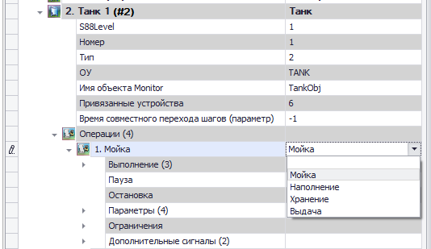</p>

<p align="center"><b>Рысунак</b> - <i>Выбар базавай аперацыі</i></p>

<p align="justify">У <code>Аперацыі</code> дададзена яшчэ адзін які расчыняецца элемент <code>Дадатковыя ўласцівасці (<i>Доп. уласцівасці</i>)</code>. У залежнасці ад абранай аперацыі, з'яўляецца розная колькасць палёў, якую неабходна запоўніць. Калі ў аперацыі няма доп. уласцівасцяў, тое гэтае поле не будзе паказана (<i>будзе ўтоена</i>) Запаўняць можна ўручную або пры дапамозе кліку па дадаванай прыладзе на <b>ФСА</b>. Таксама даступна рэдагаванне праз акно "<b>Прылады, параметры аб'ектаў</b>".</p>

<p align="center"></p>

<p align="center"><b>Рысунак</b> - <i>Налада ўласцівасці праз акно "Прылады, параметры аб'ектаў"</i></p>

<p align="justify">У гэтым акне можна графічнай выявай (<i>паставіць галачкі</i>) адзначыць, якія прылад або параметры павінны быць зададзены ў поле. Калі акно "<b>Прылады, параметры аб'ектаў</b>" пустое, значыць графічным чынам дадаваць дадзеныя не прадугледжана альбо гэта іншыя дадзеныя, якія такім спосабам дадаваць нельга.</p>

<p align="center"></p>

<p align="center"><b>Рысунак</b> - <i>Дадатковыя палі аперацыі</i></p>

Надбудова правярае, якія ўласцівасці запоўненыя, а якія не. Для таго, каб не было паведамлення пра незапоўненую ўласцівасць (напрыклад, яно не апрацоўваецца ці склалася так, што яго няма, ці нейкія іншыя ўмовы), неабходна відавочна задаць адмысловае значэнне. Пры апрацоўцы дадзеных уласцівасцяў, сістэма правярае, ці не ўведзена значэнне-заглушка (слова "Не"). Правяраецца не проста слова "Не", а яго наяўнасць ва ўводзімым радку. Калі было ўведзена слова "__АбвгднетАбвгд__", то сістэма распазнае заглушку "**Не**" і запіша гэтае значэнне ў поле. Пры аўтаматычнай праверцы праекту дадзеныя палі лічацца карэктна запоўненымі.

<p align="center"></p>

<p align="center"><b>Рысунак</b> - <i>Выкарыстанне значэння-заглушкі</i></p>

Тыпы ўласцівасцяў:
1. Тэкставае - значэнне задаецца ў выглядзе тэксту ўручную, або клік па схеме (калі прадугледжана).
2. Булеўскае - падвойны клік, які змяняе значэнне ўласцівасці на супрацьлеглае. Калі значэнне адрозніваецца ад стандартнага, тое яно будзе вылучана тоўстым.

##### Заўвага:

* Калі базавая аперацыя не абрана, то дадатковых палёў не з'явіцца.
* Паля, якія з'яўляюцца, выкарыстоўваюцца пры фарміраванні prg.lua.
* Калі аперацыі ў спісе няма, то гэтая аперацыя не рэалізавана.
* На кожны аб'ект можа быць абрана толькі 1 базавая аперацыя канкрэтнага тыпу (заўв., толькі 1 аперацыя напаўнення на аб'ект).
* Калі ў аб'екце няма нейкай базавай аперацыі г.зн. яна не выкарыстоўваецца, то яе можна выдаліць без шкоды для кіравальнай праграмы.

#### 7.3.3 Выкарыстанне базавага кроку ####

Базавы крок дазваляе паказаць тыя крокі, уласцівыя для базавай аперацыі, інфармацыя аб якіх будзе аўтаматычна запісана ў файле prg.lua. Тым самым апісаны крок не трэба будзе ўручную апісваць у праграме праз файл main.plua. Выбар базавага кроку ажыццяўляецца па такім жа прынцыпе, як і выбар базавага аб'екта, базавай аперацыі. Спіс базавых крокаў для кожнай базавай аперацыі будзе апісаны ў наступным раздзеле дакументацыі.

##### Заўвага:
* Калі ў аб'екце няма якога-небудзь базавага кроку, т.е ён не выкарыстоўваецца, яго можна выдаліць без шкоды для кіравальнай праграмы.

#### 7.3.4 Выкарыстанне абсталявання базавага аб'екта ####
У тэхналагічным аб'екце ёсць укладка "Абсталяванне". Гэта ўкладка змяшчае фізічнае абсталяванне абранага базавага тэхналагічнага аб'екта. Калі ў аб'екта няма ніякага абсталявання, то гэтая ўкладка будзе ўтоена аўтаматычна. Напрыклад, для базавага аб'екта `Вузел мяшання` дадаюцца 3 прылады: датчык люка, датчык рашоткі, мешалка. Усе прылады можна дадаваць як рукамі, так і па кліку на адпаведную прыладу на ФСА. Прыклад дадання на малюнку ніжэй.

<p align="center"></p>

<p align="center"><b>Рысунак</b> - <i>Абсталяванне базавага аб'екта</i></p>

Калі нейкага абсталявання няма ў аб'екце, але яно ёсць у спісе, то гэтае абсталяванне можна не запаўняць.

Нататка: абсталяванне можна дадаваць па кліку на аб'ект у схеме.

У дадатку прысутнічае сістэма аўтаматычнай прывязкі абсталявання да аб'екта. Гэта адбываецца падчас выбару/змены базавага аб'екта, а таксама пры адкрыцці/закрыцці/абнаўленні/захаванні праекту. Прывязка ажыццяўляецца толькі, калі дадзенае поле з абсталяваннем было запоўнена стандартным значэннем і не з'яўляецца пустым. Аўтаматычная прывязка працуе на падставе таго, што стандартызаваны імёны прылад і іх нумары, якія выкарыстоўваюцца для таго ці іншага абсталявання. Сістэма фармуе ОУ прылады (на падставе ОУ аб'екта і яго нумара), складае імя прылады, правярае яго наяўнасць і прывязвае, калі прылада ёсць на схеме. Множная аўтаматычная прывязка прылад адсутнічае.

Дадзены функцыянал дазваляе прывязваць больш за 1 прыладу на адзін тып абсталявання.

#### 7.3.5 Выкарыстанне дадатковых уласцівасцяў аб'екта ####

<p align="justify">Абсталяванне базавага аб'екта з'яўляецца апісаннем фізічнай структуры аб'екта, а поле "<i>Дадатковыя ўласцівасці</i>" аб'екта дазваляе наладзіць логіку працы аб'екта (<i>напрыклад, ігнараванне памылак ці нешта яшчэ</i>). У гэтым полі знаходзяцца ўласцівасці, якія ўплываюць на аб'ект. Калі такіх уласцівасцяў у аб'екта няма, тое гэтае поле не будзе адлюстроўвацца т.е будзе аўтаматычна ўтоена.</p>

<p align="center">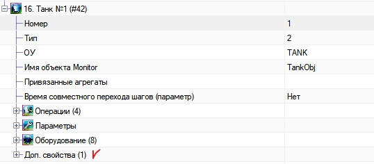</p>

<p align="center"><b>Рысунак</b> - <i>Дадатак. уласцівасці аб'екта</i></p>

<p align="justify">У гэтым полі могуць быць параметры булевыя (<i>так/няма</i>), або актыўныя параметры, якія могуць прымаць прылады, параметры і інш.</p>

#### 7.3.6 Выкарыстанне сістэмных параметраў у базавым аб'екце ####
<p align="justify">Функциональность базового объекта добавляет системные параметры в объект, при их наличии. Если системные параметры были заданы в файле описания, они появятся в базовом объекте. Особенность системных параметров в том, что они управляют какими-то общими параметрами. В системных параметрах можно только редактировать значение, все остальное доступно только для чтения.</p>

<p align="center"></p>

<p align="center"><b>Рисунок</b> - <i>Системные параметры объекта</i></p>

#### 7.3.7 Спіс базавых аб'ектаў, аперацый, параметраў, крокаў і абсталявання ####

Перенесено в репозиторий с описанием базовых объектов. Т.е в ptusa-Lua-dairy-system. Файл ReadMe.md.

#### 7.3.8 Рэкамендацыі па выкарыстанні ПП(_пазначэнне прылад_) у аб'ектах ####
* Для лініі паказваць літару, якая пазначае лінію - `B`, `C` і інш.
* Для вузлоў мяшання/астуджэнні/падагрэву паказваць ОУ - `MIX`/`COOLER`/`HEATER` адпаведна (_рэгістр не важны_). Калі вузел мяшання/астуджэнні/падагрэву прыналежыць толькі аднаму аб'екту, то для яго ОУ можна выкарыстаць пазначэнне таго аб'екта, да якога ён прыналежыць. Напрыклад, для лініі з ОУ `C` можна выкарыстоўваць такое ж ОУ для вузла.

#### 7.4 Экспарт аб'ектаў з рэдактара і зваротны імпарт ####

<p align="justify">Надбудова дазваляе экспартаваць аб'екты, апісаныя ў рэдактары ў файл, а затым выкарыстоўваць экспартаваныя аб'екты ў іншых праектах, папярэдне загрузіўшы іх (<i>імпартаваўшы</i>) у праект. Выклік вокнаў экспарту або імпарту выклікаецца з акна рэдактара (гл. пункт <b>7.1</b></i>).</p>

У імпарце і экспарце аб'ектаў, глабальныя нумары аб'ектаў будуць занулены (_нулявыя значэння_). Гэта прынята таму, што гэтыя аб'екты яшчэ не знаходзяцца ў агульным пуле глабальных аб'ектаў асноўнага дрэва.

#### 7.4.1 Экспарт аб'ектаў ####

<p align="justify">Пры адкрыцці меню экспарту, з'яўляецца спецыяльнае акно (<em>гл. Рысунак</em>), у якім трэба адзначыць галачкамі аб'екты, якія трэба экспартаваць і націснуць кнопку "<em>Экспартаваць</em>". Кнопка "Адмена</em>" - адмяняе дзеянне, закрывае акно экспарту. Дадатковыя кнопкі над спісам: "<em>Усе</em>" і "<em>Ачысціць</em>", дазваляюць хутка адзначыць/зняць галачкі з усіх элементаў спісу.</p>

<p align="center">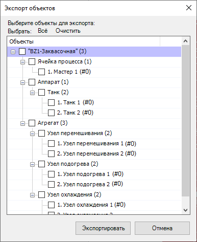</p>

<p align="center"><b>Рысунак</b> - <i>Акно экспарту</i></p>

<p align="justify">Пасля націску на кнопку "Экспартаваць</em>", адкрыецца дыялог (<em>стандартны Windows дыялог, выкліканы пры захаванні файла</em>), у якім трэба паказаць месца захавання і назоў файла. Пасля націску кнопкі "<em>Захаваць</em>", акно экспарту будзе аўтаматычна зачынена, а файл з аб'ектамі з'явіцца па ўказаным шляху з названым імем (гл. Рысунак ніжэй).</p>

<p align="center"></p>

<p align="center"><b>Рысунак</b> - <i>Акно захавання</i></p>

Алгарытм захавання:
1. Указваем шлях да файла;
2. Паказваем імя файла;
3. Ціснем кнопку "_Захаваць_".

#### 7.4.2 Імпарт аб'ектаў ####

<p align="justify">Пры адкрыцці меню імпарту, з'яўляецца спецыяльнае акно (<em>гл. Рысунак ніжэй</em>). У гэтым акне, неабходна пазначыць праз кнопку "<em>Агляд</em>" файл з аб'ектамі і загрузіць яго, затым, адзначыўшы патрэбныя аб'екты галачкамі ў спісе, націснуць кнопку "<em>Імпартаваць</em>". Кнопка "Адмена</em>" - адмяняе дзеянне і закрывае акно імпарту. Дадатковыя кнопкі над спісам: "<em>Усе</em>" і "<em>Ачысціць</em>", дазваляюць хутка адзначыць/зняць галачкі з усіх элементаў спісу.</p>

**Заўвага**:
1. Ва ўсіх аб'ектаў пры імпарце прывязка скідаецца, бо невядома, што прывязана да яго ў праекце і куды ён імпартуецца;
2. У дзеяннях скідаюцца прылады, якія не існуюць у праекце, куды імпартуецца аб'ект;
3. Скідаюцца абмежаванні аперацый, бо яны могуць у новым праекце не супадаць і выклікаць памылкі;
3. Усё астатняе цалкам капіюецца.

<p align="center"></p>

<p align="center"><b>Рысунак</b> - <i>Акно імпарту</i></p>

<p align="justify">Націснуўшы кнопку "<em>Агляд</em>", з'явіцца акно (<em>гл. Рысунак ніжэй</em>), у якім трэба паказаць шлях да файла (<em>пункт 1 на малюнку</em>), абраць файл і націснуць кнопку "<em>адкрыць</em>" (<em>н

<p align="center"></p>

<p align="center"><b>Рысунак</b> - <i>Акно загрузкі</i></p>

<p align="justify">Пасля адкрыцця файла з аб'ектамі, аб'екты будуць загружаныя ў сістэму і іх спіс будзе выведзены ў акенцы, у якім можна адзначаць патрэбныя для імпарту аб'екты (<em>гл. Рысунак ніжэй</em>).</p>

<p align="center">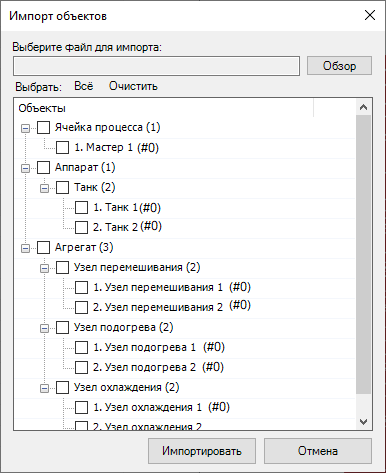</p>

<p align="center"><b>Рысунак</b> - <i>Акно імпарту пасля загрузкі аб'ектаў</i></p>

<p align="justify">Пасля расстаноўкі птушак на патрэбных для імпарту ў праект аб'ектах, неабходна націснуць кнопку "<em>Імпартаваць</em>". Аб'екты дададуцца ў <strong>канец</strong> дрэва аб'ектаў праекта, і акно імпарту аўтаматычна зачыніцца.</p>

#### 7.5 Аўтаматычная ўстаўка аб'ектаў з макрасаў ####

EasyEplanner дазваляе аўтаматычна ўстаўляць патрэбныя базавыя аб'екты на аснове макрасаў. Гэта значыць, дастаткова ўставіць макрас з патрэбным апісаннем, і сістэма аўтаматычна дадасць новы базавы аб'ект. Падрабязней гэты функцыянал апісаны [тут](AutomaticInsertObjectFromEplanMacros.md).

#### 7.6 Скід базавага аб'екта ў рэдактары ####

Скід базавага аб'екта дазваляе скінуць базавы аб'ект. Для таго, каб скінуць аб'ект, неабходна вылучыць аб'ект і націснуць кнопку скіду ([малюначак тут](#71-Апісанне-вокны-рэдактара)) пад нумарам <strong>16</strong>. Неабходна ўключыць рэжым рэдагавання. Базавы аб'ект ператворыцца ў "<strong>Неапазнаны аб'ект</strong>" і будзе перамешчаны ў адпаведную ўкладку рэдактара аб'ектаў. Змяненне базавага аб'екта з неапазнанага ў нейкі вызначаны аб'ект можна ажыццявіць праз механізм выразання (<em>Ctrl + X</em>). Падрабязней - [тут](#711-Неопознанные-объекты-при-загрузке-описания-проекта).

<p align="justify"><b>Увага</b>: будуць скінуты толькі палі і ўласцівасці, якія залежаць ад базавага аб'екта. Гэта значыць, базавы крокі, базавыя аперацыі, абсталяванне і інш. Усё астатняе - застанецца. Крокі, аперацыі і прылады ў іх, а таксама параметры не памяняюцца.</p>

#### 7.7 Выкарыстанне груп з тыпавым аб'ектам ####

<p align="justify">Тыпавы аб'ект вызначае базавую функцыянальнасць для групы тэхналагічных аб'ектаў. Спадчынныя аб'екты абнаўляюцца як пры стварэнні на аснове тыпавога, так і пры рэдагаванні тыпавога аб'екта. Вялікая частка палёў тыпавога аб'екта не ўспадкоўваецца, калі яны не запоўненыя, а ў спадчынных аб'ектах можна задаць гэтым палям розныя значэнні.</p>

<p align=justify>Для карэктнага перамяшчэння аперацый і крокаў у тыпавым аб'екце і такога ж перамяшчэння элементаў у спадчынных аб'ектах, для іх павінны быць устаноўлены ўнікальныя назвы.</p>

##### 7.7.1 Стварэнне групы і даданне тэх. аб'ектаў #####

Стварыць групу з тыпавым аб'ектам можна трыма спосабамі:
1. З кантэкстнага меню базавага аб'екта стварыць новы тыпавы аб'ект як паказана на малюнку ніжэй, альбо выкарыстоўваць камбінацыю клавіш <kbd>Ctrl</kbd>+<kbd>Insert</kbd>:

<p align=center>

<br><b>Рысунак</b> - <i>Стварэнне новага тыпавога аб'екта</i>
</p>

2. Стварыць тыпавы аб'ект на аснове тых. аб'екта камандай Стварыць(<kbd>Insert</kbd>), тыпавы аб'ект набудзе ўсе палі зыходнага аб'екта;

3. Згрупаваць некалькі тэхналагічных аб'ектаў з кантэкстнага меню, як паказана на малюнку ніжэй, або выкарыстоўваць камбінацыю клавіш <kbd>Ctrl</kbd>+<kbd>G</kbd>. У гэтым выпадку тыпавы аб'ект аўтаматычна набудзе агульныя палі вылучаных аб'ектаў:

<p align=center>

<br><b>Рысунак</b> - <i>Групоўка некалькіх тэхналагічных аб'ектаў і стварэнне тыпавога аб'екта на іх аснове</i>
</p>

<p align="justify">Дадаць новыя аб'екты ў групу з тыпавым аб'ектам можна пры дапамозе кнопкі "Стварыць"(Insert) альбо ўставіць капіяваныя/выразаныя аб'екты, тады яны набудуць функцыянальнасць тыпавога аб'екта і захаваюць ужо наяўную функцыянальнасць.</p>

##### 7.7.2 Дзеянні #####

<p align="justify">Прылады, дададзеныя ў дзеянні тыпавога аб'екта абазначаюцца ў спадчынных аб'ектах спецыяльным вылучэннем, як паказана на малюнках ніжэй. Дадзеныя прылады можна рэдагаваць і ў спадчынным аб'екце.</p>

<div align=center>

Дзеянне ў тыпавым аб'екце Дзеянне ў спадчынным аб'екце
:-------------------------:|:-------------------------:
 | 

<p><b>Рысунак</b> - <i> ўспадкоўванне прылад у дзеянні з тыпавога аб'екта </i> </p>
</div>

<p align = "justify">Прылады, дададзеныя ў дзеянне з назвай аб'екта адпаведным ОУ тэхналагічнага аб'екта будуць аўтаматычна змяняць нумар аб'екта на тэхналагічны нумар адпаведнага спадчыннага аб'екта. Можна выкарыстоўваць прыладу з любым нумарам аб'екта.</p>

<div align=center>

Тыпавы танк | Атрыманы ў спадчыну танк №1 | Успадкоўваны танк №2
:-------------------------:|:-------------------------:|:---------------:
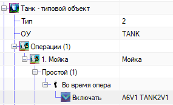 |  | 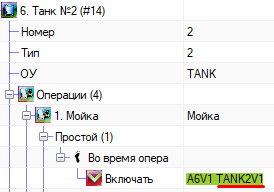

<p><b>Рысунак</b> - <i>Успадкоўванне прылад у дзеянні з тыпавога аб'екта c вызначаным ОУ</i></p>
</div>

##### 7.7.3 Параметры ####

<p align="justify">У спадчынныя аб'екты пераходзяць усе параметры тыпавога аб'екта, а таксама іх дадзеныя (назва, аперацыя, lua-імя...) і значэнне. Калі ў параметры ў тыпавым аб'екце якое-небудзь поле не запоўнена, тое дадзенае поле не ўспадкоўваецца і яго можна змяняць ва ўсіх аб'ектах групы. Для значэння параметра ў тыпавым аб'екце можна ўсталяваць значэнне "-" (Мінус), тады значэнне поля не ўспадкоўваецца, і ва ўсіх аб'ектах групы можа быць усталявана рознае значэнне гэтага параметра, як паказана на малюнках ніжэй.</p>

<div align=center>

Параметр без значэння ў тыпавым аб'екце Параметр са значэннем у спадчыннай аб'екце
:-------------------------:|:-------------------------:
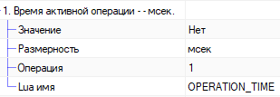 | 

<p><b>Рысунак</b> - <i> ўспадкоўванне параметраў з пустым значэннем </i> </p>
</div>

<p align="justify"><b>Нататка:</b> У спадчынных аб'ектах можна дадаваць дадатковыя параметры, але, пры даданні новых параметраў у тыпавы аб'ект, параметры спадчыннага аб'екта будуць "Зацёртыя" новымі параметрамі.</p>

#### 7.7.4 Прывязаныя агрэгаты ####

<p align=justify>Пры прывязцы агрэгата да тыпавога аб'екта можна прывязаць групу аб'ектаў да групы гэтага тыпавога аб'екта. Для гэтага ў якія прывязваюцца аб'ектах павінны быць зададзены тыпы і яны павінны знаходзіцца ў базавым аб'екце аднаго падтыпу. Тады прывязка адбудзецца ў адпаведнасці з тэхналагічнымі нумарамі аб'ектаў. У спадчынных аб'ектах можна дадаткова прывязаць аб'екты. Прывязаныя аб'екты, атрыманыя ў спадчыну ад тыпавога аб'екта, падсвятляюцца па аналогіі з прыладамі і дзеяннямі, як паказана на малюнку ніжэй. </p>

<p align=center>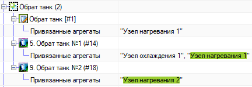<br><b>Рысунак</b> - Спадчына прывязаных агрэгатаў</i></p>

#### 7.8 Аўтазапаўненне ####

Аўтазапаўненне - гэта функцыянальнасць для аўтаматычнага запаўнення дадзеных
тэхналагічных аб'ектаў на падставе пэўных перадналад, устаноўленых
пры рэдагаванні.

Актывацыя дадзенай функцыі даступная для пэўных элементаў дрэва з
кантэкстнага меню або спалучэннем клавіш <kbd>Ctrl</kbd> + <kbd>A</kbd>.

##### 7.8.1 Аўтазапаўненне параметраў #####

Аўтаматычнае запаўненне параметраў можна запусціць з элементаў
тых. аб'ектаў: ​​`Параметры` ці `Аперацыі`. Запуск аўтазапаўнення з дадзеных
вузлоў запускае поўнае аўтазапаўненне па ўсіх аперацыях. Папярэдне
неабходна вызначыць парадак аперацый, прывязаць неабходныя вузлы і
наладзіць дадатковыя ўласцівасці аперацый, выбраўшы ў якіх аперацыях
якія вузлы выкарыстоўваюцца (назвы параметраў для вузлоў не запаўняюцца).

Параметры генеруюцца па наступным шаблоне:
- [ 1 - 20 ] - Сістэмныя (агульныя) параметры (генеруюцца пры стварэнні аб'екта,
  пры аўтазапаўненні дадаюцца толькі заглушкі)
- [ 21 - 30 ] - Параметры 1-й аперацыі:
+ Параметры аперацыі.
+ Параметры вузлоў аперацыі.
+ Заглушкі.
- [ 31 - 40 ] - Параметры 2-й аперацыі.
- [ 41 - 60 ] - Параметры 3-й аперацыі
  (калі параметраў генеруецца больш за 10, то група павялічваецца кратна 10).
- ...

Аўтаматычнае запаўненне можна запусціць асобна для кожнай аперацыі,
дад. уласцівасцяў аперацыі і асобна для асноўнага параметра прывязанага вузла.

### 8 Устаноўка абмежаванняў ###

<p align="justify">Для кожнай аперацыі ў аб'екце створана група палёў: «Ограничения внутри объекта», «Общие ограничения», «Ограничения на последующие операции» , якія прызначаны для налады абмежаванняў для дадзенай аперацыі.</p>

<p align="center"></p>

<p align="center"><b>Рысунак</b> - <i>Местонаходжанне абмежаванняў</i></p>

<p align="justify">Абмежавання ўяўляюцца парамі выгляду {N, M}, дзе <b>N</b> – нумар аб'екта, у якім правяраем на ўключанасць аперацыю <b>M</b> Толькі трэба ўлічваць, што N - глабальны нумар аб'екта, які для карыстальніка недаступны (<em>адбылося ад старога рэдактара</em>). Абмежаванні правяраюцца перад уключэннем аперацыі, у якой прапісваюцца пары. "Абмежаванні ўнутры аб'екта" прызначаны для апісання недаступных аперацый ўнутры аб'екта. Да прыкладу, для аперацыі "Напаўненне" можам пазначыць аперацыю "Сквашванне", нам не трэба правяраць "Сквашванне" ва ўсіх іншых аб'ектах. "Агульныя абмежаванні" апісваюць недаступныя аперацыі з іншымі аб'ектамі. У полі "Абмежаванні на наступныя аперацыі" паказваюцца аперацыі аб'екта, якія нельга ўключыць пасля бягучай. Напрыклад, пасля аперацыі "Выдача" нельга ўключыць "Напаўненне". Рэдагаваць абмежаванні можна ўручную ці праз акно са спісам аперацый. Яго можна выклікаць з меню <b>"EasyEplanner" -> "Аперацыі, абмежаванні, прывязка аб'ектаў"</b> (<em>глядзі прыклад у главе 1</em>). Калі акно для рэдагавання тэхналагічных аб'ектаў знаходзіцца ў рэжыме рэдагавання, то пры пераходзе на радок з абмежаваннямі ў вузлоў дрэва з аперацыямі з'явяцца _CheckBox_ для выбару неабходных абмежаванняў.</p>

<p align="center"></p>

<p align="center"><b>Рысунак</b> - <i>Рэдагаванне абмежаванняў</i></p>

<p align="justify">Пасля рэдагавання і зачыненні праекту ўсе абмежаванні экспартуюцца ў асобны файл <b>main.restrictions.lua</b>, які ў далейшым запісваецца ў кантролер. Перазагрузка дадзенага файла магчыма без перазагрузкі праграмы. Для працы з абмежаваннямі створаны наступныя сістэмныя параметры:</p>

* __CMD__ - Для перазагрузкі файла абмежаванняў у CMD пішам 100, калі ўсё ОК, то вернецца 0, інакш 1 і радок з апісаннем памылкі будзе ў CMD_ANSWER.
* __CMD_ANSWER__ – Радок з апісаннем памылкі перазагрузкі абмежаванняў.
* __P_RESTRICTIONS_MODE__ – Параметр для ўключэння/выключэнні абмежаванняў - 0 - аўта, 1 - ручны, 2 - паўручны (_праз час P_RESTRICTIONS_MANUAL_TIME вернецца ў аўтаматычны рэжым_).
* __P_RESTRICTIONS_MANUAL_TIME__ - Праца модуля абмежаванняў у ручным рэжыме зададзены час, мс.

### 9 Сінхранізацыя і экспарт

#### 9.1 Сінхранізацыя назваў прылад і модуляў ####

<p align="justify">Сінхранізуе прывязаныя прылады: палі "Заўвага" ў прылад. Поле задаецца на функцыянальнай схеме аўтаматызацыі (<em>ФСА</em>) і потым выкарыстоўваецца пры прывязцы да модуляў уводу-высновы. Калі пасля выканання прывязкі змяніць гэтае поле на ФСА, то там, дзе гэта прылада ўжо прывязана, застанецца старое значэнне гэтага поля. Дадзеная функцыя вырашае гэтую праблему. Будзе карысна, калі за аснову бярэцца ўжо існуючы праект або пры змене прызначэння прылад і інш.</p>

**Заўвага**:
1. Каб пазбегнуць няправільнага спрацоўвання функцыі сінхранізацыі  (_ккалі праект у EasyEplaner апісаны не поўнасцю або з памылкамі_), калі ласка, рабіце рэзерваванне праекта перад выклікам функцыі сінхранізацыі.
2. Улічыце, што праекты, у якіх DEV_VTUG папросту заменены на Y (абазначэнне пнеўмавострава) будуць апрацоўвацца з выдаленнем множнай прывязкі, таму што лічыцца, што пераход ад старога выгляду прывязкі да новага (хоць і прылады прывязаныя) завершаны не цалкам. Што б гэтага не адбывалася, неабходна цалкам перайсці на новы від прывязкі пнеўмавострава Y (_глдз. раздзел 3.2.2_)

<p align="justify">таксама, калі была выдаленая якая-небудзь прывязаная прылада, то, запусціўшы сінхранізацыю, гэтая прылада аўтаматычна будзе выдаленае з усіх прывязак да модуляў уводу-высновы.</p>

<p align="justify">У залежнасці ад тыпу прылады і колькасці прывязаных прылад алгарытм сінхранізацыі будзе адрознівацца.</p>

* Для адзінарных прылад (_калі да аднаго канала прывязана адна прылада_) будзе заўсёды дадавацца тэкст з поля "_Заўвага_", нават калі яго выдаліць уручную, то пры сінхранізацыі тэкст аўтаматычна запішацца ў функцыянальны тэкст у які прывязваецца модулі ўводу-высновы.

<p align="justify">Калі да модуля ўводу-вываду прывязана больш за 1 прылады, гэта значыць на кожны канал прылады ў функцыянальным тэксце прыходзіцца два і больш прылады (<em>гэта магчыма толькі пры прывязцы клапанаў да пнеўмавострава і AS-i інтэрфейсу</em>), то ў справу ўступаюць іншыя алгарытмы апрацоўкі дадзеных.</p>

* Для AS-інтэрфейсу каментары не пішуцца і не абнаўляюцца, але ў AS-інтэрфейсе ўлічваецца параметр *R_AS_NUMBER*, у залежнасці ад якога клапана размяшчаюцца ў функцыянальным тэксце. Для карэктнага адлюстравання неабходна правільна наладзіць адлюстраванне функцыянальнага тэксту ва ўкладцые "_Отображение_" (_гдзз. канец падпункта_). Гэтак жа для модуляў AS-інтэрфейсу аўтаматычна ва ўласцівасць "Доп. поле [20]" запісваюцца парадкавыя лікі ад 1 да 62 (_максимальное количество клапанов, которое может быть привязано для AS-i 3.0_) з падзельнікам, які ўяўляе сабой сімвал новага радка. З дапамогай гэтых парадкавых нумароў ствараецца бачнае адлюстраванне, якое паказвае які. *R_AS_NUMBER* у клапана і якія *R_AS_NUMBER* вольныя.

<p align="center"></p>

<p align="center"><b>Рисунак</b> - <i>Прыклад адлюстравання для AS-i</i></p>

* Для пнеўмавострава абнаўленне адбываецца прасцейшае. Калі да клемы пнеўмавострава прывязана адна прылада, то сінхранізацыя адбываецца па такім жа алгарытме, як і для адзінарных прылад, а калі да клемы прывязана больш за адну прыладу, то магчымыя два варыянты:
    * Калі пнеўмавостраў з прывязкай знаходзіцца на шматполюснай схеме злучэнняў, то ў яго будуць прыбраныя каментары;
    * Калі пнеўмавостраў з прывязкай знаходзіцца на схеме тыпу "Агляд", то каментарыі будуць пакінутыя.

##### Настройка акна "Адлюстраванне" для AS-i модуля

Для таго, каб AS-i адлюстроўваўся нармальна (і прывязка, і парадкавыя нумары), неабходна правесці першапачатковую наладу адлюстравання функцыянальнага тэксту. **ВАЖНО** - парадкавыя нумары клапанаў запісваюцца ў Дад. поле [20] аўтаматычна.

Ніжэй на малюнках паказана, як павінна быць наладжана.

<p align="center"></p>

<p align="center"><b>Рысунак</b> - <i>Наладка адлюстравання функцыянальнага тэксту</i></p>

<p align="center">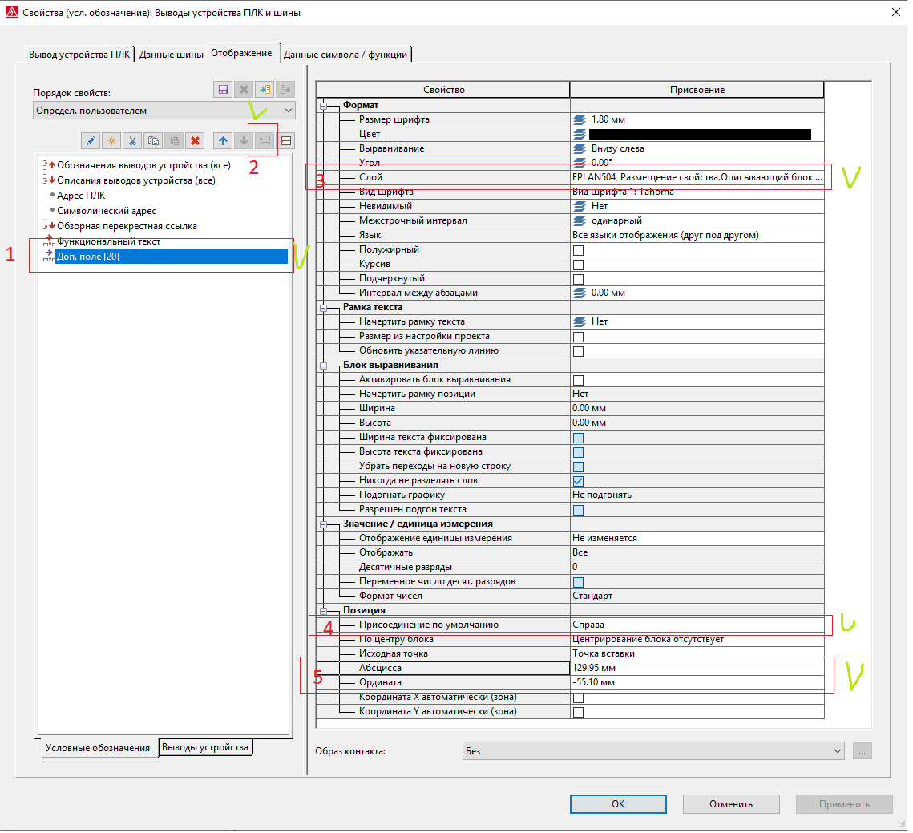</p>

<p align="center"><b>Рысунак</b> - <i>Наладка адлюстравання дад. поле [20]</i></p>

<p align="center"></p>

<p align="center"><b>Рысунак</b> - <i>Вынік наладкі</i></p>

Гэта значыць, адлюстраванне павінна быць наладжана так, каб наадварот лічбы 1 з Дад. поле [20] было першае значэнне прывязкі, а функцыя сінхранізацыі сама размесціць модулі ў патрэбным парадку.

Гэтак жа, можна выкарыстоўваць альтэрнатыўную настройку адлюстравання для Доп. поле [20] (_пры ўмове, што адлюстраванне Функцыянальнага тэксту наладжана так, як апісана вышэй_).

<p align="center"></p>

<p align="center"><b>Рысунак</b> - <i>Альтэрнатыўная настройка адлюстравання Дад. поле [20]</i></p>

Пры выкарыстанні альтэрнатыўнай налады размяшчэнне лічбаў у Дад. поле [20] нельга памяняць з дапамогай уласцівасцяў _Абсцисса_ і _Ордината_.

#### 9.2 Экспарт XML для EasyServer ####

Дазваляе стварыць базу каналаў для EasyServer. Пры націску на дадзены пункт меню з'явіцца акно для настройкі экспарту:

<p align="center">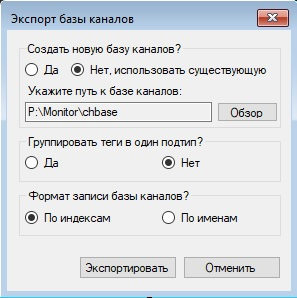</p>

<p align="center"><b>Рысунак</b> - <i>Акно экспарту базы каналаў</i></p>

Пры адкрыцці акна селектары ўсталёўваюцца ў стандартныя становішчы (_як на малюнку_).

Указваецца:
1. Неабходнасць ствараць новы файл базы каналаў (першая пара селектараў - "_Да_", "_Нет, использовать существующую_") ці ж выкарыстоўваць існуючую. Пасля выбару ў селектары неабходна націснуць кнопку "_Обзор_" і выбраць, куды захаваць базу каналаў або выбраць файл базы каналаў (_у залежнасці ад абранага рэжыму_). Для захавання новай базы каналаў можна выкарыстоўваць стандартны шлях (_які зададзены ў радку на малюнку_).

2. Неабходнасць у групоўцы тэгаў у адзін падтып (другая пара селектараў - "_Да_", "_Нет_"). У залежнасці ад абранага рэжыму групоўкі, аб'екты будуць па-рознаму згрупаваны ў базе каналаў.

3. Фармат запісу базы каналаў (трэцяя пара селектараў - "_По индексам_", "_По именам_"). Дазваляе абраць фармат запісу імёнаў аб'ектаў. Па індэксах - звычайны, стары варыянт. Па імёнах - новы варыянт, калі замест OBJECT выкарыстоўваецца поле "Імя аб'екта Monitor" і нумар аб'екта.

_Заўвага:_ для карэктнага экспарту базы каналаў, неабходна, каб у рэдактары тэхналагічных аб'ектаў было правільна запоўнена поле "Імя аб'екта Monitor" у аб'ектах. Калі гэтыя палі ў аб'ектах будуць супадаць, то гэтыя аб'екты будуць адключаныя (закаментаваныя) у базе каналаў. Напрыклад, калі ёсць аб'екты са значэннем поля TankObj з аднолькавымі нумарамі (TankObj1 і TankObj1, тып не ўплывае), то база каналаў закаментуе гэтыя аб'екты. Таму важна, каб поле "Імя аб'екта Monitor" было ўнікальна для кожнага тыпу аб'ектаў. Напрыклад, _Танк малока 1_, _Танк вады 1_ можна пазначыць, як _TankMilkObj_ і _TankWaterObj_. Надбудова папярэджвае карыстальніка аб супадаючых імёнах у аб'ектах.

Дадаткова база каналаў аўтаматычна экспартуецца пры кожным зачыненні праекта (_ці зачыненне праекту, ці завяршэнне Eplan з адчыненым праектам_). Захаванне ажыццяўляецца ў тэчку з праектам Eplan у каталог **chbase**. База каналаў будзе мець такую ​​ж назву, як і імя праекта. У базе каналаў тэгі будуць згрупаваны па падтыпах, а аб'екты апісаны на аснове індэксаў.

##### 9.2.1 Экспартуемыя параметры #####

Калі не паказаны падтып прылады, гэтыя параметры экспартуюцца для любога тыпу прылады. Першы ўзровень спісу - прылада, другі - падтып, трэці - гэта параметры з каментарамі.

1. Прылада- **V**
    * **V_DO1**, **V_DO2**, **V_IOLINK_VTUG_DO1**, **V_IOL_TERMINAL_MIXPROOF_DO3**
        * ST - стан;
        * M - ручны рэжым;
    * **V_DO1_DI1_FB_ON**, **V_IOLINK_VTUG_DO1_FB_ON**, **V_DO1_DI1_FB_OFF**, **V_IOLINK_VTUG_DO1_FB_OFF**
        * ST - стан;
        * M - ручны рэжым;
        * P_ON_TIME - час уключэння;
        * P_FB - уключэнне/выключэнне зваротнай сувязі;
        * FB_OFF_ST - бягучы стан обратной связи (на адключаны стан);
    * **V_DO1_DI2**, **V_DO2_DI2**, **V_DO2_DI2_BISTABLE**, **V_MIXPROOF**, **V_AS_MIXPROOF**, **V_AS_DO1_DI2**, **V_BOTTOM_MIXPROOF**, **V_IOLINK_VTUG_DO1_DI2**, **V_MINI_FLUSHING**
        * ST - стан;
        * M - ручны рэжым;
        * P_ON_TIME - час уключэння;
        * P_FB - уключэнне/выключэнне зваротнай сувязі;
        * FB_OFF_ST - бягучы стан обратной связи (на адключаны стан);
        * FB_ON_ST - бягучы стан обратной связи (на ўключаны стан);
    * **V_IOLINK_MIXPROOF**, **V_IOLINK_DO1_DI2**
        * ST - стан;
        * M - ручны рэжым;
        * P_ON_TIME - час уключэння;
        * P_FB - уключэнне/выключэнне зваротнай сувязі;
        * V - аналагавае значэнне;
        * BLINK - індыкацыя месцазнаходжання прылады (па змаўчанні міргае фіялетавым колерам);
        * CS - сігнал кіравання;
        * ERR - памылка;
    * **V_VIRT**
        * ST - стан;
        * M - ручны рэжым;
        * V - аналагавае значэнне;
2. Прылада - **VC**
    * **VC**, **VC_VIRT**
        * ST - стан;
        * M - ручны рэжым;
        * V - аналагавае значэнне;
    * **VC_EY**
        * ST - стан;
        * M - ручны рэжым;
        * V - аналагавае значэнне;
    * **VC_IOLINK**
        * ST - стан;
        * M - ручны рэжым;
        * V - аналагавае значэнне;
        * BLINK - индикация местонахождения устройства (быстро мигающие светодиоды);
        * NAMUR_ST - стан по стандарту NAMUR;
        * OPENED - адкрыты;
        * CLOSED - закрыт;
3. Прылада - **M**
    * **M**
        * ST - стан;
        * M - ручны рэжым;
        * P_ON_TIME - час уключэння;
    * **M_FREQ**
        * ST - стан;
        * M - ручны рэжым;
        * P_ON_TIME - час уключэння;
        * V - аналагавае значэнне;
    * **M_REV**, **M_REV_FREQ**, **M_REV_2**, **M_REV_FREQ_2**, **M_REV_2_ERROR**
        * ST - стан;
        * M - ручны рэжым;
        * P_ON_TIME - час уключэння;
        * V - аналагавае значэнне;
        * R - рэверс;
    * **M_ATV**
        * ST - стан;
        * M - ручны рэжым;
        * P_ON_TIME - час уключэння;
        * V - аналагавае значэнне;
        * R - рэверс;
        * EST - пашыраны стан;
        * RPM - абароты ў хвіліну;
        * FRQ - частата;
    * **M_ATV_LINEAR**
        * ST - стан;
        * M - ручны рэжым;
        * P_ON_TIME - час уключэння;
        * V - аналагавае значэнне;
        * R - рэверс;
        * EST - пашыраны стан;
        * RPM - абароты ў хвіліну;
        * FRQ - частата;
        * P_SHAFT_DIAMETER - дыяметр вала, м.;
        * P_TRANSFER_RATIO - перадаткавы лік;
    * **M_VIRT**
        * ST - стан;
        * M - ручны рэжым;
        * V - аналагавае значэнне;
4. Прылада - **LS**
    * **LS_MIN**, **LS_MAX**, **LS_VIRT**
        * ST - стан;
        * M - ручны рэжым;
        * P_DT - дельта;
    * **LS_IOLINK_MAX**, **LS_IOLINK_MIN**
        * ST - стан;
        * M - ручны рэжым;
        * V - аналагавае значэнне;
        * P_DT - дельта;
5. Прылада - **FS**
    * **FS**
        * ST - стан;
        * M - ручны рэжым;
        * P_DT - дельта;
    * **FS_VIRT**
        * ST - стан;
        * M - ручны рэжым;
        * V - аналагавае значэнне;
6. Прылада - **GS**
    * **GS**, **GS_INVERSE**
        * ST - стан;
        * M - ручны рэжым;
        * P_DT - дельта;
    * **GS_VIRT**
        * ST - стан;
        * M - ручны рэжым;
        * V - аналагавае значэнне;
7. Прылада - **TE**
    * **TE**, **TE_IOLINK**
        * ST - стан;
        * M - ручны рэжым;
        * P_CZ - зрух за нуль;
        * V - аналагавае значэнне;
    * **TE_VIRT**
        * ST - стан;
        * M - ручны рэжым;
        * V - аналагавае значэнне;
    * **TE_ANALOG**
        * ST - стан;
        * M - ручны рэжым;
        * V - аналагавае значэнне;
        * P_ERR - значение ошибки (значэнне падчас памылкі датчыка);
        * P_MIN_V - мінімальнае значэнне;
        * P_MAX_V - максімальнае значэнне;
        * P_CZ - зрух за нуль;
8. Прылада - **LT**
    * **LT**
        * M - ручны рэжым;
        * V - аналагавае значэнне;
        * P_CZ - зрух за нуль;
        * P_ERR - значение ошибки (значэнне падчас памылкі датчыка);
    * **LT_CYL**
        * M -ручны рэжым;
        * V - аналагавае значэнне;
        * P_CZ - зрух за нуль;
        * P_MAX_P - максімальны ціск;
        * P_R - радыус танка;
        * CLEVEL - пералічаны ўзровень;
    * **LT_CONE**, **LT_IOLINK**
        * M - ручны рэжым;
        * V - аналагавае значэнне;
        * P_CZ - зрух за нуль;
        * P_MAX_P - максімальны ціск;
        * P_R - радыус танка;
        * CLEVEL - пералічаны ўзровень;
        * P_H_CONE - вышыня конуснай часткі танка;
    * **LT_TRUNC**
        * M - ручны рэжым;
        * V - аналагавае значэнне;
        * P_CZ - зрух за нуль;
        * P_MAX_P - максімальны ціск;
        * P_R - радыус танка;
        * CLEVEL - пералічаны ўзровень;
        * P_H_TRUNC - вышыня ўсечанай часткі танка (нідзе і ніколі не выкарыстоўвалася);
    * **LT_VIRT**
        * M - ручны рэжым;
        * V - аналагавае значэнне;
9. Прылада - **HA**
    * **HA**, **HA_VIRT**
        * ST - стан;
        * M - ручны рэжым;
10. Прылада - **HL**
    * **HL**, **HL_VIRT**
        * ST - стан;
        * M - ручны рэжым;
11. Прылада - **SB**
    * **SB**
        * ST - стан;
        * M - ручны рэжым;
        * P_DT - дельта;
    * **SB_VIRT**
        * ST - стан;
        * M - ручны рэжым;
12. Прылада - **DI**
    * **DI**
        * ST - стан;
        * M - ручны рэжым;
        * P_DT - дельта;
    * **DI_VIRT**
        * ST - стан;
        * M - ручны рэжым;
13. Прылада - **DO**
    * **DO**, **DO_VIRT**
        * ST - стан;
        * M - ручны рэжым;
14. Прылада - **AI**
    * **AI**
        * ST - стан;
        * M - ручны рэжым;
        * P_MIN_V - мінімальнае значэнне;
        * P_MAX_V - максімальнае значэнне;
        * V - аналагавае значэнне;
    * **AI_VIRT**
        * ST - стан;
        * M - ручны рэжым;
        * V - аналагавае значэнне;
15. Прылада - **AO**
    * **AO**
        * M - ручны рэжым;
        * V - аналагавае значэнне;
        * P_MIN_V - мінімальнае значэнне;
        * P_MAX_V - максімальнае значэнне;
    * **AO_VIRT**
        * M - ручны рэжым;
        * V - аналагавае значэнне;
    * **AO_EY**
        * M - ручны рэжым;
        * V - аналагавае значэнне;
        * P_MIN_V - мінімальнае значэнне;
        * P_MAX_V - максімальнае значэнне;
16. Прылада - **PT**
    * **PT**
        * ST - стан;
        * M - ручны рэжым;
        * P_MIN_V - мінімальнае значэнне;
        * P_MAX_V - максімальнае значэнне;
        * P_CZ - зрух за нуль;
        * V - аналагавае значэнне;
    * **PT_IOLINK**
        * ST - стан;
        * M - ручны рэжым;
        * P_MIN_V - мінімальнае значэнне;
        * P_MAX_V - максімальнае значэнне;
        * V - аналагавае значэнне;
    * **PT_VIRT**
        * ST - стан;
        * M - ручны рэжым;
        * V - аналагавае значэнне значение;
17. Прылада - **FQT**
    * **FQT**
        * ST - стан;
        * M - ручны рэжым;
        * V - адноснае (карыстальніцкае) значэнне;
        * ABS_V - абсалютнае значэнне;
        * DAY_T1 - сёння, лічыльнік 1;
        * PREV_DAY_T1 - учора, лічыльнік 1;
        * DAY_T2 - сёння, лічыльнік 2;
        * PREV_DAY_T2 - учора, лічыльнік 2;
    * **FQT_F**, **FQT_VIRT**
        * ST - стан;
        * M - ручны рэжым;
        * V - адноснае (карыстальніцкае) значэнне;
        * ABS_V - абсалютнае значэнне;
        * P_MIN_FLOW - мінімальнае значэнне патоку;
        * P_MAX_FLOW - максімальнае значэнне потока;
        * P_CZ - зрух за нуль;
        * F - выдатак;
        * P_DT - дельта;
        * P_ERR_MIN_FLOW - параметр для апрацоўкі памылкі рахункі імпульсаў;
        * DAY_T1 - сёння, лічыльнік 1;
        * PREV_DAY_T1 - учора, лічыльнік 1;
        * DAY_T2 - сёння, лічыльнік 2;
        * PREV_DAY_T2 - учора, лічыльнік 2;
    * **FQT_IOLINK**
        * ST - стан;
        * M - ручны рэжым;
        * V - адноснае (карыстальніцкае) значэнне;
        * ABS_V - абсалютнае значэнне;
        * T - тэмпература;
        * P_ERR_MIN_FLOW - параметр для апрацоўкі памылкі рахункі імпульсаў;
        * DAY_T1 - сёння, лічыльнік 1;
        * PREV_DAY_T1 - учора, лічыльнік 1;
        * DAY_T2 - сёння, лічыльнік 2;
        * PREV_DAY_T2 - учора, лічыльнік 2;
18. Прылада - **QT**
    * **QT**
        * ST - стан;
        * M - ручны рэжым;
        * P_MIN_V - мінімальнае значэнне;
        * P_MAX_V - максімальнае значэнне;
        * V - аналагавае значэнне;
        * P_CZ - зрух за нуль;
    * **QT_OK**
        * ST - стан;
        * M - ручны рэжым;
        * P_MIN_V - мінімальнае значэнне;
        * P_MAX_V - максімальнае значэнне;
        * V - аналагавае значэнне;
        * P_CZ - зрух за нуль;
        * OK - проверка концентратомера
    * **QT_IOLINK**
        * ST - стан;
        * M - ручны рэжым;
        * V - аналагавае значэнне;
        * P_CZ - зрух за нуль;
        * T - тэмпература;
    * **QT_VIRT**
        * ST - стан;
        * M - ручны рэжым;
        * V - аналагавае значэнне значение;
19. Прылада - **WT**
    * **WT**
        * ST - стан;
        * M - ручны рэжым;
        * V - аналагавае значэнне;
        * P_NOMINAL_W - номинальная нагрузка;
        * P_DT - дэльта;
        * P_RKP - рабочий коэффициент передачи;
        * P_CZ - зрух за нуль;
    * **WT_VIRT**
        * ST - стан;
        * M - ручны рэжым;
        * V - аналагавае значэнне значение;
    * **WT_RS232**
        * ST - стан;
        * M - ручны рэжым;
        * V - аналагавае значэнне;
        * P_CZ - зрух за нуль;
    * **WT_ETH**
        * ST - стан;
        * M - ручны рэжым;
        * V - аналагавае значэнне;
        * P_CZ - зрух за нуль;
    * **WT_PXC_AXL**
        * ST - стан;
        * M - ручны рэжым;
        * V - аналагавае значэнне;
        * P_DT - час парогавага фільтра;
        * P_CZ - зрух за нуль;
        * P_K - каэфіцыент прапарцыйнасці;

20. Прылада - **F**
    * **F**
        * ST - стан;
        * M - ручны рэжым;
        * V - аналагавае значэнне;
        * NOMINAL_CURRENT_CH - Зададзены ток канала (_4 канала_);
        * LOAD_CURRENT_CH - Бягучы ток канала (_4 канала_);
        * ST_CH - стан канала (_4 канала_);
        * ERR - Аварыя прылады;
        * ERR_CH - Аварыя канала (_4 канала_);
    * **F_VIRT**
        * ST - стан;
        * M - ручны рэжым;
        * V - аналагавае значэнне;

21. Прылада - **ПИД-регулятор** варыяцыі камбінацый з рэгуляваннем CC (_TC, FC и др._)
    * ST - стан;
    * M - ручны рэжым;
    * V - аналагавае значэнне;
    * Z - задание.
22. Прылада - **HLA**
    * **HLA**
        * ST - стан;
        * M - ручны рэжым;
        * L_RED - стан чырвонай лямпачкі;
        * L_YELLOW - стан жоўтай лямпачкі;
        * L_GREEN - стан зялёнай лямпачкі;
        * L_SIREN - стан сірэны;
    * **HLA_VIRT**, **HLA_IOLINK**
        * ST - стан;
        * M - ручны рэжым;
        * L_BLUE - стан голубой лампочки;
        * L_RED - стан чырвонай лямпачкі;
        * L_YELLOW - стан жоўтай лямпачкі;
        * L_GREEN - стан зялёнай лямпачкі;
        * L_SIREN - стан сірэны;
23. Прылада - **CAM**
    * **CAM_DO1_DI1**
        * ST - стан;
        * M - ручны рэжым;
        * RESULT - вынік апрацоўкі;
    * **CAM_DO1_DI2** и **CAM_DO1_DI3**
        * ST - стан;
        * M - ручны рэжым;
        * RESULT - вынік апрацоўкі;
        * READY - гатоўнасць;
        * P_READY_TIME - лімітавы час адсутнасці гатоўнасці да працы, сек.
24. Прылада - **PDS**
    * **PDS**
        * ST - стан;
        * M - ручны рэжым;
        * P_DT - дельта;
    * **PDS_VIRT**
        * ST - стан;
        * M - ручны рэжым;
25. Прылада - **TS**
    * **TS**
        * ST - стан;
        * M - ручны рэжым;
        * P_DT - дельта;
    * **TS_VIRT**
        * ST - стан;
        * M - ручны рэжым;
26. Прылада - **G**
    * **G_IOL_4**
        * ST - стан;
        * M - ручны рэжым;
        * V - аналагавае значэнне;
        * NOMINAL_CURRENT_CH - Зададзены ток канала (_4 канала_);
        * LOAD_CURRENT_CH - Бягучы ток канала (_4 канала_);
        * ST_CH - стан канала (_4 канала_);
        * ERR - Аварыя прылады;
        * SUM_CURRENTS - Сумарны ток;
        * VOLTAGE - Напружанне;
        * OUT_POWER_90 - Перавышэнне 90% нагрузкі;
    * **G_IOL_8**
        * ST - стан;
        * M - ручны рэжым;
        * V - аналагавае значэнне;
        * NOMINAL_CURRENT_CH - Зададзены ток канала (_8 каналов_);
        * LOAD_CURRENT_CH - Бягучы ток канала (_8 каналов_);
        * ST_CH - стан канала (_8 каналов_);
        * ERR - Аварыя прылады;
        * SUM_CURRENTS - Сумарны ток;
        * VOLTAGE - Напружанне;
        * OUT_POWER_90 - Перавышэнне 90% нагрузкі;
27. Прылада - **WATCHDOG**
    * **WATCHDOG**
        * ST - стан;
        * M - ручны рэжым;
        * P_T_GEN - Інтэрвал генерацыі выходных імпульсаў;
        * P_T_ERR -Інтэрвал чакання змены ўваходу;
28. Прылада - **EY**
    * **DEV_CONV_AO2**
        * ST - стан;
        * V - аналагавае значэнне;
        * CH - Значэнне канала (_2 канала_);

Пратакалююцца: TE_V, QT_V, FQT_F, PT_V, VC_V, M_V, M_ST, LT_CLEVEL, V_ST, LS_ST, FS_ST, GS_ST,
SB_ST, DI_ST, DO_ST, SB_ST, HL_ST, HA_ST, AO_V, AI_V.

Устанаўліваецца перыяд: TE_V, QT_V, LT_V, PT_V, AO_V, AI_V, FQT_F, M_V, VC_V, LT_CLEVEL, V_V.

__Заўвага:__
ПІД-рэгулятары экспартуюцца зыходзячы з базавага аб'екта (_калі абраны базавы аб'ект ПІД, то будзе экспартаваны дадаткова ПІД-рэгулятар, з нумарам аб'екта_).

#### 9.3 Экспарт тэхналагічных прылад у Excel ####

Экспарт, які выконваецца гэтым пунктам меню, стварае Excel-файл, у якім змяшчаецца розная інфармацыя, а менавіта:
+ Апісанне модуляў уводу-вываду (_прывязка, каляровае абазначэнне, нумары клем_);
+ Пералік усіх тэхналагічных прылад з тыпамі і падтыпамі, а гэтак жа з параметрамі пры іх наяўнасці;
+ Зводная табліца ўсіх прылад (_колькі і якіх прылад ўстаноўлена_);
+ Падлучэнне прылад (_тэкставае апісанне, як у акне "Прылады, параметры аб'ектаў"_);
+ Параметры аб'ектаў (_з рэдактара тэхналагічных аб'ектаў_);
+ Апісанне аперацый і прылад (_з рэдактара тэхналагічных аб'ектаў_).

##### 9.3.1 Экспарт інфармацыі для SCADA з праекта #####

Таксама, надбудова пры закрыцці праекта (_ці Eplan пры адкрытым праекце_), генеруе новы файл Excel у тэчцы _DOC_ з назовам _"<Название проекта> auto report"_. Гэты файл прызначаны для інжынераў, якія распрацоўваюць праекты ў SCADA сістэме. Дадзеныя, змешчаныя ў гэтым файле, пакрываюць іх запатрабаванне ў выкарыстанні Eplan. Такім чынам, гэта дазваляе менш выкарыстоўваць якія плаваюць ліцэнзіі Eplan, калі іх недастатковая колькасць.

### 10 Аб'ектная мадэль па ISA (S88, S95)

#### 10.1 Аб'ектная мадэль рэцэптурнай вытворчасці ####

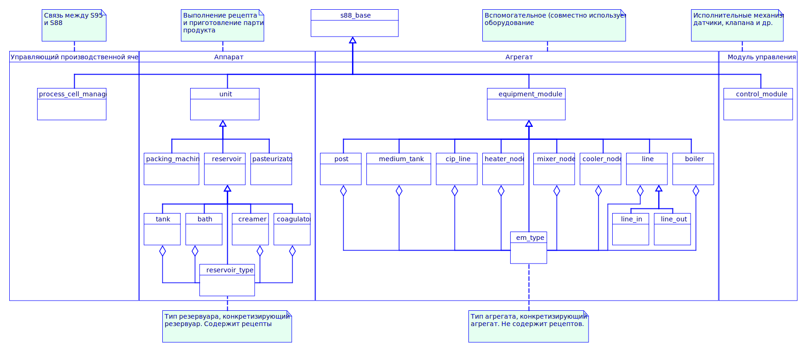

<p align="center"><b>Рысунак</b> - <i>Аб'ектная мадэль без модуляў кіравання</i></p>

<p align="center"></p>

<p align="center"><b>Рысунак</b> - <i>Аб'ектная мадэль модуляў кіравання</i></p>

### 11 Сістэма дапамогі OSTIS

Гэта адкрыты [праект](https://github.com/savushkin-r-d/s88-ostis) асновы ведаў (сам праект OSTIS знаходзіцца [тут](https://github.com/ostis-dev)). Ён утрымоўвае ў сабе інфармацыю аб аб'ектнай мадэлі ISA-88, якая выкарыстоўваецца пры распрацоўцы праектаў з дапамогай надбудовы EasyEplanner.

Для выкарыстання гэтай базы ведаў неабходна вылучыць аб'ект у дрэве і націснуць кнопку <b>F1</b>. Надбудова згенеруе спасылку і адкрые яе ў браўзэры па змаўчанні. Калі апісанні дадзенага аб'екта няма, то спасылка будзе адчыненая з галоўнымі апісаннем стандарту ISA-88.

_Заўвага_: калі дрэва аб'ектаў не выдзелена, тое будзе адкрывацца стандартнае акно даведкі Eplan. У выпадку, калі дрэва будзе выдзелена і не будзе выдзелены ніякі элемент, надбудова паведаміць аб гэтым карыстальніка і ніякай спасылкі адкрыта не будзе.

База ведаў падтрымлівае наступныя мовы: рускую, англійскую, нямецкую, украінскую. Напоўненасць дадзенымі ў кожнай мове можа адрознівацца.

Наладка:
1. Для таго, каб змяніць адрас галоўнай старонкі, якая будзе адчыняцца, калі не знойдзена апісанне аб'екта, трэба адкрыць файл канфігурацыі <code>configuration.ini</code>, знайсці секцыю <code>helpSystem</code> і ў ключы <code>mainAddress</code> трэба паказаць адрас, які будзе адкрывацца.
2. Для змены адраса базы ведаў ostis (_асноўнай спасылкі_), трэба адкрыць файл канфігурацыі <code>configuration.ini</code>, знайсці секцыю <code>helpSystem</code> і ў ключы <code>address</code> трэба паказаць адрас, які будзе выкарыстоўвацца для генерацыі спасылак.

_Заўвага_: адрас базы ведаў (_асноўны_) выкарыстоўваецца для дадатку яго дадатковымі дадзенымі ў адрасным радку і адкрыццю спасылкі па новай атрыманай спасылцы.

### 12 Міжпраектны абмен сігналамі ###

Дадзены функцыянал дазваляе наладзіць абмен сігналамі паміж праектамі з дапамогай зручнага графічнага інтэрфейсу. Модуль аўтаматычна генеруе неабходныя файлы адразу ва ўсіх праектах, з якімі ён узаемадзеяння. Поўнае апісанне працы з модулем размешчана [тут](InterprojectExchange.md).

### 13 Наладка і праграмаванне апісання базавых аб'ектаў ###

Базавыя аб'екты не захоўваюцца ўнутры надбудовы, а падгружаюцца з файлаў з іх апісаннем. Надбудова можа мець больш за **1** файл апісання з базавымі аб'ектамі. Файлы з апісаннем захоўваюцца па наступным шляху: "**Lua\BaseObjectsDescriptionFiles**". У гэты каталог можна загружаць **.lua** файлы з апісаннем базавых аб'ектаў. Пры адсутнасці файлаў апісання ў каталозе з апісаннем (_ці самога каталога_), будзе створаны файл пустога шаблону (_шаблон апісаны ніжэй_). Неабходна запоўніць базавыя аб'екты па шаблоне (запаўняючы толькі тое, што канкрэтна трэба Вам), можна ў тым жа файле ці ў сваім уласным. Запоўнены файл трэба дадаць у дырэкторыю, апісаную вышэй.

У функцыі **get_main_packages()** запісваецца спіс модуляў, якія будуць дадавацца ў файле **main.plua** падчас генерацыі шаблона.


Файлы апісання павінны апісвацца па наступным шаблоне:
```LUA
-- Шаблон файла, які апісвае базавую функцыянальнасць.
-- У гэтым файле апісаны адзін пусты базавы аб'ект, для прыкладу.

-- Базавы аб'ект (назва табліцы - eplanName г.зн. LUA-імя аб'екта, пішацца ў любых рэгістрах):
-- 1. s88Level - узровень аб'екта па ISA-88 (1 - для асобных частак, апаратаў. 2 - для агрегатаў).
-- 2. name - рускамоўная назва аб'екта.
-- 3. baseOperations - апісанне базавых аперацый аб'екта.
-- 4. basicName - англамоўнае імя аб'екта, якое фігуруе ў функцыянальнасці (add_functionality).
-- Гэта імя павінна змяшчаць імя без прыпіскі "basic_"
-- 5. equipment - абсталяванне базавага аб'екта.
-- 6. aggregateParameters - параметры аб'екта, які з'яўляецца агрэгатам (якія будуць дададзены
-- у апарат, пры прывязцы агрэгата да апарата).
-- 7. bindingName - имя агрэгата, выкарыстоўванае пры прывязцы яго да апарата (для апаратаў не абавязкова).
-- 8. isPID - ці з'яўляецца ПИД-рэгулятарам.
-- 9. objectGroups - групы аб'ектаў (танкі, лініі і інш).
-- 10. system_params - сістэмныя параметры аб'екта.
-- 11. parameters - паказваюцца параметры аб'екта. Можна паказаць у выглядзе спасылкі на іншую пераменную,
-- якая ўяўляе параметр, ці ж апісаць самому ў выглядзе lua-табліцы. Пры апісанні ў выглядзе
-- спасылкі на зменную, параметры будуць ісці па парадку (па індэксах), а калі апісваць праз
-- Lua-табліцы, то па ключы Lua-табліцы. Пераважны першы варыянт, ён апісаны ніжэй па файле,
-- а менавіта, там дзе вызначана зменная object_parameters.
-- 12. luaModuleName - імя модуля Lua, у якім апісана логіка працы базавага аб'екта. Звычайна апісана
-- у скрыптах, якія ідуць у пастаўцы разам з гэтым файлам. На падставе гэтага імя ў prg.lua
-- будзе генеравацца загаловак падлучаемага модуля - require( "luaModuleName").
-- Пустое або адсутнае значэнне - модуль не будзе падлучаны.
-- 13. monitorName - імя аб'екта Monitor, якое будзе задавацца пры аўтаматычнай наладзе аб'екта
-- пры яго даданні ў дрэва. Калі не зададзена - будзе задавацца стандартнае значэнне - TankObj.
-- 14. baseProperties - базавыя (дадатковыя) уласцівасці аб'екта. Дадаюцца таксама, як і параметры
-- базавай аперацыі. За выключэннем таго, што даступныя толькі bool і active параметры.
-- 15. deprecated - састарэлы аб'ект ці не. Калі састарэлы - не будзе паказаны ў спісе базавых аб'ектаў,
-- але яго можна выкарыстоўваць ва ўжо існуючых праектах, дзе такія аб'екты выкарыстоўваюцца. Для гэтага
-- трэба дадаваць яго праз Insert у групе аб'ектаў.

-- Базавыя аперацыі (baseOperations) (назва табліцы - гэта Lua-імя аперацыі, пішацца ў верхнім рэгістры):
-- 1. name - рускамоўная назва аперацыі.
-- 2. params - параметры аперацыі, могуць быць актыўнымі, булевымі.
-- 3. state - стан базавай аперацыі, у якім знаходзяцца шагі.
-- 4. defaultPosition - пазіцыя аперацыі пры аўтаматычнай наладзе, калі ажыццяўляецца ўстаўка
-- аб'екта. Калі поле адсутнічае - аперацыя не будзе наладжвацца аўтаматычна.
-- Значэнні гэтага поля павінны быць ад 1 і не перасякацца (апцыянальна).

-- Базавы стан (state) - назва табліцы, гэта LUA-імя стану. Пакуль што гэта ўвесь функцыянал
-- стану. Унутры стану паказваюцца базавыя крокі (steps).
-- Існуючыя стану: IDLE (Просты), RUN (Выкананне), PAUSE (Паўза), STOP (Прыпынак), STARTING (Запускаецца), PAUSING (Становіцца ў паўзу), UNPAUSING (Выходзіць з паўзы), STOPPING (Спыняецца).

-- Базавыя шагі - шаг базавай аперацыі (steps). Назва табліцы – LUA-імя базавага шагу, у верхнім рэгістры.
-- Усярэдзіне табліцы паказваюцца наступныя палі:
-- 1. name = радковае абазначэнне імя шага.
-- 2. defaultPosition - па аналогіі з defaultPosition у базавай аперацыі, толькі адносіцца
-- да базавага шагу (апцыянальна).

-- Актыўныя параметры (active) - параметры, якія адлюстроўваюцца і захоўваюцца, маюць агульную апрацоўку,
-- якая характэрна для ўсіх такіх параметраў (назва табліцы - гэта Lua-імя параметра,
-- пішацца ў верхнім рэгістры):
-- 1. name - рускамоўнае імя параметра.
-- 2. defaultValue - значэнне па-змаўчанні (апцыянальна).
-- 3. displayObjects - спіс параметраў, які паказвае, што будзе адлюстроўвацца ў акне
-- графічнай налады параметра (акно "Прылады"), пры наладзе параметра.
-- Табліца displayObjects можа адсутнічаць.
-- Дапушчальныя ўласцівасці: signals - будуць дададзеныя сігналы AO, AI, DO, DI;
-- parameters - будуць дададзеныя ўсе параметры аб'екта.
-- Прыклад: displayObjects = { "signals", "parameters" } - будуць дададзены сігналы і параметры.

-- Булевыя параметры (bool) - аналаг актыўных параметраў, толькі маюць два значэнні - так ці не
-- (назва табліцы - гэта Lua-імя параметра, пішацца ў верхнім рэгістры):
-- 1. name - рускамоўнае імя параметру.
-- 2. defaultValue - значэнне па змаўчанні.

-- Галоўны параметр агрэгата (main) - аналог булевага параметру. З'яўляецца галоўным кіраўніком
-- параметрам агрэгата (кіруе даступнасцю параметраў). Мае толькі два значэнні - так ці не
-- (назва табліцы - гэта Lua-імя параметра, пішацца ў верхнім рэгістры):
-- 1. name - рускамоўнае імя параметру.
-- 2. defaultValue - значэнне па-змаўчанні.

-- Параметр абсталявання (equipment) – параметр для абсталявання. Апрацоўка падобная да дзеянняў
- у кроках аперацыі. Гэты тып параметру ствараецца, калі запаўняецца абсталяванне ў аб'екце.
-- Ствараецца табліцы equipment. Мае агульную апрацоўку, якая характэрна для
-- усіх такіх параметраў (назва табліцы - гэта Lua-імя параметра,
-- пішацца ў верхнім рэгістры):
-- 1. name - рускамоўнае імя параметру.
-- 2. defaultValue - значэнне па-змаўчанні (апцыянальна).

-- Групы аб'ектаў (objectGroups) - групы аб'ектаў (галоўным чынам для ліній). Унутры гэтай зменнай
-- паказваюцца групы аб'ектаў, якія патрэбныя ў аб'екце.
-- Назва табліцы - Lua-імя групы, пішацца ў любым рэгістры:
-- 1. name - рускамоўная назва гурта.
-- 2. allowedObjects - паказваецца адзін з даступных тыпаў аб'екта ў выглядзе радка (units, aggregates, all).
-- Стандартнае значэнне - aggregates, яно будзе выкарыстоўвацца, калі не паказаць гэтае поле.

-- Абсталяванне - параметр абсталявання.
-- Параметры аб'екта, як агрэгата - па аналогіі з актыўнымі і булеўскімі параметрамі і
- Галоўным параметрам агрэгата, ён з'яўляецца абавязковым для агрэгата. main-параметр задаецца толькі адзін!

-- Сістэмныя параметры аб'екта (systemParams) - сістэмныя параметры аб'екта, якія выкарыстоўваюцца
- У кантролеры. Даступныя толькі для чытання, можна мяняць толькі значэнне.
-- Індэкс табліцы - паказвае яго нумар у спісе параметраў.
-- 1. name - рускамоўная назва параметру
-- 2. meter - адзінка вымярэння параметру
-- 3. defaultValue - стандартнае значэнне параметру
-- 4. nameLua - LUA-імя параметру

base_tech_objects = function()
return
    {
        uniqueEplanName = { -- Унікальнае Lua-імя абъ'кта
            name = "",
            s88Level = 0,
            baseOperations =
            {
                uniqueOperationLuaName = { -- Унікальнае Lua-імя аперации
                    name = "",
                    params =
                    {
                        active = -- Актыўныя параметры
                        {
                            uniqueLuaName = { name = "Имя", defaultValue = "Значэнне па змаўчанні" },
                        },
                        bool = -- Булевыя актыўныя параметры
                        {
                            uniqueLuaName = { name = "Имя", defaultValue = "Значэнне па змаўчанні" },
                        },
                    },
                    state = -- Стан
                    {
                        RUN =
                        {
                            steps = -- Шагі
                            {
                                uniqueLuaName = { name = "імя" }
                            },
                       },
                    },
                },
            },
            basicName = "",
            equipment = -- Абсталяванне
            {
                uniqueLuaName = { name = "імя", defaultValue = "Значэнне па змаўчанні" },
            },
            aggregateParameters = -- Параметры агрэгата
            {
                uniqueLuaName = { name = "Имя", defaultValue = "Значэнне па змаўчанні" },
            },
            bindingName = "Lua-імя для прывязкі",
            system_params =
            {
                 [ 1 ] =
                     {
                         name = "Назва параметра",
                         meter = "адз.вым.",
                         defaultValue = 20,
                         nameLua = "parLuaName",
                     },
            },
            parameters = { object_parameters.ParLuaName1, },
            luaModuleName = "name",
            monitorName = "TankObj",
            baseProperties =
            {
                active = -- Актыўныя параметры
                        {
                            uniqueLuaName = { name = "Імя", defaultValue = "Значэнне па змаўчанні", displayObjects = { "signals" }, },
                        },
                        bool = -- Булевыя актыўныя параметры
                        {
                            uniqueLuaName = { name = "Имя", defaultValue = "Значэнне па змаўчанні" },
                        },
            },
        },
    }
end

-- Тут утрымоўваецца агульны пул параметраў, для базавых аб'ектаў. Параметры
-- наладжваюцца наступным чынам:
-- 1. luaName - паказваецца радковае Lua-імя параметра. Гэта Lua-імя дублюецца
-- у назве зменнай (табліцы) параметру.
-- 2. name - паказваецца радковая якая адлюстроўваецца назоў.
-- 3. value - паказваецца пачатковае значэнне параметра.
-- (цэлы лік або лік з якая плавае коскі).
-- 4. meter - паказваецца адзінка вымярэння ў выглядзе радка.
object_parameters =
{
    ParLuaName1 = {
        luaName = "ParLuaName1",
        name = "Назва параметра",
        value = 20,
        meter = "сек",
    },
}

-- Тут змяшчаецца спіс шляхоў да модуляў, якія дадаюцца ў шаблон кіруючай праграмы "main.plua"
get_main_packages = function()
    return
    {
        ";./dairy-sys/?.lua",
    }
end
```

### 14 Автоматическая генерация описания для IOL-Conf ###

Для **IO-Link** модуляў уводу-высновы **Phoenix Contact** і **IO-Link** прылад можна згенераваць аўтаматычнае апісанне, якое можа быць загружана праз **IOL-Conf** у модуль уводу-высновы, тым самым атрымаем аўтаматычную наладу на аснове апісання **EPLAN**.

**Заўвага**: **IODD** файлы павінны быць загружаны ў **IOL-Conf** для аўтаматычнай налады адрасоў уводу-вываду на клемах модуля ўводу-вываду.
У надбудове ёсць каталог **IOL-Conf**, усярэдзіне яго каталогі **Devices** і **Modules**.

**Modules** - служыць для захоўвання шаблонаў апісання модуляў уводу-высновы **IO-Link** у **.lrp** фармаце. Назва файла шаблону павінна супадаць з назвай выраба ў EPLAN.
**Devices** - аналагічна каталогу **Modules**, толькі для **IO-Link** прылад.

Механізм генерацыі прапускае модуль ці прыладу ў чарзе на генерацыю апісання, калі не знойдзены шаблон. Калі не знойдзены шаблон прылады, прапусціць прыладу, а калі не знойдзены шаблон модуля, то прапусціць увесь модуль у т.л. і прылады размешчаныя на ім.

Гатовыя канфігурацыі будуць захаваны ў каталогу **IOL-Conf** у тэчцы з файламі праекту, файлы канфігурацыі падзеленыя па модулях і маюць імя, як на схемах ФСА (_A100, A200, і т.д._) у фармаце **.lrp**.

#### 14.1 Стварэнне шаблонаў прылад і модуляў уводу/вываду ####

Для таго, каб атрымаць шаблон для модуля ўводу-высновы, трэба падлучыцца да модуля праз **IOL-Conf**, абраць яго і захаваць канфіг.

<p align="center"></p>

Трэба абавязкова абраць толькі нешта адно (_модуль ці прылада_)
<p align="center"></p>

І націснуць кнопку захаваць. Пасля гэтага, увесці назву выраба і захаваць.

**Заўвага**: карэктнае захаванне модуля ўводу-вываду магчыма, калі ў ім не вызначаны прылады (_парты пустыя_).

<p align="center"></p>

#### 14.2 Наладка параметраў прылад ####

Функцыянал падтрымлівае наладку параметраў прылады па ім вырабу. Для гэтага трэба ведаць імя параметру, якое трэба наладзіць, і значэнне, якое трэба пазначыць. Імя параметра можна паглядзець у шаблоне прылады, у атрыбуце **Id**.

Указваюцца параметры ў **Дад.. полі [7]** прылады.

<p align="center"></p>

Параметры запісваюцца ў выглядзе: `<Назва параметра>=<Значэнне>`, падзельнікам параметраў з'яўляецца **коска**. Раздзяляльнік цэлай часткі лікаў - "кропка".

**ВАЖНА**: Калі зменены параметр у шаблоне мае **InternalValue** і **Value** роўныя **0**, то параметр не можа быць усталяваны. Гэтая праблема вырашаецца усталёўкай значэння выдатнага ад нуля. Гэта адбываецца з-за разліку градыенту (_каэфіцыента_), на аснове якога працуе IOL-Conf. Карыстальнік паказвае толькі **Value**, а **InternalValue** ужо разлічваецца на аснове радкоў шаблона па прапорцыі.

#### 14.3 Магчымыя паведамленні акна логаў, і шляхі іх рашэння ####

**E** - exception/памылка.
**S** - solution/exception

**E**: Шаблон <*путь да шаблону*> з памылкай.  
**S**: Нешта не так з шаблонам, які падаў **IOL-Conf**. Шаблон трэба паўторна выгрузіць (*пры ўмове, што яго не кіравалі ўручную*). Звычайна, гэта значыць, што змянілася схема **XML** і патрэбна мяняць яе ў EasyEplanner.

**E**: В устройстве <имя устройства в EPLAN> зададзена ўласцівасць <имя свойства>, яго не існуе ў шаблоне прылады <изделие устройства>.  
**S**: Было зададзена параметр, якога ў шаблоне няма. Альбо змяніўся шаблон, ці карыстач памыліўся пры ўводзе імя параметру. Праверце шаблоны, магчыма няправільна злучаны з вырабам, альбо ён змяніўся і такой уласцівасці ў ім больш няма.

**E**: Шаблон <*путь к шаблону*> ужо існуе.  
**S**: Такі шаблон ужо быў прачытаны і дададзены ў спіс шаблонаў. Праверце тэчкі **Devices** и **Modules**, недзе супадаюць імёны файлаў шаблонаў.

**E**: Параметр клемы <*название параметра*> модуля <*имя модуля ввода-вывода прим., А100*> <*изделие модуля*> не знойдзены.  
**S**: Імя параметраў партоў (*в шаблоне они в атрибуте **Id***) зараз зашыта ў код т.к яно ўсюды аднолькавае, а менавіта "**V_PortConfig_ХХ**", дзе **ХХ** - нумар, двухзначны (*01, 02, 03, и т.д*). Трэба правяраць шаблон, ці памяняўся ён. Калі так (*больш за 2-х тыпаў назваў*), то трэба паправіць EasyEplanner. Канфігуратар не можа наладзіць рэжымы працы клем на модулі ўводу-вываду.

**E**: У шаблоне выраба <**имя изделия**>, параметр <**параметр изделия из шаблона**> змяшчае ў сябе **Value** ці **InternalValue** роўнае **0**. Дзяленне на **0**. Усталюйце іншыя значэнні ў шаблоне.  
**S**: Гэта адбываецца, калі стандартнае значэнне **InternalValue** и **Value** раўняецца **0**. Я не магу палічыць множнік градыенту (*на які мы памнажаем **Value**, каб атрымаць **InternalValue***). Таму трэба ў шаблоне змяніць гэты параметр (*через IOL-Conf*) на дапушчальныя значэння. Пасля гэтага, усё будзе лічыцца як трэба. Калі параметр не змяняецца, але мае **Value** и **InternalValue** роўнае **0**, то гэта мае месца быць.

**E**: Немагчыма праверыць існаванне тэчак з шаблонамі IOL-Conf.  
**S**: Гэтая памылка не павінна ўвогуле з'яўляцца. Яна з'яўляецца, калі EasyEplanner не можа знайсці шлях да dll. Такое магчыма пры ўмове, што нехта сапсаваў зыходны код і не пратэставаў змены. Верагоднасць памылка 1%.

**E**: Немагчыма знайсці генераваныя файлы праекту.  
**S**: Файлы праекту не знойдзены. Магчыма такое, калі хтосьці кіраваў код і не праверыў змены. Таксама, такое магчыма, калі ў файле configuration.ini не паказваць наогул ніякі шлях да файлаў праекту, але тады апісанне становіцца няправільным. У нас па змаўчанні ўжо нейкія шляхі ды зададзены. Верагоднасць памылкі 1%.

**E**: Каталогі не створаны, спачатку стварыце каталогі.
**S**: Толькі дасягаецца з кода. Хтосьці змяніў паслядоўнасць метадаў і перадаў няправільныя дадзеныя. Верагоднасць і прычыны з'яўлення такія ж, як і ў папярэдніх дзвюх памылках.

**E**: Адсутнічаюць апісанні прылад.
**S**: У каталозе **Devices** няма ніводнага шаблона, які мог быць прачытаны. Будзе паказана гэта памылка, але апісанне модулей будзе сгенеравана.

**E**: Адсутнічаюць апісанні модулей увода-вывада.  
**S**: У каталоге **Modules** няма ніводнага шаблону, які мог бы быць лічаны. Генерацыя працаваць не будзе.

**E**: Шаблоны не загружаны, загрузіце шаблоны.
**S**: Хтосьці ў кодзе прапусціў этап загрузкі шаблонаў ці зламаў іх. Верагоднасць памылкі 1%. Адбываецца па віне праграміста.
