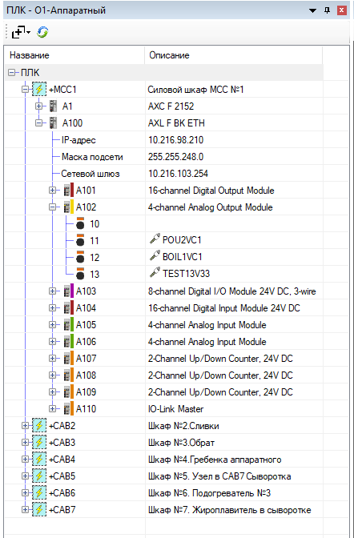
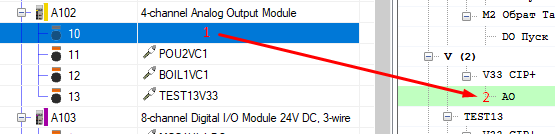
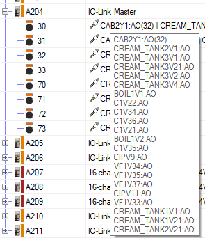

# Структура ПЛК #

Окно с описанием структуры ПЛК отражает состав узлов контроллера и 
модулей ввода-вывода в проекте в виде древовидной структуры.

### 1 Настройка узла ###

Доступные для настройки свойства узлов контроллера: IP-адрес,
маска подсети и сетевой шлюз.

Данные свойства можно отредактировать прямо в окне,
изменения автоматически применяются в узле на ФСА.

### 2 Привязка каналов устройств к клеммам ###

#### 2.1 Привязка каналов ####

Привязка к клеммам осуществляется по аналогии с привязкой каналов на ФСА:
  1. Выбираем в окне клемму, к которой хотим привязать канал;
  2. В окне устройств двойной клик по каналу, который хотим привязать 
  (<kbd>Ctrl</kbd> для множественной привязки).

#### 2.2 Сброс привязки ####

Для сброса привязки канала можно выбрать клемму и нажать клавишу 
<kbd>Delete</kbd>:  
На ФСА в функциональном тексте клеммы пропишется `"Резерв"`.

#### 2.3 Ручное редактирование привязки ####

Функциональный текст клеммы можно также отредактировать в окне редактора.  
Но при этом привязка в редакторе автоматически не обновиться,
нужно обновить проект.

#### 2.4 Отображение множественной привязки ####

В случае множественной привязки, например, к пневмоострову,  
можно увидеть всю привязки в подсказке, наведя мышь на клемму:

