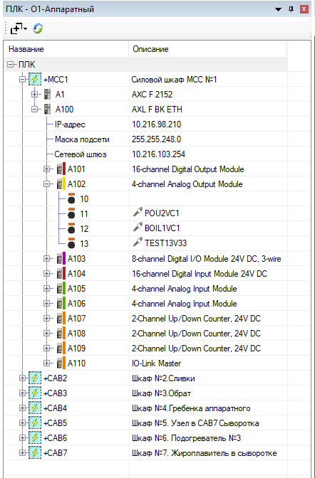
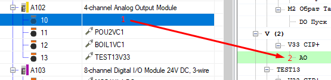
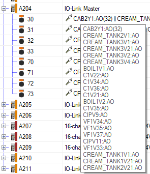

# Структура ПЛК #

Окно с описанием структуры ПЛК отражает состав узлов контроллера и 
модулей ввода-вывода в проекте в виде древовидной структуры.

### 1 Настройка узла ###

Доступные для настройки свойства узлов контроллера: IP-адрес,
маска подсети и сетевой шлюз.

Данные свойства можно отредактировать прямо в окне,
изменения автоматически применяются в узле на ФСА.

### 2 Привязка каналов устройств к клеммам ###

#### 2.1 Привязка каналов ####

Привязка к клеммам осуществляется по аналогии с привязкой каналов на ФСА:
  1. Выбираем в окне клемму, к которой хотим привязать канал;
  2. В окне устройств двойной клик по каналу, который хотим привязать 
  (<kbd>Ctrl</kbd> для множественной привязки).

#### 2.2 Сброс привязки ####

Для сброса привязки канала можно выбрать клемму и нажать клавишу 
<kbd>Delete</kbd>:  
На ФСА в функциональном тексте клеммы пропишется `"Резерв"`.

#### 2.3 Ручное редактирование привязки ####

Функциональный текст клеммы можно также отредактировать в окне редактора.  
Но при этом привязка в редакторе автоматически не обновиться,
нужно обновить проект.

#### 2.4 Отображение множественной привязки ####

В случае множественной привязки, например, к пневмоострову,  
можно увидеть всю привязки в подсказке, наведя мышь на клемму:

### 3 Контекстное меню ###

Для элементов структуры ПЛК доступно контекстное меню, вызываемое правой
кнопкой мыши.

#### 3.1 Переход на ФСА ####

Пункт **Перейти на ФСА** открывает страницу ФСА, на которой расположен
выбранный элемент. Переход доступен для контроллеров, узлов, модулей,
исключенных модулей и клемм.

Быстрый переход также доступен:
  1. Нажатием колесика мыши по элементу;
  2. Нажатием <kbd>Ctrl</kbd> + <kbd>ЛКМ</kbd> по элементу.

При переходе к клемме открывается соответствующая страница ФСА без
перемещения курсора к самой клемме.

#### 3.2 Сдвиг модулей ####

Пункт **Сдвинуть модули** используется для вставки свободного места в
структуру ПЛК. После выбора пункта необходимо указать, на сколько позиций
сдвинуть модули.

Сдвиг выполняется начиная с выбранного модуля. Например, при сдвиге на
2 позиции модуль `-A110` будет переименован в `-A112`, а следующие за ним
модули также будут сдвинуты.

#### 3.3 Удаление модулей ####

Пункт **Удалить** исключает выбранные модули из рабочей структуры ПЛК.
Можно выбрать и удалить сразу несколько модулей.

При удалении обычного модуля он переименовывается из `-Axxx` в `-DELxxx`
и отображается в группе **Исключенные модули**. На месте удаленного модуля
остается пустой неопределенный модуль.

Если удалить пустой неопределенный модуль, выполняется сдвиг последующих
модулей, и свободное место удаляется из структуры.

### 4 Исключенные модули ###

Исключенные модули отображаются внутри соответствующего шкафа в группе
**Исключенные модули**. Такие модули остаются на ФСА, но не участвуют в
основной структуре ПЛК как активные модули.

Исключенный модуль можно вернуть в структуру перетаскиванием:
  1. Перетащить можно только один исключенный модуль за раз;
  2. Перетаскивание разрешено в пустой неопределенный модуль или в строку
  добавления модуля в конец узла;
  3. При переносе модуль переименовывается обратно из `-DELxxx` в `-Axxx`.

Во время перетаскивания исключенного модуля внизу каждого узла появляется
строка **Добавить исключенный модуль в конец**. Перетащите модуль на эту
строку, чтобы добавить его в конец структуры выбранного узла. Модуль получит
следующий свободный номер после последнего модуля узла.

Если исходное место исключенного модуля свободно, его можно вернуть через
контекстное меню **Восстановить**. Для группы **Исключенные модули** команда
восстановит все модули, для которых в структуре есть пустые места с
соответствующими номерами.